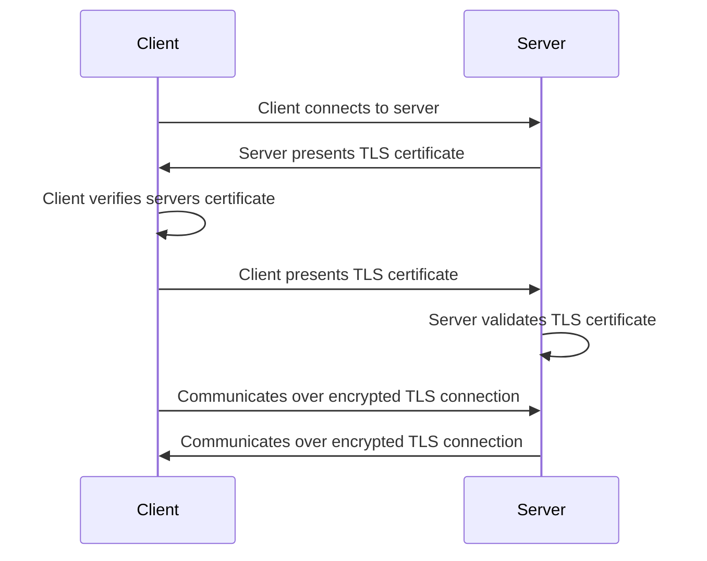

## Summary

We require that all communication between Cell services is secure and both parties identities are verified.

## Goals

The purpose of implementing mutual TLS (mTLS) is to ensure all communication
between Cell services is secure and both parties identities are verified. This
enhances overall system security by mitigating risks associated with
unauthorized access and data interception. All Cell services that communicate with
each other should use mTLS where it's feasible to do so as a secure
authentication mechanism

1. **Scope**

    mTLS secures CDNs and load balancers to their backends and secures communication
    between internal services. But it doesn't secures communication from outside
    clients to GitLab services. Communication between services inside a cell and those
    outside a cell should be considered and discussed separately as the requirements
    are likely to be very different.

1. **Technology**

    The certificate authority should be able to be integrated with a CDN provider,
    Kubernetes, Runway and cloud managed load balancers/services that support mTLS.
    Recommending using a Docker sidecar where feasible. Existing open source
    software or cloud provided mechanisms should be used for managing certificates.

1. **Ease of use**

    The management of mTLS should be able to be handled transparently to developers.

1. **Authorization**

    Using mTLS headers as an option for authorization as well as authentication should
    be considered.

## Requirements

| Requirement                            | Description                                                                     | Priority |
| ---------------------------------------| --------------------------------------------------------------------------------| -------- |
| Security                               | Only authorized services can communicate with one another                       | high     |
| High availability                      | Certificates can be rotated automatically without service interruption          | high     |
| Cells support                          | Can be used for all cells services                                              | high     |
| Transparent to application developers  | Application developers get mTLS security for their services with minimal setup  | high     |
| Authorization support                  | Application Developers can use mTLS for authorization                           | high     |
| Provision certificates within seconds  | We can create a new certificate in seconds                                      | high     |
| Multiple Protocol support              | Support HTTP/1.1, HTTP/2, gRPC                                                  | high     |
| Gradual Adoption                       | First allow traffic without a certificate to be accepted                        | med      |
| Auditable                              | Can validate all services are using secure authentication via mTLS              | med      |
| Cloud-managed                          | Can be integrated with cloud services                                           | med      |
| Self-managed                           | Can be eventually used in self managed scenarios                                | med      |

## Non-Goals

- mTLS should not be considered for managing user level authorization

## Architecture

## Supported clients & servers

| Client | Server |
| ------ | ------ |
|HTTP Router|Topology Service|
|GitLab|Topology Service|
