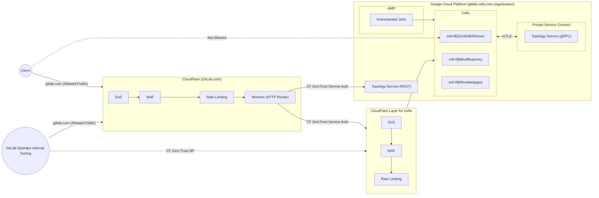



## Pre-Reads

- [HTTP Router](../http_routing_service.md)
- [Topology Service](../topology_service.md)
- [ADR 002](../decisions/002_gcp_project_boundary.md)
- [ADR 004](../decisions/004_vpc_subnet_design.md)

## Guidelines

- **Cross-VPC communication in GCP:** Any interactions between services in different VPCs.
  For instance, Cell communicating with Topology Service will use [Private Service Connect,](https://cloud.google.com/vpc/docs/private-service-connect)
  which helps avoid overlapping CIDRs, VPC peering limitations, inconsistent DNS resolution across VPCs, and going over the public internet.
- **Authentication and Authorization:** Each service needs to have an identity in the form of a certificate, or a token that will be used to communicate using HTTP requests.
  Using that identity will also be used to authorize the request.
  The certificate identity is better known as mTLS and has a [separate blueprint](../mutual_authentication_between_cell_services.md).
- **Cells are not public but remain individually accessible:** Users must submit all requests through `gitlab.com` domain on the public internet to maintain a central entry point and a global counter for rate limits.
  - **External:** The cells are individually accessible through an external hostname but this is not public - customers cannot directly interact with the cell domains.
  - **Public:** The cells are only accessible to customers through the gitlab.com domain which is available on the public internet.

With the guidelines above we will end up with the following communication between

## Cross-VPC communication in GCP

Each Cell will have its [own GCP project](../decisions/002_gcp_project_boundary.md) resulting in its [own VPC](../decisions/004_vpc_subnet_design.md).
This means when a Cell needs to send requests to downstream services it will either have to go through the public internet or internal network somehow.
In [ADR 004](../decisions/004_vpc_subnet_design.md) we decided we will use [Private Service Connect](https://cloud.google.com/vpc/docs/private-service-connect) for internal communication.
This means any requests between services should be internal for speed and cost reasons. Otherwise, we would have to pay for ingress and egress fees.
Private Service Connect traffic goes directly from consumer clients to producer backends without intermediate hops or proxies.
NAT (Network Address Translation) is performed directly on the physical host machines that host the consumer and producer VMs, which reduces latency and increases bandwidth capacity.

Private Service Connect is going to be used for communication between GCP hosted services only. We can't use it between HTTP Router and Topology Service since HTTP Router is not hosted in GCP

With Private Service Connect there are two entities to keep in mind: the `Consumer` and the `Producer`. For example, a Cell (`Consumer`) sending a request to Topology Service (`Producer`).

There are two ways for a `Consumer` to access the `Producer` either through an [`Endpoint`](https://cloud.google.com/vpc/docs/private-service-connect#endpoints) or a [`Backend`](https://cloud.google.com/vpc/docs/private-service-connect#backends),
we will use a `Backend` since Private Service Connect backends use a load balancer configured with Private Service Connect network endpoint group (NEG) backends.
Accessing APIs and services through a consumer-managed load balancer provides several benefits:

- Load balancers can act as a centralized policy enforcement point where security policies (such as Google Cloud Armor policies and SSL policies) or routing policies (such as Google Cloud URL maps) are enforced.
- They provide centralized metrics and logging that a published service might not provide
- They allow consumers to control their routing and failover.
- All load balancers should be multi-regional by default since we have Cells running with Geo for failover, and Topology Service running in two regions.

[source](https://excalidraw.com/#json=ZkpKyrjuSVihA98HOcnBa,aSljwYS_JGT6G9leGgpHZw)

## Authentication and Authorization

We would be leveraging a mix of [mTLS](../mutual_authentication_between_cell_services.md) along with [Cloudflare Zero Trust](https://developers.cloudflare.com/cloudflare-one/).
Each cell should have an identity in the form of a certificate that will be used to connect to Topology Service as a way to authenticate.
It's up to the Topology service to implement authorization, using the identity provided in the certificate.
For example, a Cell connects to the Topology Service using mTLS for authentication, and then the Topology Service will use that identity to authorize if they can run that request.

### Authentication Protocols and Connection Matrix

| Client | Server | Protocol | Mechanism |
| ------ | ------ | ------ | ------ |
| Cloudflare / HTTP Router | Topology Service | HTTP | Cloudflare Zero Trust (using Service Token) |
| Cloudflare / HTTP Router | Gitlab Webserver/Cell Zone | HTTP | Cloudflare Zero Trust (using Service Token) |
| Gitlab Webserver | Topology Service | gRPC | normal mTLS handled by the webservers; (since the connection would be through Private Connect, we wouldn't be going through cloudflare) |
| Operators | Cell Zone/GitLab webserver | HTTP | Zero trust with IdP auth |

## Cells are not public but remain individually accessible

All public traffic will flow through the `gitlab.com` domain as it exists today.
This gives us a central point of entry making it easier for observability, audit tracking, forward/backward compatibility, and a centralized place to configure and manage Web Application Firewalls and Rate limits.

Each Cell will still have its dedicated domain known as `managed_domain` inside of the tenant model, which will be registered in Cloudflare,
the reason for this is built on top of `Authentication and Authorization` where each workload has its own identity,
and for the Topology Service and HTTP Router to have an identifier for a Cell.
The Cell should be directly accessible not just programmatically by the client,
but also by human operators that will circumvent the HTTP Router and connect directly to it for operational reasons such as debugging the Rails application without the HTTP Router and Topology service.

This means that a Cell has 2 types of clients, a human client and other services like HTTP Router and Instrumentor, both will be solved using the same core technologies using [Cloudflare Zero Trust](https://developers.cloudflare.com/cloudflare-one/).

### Human Operator

With Cloudflare Zero Trust we can set up an Identity provider such as [Okta](https://developers.cloudflare.com/cloudflare-one/identity/idp-integration/okta/) so that when we access the `managed_domain` using the browser we will be required to log into Okta to continue to the cell.

We can configure [Access Policies](https://developers.cloudflare.com/cloudflare-one/policies/access/) on our application in CloudFlare ZeroTrust and restrict the access to Operators part of a particular Okta Group.

This has been validated by the [Cloudflare Zero Trust PoC](https://gitlab.com/gitlab-com/gl-infra/tenant-scale/cells-infrastructure/team/-/issues/241#note_2392103428).

### Services

We can leverage Cloudflare Zero Trust [Service Token Auth](https://developers.cloudflare.com/cloudflare-one/identity/service-tokens/) for secure communication between our HTTP Router to Cell and Topology Service.

The service auth token can be uploaded as [worker secrets](https://developers.cloudflare.com/workers/configuration/secrets/) and can be added as headers while proxying the request to a cell.

We validated how this would be working as part of [CloudFlare Zero Trust PoC](https://gitlab.com/gitlab-com/gl-infra/tenant-scale/cells-infrastructure/team/-/issues/241).
