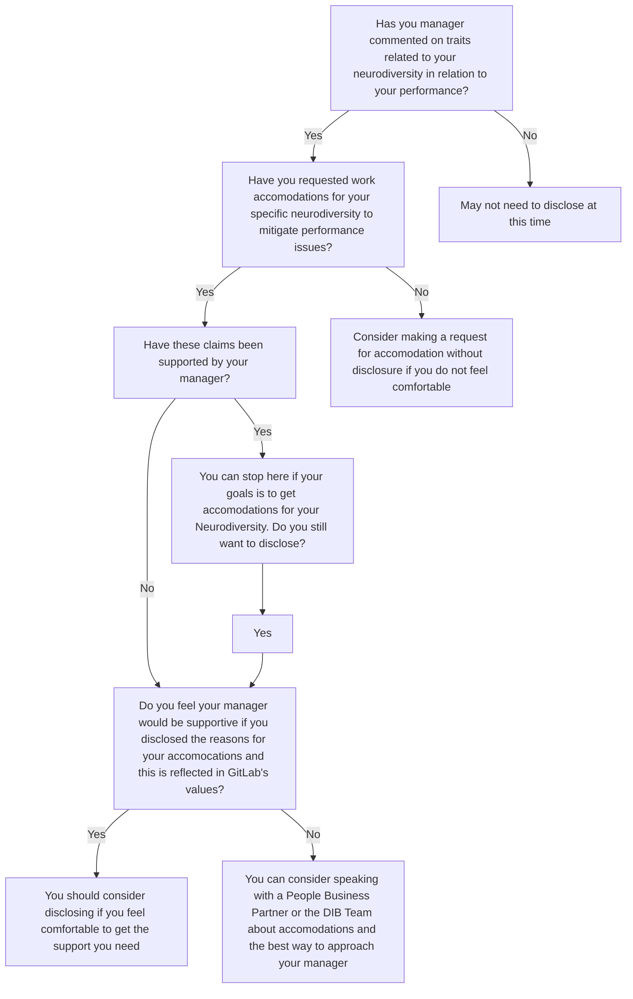

---

title: "Neurodiversity Resources"
description: "This page provides resources for team members, managers and those who identify as neurodivergent"
canonical_path: "/company/culture/inclusion/neurodiversity-resources/"
---

## The purpose of Neurodiversity Resources

- Provide resources for those who identify as neurodivergent, to help them navigate remote work, management difficulties and other situations and challenges that they may face at work.
- Provide team members and managers+ resources to help provide a better team member experience for their colleagues and direct reports who identify as neurodivergent.

## Resources for those who identify as neurodivergent

- GitLab's Employee Assistance Program, [Modern Health](), offers resources to support team members that identify as neurodivergent:
  - **Digital Content**: Modern Health offers [digital resources](https://my.joinmodernhealth.com/resources) that may be helpful, such as meditations for sensory mindfulness and programs that offer strategies for focus.
  - **Coaching & Therapy**: GitLab Team Members have access to [coaching and therapy sessions](). Modern Health has counselors and therapist who specialize in working with people across the spectrum of neurodiversity. Any member can write into help@joinmodernhealth.com and ask for a provider with this kind of specialization (the more specific, the better).
- [Neurodiversity as a competitive advantage](https://hbr.org/2017/05/neurodiversity-as-a-competitive-advantage)
- [ADHD in the workplace](https://www.webmd.com/add-adhd/adhd-in-the-workplace)
- [Free neurodiversity peer mentorships](https://www.neurodiver-city.org/)
- [Digital magazine with articles on ADD/ADHD including latest research](https://www.additudemag.com/)
- [Youtube channel with significant amounts of information, interviews, and personal experiences relating to ADHD](https://www.youtube.com/c/HowtoADHD)

- [The Autistic Life Resources Store](https://www.theautistic.life/shop?Collection=Worksheets)
- Join the [#neurodiversity](https://gitlab.slack.com/archives/CQRDJ0TLN) Slack Channel for support & community with other GitLab Team Members or to learn more about the experiences of others
- Join the [#bodydouble_friends](https://gitlab.slack.com/archives/C03EX45QPGB) Slack Channel to find others to participate in a ["body-doubling"](https://healthyadhd.com/body-doubling-for-adhd/) virtual work session that can help you begin projects or tasks with the support of another person as a "virtual-anchor" and accountability buddy. Use this channel to request a body double session with another GitLab Team Member which aligns with our value of [collaboration](/handbook/values/#collaboration) and [diversity, inclusion, and belonging](/handbook/values/#diversity-inclusion).
- Join the [#neurodiverse-coffee-chat](https://gitlab.slack.com/archives/C01LPT0LGVC) Slack Channel to get paired for a coffee chat with others in the neurodiverse GitLab community

## Do you want to disclose or not?

[Diverseability Resource - Disclosing your disability to your team and GitLab]()

## Resources for Team Members and Managers+

- [Modern Health]() provides Coaching sessions for team members and managers supporting people in the neurodiverse community. Team Members can schedule a coaching sessions via the modern health platform. Please reach out to the Total-Rewards@gitlab.com should you need any help with scheduling a session.
- [How to embed neurodiversity into your people management practices](https://www.hrzone.com/perform/people/how-to-embed-neurodiversity-into-your-people-management-practices)
- [Autistic Advocacy Resources](https://autisticadvocacy.org/resources/accessibility/)
- [Certified Neurodiverse Workplace](https://ibcces.org/certified-neurodiverse-workplace/)
- [Understanding the benefits of neurodiversity in the workplace](https://www.hays.com.au/blog/insights/understanding-the-benefits-of-neurodiversity-in-the-workplace)
- [Neurodiversity Resources for Employers](https://www.neurodiversityhub.org/resources-for-employers)
- [Neurodiver-city.org](https://www.neurodiver-city.org/)
- Useful videos for understanding ADHD from the outside, [What is ADHD?](https://www.youtube.com/watch?v=xMWtGozn5jU) and [Why Do We Hold Ourselves to Neurotypical Standards?](https://www.youtube.com/watch?v=IMeCxDQZeqY)
- [Specialisterne Blog](https://www.us.specialisterne.com/category/blog/)
- [Youtube channel with significant amounts of information, interviews, and personal experiences relating to ADHD](https://www.youtube.com/c/HowtoADHD)

## Team Member Profile

As a way to support all team members and ensure that neurodivergent team members who choose not to disclose or may be undiagnosed are being provided the support they need. All team members have individual needs and employing personalisation will go along way to ensuring everyone feels included.

You can use this [template](https://gitlab.com/gitlab-com/people-group/dib-diversity-inclusion-and-belonging/diversity-and-inclusion/-/blob/master/.gitlab/issue_templates/Team-Member-Profile.md) to help build a simple team member profile of communication, working and feedback styles.

## Reasonable Accommodations

We provide [reasonable accommodations]() to individuals in order to remove any artificial barriers to success.  Our [EAP program]() is also always available for team members to help them identify the best reasonable accommodations for them.

*Please note that all accommodations discussed below are potential accommodations that can be reviewed on a case-by-case basis, but are not guaranteed. Any accommodations and/or adjustments made are in line with the applicable laws/regulations of the jurisdiction in question.*

### Evaluating Performance

It is important to have a discussion with the team member regarding the best way for them to receive feedback.  Although the performance standards would not be changed, the manager might need to change their approach. Reflecting on your communication style as a manager and tailoring this to best suit the individual's need can be a good place to start. There is no one size fits all approach when it comes to communication, but here are a few ideas:

- Conducting more frequent one-to-one meetings
- Delivering feedback visually structured in a way (tables, color coding) that is easier to digest
- Make all types of feedback direct and clear

### Coaching

- Recorded instructions that can be reviewed later

### Time Management

- Assign a mentor
- Provide to-do lists
- Assistance with prioritization
- Assistive technology (timers, apps, calendars, etc)

### References for more ideas

- [Neurodiversity in the Workplace](https://askearn.org/topics/neurodiversity-in-the-workplace/#1557151728256-a74a15bb-64c5)
- [Attention Deficit/ Hyperactivity Disorder (AD/HD)](https://askjan.org/disabilities/Attention-Deficit-Hyperactivity-Disorder-AD-HD.cfm)
