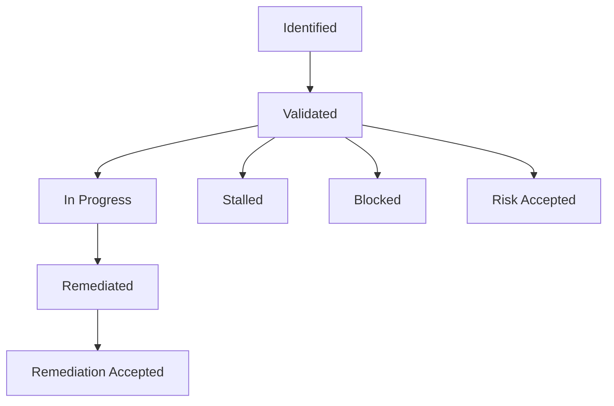
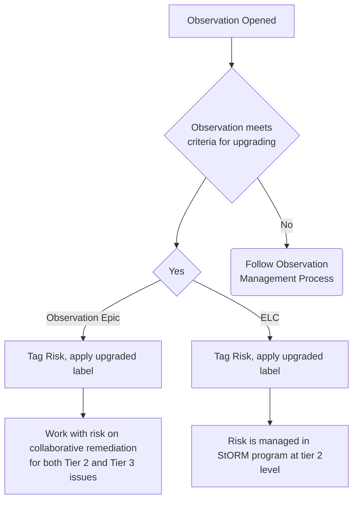
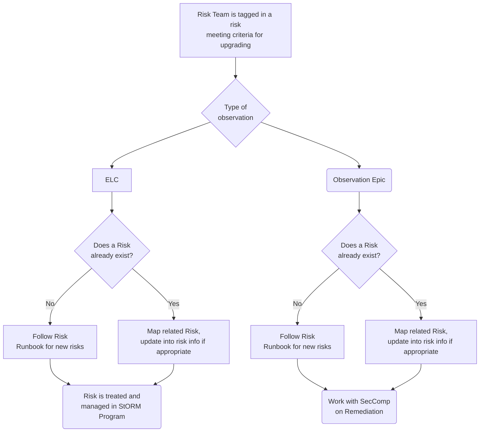

## Purpose

The Observation Management Program at GitLab is used to identify, track, remediate and provide a risk ratings of identified findings, exceptions or deficiencies for any Tier 3 information system risks that are identified as an output of compliance operations or other mechanisms by team members, such as self-identification of a system specific risk.

This procedure details the creation process for observations.

## Scope

Tier 3 risks or observations identified at the information system or business process levels

## Roles and Responsibilities

| Role | Responsibility  |
| ---- | ------ |
| Observation Manager | Responsible for being the observation DRI through the observation lifecycle including verifying and fine tuning recommended remediation plans in order to meet legal and regulatory requirements. |
| Remediation Owner | Validates observation, confirms assignee, due date, finalizes remediation plan and conducts remediation activity based on defined [remediation SLA's](/handbook/security/security-assurance/observation-management-procedure/#remediation-sla). |
| Managers to Executive Leadership | Responsible for escalation as necessary and resource allocation for remediation activity. |

## Procedure

### Lifecycle Overview

### Observation Workflow Labels

These workflow labels indicate with the observation issue within the lifecycle.

| Label | Description |
| ------ | ------ |
| Observation Workflow:: Identified | Initial review to determine validity of observation     |
| Observation Workflow:: Validated| Remediation owner has been assigned, but remediation has not started |
| Observation Workflow:: In Progress| Remediation owner has been assigned and remediation is underway |
| Observation Workflow:: Remediated| Remediation owner indicates the [remediation step](/handbook/security/security-assurance/observation-management-procedure/#observation-remediation) is complete|
| Observation Workflow:: Remediation Accepted| Indicated that the observation manager has reviewed remediation and agrees the issue is closed|
|Observation Workflow:: Risk Accepted| Observations that no remediation action will be taken and have been risk accepted by the remediation owner. Please tag `@madlake` in these issues.|
| Observation Workflow:: Blocked| Indicated that the observation is blocked - please indicate why in a comment|
| Observation Workflow:: Stalled| Indicated that remediation is stalled|

### Observation Category Labels

Labels in this set are used to categorize issues for metrics and reporting and cross-team collaboration.

| Label | Description |
| ------ | ------ |
| Department::***   | Department that is responsible for remediation  |
| RiskRating:: Critical| Risk rating for security compliance observations - Critical|
| RiskRating:: High| Risk rating for security compliance observations - High|
| RiskRating:: Moderate| Risk rating for security compliance observations - Moderate|
| RiskRating::Low | Risk rating for security compliance observations - Low| 
| ObservationManager::*** | GitLab team member managing the observation through the [observation phases](/handbook/security/security-assurance/observation-management-procedure/#lifecycle-overview). |
| Blocked:: Awaiting Remediation Owner Input    | This flags indicates the observation manager is waiting for response from the remediation owner.   |
| Blocked:: Awaiting Observation Manager Input  | This flags the issue for the observation manager on the SecAssurance team                                                                                       |
| Blocked:: New tool implementation in progress | This flags the issue for pending completion of the new tool                                                                                                     |
| Upgraded::StORM-Managed                       | This label will be leverage when the observation has been upgraded to a tier 2 risk and will be managed in the StORM program                                    |
| Upgraded::StORM-Shared                        | This label will be leverage when the observation has been upgraded to a tier 2 risk and remediation is shared by the Security Risk and Security Compliance team |
| NIST CSF Function:*** | Identifies observations within the NIST CSF function|
| NIST CSF Category:*** | Identifies observations within the NIST CSF category|
| seccomp program:***| Identifies which program or external certification is affected by the observation|
| system::***| Identifies what system is impacted by the observation|

### Identifying Observations

Observations can be identified through the following channels:

1. Security control testing activities (CCM)
1. Business Impact Analysis (BIA) activities
1. External audit activities
1. Gap assessment activities
1. Ad-hoc issues

### Assigning Observations

The observation identifier is responsible for opening an observation in the GitLab Observation Project. The observation identifier fills out all necessary observation information, remediation recommendations and submits the observation to the Remediation Owner for validation. The Observation Manager is responsible for managing the observation through the observation lifecycle. This includes linking the observation to the associated control in Hyperproof, validating the observation with the Remediation Owner, tracking all remediation progress and updating the GitLab issue with current information and status updates. Each observation has both a GitLab Issue (for Remediation Owners) and a Hyperproof Issue (for Observation Managers). Each observation will be assigned a [risk rating](#risk-ratings), which should drive the priority of remediation.

### Drafting Observation Description Guidance

The Observation description should include the who, what, when, where, why, and how related to the observation. As a review step, if you knew nothing about this observation could you understand the finding, how it was identified, and the effect it has on objectives? Consider leveraging the 4C's model:

1. Condition - current state
1. Criteria - desired state based on policy, requirement, control, regulation, etc.
1. Cause - root cause of the observation
1. Consequence - actual or potential effect on objectives/assets

### Risk Ratings

Tier 3 information system risk ratings are based off the formula below.

> Risk Rating = Likelihood x Impact

#### Determine the likelihood of the observation recurring

At GitLab, observations will be rated based on the likelihood the observation has recurring and/or the frequency that the control has seen observations.

| Qualitative   Score |  Scoring Guidelines |
| :--------------------: |  ------------------ |
| **4** |  The control has observations that have persisted and continue to occur year to year AND/OR the observation noted is associated with the design of the control. |
| **3** |  The control has had multiple observations in the current fiscal year or prior 9 months, whichever is longer. |
| **2** |  The observation was identified as a result of management's oversight on the control and may potentially occur again. This is the only observation associated with the control in the current fiscal year or prior 9 months, whichever is longer.    |
| **1** |  The observation identified is considered to be a one off occurrence for the control as a result of extenuating circumstances. It is unlikely to occur again once remediated. |

#### Determine the impact of the observation

| Qualitative Score | External Audit Impact | Remediation Effort |  Legal & Regulatory Impact | Financial Impact |
|:----------------:|:---------------------|:-------------------|:-----------------|:-------------------------|
| **4** | The observation *will* result in a documented finding in the audit. | The observation has remediation effort that requires support at the executive level. |  The observation could directly result in major regulatory action against GitLab. | Loss of $500,000+|
| **3** | The observation is *likely* to result in a documented finding in the audit. | The observation has remediation effort that requires support at the director level. |  The observation could lead to an investigation or regulatory action. | Loss between $10,000 and $499,999 |
| **2** | The observation would *likely not* lead to a documented finding in the audit because it is an isolated occurrence. | The observation has remediation effort that requires support at the management level. | The observation could lead to minor regulatory action. | Loss between $1,000 and $9,999 |
| **1** | The observation would *not* lead to a documented finding in the audit. | The observation was related to extenuating circumstances and requires simple reinforcement of policy/process, no additional management oversight required. |  The observation would not lead to major action by a regulator. | Loss up to $999. |

#### Determining Risk Rating

Once the likelihood and impact scores are determined, the following table can be used to determine the risk rating for the observation:

|Risk Rating|Risk Score Range|
|:---------:|:--------------:|
|Critical|16|
|High|12-15|
|Medium|4-11|
|Low|1-3|

### Observation Remediation

Once all remediation activities have been completed, the Remediation Owner is responsible for tagging the Observation Manager in the observation issue. If there is no Observation Manager assigned, tag `@gitlab-com/gl-security/security-assurance/security-compliance` in the observation issue.

It is the responsibility of the Observation Manager to track the milestones, work progress and validation of the remediation activity. The Observation Manager will then validate the remediation activity for completeness, re-test the observation (as applicable) and close the observation issue. If re-testing does not result in a fully effective conclusion, the observation description and remediation recommendations may be updated to reflect the new findings and required remediation tasks.

### Remediation SLA

Observation remediation SLA's are determined by the risk rating of the individual observation. The following table shows the SLA for each risk rating unless otherwise defined by the agreed upon remediation plan.

| Risk Rating | Remediation SLA |
| :---: | :---: |
| Critical | 3 months|
| High | 6 months|
| Medium | 12 months|
| Low | 18 months|

### Criteria for Upgrading Observations To Tier 2 Risks

Criteria and procedures

The observation program is a key input to the [StORM program](/handbook/security/security-assurance/security-risk/storm-program), which manages tier 2 security operational risks. When the following criteria is met, it is an indicator that a larger risk exists and is upgraded to a tier 2 operational risk and therefore included in the StORM program. This criteria is as follows:

- An observation in an entity level control
- When multiple observations share root cause and are grouped in an observation epic. Observation epics are a group of observations spanning multiple systems that have shared root cause and remediation paths.

### Security Compliance Workflow

### Security Risk Workflow

Detailed write up:

1. Open an observation following the [Observation Intake runbook](https://gitlab.com/gitlab-com/gl-security/security-assurance/security-compliance-commercial-and-dedicated/observation-management/-/blob/master/runbooks/1_Observation%20Intake%20and%20Management.md?ref_type=heads) (internal only).
1. If the observation meets the criteria for being upgraded, tag the [StORM DRI](/handbook/security/security-assurance/security-risk/#storm) and apply label ~upgraded::storm-managed if an ELC or ~upgraded:storm-shared if added to an observation epic.
    1. Definitions of labels:
        1. `Upgraded::StORM-Managed` : StORM risk managers are solely responsible for tracking remediation activities
        1. `Upgraded::StORM-Shared` : Remediation of the observation and risk is shared by the StORM risk managers and the observation manager. The StORM risk manager may track remediation activities spanning multiple systems via a common initiative, while the observation manager would be responsible for remediation of the specific system. See the [collaborative remediation](#collaborative-remediation) section for more details.
1. When the Security Risk team is tagged, someone on that team will determine if there is a risk represented for the observation meeting the criteria.
    1. If there is an existing risk, they will map the observation to the risk and leave a comment in the GitLab issues for transparency.
    1. If there is not an existing risk, they will open a new risk following the [StORM Risk Intake runbook](https://gitlab.com/gitlab-com/gl-security/security-assurance/security-risk-team/storm/-/blob/master/runbooks/storm-risk-intake-gl.md?ref_type=heads) (internal only).
1. An entity level control, the observation will be entirely managed by the StORM program at the tier 2 risk level, represented by the `Upgraded::StORM-Managed` label.
1. If the Observation is not an entity level control, Security Compliance will work with Security Risk for collaborative remediation with the remediation owner(s).

#### Collaborative Remediation

Security Compliance and Security Risk should look for opportunities to remediate via aggregated/common controls. In the event that observations can be remediated via a common control or implementation, activities can be tracked by the Security Risk team. For example, if we have systems that are not meeting password requirements and remediation across multiple systems involves integrating with Okta, this roll-out can be tracked by Security Risk. If remediation is system-specific, remediation activities can be tracked by Security Compliance. Remediation testing will be completed by which ever team is tracking remediation activities using the [Security Compliance remediation runbook](https://gitlab.com/gitlab-com/gl-security/security-assurance/security-compliance-commercial-and-dedicated/observation-management/-/blob/master/runbooks/2_Remediation%20and%20Closeout.md).

### Status Labels

Defined below are status labels that will aide in the process of managing remediation of observations.

| Label| Definition|
|--|--|
|`Blocked:: Awaiting Remediation Owner Input`| This flags indicates the observation manager is waiting for response from the remediation owner. |
|`Blocked:: Awaiting Observation Manager Input`| This flags the issue for the observation manager on the SecAssurance team|
|`Blocked:: New tool implementation in progress` |This flags the issue for pending completion of the new tool|
|`Upgraded::StORM-Managed` | This label will be leverage when the observation has been upgraded to a tier 2 risk and will be managed in the StORM program|
|`Upgraded::StORM-Shared` | This label will be leverage when the observation has been upgraded to a tier 2 risk and remediation is shared by the Security Risk and Security Compliance team|

## Metrics and Reporting

Please refer to the [observation management project](https://gitlab.com/gitlab-com/gl-security/security-assurance/security-compliance-commercial-and-dedicated/observation-management)'s [issue boards](https://gitlab.com/gitlab-com/gl-security/security-assurance/security-compliance-commercial-and-dedicated/observation-management/-/boards/5659373?label_name[]=Department%3A%3ASecurity%20Compliance) for details for all observations by risk, status, and department. Please refer to our [tableau dashboard](https://10az.online.tableau.com/#/site/gitlab/views/ObservationMetrics/SecCompOperationalMetrics?:iid=1) for operational metrics for the observation program.

## Exceptions

Exceptions will be created for observations that breach a mutually agreed upon remediation date, breach in SLA or if the Remediation Owner confirms the observation will not be remediated.

Exceptions to this procedure will be tracked as per the [Information Security Policy Exception Management Process](/handbook/security/controlled-document-procedure/#exceptions).

## References

- [GCF Control Lifecycle](/handbook/security/security-assurance/security-compliance/security-control-lifecycle/)
- [Observation Management Project](https://gitlab.com/gitlab-com/gl-security/security-assurance/observation-management)

## Contact & Feedback

If you have any questions or feedback about the observation management process please [contact the GitLab Security Assurance Team](/handbook/security/security-assurance/#i-idbiz-tech-icons-classfas-fa-usersicontacting-the-team).
