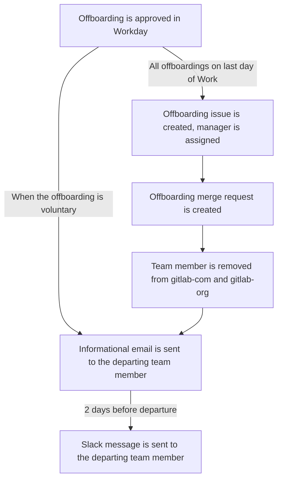

The People Group Engineering team aims to reduce as much manual work as possible. One of the areas we have done this, is everything related to the employment automation flow.

## Offboarding

Note: this section only discusses items in the offboarding where People Engineering was involved. You can read more about offboarding at GitLab on [this handbook page](/handbook/people-group/offboarding)

## Timeline Flow



> Terminations will be processed within a valid offboarding window for the day, according to the team members current timezone of their primary address in Workday. Please see, the [Scheduled Offboarding Issue Creation](#scheduled-offboarding-issue-creation) section for more.

## Automations

### Voluntary offboarding email

When a team member voluntarily leaves GitLab, an email going over the offboarding interview and frequently asked questions is automatically sent to them.

The pipeline is scheduled to run every hour and scan for any recent voluntary offboardings that have been submitted in Workday. Email status is then synced to our [notification spreadsheet](https://docs.google.com/spreadsheets/d/1EB5w9Bg32sSNHXIW53Yks_3SEl6FnVxQE77EIG3CVcg/edit?usp=drive_web&ouid=108123136078926162603) to ensure these emails are not sent out again.

### Scheduled offboarding issue creation

Every 15 minutes, a pipeline scans Workday for any terminations.

All scheduled offboardings will be opened between 4:00 - 5:00pm of the team members *local timezone*.

For each row matching this criterion, it will perform the same actions as if a People Connect Team member ran manually initiated the offboarding. (see [Manually initiated offboarding issue creation](#manually-initiated-offboarding-issue-creation) and [Offboarding merge request](#offboarding-merge-request) sections).

The manual process is kept as a backup process should the automation fail or for exceptional cases where a team member offboarding cannot be added to the offboarding spreadsheet.

After the offboarding issue has been created, we send a follow up message to the `#offboardings` Slack channel contianing the team members name, last day of work, and a link to the opened offboarding issue.

<details>
  <summary>Automation Overview</summary>
  <div style="width: 640px; height: 480px; margin: 10px; position: relative;"><iframe allowfullscreen frameborder="0" style="width:640px; height:480px" src="https://lucid.app/documents/embedded/982e697f-797d-426e-ac2a-6065b8422460" id="_t~UzrcpTEIj"></iframe></div>
</details>

### Manually initiated offboarding issue creation

After a People Connect Team member runs the Slack command to open the issue, this will be automatically assigned to the People Connect Team member
who ran the command and the outgoing team member's Manager.

The job then grabs various details of the outgoing team member, like country of residence, entity through which they are hired, division, department, job title etc. For each of these details, it checks for the existence of a task file in the [`offboarding_tasks` folder](https://gitlab.com/gitlab-com/people-group/people-operations/employment-templates/-/tree/main/.gitlab%2Fissue_templates%2Foffboarding_tasks) of the `employment` project. These tasks files are of the format `country_<country name>.md`, `entity_<entity name>.md`, `division_<division name>.md`, `department_<department name>.md`, etc. If such a file is found, it includes contents of those files also in the offboarding issue.

This issue is added to the [team member's epic](/handbook/people-group/engineering/employment-issues#epics).

### Offboarding merge request

The `offboarding` command will also create a merge request to the `www-gitlab-com` project. This MR includes:

- Removing the individual file from the `data/team_members/person` directory
- Removing the picture used in the previous file
- Adjusting the `reports_to` in case the offboarded team member had reports
- Removing the pet picture in case the team member had any
- Update the CODEOWNERS file: change to the manager or remove if the manager is already a codeowner for that file

In the event that the merge request has become out of date and the `/rebase` quick action isn't working a People Connect Team member can follow these steps to regenerate the MR:

1. Close the MR that is out of date, and ensure to delete the branch that this was created on.
1. Run the offboarding team page Slack command to re-trigger the automation.
1. Verify that the MR has been opened.

### 90 Day Offboarding Issue Closer

Every day, Monday-Friday, we run an automation to check for offboarding issues that have been open longer than 90 days. If any are found, we leave a comment with the [`/close` quick action](https://docs.gitlab.com/ee/user/project/quick_actions.html) to close the issue.

#### Reasoning

This aims to cleanup the employment project of any offboarding issues that have already been completed, as these issues are subject to a **5 day SLA** from when the issue is created, there should be no remaining tasks by the 90 day mark.

More information regarding this addition in [this issue](https://gitlab.com/gitlab-com/people-group/peopleops-eng/people-group-engineering/-/issues/599).

#### Details

We leverage the [issues API](https://docs.gitlab.com/ee/api/issues.html#list-issues) to search for related issues matching the following filters:

```ruby
{
  created_before: "#{90.days.ago.end_of_day.iso8601}", # eg. 2019-03-15T08:00:00
  per_page: 100, # limit results to 100 issues per request
  labels: [ 'offboarding' ], # only match issues with the 'offboarding' label
  state: 'opened', # only match open issues
  confidential: true, # all offboardings are confidential by default
}
```

We then iterate through the collection of issues to leave comments closing each issue out with the following message:

```text
This issue has been opened for more than 90 days and is going to be automatically closed.
If you have any remaining items on this issue complete them immediately.

/close
```
