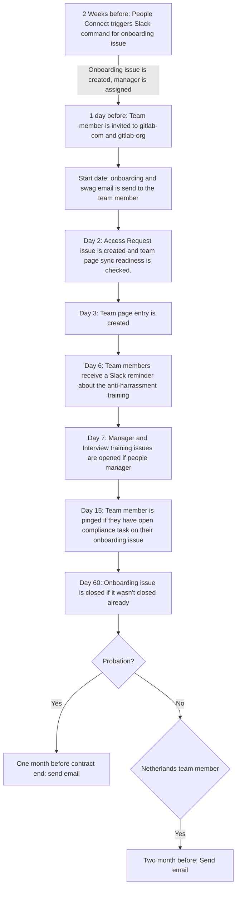
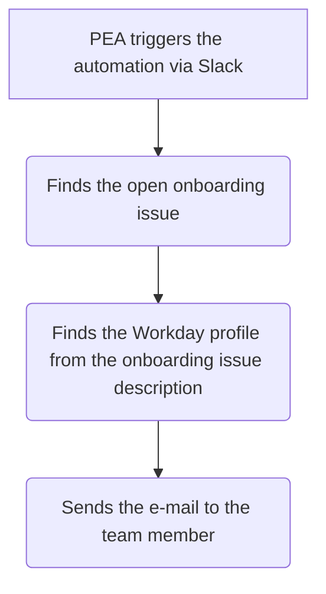

The People Group Engineering team aims to reduce as much manual work as possible. One of the areas we have done this, is everything related to the employment automation flow.

Everything on this page, assumes the team member is already present in Workday.

## Onboarding

Note: this section only discusses items in the onboarding where People Engineering was involved.

## Timeline Flow

## Onboarding issue creation

The onboarding issue creation is a semi-automated process. Meaning that it needs to be triggered by a People Connect team member to be started. A People Connect team member can make use of the `onboarding` Slack command to initiate the process.

The onboarding issue will be automatically assigned to the People Connect Team member
who ran the command and the incoming team member's Manager.

The onboarding tasks that are applicable to all team members are listed in the
general [`onboarding.md`](https://gitlab.com/gitlab-com/people-group/people-operations/employment-templates/-/blob/main/.gitlab/issue_templates/onboarding.md) file. It will be included by default in the onboarding issue.

The job then grabs various details of the incoming team member, like country of residence, entity through which they are hired, division, department, job title etc. For each of these details, it checks for the existence of a task file in the [`onboarding_tasks` folder](https://gitlab.com/gitlab-com/people-group/people-operations/employment-templates/-/tree/main/.gitlab/issue_templates/onboarding_tasks) of the `employment` project. These tasks files are of the format `country_<country name>.md`, `entity_<entity name>.md`, `division_<division name>.md`, `department_<department name>.md`, `role_<exact job title>.md`, etc. If such a file is found, it includes contents of those files also in the onboarding issue.

Role templates don't take seniority into level. For example SDR 1, 2, or 3 would all receive the SDR template.

If you receive a question from a manager about why a template was not linked in an onboarding issue, be sure to check the naming convention of the template and ensure everything matches up in Workday with the entity, division, department, etc. If everything looks like it's matched up, reach out to the People Group Engineer for additional assistance.

Note: If a People Connect Team member needs to create the onboarding issue for interns, they can use the same Slack command.

This issue is added to the [team member's epic](/handbook/people-group/engineering/employment-issues#epics).

If you want to read more about how employment issues are set up, please read [this section](/handbook/people-group/engineering/employment-issues).

## Invited to GitLab.com

We run a scheduled pipeline every day that invites team members starting the following day to the two main GitLab groups:

- gitlab-com
- gitlab-org

The invite email is send to their `GitLab` email address which they will get access to the next day.

> These invites are set to expire one month after their start date.

## Onboarding Email

This is the [email](https://gitlab.com/gitlab-com/people-group/people-operations/employment-templates/-/tree/main/email_templates) that is sent to our team members on the morning of their first day of employment (based upon the onboarding date in the issue title). The email is cc'd to `people-connect@domain`.

Every day we run 3 scheduled pipelines. They are each set up for a specific region:

- Americas at 10 AM UTC
- EMEA at 4 AM UTC
- APJ at 6 PM UTC

For the **APJ** pipeline, it will fetch the team members with a start date for the next day (timezones).

For the **EMEA** and **Americas** pipelines, it will fetch all the team members that have a start day equal
to the current day (so who is starting today). The pipeline then filters out the ones for the region
they need to send the email to. This all is to ensure we don't send out the email too late or too early.
The region of the team member is determined from the region that is on their Workday profile. This is the
first iteration, if we need to split it up by country, we can rework the current implementation.

We fetch some other data besides the region as well:

- their onboarding issue URL
- their name

This data is used to populate the email that we then send to them. The email address used to send the email is `onboarding@domain` and is set with a `reply-to: people-connect@domain` as nobody monitors replies to `onboarding@`. The email address is strictly used for automation.

### Manual Onboarding E-Mail

If for some reason the e-mail could not be sent, we have added functionality for a People Connect Team member to be able to manually send this by running the `onboardingemail` Slack command.

This  triggers the following flow:

### Updating Email Template

If changes are required to the onboarding email template, follow these steps to update them:

- Browse to the MJML [page](https://mjml.io/try-it-live/)
- Open the MJML [template](https://gitlab.com/gitlab-com/people-group/people-operations/employment-templates/-/blob/main/email_templates/onboarding_email.mjml)
- Copy and paste the template file of your choice into MJML website on the left
- Make the relevant changes and then select `View HTML` on the top left hand side of the website.
- Copy the HTML version to the HTML template.
- Copy and pasted the MJML version from the browser to the MJML template.
- Submit Merge Request like normal with the updates.

## Swag Email

This is the [email](https://gitlab.com/gitlab-com/people-group/people-operations/employment-templates/-/blob/main/email_templates/swag_email.md) that is sent on the first day of a new team member so they receive the instructions to redeem their new hire swag. The email is cc'd to `people-connect@domain`.

Every day at 9 AM UTC we run a scheduled pipeline. This pipeline will fetch all the eligible team members. An eligible team
member means:

- Team member who is on their first day of employment at GitLab

The email address used to send the email is `onboarding@domain` and is set with a `reply-to: people-connect@domain` as nobody
monitors replies to `onboarding@domain`. The email address is strictly used for automation.

## Access Request issue creation

To get access to the tools our team members need for their job, an Access Request (AR)
issue needs to be created. To make sure our team members experience a good onboarding,
we automated this process by creating the AR Role based entitlement issue
with the bot.

Every day we run 3 scheduled pipelines. They are each set up for a specific region:

- Americas at 10 AM UTC
- EMEA at 4 AM UTC
- APJ at 6 PM UTC

For the APJ pipeline, it will fetch the team members with a start date for the current day (timezones).
For the EMEA and Americas pipeline, it will fetch all the team members that have a start day equal
to the previous day (so who started yesterday). The pipeline then filters out the ones for the region
they need to send the email to. This all is to ensure we don't create the issue too late or too early.
The region of the team member is determined from the region that is on their Workday profile.

For all these members it will check if it is possible to create an Access Request
issue. It will only work for the members with roles that have a set template in the
[role baseline access requests tasks directory](https://gitlab.com/gitlab-com/team-member-epics/access-requests/tree/master/.gitlab/issue_templates/role_baseline_access_request_tasks).

The templates are created on a role level and can be created for the specialty level as well. For example
if you have a person with the role `Security Engineer, Strategic Security`. The code will look for two templates:
`role_security_engineer.md` and `role_security_engineer_strategic_security.md`. Note: you don't need to have both created,
but if there are two, the code will use both to create the issue, if there is just one, it will create the one it can find.

The issue will be created in the [AR project](https://gitlab.com/gitlab-com/team-member-epics/access-requests).

The bot will announce in Slack (#peopleops-alerts-private) the list of people that we were able to
create the AR. As well as the list of people (with their role) that we weren't
able to create the AR for. This way we can connect with the teams so they can add a template for this role.

For those that we can not create an issue, the Employment bot will leave a comment on the onboarding issue. In this comment the manager is tagged to inform them and we ask them to create the issue and if needed to create a template for future hires.

Note: People Operations is not responsible for creating or maintaining the templates, each team
is responsible for creating the templates for their roles. This is also explained in the
[README](https://gitlab.com/gitlab-com/team-member-epics/access-requests/blob/master/README.md) of the project.

Here's a video with the People Group Engineer going over the AR automation. They discuss
how it works and how a template can be added.



## Team page readiness check

Every day at 09AM UTC, we have a pipeline running that fetches all the team members that started yesterday and check if they can be synced to the team page. Currently the only required item to determine if we can sync them is that they need to have a GitLab username.

If we can't determine their GitLab username (from the issue or from their Workday profile) we will leave an issue note on the onboarding issue asking them to fill in their Workday profile correctly.

## Sync to team page

Every day at 09AM UTC, we have a pipeline running that syncs our new team members to the `www-gitlab-com` project, so that they show up on the team page.

> Many teams have adopted the team page entries for building out custom partials within the handbook, any changes to this process should be sent in `#whats-happening-at-gitlab` prior to get insights from other teams on their particular use cases.

We fetch all the new team members with a start date of the day before yesterday and check if they opted-in on
being synced to the team page. Opt-in happens by setting `Export Name Location to Team Page` to `Yes` on their Workday profile. This is a task on day one for the new team member.


You can find a Howto guide for setting the Opt-in mentioned above by searching for a doc titled, "How to: Set Team Page Export Preferences" in Google drive.


If they selected yes, we grab some data (name, job title, start date, department and country) and format it,
so it can be added to the team page entry. If they did not opt-in, we still add an entry to the team page.
However that entry is anonymous. For every new team member, we commit a new file in the `data/team_members` directory.

We then create a merge request on `www-gitlab-com` project so it can be merged.

The merge request is assigned to the People Connect team and they set it to merge when the pipeline succeeds.

### Possible Errors and Fixes

In the event we run into errors with the team page sync, we have some backup plans in place.

In case team members did not fill in the required data, we won't be able to sync them. A People Connect Team member
can later on sync them by running the `teampageindividual` Slack command.

This will spin up a pipeline and fetch the details. Note that if the team member was synced already, it will abort the sync.

If the **entire** group of team members was missed, in the event of a failed pipeline or another error, a People Connect Team member can re-run the sync by using the `teampageweek` Slack command.

This will trigger a new pipeline and fetch the new team members of the provided week and create a new merge request adding them to the Team page.

## Slack reminder for the anti-harrassment training

We have a daily pipeline that checks everyday who started 6 days ago. For those team members, we send a reminder
that they have to complete the anti-harrassment training.

## Manager and Interview training issues

There's a scheduled pipeline that runs every day that checks for hires that started a week ago.
For those hires we will look if the incoming
team member is a people manager. Currently there's no exact field
on Workday for us to check this. The way we do this is by looking
at their job title. If it **starts** with any of the following:

- `Team Lead`
- `Manager`
- `Senior Manager`
- `Director`
- `Senior Director`
- `Chief`
- `VP`
- `Vice President`

We also consider the person a people manager when the job title **ends** with:

- `Area Sales Manager`

We create the Interview Training and Becoming a Manager issues in the
[People Group Training project](https://gitlab.com/gitlab-com/people-group/Training).

## Onboarding compliance checks

We run a scheduled pipeline every day that fetches our team members that are on their 15th day of employment at GitLab. We look on their onboarding issue if they have any compliance tasks open.

A compliance task is marked with the `:red-circle` icon. If they have any open tasks the onboarding bot will tag the user asking to finish the open tasks.

## Onboarding issue closing

It is expected that onboarding issues be completed and closed within 30 days of
opening. To remind team members about this, we are using the `due date`
functionality in GitLab issues. When an onboarding issue is created, we
automatically calculate the due date by adding 31 days to their start date.
GitLab will send a reminder notification email to all the assignees of the issue
near the due date.

In addition to this due date, team members get an additional 30 days to complete
and close the onboarding issue. In total, a team member gets around 60 days
to complete their onboarding issue.

We have a scheduled pipeline to close the outdated issues (issues that
have been open for more than 60 days). This pipeline will add a comment on the
issue that it is being automatically closed and what the team members should do
if they have onboarding tasks remaining.

Currently, the pipeline is scheduled to be run at 09:30 PM on every Friday. It
will close all the onboarding issues created before 60 days from that date.


