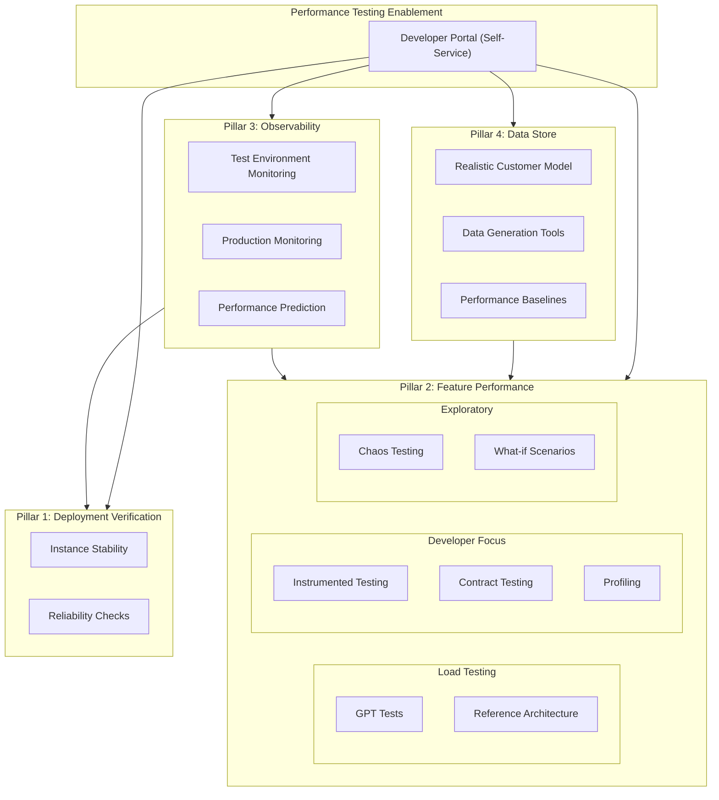

## Overview

Between Self-managed, Dedicated and SaaS, we are going to have a large number of GitLab instances (Tenants and Cells) running that we will need to deploy to. Every time we deploy, we need to verify that the deploy was successful and the instance came back up correctly. We could verify the deploy through the use of E2E (End to End) test scripts. However this is a very slow, expensive, and invasive approach. E2E tests work through the UI/API of GitLab which makes them vulnerable to changes in functionality (which are frequent for an application that is still under active development), often require administrator access, and generate data on the instance we are testing. All three of these are not very desirable on customer facing instances. 

Many of the checks that we need to do would be painful or difficult to test and report on from an E2E perspective. For example, verifying that the GitLab instance is able to connect to all it's data stores correctly could only be tested indirectly in an E2E scenario, by finding that some functionality does not work, but did it not work becuase the data store was not accessible or because some feature flag was not turned on or ...? 

A better approach would be to enhance GitLab's endpoints / health checks to allow the instance to tell us that it is configured correctly and getting responses, that way we are getting direct information on the check.

### Approach

Deploy verification checks can be divided into three approaches:

1. Improving GitLab's reporting to alert when a problem is detected (is the instance able to connect to S3)
2. Adding specific checks that can be run in a pipeline to detect if a component is configured correctly (is S3 configured correctly to be connected to)
3. Once those two are done, we can make the determination if it is worth running an E2E test to validate that the GitLab instance is using the commonent as intended (is GitLab able to push a run result to S3 for future analysis) NOTE: in virtually all use cases, this path will be redundant with GitLab functionality tests that are run earlier in the development cycle and should only be run if we have indentified that there's a specific need to test GitLab functionality as part of the deploy instead of configuration.

## Checks

This is a list of the checks that we have indentified as being ones that we are working on developing tests to support:

| Check Name | Description | Notes |
| ---------- | ----------- | ----- |

## E2E tests

Most of the testing this page documents will be non E2E tests, this section provides a space for us to notate scenarios we have uncovered that are best covered by an E2E test.

| Scenario | Description | Test that covers |
| -------- | ----------- | ---------------- |
