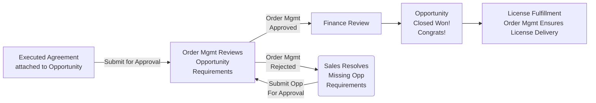
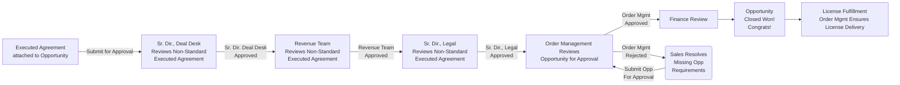

**Welcome to the Sales Order Processing page!**

This page outlines the Quote to Cash process. Topics include account and opportunity creation, quote configuration and approvals, opportunity booking requirements, and closing an opportunity. This page will also cover common questions that may arise after an opportunity has been closed.

### Helpful Links

- **Salesforce Reports and Dashboards**

  - [Current Quarter WW Sales Dashboard](https://gitlab.my.salesforce.com/01Z4M0000007H7W)
  - [Monthly Bookings Report](https://gitlab.my.salesforce.com/00O61000004Ik27)
  - [Deal Desk Pending Opportunity Approvals Report](https://gitlab.my.salesforce.com/00O4M000004e0Dp)

- **Frequently Used Handbook Pages**

  - [Sales Order Processing](/handbook/sales/field-operations/order-processing/)
  - [How to Work with Legal](/handbook/legal/customer-negotiations/)
  - [Deal Desk Opportunity Approval Process](/handbook/sales/field-operations/order-processing/#submit-an-opportunity-for-booking)
  - [Bookings Policy](/handbook/sales/field-operations/order-processing/#bookings-policy)
  - [Useful Company Information](https://gitlab.com/gitlab-com/finance/wikis/company-information)
  - [Account Ownership Rules of Engagement](/handbook/sales/field-operations/gtm-resources/rules-of-engagement/#account-ownership-rules-of-engagement)
  - [ARR Calculation Guide](/handbook/sales/sales-term-glossary/arr-in-practice/)
  - [Vendor Setup Form Process](/handbook/sales/field-operations/order-processing/#how-to-process-customer-requested-vendor-setup-forms)
  - [Security Questionnaire Process](/handbook/security/#process)
  - [Troubleshooting: True Ups, Licenses + EULAS](/handbook/support/internal-support/#regarding-licensing-and-subscriptions)
  - [Licensing FAQ](https://about.gitlab.com/pricing/licensing-faq/)
  - [Legal Authorization Matrix](/handbook/finance/authorization-matrix/)
  - [Trade Compliance](/handbook/legal/trade-compliance/)

- **Other Resources**

  - [Sales Territory Spreadsheet](https://docs.google.com/spreadsheets/d/1PYU8oQJQEPpi8K-SHuqSgPeSpLcWeSQd9FuwKtgD048/edit?ts=5d6ea274#gid=0)
  - [Quote Approval Matrix](https://docs.google.com/document/d/1-CH-uH_zr0qaVaV1QbmVZ1rF669DsaUeq9w-q1QiKPE/edit?ts=5d6ea430#heading=h.ag75fqu12pf0)
  - [Billing FAQs and Useful Tips](https://gitlab.com/gitlab-com/finance/-/wikis/Billing-Team-FAQs-&-Useful-Tips)
  - [Sample Order Form (Blank)](https://drive.google.com/open?id=1NB5KH7U4cucjiOjUdZrq94mYGzH6jG4f)

### **Creating Accounts and Contacts**

#### How to Create an Account

1. Click on the Accounts tab in Salesforce.
2. Click the "New" button.
3. Select either "Standard" or "Partner" record type. Each record type will have a different account layout.
    - "Standard" = all non-reseller/distributor accounts
    - "Partner" - only reseller/distributor/MSP accounts (note: sales should not create partner accounts, see point 6)
    - Note: Partners who are also customers must have two separate accounts - one Partner type account, and one Standard type account.
4. On the Create Account screen, do the following:
    - Complete all mandatory fields.
    - Be sure to enter the correct URL under "Domain" as this impacts the identification of the customer and related sales segment.
    - Click Save.
5. Be sure to enter detailed information regarding the customer or partner, including full legal name, full billing address, and other pertinent details.
6. If the account is a `Partner` account, it should be created via the partner creating an account in Impartner or manually via Partner Operations. Sales should not create Partner accounts and should Slack [#partner-programs-ops](https://gitlab.slack.com/archives/CTM4T5BPF).

#### How to Create/Edit a Contact

1. Click the "New Contact" button.
2. Add the full first name, last name, title, phone number, email address, and full address for all contacts.
    - Salesforce requires that all contacts entered on a quote as "Sold To," "Bill To," or "Invoice Owner Contact" have a full and complete address. A quote object containing contacts without full and complete addresses will not save.

### **Quote Configuration**

The following is a high level guide to quote types and important quote information to note before processing an order. Review the [**Go To Market Handbook**](/handbook/sales/field-operations/gtm-resources/) for opportunity creation instructions, and opportunity management guidelines. Review the [**Deal Desk Quote Configuration Guide**](/handbook/sales/field-operations/sales-operations/deal-desk/#zuora-quote-configuration-guide---standard-quotes) for written instructions and video tutorials specific to each quote type.

**Reference Link: [Starter/Bronze End of Availability + Tier Re-naming](/handbook/sales/field-operations/sales-operations/deal-desk/#quoting-guide-starterbronze-end-of-availability--silvergold-re-naming) Quoting Guide**

#### Standard Quote Types

There are 4 different types of quotes - New Subscription, Amend Existing, Renew Existing, Cancel Existing. Quote type will typically align to opportunity type. The correct quote type must be used for each opportunity.

| **Quote Type** | **When to Use** |
|-----------------|:-------------|
| [New Subscription](/handbook/sales/field-operations/sales-operations/deal-desk/#new-subscription-quote) | Any New Subscription Term OR Renewal where customer is changing term length |
| [Amend Subscription](/handbook/sales/field-operations/sales-operations/deal-desk/#amend-subscription-quote)     | Use this quote type to add users, true up, or change product tier **during the current subscription term.** (NOTE: True-ups added before renewal date will not eliminate true-up requirement for the same term which will be charged at renewal. True-up is a backward looking one-time fee that is always recognized at renewal. License add-ons during the term will eliminate the future true-ups to be charged at renewal.) |
| [Renew Existing Subscription](/handbook/sales/field-operations/sales-operations/deal-desk/#renew-subscription-quote)      | Customer is at the end of their current term and wants to renew for the same term length      |
| [Cancel Existing Subcription](/handbook/sales/field-operations/sales-operations/deal-desk/#contract-reset)      | This is used for a Contract Reset - please open a support case via opportunity button for assistance with contract resets      |

#### Quote Template Types

GitLab uses 5 quote templates to support each type of transaction. The following quote templates are available on all quotes (New Subscription, Amendment, Renewal). The correct quote template must be used for the deal as there is acceptance language specific to each route to market.

| Template                            | Use For                                                                                                  |
|-------------------------------------|----------------------------------------------------------------------------------------------------------|
| Standard Order Form                 | Most quotes, including alliance marketplace transactions, EDU/OSS/YC, or Customers with an Existing Agreement (MSA) in place |
| Standard Order Form (Hide Discount) | Hide the Discount and List Price Column for Direct Deals. Otherwise Identical to the Standard Order Form |
| Authorized Reseller Order Form      | Authorized Reseller Transactions                                                                         |
| MSP Order Form                      | Managed Service Provider Transactions                                                                    |
| Distributor Order Form              | Distributor Transactions                                                                                 |

Pre-Approved Legal Language can be added to each quote. Selections are listed as Toggle Fields on the quote object.

| Toggle Field                   | Output                                                                                   |
|--------------------------------|------------------------------------------------------------------------------------------|
| Annual Payments                | Annual Payment Language will populate in Payment Details on the Order Form PDF           |
| Customer Reference Language    | Customer Reference Language will populate in Notes Section of the order form             |
| Add Quarterly True Up Language | Standard Quarterly True Up Language will populate in the Notes section of the Order Form *This language permits manual quarterly add-ons, and can only be used when SuperSonics Quarterly Reconciliations do not apply |
| Remove Signature Block         | Signature Block will be removed. Use for customers with Existing Agreements (MSA)        |

Quotes run through an automated logic check to ensure that the selected Legal Language can be added to the order form. This logic check reviews characteristics of the quote, including populated fields, route to market, and products being sold to ensure added language does not conflict with the deal structure.

In some instances, you will make a selection that will require additional review and approval before an order form can be sent out. This is typically for complex/non standard deals. If you make a selection that cannot be accommodated, you will see an error message. Remove the selection and move forward with the quote. If you are confused, or need assistance, open a Deal Desk support case and provide a screenshot of the error you're experiencing.

#### Known Quote Template Issues

**Additional Line Items Displaying on the Quote**: If you construct a quote and notice that there is an additional line item displaying on your quote, know that this is the result of a [known Zuora bug](https://web.archive.org/web/20210227012538/https://community.zuora.com/t5/Zuora-CPQ/known-Issue-Duplicate-Rate-Plan-created-for-Renewal-Quote-when/m-p/34564#!%2F%23M3294). The only current workaround in place is to recreate the quote from scratch by clicking the `New Quote` button and follow the New Quote creation flow.

#### Quote Assistance

If your quote requires any special, non-standard edits, or if you have questions regarding standard quotes, you are encouraged to open a Deal Desk support case via the SFDC Opportunity record for assistance.

Please provide as much detail as possible, including links to relevant records, dates, user counts, and other applicable information. **It is the Opportunity Owner's responsibility to create all standard quotes, unless they are complex custom deals or one of the scenarios listed below.**

#### What quotes can Deal Desk assist me with?

Deal Desk will review any quote to ensure accuracy and completion. **[Standard Quotes](/handbook/sales/field-operations/order-processing/) are expected to be created and managed by the opportunity owner or ISR.**

For **Non-Standard/Complex Quote requests**, the Deal Desk team will assist the opportunity owner in creating the quote correctly. Some examples of these complex scenarios include:

- **Contract Resets:** If the customer wishes to reset their subscription term in the middle of their term (for example, they want to upgrade, but want to reset their term for 12 months starting on the date of upgrade), you will need create a new subscription. In this case, the Subscription Type will be 'New' while the Opportunity Type will be 'Renewal'. Deal Desk will assist you with the credit portion for the remainder of the existing subscription, which in this case would be cancelled.
- **Co-term of multiple subscriptions:** If the customer has multiple groups and wishes to consolidate their subscriptions, an "Amendment" may be created against a "Renewal Business" opportunity.
- **Splitting out a single subscription**. Conversely, there may be times when a customer needs to split their single subscription into multiple subscriptions. When this occurs, the Subscription Type and Opportunity Type will be 'Renewal'.
- **Ramped Pricing:** If the prospect or customer would like to employ a ramped pricing schedule where they may want to increase their user count over time. Two examples of ramped schedules include:
  - Year 1 will be for 100 users and Year 2 will be for 200 users.
  - Year 1 will be $45 per user per year and Year 2 will be $48 per user per year

Please review the [Deal Desk Quote Configuration Guide](/handbook/sales/field-operations/sales-operations/deal-desk/#zuora-quote-configuration-guide---standard-quotes) for more information. Note that the above list of non-standard quote elements is not exhaustive. If you encounter a non-standard need that is not listed on this page, request internal support to create a case for Deal Desk on the SFDC Opportunity in question for evaluation and assistance.

#### Quote Tax Information

If a customer requests Tax removed from the quote, they need to provide a Valid Tax Exemption Certificate. Please attach this to the opportunity.

1. Tax Exempt - Need to check with client to make sure they are tax exempt and load tax exempt certificate into their account in SFDC.
1. Tax Exempt - If tax exempt click yes on drop down menu and add additional notes if needed.
1. Tax/VAT ID field - adding a valid VAT ID is required for tax compliance of cross-country transactions to European Union countries. These are when we bill from GitLab Inc to any EU country, from GitLab BV to any other EU country except the Netherlands, from GitLab Ltd to any other EU country except the UK, from GitLab GmbH to any other EU country except Germany. **Note there is an [automation rule](https://gitlab.my.salesforce.com/01Q4M000000oVDi) in Salesforce that automatically populates the contents of a Quotes `VAT ID` from a quotes `VAT/Tax ID` - If you attempt to update the VAT ID and it is overwritten please [open a case for support](/handbook/sales/field-operations/sales-operations/) on the related opportunity**
1. Special Terms and Notes - Enter any additional notes that is not specified by the above settings.

#### How to Create a Draft Proposal

Follow the standard process for [quote creation](/handbook/sales/field-operations/sales-operations/deal-desk/#zuora-quote-configuration-guide---standard-quotes). The Quote Object **does not** need to be approved before generating a Draft proposal.

1. Click Edit Quote.
2. Select the Draft Quote Template. Save.
3. Click Generate PDF. A Draft Proposal PDF will be attached to the opportunity in the Notes & Attachments section.

**Important Notes**

- A Draft Proposal PDF is not an Order Form. All quotes must go through the applicable approval process before you can generate an Order Form. Draft Proposals are not guaranteed approval.
- A Draft Proposal PDF will not be accepted in place of an Order Form under any circumstance.

### **Billing and Subscription Management ("SuperSonics")**

GitLab's Cloud Licensing experience allows for the activation and provisioning of Quarterly Subscription Reconciliation and Auto-Renewals, which apply to both SaaS and Self-Managed Subscription plans. In addition, the Cloud Licensing experience introduces Operational Data.

#### Auto-Renewal, Quarterly Subscription Reconciliation, and Operational Data: Eligibility

The SuperSonics Billing and Subscription Management Experience applies to all eligible new customers and any eligible existing customers at their next renewal, assuming they are running GitLab 14.1 and have opted into the new terms. To determine whether your customer is eligible for Auto-Renewal, Quarterly Subcription Reconciliation, and Operational Data, review the [Availability Matrix](https://internal.gitlab.com/handbook/product/fulfillment/#feature-availability-matrix) and read the [Customer Availability Summary Table](https://docs.google.com/document/d/1XmaIDggCYespisg1MTXHMVDUnWtdRsDw_brz-ir9RrI/edit#bookmark=id.jb012t7kd93k) section of the [Field Team FAQ](https://docs.google.com/document/d/1XmaIDggCYespisg1MTXHMVDUnWtdRsDw_brz-ir9RrI/edit#). Please direct any questions regarding SuperSonics eligibility to the #pnp-changes-field-questions Slack channel.

#### Auto-Renewal, Quarterly Subscription Reconciliation, and Operational Data: Sales Assisted Transactions

Specific fields have been added to the Quote object to support SuperSonics Functionality. These fields will appear on two sections of the quote object.

##### Zuora Fields

This section contains a number of fields that show the current state of each SuperSonics feature (Auto-Renewal, Quarterly Subscription Reconciliation, Operational Data). The "Contract" fields show whether the customer is contractually eligible for the related feature. The "Turn On" fields show whether that feature is actually enabled on the subscription.

For customers who are not exempt, the default values will be "Yes" for all fields. For customers who are exempt based on the [Availability Matrix](https://internal.gitlab.com/handbook/product/fulfillment/#feature-availability-matrix), the default values will be "No" for all fields.

- Note: If a customer is exempt from SuperSonics, or has opted out, Legal Language will populate on the Order Form noting that SuperSonics does not apply. In these cases, such language can only be removed or edited by the GitLab Legal Team.
  - For exemptions related to MSAs or partner deals, legal opt-out language will not populate on the Order Form.

| Field Name | Field Description |
|-|-|
| Contract Auto-Renewal | (Yes/No) Shows whether customer is contractually eligible for Auto-Renewal  |
| Contract Quarterly Reconciliation | (Yes/No) Shows whether customer is contractually eligible for Quarterly Subscription Reconciliation |
| Contract Operational Data | (Yes/No) Shows whether customer is contractually eligible for Operational Data |
| Turn On Auto-Renewal | (Yes/No) Shows whether Auto-Renewal is enabled for the subscription |
| Turn On Quarterly Reconciliation | (Yes/No) Shows whether Quarterly Subscription Reconciliation is enabled for the subscription |
| Turn On Operational Data | (Yes/No) Shows whether Operational Data is enabled for the subscription |
| Turn On Cloud Licensing | (Yes/Offline/No) Shows whether a customer activated with Cloud Licensing, Offline Cloud Licensing or a Legacy License File |

Note: there is no contractual field for Cloud Licensing as sending Cloud License [Subscription Data](/handbook/legal/privacy/customer-product-usage-information/#subscription-data) is part of the standard GitLab's standard Subscription Agreement.

##### Cloud Licensing Fields

The fields in this section enable contractual opt-outs for each SuperSonics feature. If you wish to request an opt-out of Auto-Renewal, Quarterly Subscription Reconciliation, or Operational Data, you must check the applicable box on the quote object. Checking these boxes will trigger an approval workflow, and will ultimately insert legal language onto the Order Form that opts the customer out of the related feature. If any of these boxes are checked, and the opt-out is approved, the related Zuora Fields will reset to "No."

| Field Name | Field Description |
|-|-|
| [Cloud Lic] Add Reconciliation Opt Out | (Checkbox) Opts customer out of Quarterly Subscription Reconciliation  |
| [Cloud Lic] Add Auto-Renewal Opt-Out | (Checkbox) Opts customer out of Auto-Renewal |
| [Cloud Lic] Add Operational Data Opt Out | (Checkbox) Opts customer out of Operational Data |
| License Type | (Picklist) SaaS: Default = Cloud License; Self-Managed: A selection is required. Selecting `Offline Cloud License` or `Legacy License` will trigger approvals per the [Deal Approval Matrix](https://docs.google.com/document/d/1-CH-uH_zr0qaVaV1QbmVZ1rF669DsaUeq9w-q1QiKPE/edit#bookmark=kix.iqw46t1jxax1). |

#### Quarterly Subscription Reconciliation (QSR): How It Works

The below process applies to any existing customers with an active subscription who have QSR enabled, and who exceed their billable user count during the subscription term.

##### Criteria

- Existing customer has an active subscription with QSR enabled.
- Customer exceeds their subscription amount (Max Users > Seats in Subscription) at any point during the quarter. This amount is "locked in" as the overage quantity for the quarter, "previewed" as invoice amount in Zuora, and stored in the CustomersDot database.

##### Timeline

- A reconciliation occurs at the end of the first, second, and third quarter of the customer's subscription.
  - For SaaS, group owners receive an email on the reconciliation date. The email communicates the overage seat quantity and expected invoice amount.
  - For Self-Managed, administrators receive an email six days after the reconciliation date. This email communicates the overage seat quantity and expected invoice amount.

##### Opportunity Creation

- On the date the reconciliation email is sent to the customer warning them of the planned QSR, an open Opportunity is created in Salesforce with the title: "[Account Name] - QSR - [Effective Date]"
  - Amount = Invoice Amount
  - Net ARR = Estimated Based on Invoice Amount
  - Stage = 6-Awaiting Signature
  - Close Date = Date of planned closure (7 days from opportunity creation)

##### Opportunity Closure

- 7 days after opportunity creation,  we perform the reconciliation by committing an amendment to the subscription in Zuora and generating an invoice which is sent to the customer. At this time, in Salesforce:
  - The opportunity becomes Closed Won automatically
  - The night after the opportunity becomes Closed Won, a nightly job will run to create the underlying quote and populate opportunity data fields accurately.

- Note: If the opportunity does not become Closed Won after the close date, please close the opportunity as Closed Lost.

**Important:** If a QSR is refunded, max user count must be reset by opening a ticket with Support. Deal Desk will support this process. [Internal process guide here](https://gitlab.com/gitlab-com/sales-team/field-operations/deal-desk/-/wikis/Web-Direct-Quarterly-Seat-Reconciliation-(QSR)-Refunds).

#### How To Opt-Out of Auto-Renewal, QSR, Cloud Licensing and Operational Data

During the Sales process, a customer who would not otherwise be exempt from Auto-Renewal, Quarterly Subscription Reconciliation, Cloud Licensing and/or Operational Data may request to disable one or more of these features. Every opt-out will require approvals, as noted in the [Deal Approval Matrix](https://docs.google.com/document/d/1-CH-uH_zr0qaVaV1QbmVZ1rF669DsaUeq9w-q1QiKPE/edit#bookmark=id.6ae1zz9525h7). If an opt-out is requested and approved, upon Closed Won the related feature will be disabled for the subscription in question.

##### Steps to Request an Opt-Out

1. Navigate to the Cloud Licensing Fields section of the quote, and check the box next to the applicable SuperSonics Feature (i.e. Add Auto-Renewal Opt-Out). Click Save.

   - This action updates the related Zuora fields to "No." The quote now shows a red "Approvals Required" message.

2. Click "Submit for Approval" to request the necessary approvals for the opt-out.
3. Once approved, generate a PDF. That PDF will include legal language in the "Notes" section that opts the customer out of the applicable SuperSonics Feature.

   - Any subsequent Add-Ons will maintain the contractual opt-out.

#### How To Temporarily Pause Auto-Renewal, Quarterly Subscription Reconciliation, and Operational Data

During the Sales process, there may be a need for Sales to "pause" an upcoming Auto-Renewal or Quarterly Subscription Reconciliation while negotiating with the customer. Every pause will require approvals, as noted in the [Deal Approval Matrix](https://docs.google.com/document/d/1-CH-uH_zr0qaVaV1QbmVZ1rF669DsaUeq9w-q1QiKPE/edit#bookmark=id.6ae1zz9525h7). If a pause is requested and approved, that feature will be temporarily disabled for the subscription in question until the next renewal occurs. A pause is not possible for Cloud Licensing.

##### Steps to Request a Pause

1. Navigate to the applicable opportunity in SFDC.
2. Open a Deal Desk support case, and explain why you'd like to pause Auto-Renewal or Quarterly Reconciliation for the subscription. Request internal support to create a case for Deal Desk. Note that justification will be required.

   - Example: Request internal support to create a case for Deal Desk: "I'd like to request that Auto-Renewal be paused for this subscription. I'm working with the customer on an upsell, and I'd like to ensure we do not auto-renew the subscription at the current user count if negotiations do not end before the renewal date. Please let me know if you have any questions. Thank you!"

3. If approved, Deal Desk will navigate to the Customer Subscription object in SFDC to temporarily disable the related feature. To pause auto-renewal, Deal Desk will check the "Pause Auto-Renewal" box. To pause QSR, Deal Desk will check the "Pause Seat Reconciliation" box. The feature will remain disabled until the next renewal occurs, at which time it will revert to its previous state.

#### Auto-Renewal, Quarterly Subscription Reconciliation, and Operational Data: Frequently Asked Questions

1. **I'm working on a deal. How can I tell if SuperSonics features apply to that deal?**

   - First, create a quote. After you've saved your quote, check the [Zuora Fields](/handbook/sales/field-operations/order-processing/#supersonics-and-sales-assisted-transactions). If you see "Yes" next to "Turn On Auto-Renewal", "Turn On Quarterly Reconciliation", or "Turn On Operational Data", then that feature applies to your customer. If you see "No" next to these fields, SuperSonics features do not apply to your customer, and Legal opt-out language will be automatically populated on the Order Form.

1. **I created a quote and legal language has automatically populated in the Notes section of the Order Form. Why did that happen?**

   - This means that your customer is exempt from one or more SuperSonics features. These SuperSonics features are not available for the deal, and we must place legal opt-out language on the Order Form to make it clear that these features do not apply. Review the [Availability Matrix](https://internal.gitlab.com/handbook/product/fulfillment/#feature-availability-matrix) for more information on exemptions.
   - Note: This language is not optional and cannot be removed unless the customer opts into SuperSonics. If you would like to discuss such a scenario, request internal support to create a case for Deal Desk.

1. **My customer is exempt from SuperSonics, and they have requested edits to the opt-out language on the Order Form. What do I do?**

   - Please open a [Legal Request](/handbook/sales/field-operations/order-processing/#contact-legal) case to discuss potential edits to the language with the Legal Team.

1. **How can I tell if Auto-Renewal or Quarterly Subscription Reconciliation are enabled on a subscription?**

   - Navigate to the SFDC Account, and click on the "Subscriptions" related list. Select the subscription in question, and review the "Auto-Renewal" and "Quarterly Reconciliation" fields. If these are marked "Yes," then these processes apply to the subscription. If these fields are marked "No" or are blank, these processes will not occur for this subscription.

1. **A QSR opportunity was opened automatically, but my customer was never charged, and the opportunity never closed. What do I do?**

   - In most cases, if a QSR opportunity is opened but is not closed within 14 days after creation, that means the QSR failed and the opportunity should be closed as Closed Lost.

1. **My customer did not opt out of Cloud Licensing during the sales process, but now they need a Legacy/Offline license file. How do I get my customer a Legacy/Offline license?**

   - To provide the customer with a legacy or offline license file, Sales should first collect the necessary approvals as noted in the [Deal Approval Matrix](https://docs.google.com/document/d/1-CH-uH_zr0qaVaV1QbmVZ1rF669DsaUeq9w-q1QiKPE/edit#bookmark=id.6ae1zz9525h7). Sales should then work with Support Engineering to request that a legacy or offline license be sent to the customer.
   - To open a Support ticket, click [here](/handbook/support/internal-support/#internal-requests).
   - To review the Support process, click [here](/handbook/support/license-and-renewals/workflows/self-managed/cloud-licensing/#post-sale-exemptions-support).

#### Resources

The following resources pertaining to the SuperSonics Billing and Subscription Management Experience are for internal purposes only.

- [Availability Matrix](https://internal.gitlab.com/handbook/product/fulfillment/#feature-availability-matrix)
- [Licensing Private Handbook](https://gitlab-com.gitlab.io/licensing/)
- [Field Team FAQ](https://docs.google.com/document/d/1XmaIDggCYespisg1MTXHMVDUnWtdRsDw_brz-ir9RrI/edit#)
- [Deal Approval Matrix](https://docs.google.com/document/d/1-CH-uH_zr0qaVaV1QbmVZ1rF669DsaUeq9w-q1QiKPE/edit#bookmark=id.6ae1zz9525h7)

### **Working with Legal**

There are several scenarios where you might need Legal assistance on an opportunity. Thouroughly review the information below. You can also learn more about the team and their scope by [visiting their handbook page](/handbook/legal/) or by checking out these [best practices on how to Collaborate with Legal](/handbook/legal/customer-negotiations/).

#### Contact Legal

For general questions related to the customer, please open a case with legal.
f
Within the Customer Opportunity:

1. Click "Legal Request" (located at the top of Opportunity SFDC layout)
1. Provide the question in the "NOTES" Section and hit "SAVE"
1. The information provided will open a "Case", which will automatically be assigned to a Contract Manager / Legal Member
1. The Contract Manager / Legal Member will review the question and provide an answer in the case comments and tag the requesting Sales Team Member via SFDC Chatter
1. Once the question is addressed, the Case will be closed by the Contract Manager.
1. **NOTE:** If not Opportunity exists yet, please create a $0 to open the Legal Request.

<details>
<summary markdown="span"><b>Customer Vendor Setup Forms and Obtaining Signatures</b></summary>

#### How to process Customer requested "Vendor Setup Forms"

- From time to time a Customer may request that GitLab complete a Vendor Setup document. This is generally required for procurement groups to add a new vendor to their system(s).
- The Sales Team member is responsible for completing such forms by following the below steps:

1. Complete as much of the form as possible. Much of this information is publicly available in the GitLab handbook. Helpful information can be found on the [Company Information](https://gitlab.com/gitlab-com/finance/wikis/company-information) page and on the final page of any direct order form generated via a Zuora quote;
1. Engage deal desk (via support case in SFDC) only for any information that is not available in the GitLab handbook. The Deal Desk team can help point you to the relevant handbook information or team who can assist with the question, but please note that it is the sales rep's responsibility to populate and manage these forms from end to end.
1. With respect to any legal terms or questions, [open a legal case](/handbook/sales/field-operations/order-processing/#contact-legal) for review and approval;
Note: GitLab will not agree to any additional terms in a Vendor Setup Form. The parties will have all the applicable terms related to the products and services we offer in, (a) the Order Form agreed to between the parties, and/or (b) a definitive agreement that is executed by GitLab and the prospect/customer.
1. Vendor Setup Forms that require signature must follow the standard Signature Process (See [Obtain Signature](/handbook/sales/field-operations/order-processing/) process below).
Note: Sales Team Members are **NOT** authorized to sign any document, contract and/or Agreement.

#### How to Obtain Signatures for any external Contract or Agreement (including Vendor Forms)

All contracts / Agreements that require GitLab countersignature will be digitally stamped by a GitLab Contract Manager or legal representative. This is done to ensure and signify that the document has been reviewed and vetted by GitLab legal, and may be signed.

**Receiving a stamped contract / Agreement**

- Once GitLab and the customer / prospect reach executable terms, the Contract Manager or legal representative will provide a final "Clean" version. This will be in PDF format and include a digital stamp below the GitLab signature line/block which indicates, (i) the name of the GitLab legal member that approved, and (ii) the date of approval.
- If a final agreement has been reached, the Sales Team Member should ensure the contract / Agreement includes the stamp (mentioned above). If a stamp is not included, please contact the contract manger or legal representative involved on the negotiation. Upon being notified of the need for a digital stamp, the Contract Manager or legal representative will respond and attach promptly.
- Contracts / Agreement without a digital stamp indicating approval by a GitLab Contract Manager or legal representative will be rejected and not signed.

NOTE: In very few circumstances, a Customer may refuse to use a PDF with GitLab Legal stamp for signature, due to their electronic signature tool(s). If this is the case, please supply the Agreement to be signed, and notify the individual(s) with signatory authority with the following information: (I) Overview that the Customer toolset prohibits the use of our GitLab Legal stamp, and (II) A link to the SFDC Case where the Contract / Agreement was negotiated. With this information, the GitLab individuals with signatory authority will be able to compare the requested version for execution, and the latest version approved by Legal in the case.

The signatory Authorization Matrix can be found here: /handbook/finance/authorization-matrix/

**Process for Signature**
Once negotiations are completed, and the digital stamp has been affixed to the final version of the contract / Agreement:

1. Change the status of the contract, in SFDC, to 'Approved to Sign'; and
1. [stage the contract](https://support.docusign.com/s/document-item?language=en_US&rsc_301=&bundleId=ulp1643236876813&topicId=lak1578456412477.html&_LANG=enus) in DocuSign for signatures;
1. Send to the Customer and cc' our CFO (Brian Robins).

</details>

<details>
<summary markdown="span"><b>Add a SaaS SLA Addendum to an Order form</b></summary>

To add our SaaS SLA Addendum to an order form, please open a Legal case after all approvals have been secured for your quote.

</details>

<details>
<summary markdown="span"><b>Export Compliance</b></summary>

#### Trade Compliance (Export / Import) and Visual Compliance Tool in SalesForce

1. Why is Trade Compliance (Export / Import) important
    1. Not complying could be detrimental to the United States and other countries GitLab operates in
    1. IT'S THE LAW!
    1. Not complying could result in fines or penalties for GitLab and/or GitLab team members
    1. Non-compliance could result in the inability to sell to federal customers, lose the trust of our customers, partners and investors and result in fines or jail time for officers and offenders
1. For more information see the [Trade Compliance](/handbook/legal/trade-compliance/) handbook page and the [Code of Business Conduct & Ethics](https://ir.gitlab.com/static-files/7d8c7eb3-cb17-4d68-a607-1b7a1fa1c95d) page.
1. GitLab uses a third party tool called "Visual Compliance" that is connected to our GitLab SalesForce account
1. This tool checks Account information against various databases to ensure no matches, Accounts are checked repeatedly to ensure GitLab's continued compliance

1. VISUAL COMPLIANCE STEPS
    1. The Account information is pulled into Visual Compliance when an Opportunity, or other action, is requested for that Account.
    1. The information is automatically reviewed for non-compliance / issues with the Account
    1. If the Account information provides NO MATCHES, Visual Compliance will CLEAR the Account
        1. NOTE: Visual Compliance will update SFDC every 15 minutes
    1. If the Account information provides a 'hit', meaning it matches some element of information from a regulation or restriction, a GitLab legal member will manually review the Account
        *NOTE: GitLab legal reviews these accounts at 09:00, 12:00, 5:00 (CENTRAL TIME)
    1. If the Account is approved, the GitLab legal member will CLEAR the Account, and Visual Compliance will update (every 15 minutes)
        *NOTE: If GitLab legal finds an issue with the Account they will alert the Sales Team to the Account being 'locked' and will work to verify next steps.

1. My Account has been flagged for Export Compliance Review!
    1. Tag Legal in chatter on the associated account. Accounts are reviewed and validated periodically throughout the day. Only the Legal team can unlock accounts flagged for EC review!!

1. WHAT SHOULD SALES DO?
    1. The more accurate information in the Account--THE BETTER! Meaning, provide the full company name, company address, and contact name(s). Partial information will result in 'hits' and delay the process
    1. If you receive the below error when attempting to update an Account:
        *(i) Check if the Visual Compliance Section [of the Account] says "Pending"-- Wait 15-30 minutes for the system to run its initial check and update. However, if Visual Compliance finds a potential 'hit' it will be cleared per the below
        *(ii) If the Visual Compliance Section [of the Account] says  "Yellow" or"Red"-- The legal team is manually reviewing the Account to ensure compliance. This is done three (3) times a day and will automatically update the Account--check back in on the Account during the same day
        *(iii) If the Account requires immediate action (i.e., to close a deal), open a Chatter message in the Account and message "@legal"--upon receipt the Legal team will immediately review and update in Visual Compliance--change should update in 15-30 minutes
    1. Once the Visual Compliance Section is updated, all Account functionality will return and you may proceed

</details>

<details>
<summary markdown="span"><b>Creating custom contracts or adding custom terms to quotes</b></summary>

#### Process for Agreement Terms Negotiations (when applicable) and Contacting Legal

If the Opportunity meets the dollar thresholds:

- Greater than $25,000 ARR (USD) Opportunity to review edits on GitLab Agreement template(s)
- Greater than $100,000 ARR (USD) Opportunity to review Customer template / agreement version(s)

The Sales Team Member will follow the below workflows to make requests for, (i) editable version(s) of GitLab Templates, (ii) engagement of contract negotiations, and (iii) assistance on general questions related to a Customer / Opportunity.

A presentation overview of the process to engage GitLab Legal can be found [**HERE**](https://docs.google.com/presentation/d/1lesWNvPAFd1B3RuCgKsqQlE85ZEwLuE01QpVAKPhQKw/edit#slide=id.g5d6196cc9d_2_0)

A video tutorial can be found [**HERE**](https://www.youtube.com/watch?v=CIWdsqRX7E0&amp=&feature=youtu.be)

You may contact Legal directly in Slack via #Legal

#### Request editable version of GitLab Template

Within the Customer Opportunity:

1. Click "Legal Request" (located at the top of the Opportunity SFDC layout)
1. For "**Type of Legal Request**" select "**Request for GitLab Agreement Template**"
1. For "**Type of Contract**" select the Template desired. For example, for a Non-Dislclosure Agreement request, select "NDA"
1. For "**Contract Source**" select "**GitLab Contract Template**"
1. Add any additional notes that may be helpful for GitLab Contract Manager / Legal and hit "SAVE"
1. The information provided will open a "Case", which will automatically be assigned to a Contract Manager / Legal Member
1. The Contract Manager / Legal Member will attach the requested template and tag the requesting Sales Team Member
1. The Sales Team Member will take the template version and provide to the Customer

   - NOTE: Sales Team Members are responsible for communication(s) with Customers. This includes providing back GitLab templates and negotiated terms.

1. **NOTE:** If not Opportunity exists yet, please create a $0 to open the Legal Request.

**At this time, the Contract Request Case will be marked as "Closed". Follow the below steps to initiate "Contract Review" of the Customer edits.**

#### Request for GitLab Review: Customer edits to GitLab Template OR Customer Agreement Template

Within the Customer Opportunity:

1. Click "Legal Request" (located at the top of the Opportunity SFDC layout)
1. For "**Type of Legal Request**" select "Contract Review"
1. For "**Type of Contract**" select the type of Agreement / Template being negotiated. For example, for a Non-Dislclosure Agreement request, select "NDA"
1. For "**Contract Source**" select the applicable Agreement / Template Source

   - For edits to a GitLab Agreement / Template select "**GitLab Contract Template**". NOTE: Be sure the Opportunity size is above $25,000 (USD)
   - To request GitLab to edit a Customer Agreement / Template select "**Customer Contract Template**". NOTE: Be sure the Opportunity size is above $100,000 (USD)

1. Add any additional notes that may be helpful for GitLab Contract Manager / Legal and hit "SAVE"
1. The information provided will open a "Case", which will automatically be assigned to a Contract Manager / Legal Member
1. The Contract Manager / Legal Member will review the Agreement / Template and attach updated red-lines

   - The Sales Team member will be alerted (via SFDC Chatter) to the Agreement being updated and ready to be sent to customer

1. If another round of edits are necessary, the Sales Team member will attach the Customer provided red-lines and tag (via SFDC Chatter) the Contract Manager / Legal Member assigned
1. The same steps will repeat until an executable version is reached. At which point, the Contract Request Case will be closed.
1. The Sales Team Member will follow the steps found at ["Obtain Signatures"](/handbook/sales/field-operations/order-processing/#how-to-obtain-signatures-for-any-external-contract-or-agreement-including-vendor-forms) and attach the fully executed version to the Customer Account.
NOTE: The above process may be used to also engage Contract Managers / Legal Members to add non-standard language to Order Forms
1. **NOTE:** If not Opportunity exists yet, please create a $0 to open the Legal Request.

**All communications, and versions of Agreements, should be kept in the Contract Request Case**

#### Request GitLab Partner Agreement

Within the Customer Opportunity:

1. Click "Legal Request" (located at the top of the Opportunity SFDC layout)
1. For "**Type of Legal Request**" select "**Request for GitLab Agreement Template**"
1. For "**Type of Contract**" select "**Other Agreement**"
1. For "**Contract Source**" select "**GitLab Contract Template**"
1. Add into the Notes section the, (i) Partner Name, and (ii) Type of Partner (Referral, Reseller, or Distributor) and hit "SAVE"
1. The information provided will open a "Case", which will automatically be assigned to a Contract Manager / Legal Member
1. The Contract Manager / Legal Member will attach the requested template and tag the requesting Sales Team Member
1. The Sales Team Member will update the cover page of the Partner Agreement to include the Partner Information (i.e., Territory, Partner Address...etc)
1. The Sales Team Member should send (AS A PDF) the Agreement to the Partner. If they require an editable version, they may send the "WORD" form originally provided.

   - NOTE: Sales Team Members are responsible for communication(s) with Partners. This includes providing back GitLab templates and negotiated terms.

1. **NOTE:** If not Opportunity exists yet, please create a $0 to open the Legal Request.

**At this time, the Contract Request Case will be marked as "Closed". Follow the below steps to initiate "Contract Review" of the Partner edits. Please note, ANY DOCUMENT THAT REQUIRES GITLAB SIGNATURE MUST HAVE A GITLAB LEGAL STAMP (SEE OBTAIN SIGNATURE)**

</details>

<details>
<summary markdown="span"><b>Creating legal dashboards or filing executed contracts</b></summary>

#### Creating your own Legal Request Dashboard

1. Creating your own Legal Request Dashboard will enable you to see all Open and Closed Legal Requests that have been created.
1. The steps to do so are highlighted below, and also found in the recording located [here](https://gitlab.zoom.us/rec/share/--dWJbirp39Lf8_fyU7lY_E4D7zvX6a823IY8vtYyk4ReS25B7mI3HrdLUM8PXat)

- Step 1:  Search Dashboards and open "Sales Rep_Legal Requests Data Template" and click on "Clone"
- Step 2:  Click on "Dashboard Properties", title this Dashboard using "Your Name_Legal Request Dashboard, hit SAVE and CLOSE
- Step 3:  While viewing the Dashboard, click on the "Open Legal Request" report
- Step 4:  Once Within the report, click "Customize"
- Step 5:  Change the third filter to include ONLY your name
- Step 6:  Click "Save As" and rename the Report to "Your Name_Open Legal Requests", Click SAVE AND CLOSE
- Step 7:   Click "Dashboards" to go back to the Dashboard
- Step 8:  While viewing the Dashboard, click on the "Closed Legal Request" report
- Step 9:  Once Within the report, click "Customize"
- Step 10:  Change the third filter to include ONLY your name
- Step 11:  Click "Save As" and rename the Report to "Your Name_Closed Legal Requests", Click SAVE AND CLOSE
- Step 12:  Click "Dashboards" to go back to the Dashboard
- Step 13:  Click on "Edit Dashboard"
- Step 14:  Click on Data Sources and search for "Your Name_Open Legal Requests"
- Step 15:  Click and drag this report over to the "Open Legal Request" Component
- Step 16:  Click on Data Sources and search for "Your Name_Closed Legal Requests"
- Step 17:  Click and drag this report over to the "Closed Legal Request" Component
- Step 18:  Click "Save" and Close.
- Step 19:  Refresh SFDC and your browser and you're done!

#### Filing the Executed Contract

After both parties have signed the contract, complete these steps:

1. Upload the fully executed pdf to the contract page;
1. Edit the `Contract Status` field to show "Active";
1. Input the `Contract Start Date` and fill in the `Contract Term (months)` field, if applicable. The End Date will auto-fill based on the number you enter. Do not put the end date in the Termination Date field.
1. Copy and paste the terms that have capture fields from the executed contract into the fields. Then, change the drop-down named "Term Capture" to "Complete". If you run into problems, you can change the field to "Started" and then request help by sending a chatter message at @Contracts.

</details>

<details>
<summary markdown="span"><b>Custom Agreements and Negotiating GitLab's Standard Agreement</b></summary>

#### Using Customer Form Agreements and Negotiating GitLab's Standard Agreement

Our experience shows that using a prospect's form agreement is expensive and, more importantly, time consuming. Deals in which we use the customer agreement take on average 60 days longer to close than if completing using our standard subscription agreement with changes as requested by customer counsel.  The arguments in favor of using our agreement are as follows:

1. Our agreement is an annual subscription agreement with a true-up whereas customer form agreements typically are based on paid up licenses.
1. We are an open source company and our agreement provides licenses for both the CE version of the product and the EE version as well as dealing with contributions of code from our customer.
1. We have non-standard but customer favorable warranty and acceptance provisions.

Despite the overwhelming arguments in favor of using the GitLab form some prospects insist on using their form agreement. GitLab will accommodate such requests with the following assumptions:

1. GitLab must have been selected as the solution of choice by the customer.
1. The deal must be in excess of $100,000.
1. The primary decision maker must indicate their willingness to facilitate the internal process in a manner that brings issues to closure within 30 days of negotiations. The decision maker must also acknowledge that they understand that the form agreement may require significant revisions based on what is described in the above section.
Items 1 and 3 above must be acknowledged in writing prior to proceeding with the contract markup.

GitLab will not accommodate changes to our standard forms for deals under $25,000.

#### Referencing Customized Customer Agreements in Quote

If GitLab agrees to customized subscription terms with a customer, all quotes, SOWs, POs, etc. must reference those customized terms and *not* the GitLab standard terms listed on our website.

To update the terms of a quote, follow these steps:

1. Delete the reference in the quote to GitLab's URL terms.
1. Replace the reference with the following language - "By accepting this Quote, you and the entity that you represent (collectively, "Customer") unconditionally agree to be bound by and a party to the GitLab Subscription Agreement signed by Customer and GitLab with an effective date of mm/dd/yyyy."
1. Insert the effective date of the customized agreement signed by both parties. The effective date should be set forth in the agreement, but if not specifically set forth, use the date the last party signed.

#### Adding Custom Terms to a Quote

If custom terms need to be added to a quote, notify the Deal Desk team. The team will review and determine if we can fulfill the request or if we will need to work with Legal. Please check out the [Legal handbook page](/handbook/legal/) for more information on how to open Legal cases, responding to Vendor Set Up forms, or questions on GitLab's Standard Agreement.

</details>

<details>
<summary markdown="span"><b>Subscription Transfer Agreements</b></summary>

For assistance with a Subscription Transfer Agreement please open a Legal Request. Please provide details as to the Account which purchased the Subscription--Including the original Opportunity--and the updated Account that is requesting to be assigned ownership.

</details>

### Open Source, Education, and Startup Application Opportunities

GitLab provides free licenses to qualifying entities through the [Community Programs](/handbook/marketing/developer-relations/community-programs/): [GitLab for Education Program](https://about.gitlab.com/solutions/education/), [GitLab for Open Source Program](https://about.gitlab.com/solutions/open-source/) and [GitLab for Startups Program](https://about.gitlab.com/solutions/startups/). All applications to these programs are routed through the [Community Programs applications automated workflows](/handbook/marketing/developer-relations/community-programs/automated-community-programs). **Only Developer Relations team members** should handle these applications and opportunities because the team verifies program requirements before issuing/renewing licenses and these opportunities are handled differently since the opportunities are free.

#### Inquiry and Application Process (Leads or Contacts)

1. If an existing contact or new lead is interested in applying to one of the programs, use the [Community Programs lead routing matrix](/handbook/marketing/developer-relations/community-programs/#inbound-sales-requests-routing-workflows) to determine how best to assist. If the lead has specific questions, direct them to send an email to `education@gitlab.com`, `startups@gitlab.com`, or `opensource@gitlab.com`. Then reassign the lead to the appropriate program manager.
1. In the situation that you need direct assistance with the lead/contact, chatter the program manager in Salesforce with a note about the requested action.

#### Assigning Opportunities and Renewal Opportunities

1. All Education opportunities should be owned by the Manager, Education Programs and all open source or startup opportunities should be owned by Sr. Open Source Program Manager.
1. If you need to assign an opportunity or a renewal opportunity to the Manager, Education Programs or the Sr. Open Source Program Manager, please chatter the program manager in Salesforce.

### **How to Submit a Quote for Discount and Payment Term Approval**

The following is intended as a guide for Opportunity Owners who need to submit a quote for approval for discount or payment terms. If the quote requires approvals before sending to a customer, there will be a <span style="color:red">**red stop sign**</span> flagged with "**Additional Approvals Required**".

#### Standard Quote Approval

Prior to generating a standard (non-draft) quote to deliver to a client or prospect in PDF format, any non-standard deal elements (discounts, unique payment terms, and other items found in the matrix) must be approved. The following steps outline the process for how to correctly submit a quote for approval. This approval flow follows the criteria in [our approval matrix](https://docs.google.com/document/d/1-CH-uH_zr0qaVaV1QbmVZ1rF669DsaUeq9w-q1QiKPE/edit#heading=h.ag75fqu12pf0) for approvers.

1. Navigate to the quote that you would like to submit for approval. Ensure that all of the relevant information is filled out on the quote.
1. Populate `Submitter Comments` on the quote before submission. This field must be populated on any quote that requires approval. Please provide detail as to why you are requesting discounts or other terms that require approval, following the below format:

```text
Executive Summary
Deal Summary (including compelling event to transact) (1-2 bullets)
Previous discount (if renewal/add-on)
Ramp details (if applicable)
Rationale for Discount Request (1-2 bullets) (ex. Services included)
Strategy to increase price over time
What are we getting in return?
Is this deal competitive? (Y/N)
  If Yes, against whom?
Logo Rights? (Y/N)
```

1. **CRO/Finance Deal Approval:** If you are applying discounts that require CRO and/or Finance approval per the current [Deal Approval Matrix](https://docs.google.com/document/d/1-CH-uH_zr0qaVaV1QbmVZ1rF669DsaUeq9w-q1QiKPE/edit?tab=t.0#bookmark=kix.h86b3ktlqijh) and the deal is >= $500k Booked ARR (Net ARR + ARR Basis), you must fill out the **[CRO/CFO Deal Approval Template](https://docs.google.com/document/d/1sBDE26cGC4-BXfFjicNNn7OVYhJ8jnRRpfTLpM6O6hE/edit?tab=t.0)** and provide a link in the `Submitter Comments` quote field prior to approval submission. Please ensure Ashley Kramer and Brian Robins have permission to access your document prior to submitting the quote for approval.
1. Click "Submit for Approval" to initiate the approval process. The quote will be routed to the appropriate approvers based on the approval matrix. You can track the status of your approval request in the "Approval History" related list on the quote.
1. Once all required approvals have been obtained, you will receive a notification and the quote status will change to "Approved". You can now generate the PDF and send the approved quote to the customer.

Note: If any changes are made to the quote after approval, you will need to resubmit it for approval before generating a new PDF.

**Contractual Discounts**

If a discount has been applied to a quote pursuant to a signed agreement between GitLab and the customer, additional approvals are not required. Create a case for Deal Desk following [this process](/handbook/sales/field-operations/requesting-internal-support/#salesforce-workflow), and provide a link to the signed agreement to request that the quote approvals be overridden.

#### Channel Quote Approval

Under the [**GitLab Partner Program**](/handbook/resellers/#gitlab-partner-program-overview), signed Channel Partners are granted specific, contractual discounts depending on the product, Partner Deal Type, and the Partner Engagement type. This information is automatically captured at the opportunity level. For more information, review the [SFDC Field Definitions](/handbook/sales/field-operations/channel-operations/#sfdc-field-definitions) and the [Partner Program Discount Tables](/handbook/sales/field-operations/channel-operations/#partner-program-discounts).

**Only GitLab-authorized partners who have completed one sales certification may transact a GitLab order.**

**Quote Approvals:** The Quote Approval module identifies channel deals (subscription deals only) and manages the necessary approvals automatically. If the discount applied to the quote is *less* than the GitLab Partner Program discount, discount approval is required by the regional Channel Approver listed in the [Approval Matrix](https://docs.google.com/document/d/1-CH-uH_zr0qaVaV1QbmVZ1rF669DsaUeq9w-q1QiKPE/edit#bookmark=kix.y33malxy9ex9). If the discount applied is *more* than the GitLab Partner Program discount, the added discount portion is subject to standard approvals listed in the [Approval Matrix](https://docs.google.com/document/d/1-CH-uH_zr0qaVaV1QbmVZ1rF669DsaUeq9w-q1QiKPE/edit#bookmark=kix.7goasfb500q2). Effective FY24 Q2, only the portion of the discount that *exceeds* the GitLab Partner Program discount will be subject to approvals.

**To request approval on a quote, follow the steps above: [Standard Quote Approval](/handbook/sales/field-operations/order-processing/#standard-quote-approval)**

**Channel Approvers:** More information regarding regional Channel Approvers can be found [here](/handbook/sales/field-operations/channel-operations/#channel-approvals).

In the event that you require escalation for an approval request, please [reach out to Deal Desk](/handbook/sales/field-operations/sales-operations/#how-to-communicate-with-us). Deal Desk will override the approvals as applicable or help seek approvals from necessary parties.

The quote approval module and approval workflow outlined above **does not apply to Public Sector opportunities**. For more information on opportunity requirements for Public Sector, check out the [Public Sector Opportunity requirements](/handbook/sales/field-operations/order-processing/).

### Where do I find the partner's contractual discount?

The quoting system will provide visibility into the correct programmatic partner discount. On the quote object, each line will be stamped with the "Partner Programmatic Discount." This field is populated by the system, but does not provide any actual discount to the quote. In order to apply the discount to the quote, this amount should be entered into the "Discount %" field on the edit products page. To confirm that the discount is correct, go to the opportunity and look at the Partner Deal Type, and then look at the Partner Engagement. Next, reference the appropriate [Partner Program Discount Table](/handbook/sales/field-operations/channel-operations/#partner-program-discounts). The product, Engagement, and Deal Type will allow you to find the proper discount in the matrix..

### Service Attach Quote Approval

#### Required EDU Attach (All Segments/Geos)

IF:

1. **Opportunity Record Type** = `Standard`
2. **Type** = `New Business` OR `Add-on`
3. **Stamped Opp Owner User Geo** = `AMER`, `EMEA`, `PubSec`
4. **Booked ARR** BETWEEN `50,000` AND `250,000`

THEN:

Require 1 AND 2 below

1. Include at least qty 12 GitLab Certification Exam Voucher
2. Include qty 1 Private Instructor Led Trainings.

#### Required EDU Attach (Commercial Segment)

IF:

1. **User Segment** = `Mid-Market`
2. **Stamped Opp Owner User Geo** = `AMER`, `EMEA`, `PubSec`
3. **Booked ARR** BETWEEN `20,000` AND `50,000`

THEN:

Require 1 OR 2 below

1. Include at least qty 12 GitLab Certification Exam Voucher
2. Include qty 1 Private Instructor Led Trainings.

#### Enterprise Service Attach Opportunity Criteria (All Products)

IF:

1. Order Type 2.0 = `1. New - First Order`
2. Net ARR >= `$20,000`
3. Stamped Sales Segment = `Large`, `PUBSEC`
4. Stamped Opp Owner User Region = `AMER`, `EMEA`

THEN:

1. Minimum Professional Services Amount to Attach: $15,000

#### Enterprise Service Attach Opportunity Criteria (Ultimate Only)

Note: If the below criteria are met, this requirement will supersede the above "All Products" requirement.

IF:

1. Opportunity Type = New Business or Add-On Business
2. Net ARR >= $100,000
3. Stamped Sales Segment = Large
4. Stamped Opp Owner User Region = AMER
5. Product Sold = SaaS - Ultimate, Self-Managed - Ultimate, or Dedicated - Ultimate

THEN:

1. Minimum Professional Services Amount to Attach: $20,000

#### Success Tiers Attach  

In FY26, we implemented a sales policy around the attachment of Success Tiers. For policy details, please read more on the dedicated Success Tiers HighSpot page [here](https://gitlab.highspot.com/items/661452f930a6998673c6d54b?lfrm=srp.0).

Have questions? Please ping the [#success-tiers](https://gitlab.enterprise.slack.com/archives/C05US54ETB3) Slack channel.

#### Service Attach Quoting Process

If an opportunity meets the criteria listed above, the Minimum Professional Services Amount must be attached to the opportunity. Services can be attached using one of two methods:

1. Add standard SKU professional services (i.e. Admin Training) totaling or exceeding the Minimum Professional Services Amount to the quote. Note: Custom services requiring a signed SOW must be quoted separately on a standalone opportunity - see below.
2. Link a separate, standalone professional services opportunity with services totaling or exceeding the Minimum Professional Services Amount via the "PS Opportunity" field.

#### Service Attach Exceptions/Approval Requirements

If an opportunity meets the criteria listed above, but does not meet the Minimum Professional Services Amount, or does not have a linked opportunity that meets the Minimum Professional Services Amount, the quote will require approval to sell the subscription deal without the minimum Service Attach.

#### Service Attach Quote Approval Process

1. Populate the "ProServ Exception Approval Notes" field on the quote with the following information:

   - What use cases are they adopting?
   - What specific services were positioned?
   - Was PS services engagement manager engaged (y/n)?
   - What was the customer's reason why they didn't agree to services?
   - Other supporting reasons?

1. Submit the quote for approval by clicking "Submit for Approval" on the quote object.
1. Approval is required per the [Deal Approval Matrix](https://docs.google.com/document/d/1-CH-uH_zr0qaVaV1QbmVZ1rF669DsaUeq9w-q1QiKPE/edit#heading=h.dccvx02huo2y).
1. If the approvals noted above are obtained, and no other approvals are required, the quote will be approved. If the approvals noted above are obtained, and other approvals are required (discount approvals, payment term approvals, etc.), the quote approval module will automatically enter the existing approval process.

### Other services quote approvals

#### EM Approval on Consulting Block quotes

For quotes that contain the Professional Services SKU [consulting block](https://about.gitlab.com/services/skus/consulting-block/), the quote will require an approval from an Engagement Manager on the Professional Services team. If you are unsure of who your assigned engagement manager is, check out [the PS to Sales Mapping doc](https://docs.google.com/document/d/1sdehii3Eqp_CiYsGT3dDb0nKbbtwpxKQlni7t3ZgfCs/edit?tab=t.0#heading=h.1er41qhhpoj5) (Internal Team Mmembers only).

### Waived True-Ups: Policy and Approval Requirements

**Summary: Waived True-Ups require executive approvals and may negatively impact Net ARR.**

1. Waived True-Ups require written approvals per the [approval matrix](https://docs.google.com/document/d/1-CH-uH_zr0qaVaV1QbmVZ1rF669DsaUeq9w-q1QiKPE/edit?ts=5d6ea430#heading=h.dccvx02huo2y). Approvals should be sought in SFDC via the [quote approval automation](/handbook/sales/field-operations/order-processing/#standard-quote-approval).
1. After approval is obtained, Sales should create the appropriate opportunity and quote. Typically, true up waivers are required after renewal, and thus require an Add-On opportunity with an amend subscription quote. The true up SKU must be added to the same subscription that incurred the overage. On the quote, Sales should apply the appropriate true up SKU and quantity approved to be waived, at a 100% discount. After saving the quote, Sales should request internal support to create a case for Deal Desk to override the quote approval requirement.
1. Like all GitLab deals, waived true up orders must meet booking requirements as described [here](/handbook/sales/field-operations/order-processing/#opportunity-booking-requirements). In most cases, that means that the customer must sign a $0 Order Form, or issue a $0 PO.
1. Upon booking the true up waiver opportunity, Order Management will notify @Revenue of the waiver in SFDC chatter.
1. After being notified, the Revenue team will review the case, and will calculate the amount of the ARR allocation. The Revenue team will then add it to the ARR Allocations Tracker.
1. After calculating the ARR allocation, the Revenue team will communicate the impact in Chatter. This ARR allocation will be communicated wtihin 3-5 days of the initial notification to the Revenue Team.
1. When the ARR allocation is communicated in Chatter, Deal Desk will adjust the Net ARR and Booked ARR of the opportunity in accordance with the ARR allocation provided by the Revenue Team.
1. Please note: L&R Support do not have the ability to waive True-Ups, further information on L&R Support responsibilities regarding True-Ups can be found in the [working with sales support handbook page](/handbook/support/license-and-renewals/workflows/working_with_sales/#support-responsibilities-regarding-true-up-waiver-requests)

### How to Request Quote Approval via Chatter

Rarely, certain urgent or complex deals may require expedited approval via chatter. Use the applicable template below to request approvals. You will need to tag the approvers outlined in the [Deal Approval Matrix](https://docs.google.com/document/d/1-CH-uH_zr0qaVaV1QbmVZ1rF669DsaUeq9w-q1QiKPE/edit#heading=h.ag75fqu12pf0). For **standard quotes** please s[ubmit the quote for approval](/handbook/sales/field-operations/order-processing/#standard-quote-approval), do not request additional approval in chatter.

**If you are Requesting Approval for New Subscriptions:**

```text
Proposed Subscription Terms:

Product Tier:
Quantity:
List Price/User/Year:
Discount:
Effective Price/User/Year:
TCV:
Contract Start Date:
Contract End Date:
Payment Terms:
Non-Standard Contract Terms:
Route to Market (Direct/Channel):
```

**If you are Requesting Approval for Add-Ons/Upgrades/Amendments/Renewals:**

```text
Existing Subscription Terms:

Product Tier:
Quantity:
List Price/User/Year:
Discount:
Effective Price/User/Year:
TCV:
Contract Start Date:
Contract End Date:
Payment Terms:
Non-Standard Contract Terms:
Route to Market (Direct/Channel):

Proposed Subscription Terms:

Product Tier:
Quantity:
List Price/User/Year:
Discount:
Effective Price/User/Year:
TCV:
Contract Start Date:
Contract End Date:
Payment Terms:
Non-Standard Contract Terms:
Route to Market (Direct/Channel):
```

### **How to Approve a Quote**

The following is intended as a guide for quote approvers who receive approval requests per the [Deal Approval Matrix](https://docs.google.com/document/d/1-CH-uH_zr0qaVaV1QbmVZ1rF669DsaUeq9w-q1QiKPE/edit)

#### Where do I approve?

Quote Approval requests will originate from one of two sources: [The quote](/handbook/sales/field-operations/order-processing/#standard-quote-approval), or [Salesforce Chatter](/handbook/sales/field-operations/order-processing/#how-to-request-quote-approval-via-chatter).

If the request originates from the quote, you will receive an email alert and a Slack alert. If the request originates from SFDC Chatter, you will receive an email alert. Click [here](https://docs.google.com/document/d/1-CH-uH_zr0qaVaV1QbmVZ1rF669DsaUeq9w-q1QiKPE/edit#bookmark=kix.1p0vwiqmoq15) to learn more about which requests should go through the quote vs. SFDC Chatter.

#### Approval Requests Submitted via Quote "Submit for Approval" Button

Approval requests submitted via [this process](/handbook/sales/field-operations/order-processing/#standard-quote-approval) can be approved one of three ways: (1) via email alert, (2) via Slack alert, or (3) directly in Salesforce.

Once a user submits a quote for approval, it will follow the order of approvers as stated on the quote and in the [Deal Approval Matrix](https://docs.google.com/document/d/1-CH-uH_zr0qaVaV1QbmVZ1rF669DsaUeq9w-q1QiKPE/edit). You will be notified by an email and a Slack alert, both of which contain information about the request, and a link to the quote.

##### Approve Directly in Salesforce

- To review how you can approve or reject quotes via email or directly in Salesforce, sign into the GitLab Unfiltered YouTube account and watch this [video](https://youtu.be/T47h4VNTRWU).
- You can approve or reject a quote directly within Salesforce by accessing the quote and scrolling to the bottom of the page under `Approval History`. Click `Approve` or `Reject` next to your name to take action.

##### Approve via Email

- To review how you can approve or reject quotes via email or directly in Salesforce, sign into the GitLab Unfiltered YouTube account and watch this [video](https://youtu.be/T47h4VNTRWU).
- Once you have reviewed the quote, you can reply directly to the email. Valid responses are:
  - `APPROVE`
  - `APPROVED`
  - `YES`
  - `REJECT`
  - `REJECTED`
  - `NO`

##### Approve via Slack

###### How It Works

- Slack Approvals sends quote approval requests from Salesforce right to your Slack via the "Quote Approval Bot." As soon as a submitter clicks "Submit for Approval" on the quote object, the first approver will receive the request. After an approver actions their step, any subsequent approver(s) will receive their request in sequence until the quote is fully approved, or until a user rejects the quote. When it's your turn to approve, you'll be able to approve, reject, add comments, and monitor progression - all right in Slack. Each action writes back to Salesforce and leaves a timestamp - just like we're used to.
- The Quote Approval Bot's Approval Dashboard conveniently lists all pending approval requests in one location. No more worrying you missed one!
  - On the dashboard, click "Slack Approval Request Link" to navigate to the original approval request (where you can approve or reject within Slack), or click on the Quote URL to open Salesforce and review the quote there.
  - This dashboard updates every 15 minutes.

###### Alert Types

Both submitters and approvers will receive alerts via the Quote Approval Bot as each quote navigates the approval workflow.

**Approvers** will receive an Approval Request with key information about the opp and quote, links to Salesforce, and Approve/Reject buttons with comment functionality that writes back to Salesforce. Approvers will also receive Approval Alerts confirming they've approved, Rejection Alerts confirming they've rejected and Recall alerts notifying them when a quote pending their approval has been recalled in Salesforce.

**Submitters** will receive Approval Alerts notifying them when each Approver has approved, Rejection Alerts notifying them that a quote has been rejected, and Final Approval Alerts notifying them when a quote has been *fully approved* and an Order Form can be generated.

###### FAQ

1. Will I still receive email notifications for quote approvals?

   Yes, you will still receive email notifications. You may use either email or Slack.

2. Does this work for chatter approval requests?

   No, chatter approval requests will not be routed through Slack. As of FY25 Q4, all quote-level approvals should be routed through the quote approval tool.

3. Can I still approve quotes directly in Salesforce?

   Yes! If you approve directly in Salesforce, or if another user approves on your behalf, the original Slack approval request will update to reflect the "approved" status so that it is clear you don't need to action anything.

4. Does this require any change in rep behavior?

   No! Submitters will click Submit for Approval on the quote object just as they do today.

5. Does this work on both the desktop app and the mobile app?

   Yes!

6. Do I have to do anything to set it up? Do new hires need to request access?

   No! All Salesforce users will automatically receive this functionality upon go-live, including new users added to Salesforce in the future.

7. Is there any functionality that enables deal-specific discussion directly in Slack?

   At this time, there is no functionality that enables deal-specific discussion directly within the Quote Approval Bot. We've custom built this integration, and will consider such functionality for future iterations.

###### Learn More

Additional resources are available in Highspot. Review the [Slack Approvals slide deck](https://gitlab.highspot.com/items/6644d40fe832298666f32013) for step-by-step instructions, or check out this [video announcement](https://gitlab.highspot.com/items/6644cf1179be967698ca92e2) to see Slack Approvals in action!

#### Approval Requests Submitted via Salesforce Chatter

If you have been tagged to approve a quote via Salesforce Chatter, please clearly communicate your Approval or Rejection, as well as exactly what you are approving or rejecting, in the same Chatter thread where your approval was sought.

#### Reassign Quote Approvals

If you are a quote approver and will be out of office, please take action to delegate your quote approvals while you are away. To reroute your approvals, follow the below steps:

1. In Salesforce, navigate to your Profile feed. At the top right of your screen click Your Name > My Profile.
1. Open a Deal Desk support case to notify the Deal Desk team that you will be out of office and tag the individual to whom approvals should be rerouted to, along with the dates that you will be out of office.
1. Navigate to your personal settings in SFDC. At the top right corner of your screen, Click on your name. In the drop down, click "My Settings".
1. Enter Approver Settings in the Quick Find box, then select Approver Settings. No results? Enter Personal Information in the Quick Find box, then select Personal Information.
     1. Assign your Delegated Approver (the individual to whom your quotes should be rerouted).
     1. Verify with your Delegated Approver that they have set their [SFDC Approval Settings](https://help.salesforce.com/s/articleView?id=platform.approvals_change_approval_user_pref.htm&type=5) to "If I am an approver" or "Delegated Approver".

Note: If you are a Delegated Approver and are not receiving approval alerts, contact sales-support for assistance.

#### Approving Multiple Product Tiers on One Quote

If a quote has multiple product tier SKUs (ex. Premium AND Ultimate), **this requires additional approvals per[our matrix](https://docs.google.com/document/d/1-CH-uH_zr0qaVaV1QbmVZ1rF669DsaUeq9w-q1QiKPE/edit#heading=h.ag75fqu12pf0)**.

1. If fair value must be allocated differently than what will be on the invoice that value will be assigned on an order form and used for the entry to be pushed to Zuora. The fair value will also be used for assigning booking value (i.e. ARR, iACV, PCV, etc).

### **How to Send an Order Form to a Customer**

If a quote has a <span style="color:green">**green circle**</span> at the top of the page, flagged with "**Approved**", it's ready to send to the customer! Note, a PDF of a quote **cannot be generated** until the quote has been approved.

#### How to Generate an Order Form as a PDF

1. Once a [quote has been approved](/handbook/sales/field-operations/order-processing/#how-to-submit-a-quote-for-discount-and-payment-term-approval), review the Quote Template to ensure you have selected the correct form for the transaction. The default template for all transaction types (new, amendment, or renewals) will be the Standard Order Form. If you want to select a different template, click the search icon next to the Order Form Template field and select the desired template. A description of each template will be visible next to each template.
1. On the quote, click `Generate PDF Doc`. The document will be saved as an attachment in the Notes and Attachments section in the opportunity record.
1. Pre-approved Legal Language can be added to some order forms through Toggle Field selections available on the quote object. To edit these fields, Click "Edit Quote Details".
1. Non-standard Legal Language needs to be reviewed, approved, and added manually by Legal. Please open a Legal Request case if non-standard contract terms need to be to include on your Order Form.

#### Setting Up DocuSign for the First Time

The first time you login to DocuSign from SFDC, you will be required to Authorize access and log in. Please follow these steps when prompted:

1. After clicking on the "Send with DocuSign" button, you will be prompted with this screen. Select "Authorize" to continue.

      

2. On the next screen, login to your DocuSign account. Enter your GitLab email address and click continue. This will automatically log you in with OKTA.

      

3. Once logged in, click "Accept" to grant access to DocuSign.
4. On the next screen, click "Allow" to grant DocuSign access to Salesforce.
5. On the final screen, you may be asked to login to Salesforce again. After this access will be granted going forward.

#### How to Send an Order Form to the Customer for Signature via DocuSign


To send a digital copy of an Order Form to the customer via DocuSign:

1. On the Approved quote, Click "Generate Quote PDF", near the top of the page.
1. Proceed to the related opportunity.
1. Confirm the PDF has been generated under the "Google Docs, Notes & Attachments" section on the opportunity.
1. From the Opportunity, select the "Send with DocuSign" button.

      

1. Here, a DocuSign window appears with the **most recent** file selected by default.

- Preview the document by clicking on the document name.
- If this is the correct document, click **Next**.
- If this is NOT the correct document, uncheck the box next to the document, and add the correct file.

1. To add one or multiple files, select "Add from Salesforce" or "Upload" from your computer:

- "Add from Salesforce" will allow you to select any Order Form PDF that has been attached to the opportunity.
  - When selecting a document from "Add from Salesforce" make sure the box is checked to the left of the document so it is added to the envelope.
- "Upload" will allow you to select any PDF from your computer. NOTE that any document not generated from a quote will require signature tags to be placed manually.
  - Note: Order Form PDFs generated prior to 2021-06-03 will require the manual placement of signature tags.
- Make sure to hit "Next" once all the documents have been selected!

1. Now you must add a **Recipient**:

- At minimum, you must add:
  - A Signer
- Additional Recipients Options:
  - Viewer
  - Receives a Copy
  - Needs to View

1. Use one of two recommended methods of adding a Recipient:

- "From Salesforce" - Simply type in the name of a contact in Salesforce. Click Select.
  - Note: If a contact on the related SFDC opportunity has the "DocuSign Signer" contact role selected, that contact will automatically display as the signer upon arriving to this step.
- "By Name & Email" - Enter Full name and email address. Click Select.
  - Note: When using this option to add a signer, **leave "Role" blank.**

1. To add a second signer, add a **second recipient.** Ensure the second signer is marked as "Signer 2."
1. Recipient Messaging

- After specifying the envelope recipient, **modify the email subject line and enter an optional email message.**
  - By default, the email subject line is prefixed with the words "Please DocuSign:" and will automatically include the name(s) of the file(s) you upload to your envelope.
  - For example, if you upload a file named "Confidentiality Agreement.docx," your subject line defaults to "Please DocuSign: Confidentiality Agreement.docx."
  - You can change the subject line to anything you like. Keep in mind that the subject line is also the envelope title that will display when you view your sent envelopes on the Manage page.
  - You can also add an email message to the envelope
  - You can add reminder options if the envelope has not been opened, signed, or view.
  - You can set an envelope expiration date when needed

1. Click Next.
1. Send Page

- **If you are sending the document to one signer:** Review the document to ensure the Signer 1 signature tags are visible on the signature block. These tags are automatically applied to any Order Form PDF generated from the SFDC quote (generated on or after 2021-06-03). When ready, click "Send.
  - Note: Order Forms generated before 2021-06-03 will have legacy signature tags, and will require manual placement of signature tags via the DocuSign tool. Only Order Forms generated with the new DocuSign templates (available starting 2021-06-03) will automatically place the signature tags.
  - To manually add signature tags on a PDF within the DocuSign tool, select the appropriate signer in the drop down menu on the top left of the screen. Drag and drop the appropriate signature tags from the "Standard Fields" section onto the signature block on the order form.
  - For each signer, GitLab requires:
    - Signature
    - Date Signed
    - Full Name
    - Title
  - Note: Signature fields can only be added for recipients who need to take action on the document.
- **If you are sending the document to two signers:** Select the appropriate signer in the drop down menu on the top left of the screen. Drag and drop the appropriate signature tags from the "Standard Fields" section onto the signature block on the order form. Repeat for the second signer.
  - For each signer, GitLab requires:
    - Signature
    - Date Signed
    - Full Name
    - Title
  - Note: Signature fields can only be added for recipients who need to take action on the document. Fields are not added for recipients who only need to view or receive a copy of the document.

1. When Complete, click "Send."

#### How do I check if the customer has signed the Order Form via DocuSign?

1. From the Opportunity level in our Salesforce instance, you can view the status of a document by hovering over the "DocuSign Envelope Status.

    

    - Once the document has been sent the status will state "Sent."
    - Once the document has been signed the status will update to "Completed."
    - You will receive email notifications to your GitLab email address when the document has been viewed, and when it has been signed.

2. **When the document has been fully signed, it will automatically be attached to the opportunity.**

#### Learning Resources

**Internal Resources:**

- For a visual demo of GitLab's DocuSign instance, review this [LevelUP Webinar from 2021-05-13](https://youtu.be/Dch4zaUQOeg)
- Note: If you cannot view the video, make sure you are logged in to GitLab Unfiltered. [You can learn more about how to log in or request access to GitLab Unfiltered here!](/handbook/marketing/marketing-operations/youtube/#unable-to-view-a-video-on-youtube)

**DocuSign University:**

- [Send Your First Envelope](https://dsu.docebosaas.com/learn/course/620)
- [Configure Envelopes for Sending](https://dsu.docebosaas.com/learn/course/687/play/1849:2112/configure-envelopes-for-sending)
- [DocuSign Support Page](https://support.docusign.com/s/?language=en_US)

Note: You must log in with your DocuSign credentials to access these educational resources.

#### PO Remittance

All Purchase Orders should be remitted to the Sales Rep / Opportunity Owner / ISR.

Exceptions for this process are for customers who remit POs to procurement software, such as Ariba. POs sent through Ariba will be attached to the opportunity by the Billing team.

Once the PO has been recieved, upload to the Google, Notes and Attachment section of the opportunity before submitting the opportunity for booking.

### **Submit an Opportunity for Booking**

You've created the quote, received all necessary approvals, and the customer has signed the Order Form. Awesome! Time to submit the opportunity for booking. Hold up! Be sure to review all required fields listed below **before** submitting the opportunity for approval.

All opportunities must meet *all* requirements outlined below to be processed. **Exceptions are rare and not made lightly** and often require several approvals. Your opportunity will be rejected if it does not meet booking requirements.

#### Opportunity Booking Requirements

There are unique requirements for different methods of selling GitLab.
Please see the general summary presentation of our booking requirements [here](https://docs.google.com/presentation/d/1Di6aPQQmu3pRFUeX1Qk_Ky52856T0weRTti1AwBZvNU/edit#slide=id.g123a13deda8_0_405).

**IMPORTANT NOTE**: At this time, we cannot accept Direct Deals through India. All sales assisted opportunities with customers based in India must go through a reseller or partner. Customers based in India can still purchase online via the customer portal directly.

Review the drop down below related to your order type.

<details>
<summary markdown="span"><b>Overview Booking Requirements for Direct Opportunities<b></summary>
<table class="tg">
<thead>
  <tr>
    <th class="tg-c3ow" colspan="3"><span style="font-weight:700;font-style:normal;text-decoration:none">DIRECT Subscription Purchase Requirements</span></th>
  </tr>
</thead>
<tbody>
  <tr>
    <td class="tg-fymr"><span style="font-style:normal;text-decoration:none">Signed Order Form</span></td>
    <td class="tg-0pky"><span style="font-style:normal">Required</span></td>
    <td class="tg-0pky"><span style="font-weight:bold;font-style:normal;text-decoration:underline">Exceptions</span><span style="font-weight:bold">: </span><br><br><span style="font-style:normal;text-decoration:none">a)</span><span style="font-weight:700;font-style:normal;text-decoration:none"> Signed </span><span style="font-weight:700">MSA </span>(Subscription Agreement) is in place. <br><br><span style="font-weight:400;font-style:normal;text-decoration:none">b) If the </span><span style="font-weight:700">customer does not have an MSA but refuses to sign our Order Form</span>, we need:<br><span style="font-weight:400;font-style:normal;text-decoration:none">  - </span><span style="font-weight:700;font-style:normal;text-decoration:none">PAO and Legal approvals </span>to accept the correctly issued PO without signed Order Form AND the following confirmation:<br><span style="font-weight:700;font-style:normal;text-decoration:none">  </span><span style="font-style:normal;text-decoration:none">- </span><span style="font-weight:700;font-style:normal;text-decoration:none">Reason</span>(s) why the Customer is refusing to execute the Order Form; and<br><span style="font-weight:700;font-style:normal;text-decoration:none">  </span><span style="font-style:normal;text-decoration:none">-</span><span style="font-weight:700;font-style:normal;text-decoration:none"> Documentation </span>(i.e., email thread) of the customer refusal.<br><br><span style="font-weight:400;font-style:normal;text-decoration:none">In the above cases we need a correctly issued PO document (please see the details below) which does not include any terms and conditions which conflict with the Order Form and</span></td>
  </tr>
  <tr>
    <td class="tg-fymr">Signature</td>
    <td class="tg-0pky">Required</td>
    <td class="tg-0pky"><span style="font-weight:400;font-style:normal;text-decoration:none">Signature with full name and signature date</span></td>
  </tr>
  <tr>
    <td class="tg-fymr"><span style="font-style:normal;text-decoration:none">Correct Order Form Attachment Format</span></td>
    <td class="tg-0pky"><span style="font-weight:400;font-style:normal;text-decoration:none">Required</span></td>
    <td class="tg-0pky">Full pdf document with all the pages without manual edits (only PO nr, VAT ID manual edits can be accepted)</td>
  </tr>
  <tr>
    <td class="tg-fymr">PO</td>
    <td class="tg-0pky"><span style="font-weight:400;font-style:normal;text-decoration:none">Required in some cases</span></td>
    <td class="tg-0pky"><span style="font-weight:700;font-style:normal;text-decoration:none">PO document in pdf </span>is required if the customer previously provided a PO document for any purchase.<br><br><span style="font-weight:400;font-style:normal;text-decoration:none">If the customer won't provide a signed Order Form (see details above), the PO must contain the following details and we need to generate an Order Form without signature block:</span><br><span style="font-weight:400;font-style:normal;text-decoration:none"> - correct GitLab entity, </span><br> - the Quote No. found within the applicable Order Form, <br><span style="font-weight:400;font-style:normal;text-decoration:none"> - payment terms matching the Order Form, </span><br><span style="font-weight:400;font-style:normal;text-decoration:none"> - currency: USD,</span><br><span style="font-weight:400;font-style:normal;text-decoration:none"> - line item descriptions that match the Order Form (without signature block)</span><br><span style="font-weight:400;font-style:normal;text-decoration:none">- visible PO number</span><br><span style="font-weight:400;font-style:normal;text-decoration:none">- matching subscription term</span><br><br><span style="font-weight:400;font-style:normal;text-decoration:none">If the customer signs our Order Form but previously they provided a PO doc as well but now they don't want to issue an PO document, they need to also provide an email confirmation that they will accept our invoice without a PO number.</span></td>
  </tr>
</tbody>
</table>

A Direct Deal is a deal between GitLab and the Customer. There are no Distributors/Partners/Resellers involved at any stage of the process. **IMPORTANT NOTE**: At this time, we cannot accept Direct Deals through India. All opportunities with customers based in India must go through a reseller or partner.

For all Direct Deals (Sales Assisted Opportunities) the customer must sign the Approved Order Form. Order Forms without a full customer signature (Name, Title, Company, Date) will be rejected by Deal Desk.

**GITLAB FIRMLY REQUIRES ORDER FORMS TO BE FULLY EXECUTED. CLICK HERE IF CUSTOMER REFUSES TO SIGN ORDER FORM**

1. Prospect/Client paid via Credit Card through the web portal- In this scenario the applicbale GitLab terms are agreed upon at the time of the purchase.

1. An Order Form (which includes a Quote No.) is required in order to confirm products purchased, # of seats, term, and pricing. An Order Form is also needed to confirm the Prospect/Client agrees to the terms and conditions referenced in the Order Form.

   - Discuss with customers / prospects, from on the onset, that signature will be required.

   - If the parties agreed to non-standard, negotiated terms, the URL to our standard terms and privacy policy should be deleted and replaced with the following: "This Order Form is governed by the terms and conditions of the [NAME OF AGREEMENT] dated [MM/DD/YYYY] between the parties ("Agreement"). Customer has been deemed to have "Accepted" the terms of this Agreement upon the earlier of, (i) executing this Order Form, (ii) reference of this Order Form Quote No within a purchase order or similar document, or (iii) the use of any GitLab software.

   - If an Order Form is executed by the Customer, GitLab review of a submitted purchase order will be minimal, the purchase order must include: a) the correct GitLab entity, b) the Quote No. found within the applicable Order Form, c) payment terms matching the Order Form, and d) line item descriptions that match the Order Form.

1. In rare circumstances, where a Prospect/Client is unwilling to sign the Order Form, approvals are required from Legal and PAO and the Sales Team Member must attach to the Opportunity:
   - Reason(s) why the Customer is refusing to execute the Order Form; and
   - Documentation (i.e., email thread) of the customer refusal

1. If the Customer's purchase order **DOES NOT** include any legal or finance terms, as determined and approved by GitLab finance and legal, and includes a) the correct GitLab entity, b) the Quote No. found within the applicable Order Form, c) payment terms matching the Order Form, and d) line item descriptions that match the Order Form (without signature block), GitLab may accept the Order Form and purchase order without changes.

1. If the Customer's purchase order **DOES** include any legal or finance terms, as determined and approved by GitLab finance and legal, the Sales Team Member will be guided to direct the customer to either:

   - Remove all references to such terms found within the purchase order; and/or

   - Insert the following language into the supplied PO: "Notwithstanding any of purchaser's standard terms and conditions set forth or referenced herein, this PO is governed by the GitLab Subscription Agreement, GitLab Professional Services Terms (as applicable) or other such software license and/or services agreement negotiated by the parties"

   - The purchase order in either instance (3&4) must also include: a) the correct GitLab entity, b) the Quote No. found within the applicable Order Form, c) payment terms matching the Order Form, d) line item descriptions that match the Order Form (without signature block)

1. Direct Deals without an executed Order Form that do not meet the standards listed above (Sections 2-4) will be rejected.

</details>

<details>
<summary markdown="span"><b>Overview Booking Requirements for Authorized Reseller, Authorized Distributor, and Managed Service Provider (MSP) opportunities</b></summary>
<table class="tg">
<thead>
  <tr>
    <th class="tg-baqh" colspan="3"><span style="font-weight:700;font-style:normal;text-decoration:none">RESELLER Subscription Purchase Requirements</span></th>
  </tr>
</thead>
<tbody>
  <tr>
    <td class="tg-0lax"><span style="font-weight:700;font-style:normal;text-decoration:none">Signed Order Form</span></td>
    <td class="tg-0lax"><span style="font-weight:400;font-style:normal;text-decoration:none">Not required</span></td>
    <td class="tg-0lax"><span style="font-weight:bold;font-style:normal;text-decoration:underline">Exception: if the reseller cannot provide a PO document and wants to sign our Order Form, the reseller Order Form with signature block can be selected in the quote template section of the quote object.</span></td>
  </tr>
  <tr>
    <td class="tg-0lax"><span style="font-weight:700;font-style:normal;text-decoration:none">Signature</span></td>
    <td class="tg-0lax"><span style="font-weight:400;font-style:normal;text-decoration:none">Not required</span></td>
    <td class="tg-0lax"><span style="font-weight:400;font-style:normal;text-decoration:none">If the reseller chooses to sign our reseller Order Form, signature with full name and signature date are required.</span></td>
  </tr>
  <tr>
    <td class="tg-0lax"><span style="font-weight:700;font-style:normal;text-decoration:none">Correct Order Form Attachment Format</span></td>
    <td class="tg-0lax"><span style="font-weight:400;font-style:normal;text-decoration:none">Not required</span></td>
    <td class="tg-0lax"><span style="font-weight:400;font-style:normal;text-decoration:none">Complete pdf document with all the pages without manual edits (only PO nr, VAT ID manual edits can be accepted)</span></td>
  </tr>
  <tr>
    <td class="tg-0lax"><span style="font-weight:700;font-style:normal;text-decoration:none">PO</span></td>
    <td class="tg-0lax"><span style="font-weight:700;font-style:normal;text-decoration:none">Required </span><br><span style="font-weight:400;font-style:normal;text-decoration:none">(however reseller can sign the Order Form and in that case we don't need a PO document)</span></td>
    <td class="tg-0lax"><span style="font-weight:400;font-style:normal;text-decoration:none">If the reseller won't provide a signed Order Form, the </span><br><span style="font-weight:700;font-style:normal;text-decoration:none">PO document in pdf </span><span style="font-weight:400;font-style:normal;text-decoration:none">must contain the following details and we need to generate a reseller Order Form without signature block:</span><br><span style="font-weight:400;font-style:normal;text-decoration:none"> - correct GitLab entity, </span><br><span style="font-weight:400;font-style:normal;text-decoration:none"> - the Quote No. found within the applicable Order Form, </span><br><span style="font-weight:400;font-style:normal;text-decoration:none"> - currency: USD,</span><br><span style="font-weight:400;font-style:normal;text-decoration:none"> - payment terms matching the Order Form, </span><br><span style="font-weight:400;font-style:normal;text-decoration:none"> - line item descriptions that match the Order Form (without signature block),</span><br><span style="font-weight:400;font-style:normal;text-decoration:none"> - matching subscription term,</span><br><span style="font-weight:400;font-style:normal;text-decoration:none"> - visible PO number</span></td>
  </tr>
</tbody>
</table>

An Authorized Reseller, Distributor, or MSP is an approved partner with an active contract with GitLab in place. For opportunities where an any of these partners will purchase and resell to an End User:

1. Authorized Reseller or Distributor must issue a PO that references the GitLab Order Form Quote No. The Authorized Reseller Order Form template OR the Distributor Order Form template must be attached to the opportunity and DOES NOT require Signature from the reseller.  The template includes reference to the executed Agreement between the parties, and in the event there is no executed Agreement, then the [Fulfillment Reseller Agreement](https://about.gitlab.com/terms/#reseller) will govern.
1. GitLab will accept the Authorized Reseller or Distributor Order Form without signature, and the Reseller PO, PROVIDED THAT:
   - The Order Form includes the correct reference to the Master Partner Agreement or Authorized Reseller Agreement and other terms; and
   - The PO received is issued to the correct GitLab entity and references the applicable Order Form Quote No. which includes, Quote ID, products, # of users, term, and pricing of the subscription(s).
1. Clickthrough EULA must be delivered and accepted by the End User. Please attach a Note to the Notes and Attachments section with a confirmation link or email.
1. The correct quote template must be selected for the relevant route to market. Authorized Reseller, Authorized Distributor, and Managed Service Provider (MSP) templates.
1. If the End User has previously accepted a EULA, then we can use it as the governing terms with respect to the End User for this purchase.  In such a case go to our [EULA Request Server](https://customers.gitlab.com/admin/eula_request) and find the `Token` and `Accepted At` from the customer's previous EULA. Then insert the following into the quote: *"By accepting this quote, you, and the entity that you represent (collectively, "Customer") unconditionally agree to be bound by the terms agreed to in EULA `Token` previously accepted on `Accepted At`."*

</details>

<details>
<summary markdown="span"><b>Booking Requirements for opportunities sold via Amazon Web Services (AWS) Private Offer</b></summary>

AWS Private Offer Transactions have a unique process flow, from quoting to opportunity approval. If your customer has chosen to transact via AWS, please note the following:

Quoting:

1. Create a quote object per standard practice, and **enter "Amazon Web Services, Inc." as the Invoice Owner. The Invoice Owner Contact field should reflect "Accounts Payable (AWS)"**. The "Resale Partner" is "Amazon Web Services." The Sold To contact must be the individual who will receive the license. Use the Standard Order Form quote template.
1. Any additional discounts, non-standard payment terms, or other devitation from standard terms will require approval per the approval matrix. Such approvals must be obtained BEFORE applicable terms are relayed to the customer.
1. Once Order Form PDF is generated, request internal support to create a case for Deal Desk to create Private Offer.
   All Private offer requests must include the following details:

   - AWS Billing ID
   - Customer details- Contact name and email who can accept the private offer
   - AWS Margin

1. Order form need not be signed by the customer for AWS deals. By accepting the private offer customer agrees to GitLab's subscription terms.
1. Note that Net ARR will reflect the net price on the opportunity, after the margin to AWS is taken into account upon booking. Compensation for AWS deals will be channel neutral specifically for the margin to AWS.
1. Deal desk will send the private offer after it is created and opportunity owner along with ABDM will be notified.

Requirements to Close Deal:

1. A Private Offer must have been created, accepted by the customer,and must match the deal elements as approved on the SFDC quote object / Order Form. The Private Offer will include the AWS Private Offer Order Form and the standard GitLab Subscription Agreement (as provided by Legal). Note that the Order Form's purpose is to highlight what is being sold, and will not be signed by the end customer.
1. Once the Private Offer has been accepted by the customer,Deal Desk will chatter on the opportunity to submit for processing by attaching offer acceptance email. Then sales rep needs to submit the opportunity for approval.

Closing the Deal:

1. At the time of deal closure, Order Management will adjust the Start Date on the Quote and Opportunity as per the [Bookings Policy](/handbook/sales/field-operations/order-processing/#bookings-policy) applicable to new subscriptions. **Order Management will also update the price to reflect the margin taken by AWS. This WILL reduce final Net ARR. More information regarding this margin can be found [here](https://docs.google.com/document/d/1-CH-uH_zr0qaVaV1QbmVZ1rF669DsaUeq9w-q1QiKPE/edit?ts=5d6ea430#heading=h.f8920bj8v6l9).**
1. Note that the AWS account is permanently set to silent, and no invoices created will go to AWS.
1. If the customer purchases Self-Managed, the license key file will automatically be sent to the 'Sold To' contact from the quote. If the customer purchases SaaS, the subscription will automatically be sent/updated for use at time of booking. Note: SaaS subscriptions purchased through AWS (or any reseller) will typically require support intervention because end-users do not have access to the customer portal. GitLab support includes a message in the purchase email that instructs users to contact support via a ticket for assistance.
ACTION: Opportunity Owner: Confirm the customer receives the license within 2 days of oppty closed-won. If the customer has not received license details, open an issue: [GitLab Support Request](https://support-super-form-gitlab-com-support-support-op-651f22e90ce6d7.gitlab.io/) and use either the **GitLab Support Internal Requests for Global customers** or **GitLab Support Internal Requests for Federal customers** request option, then select the appropriate internal request type, either for SaaS or Self-Managed.
1. Billing will create the invoice in Zuora and apply cash once received.

</details>

<details>
<summary markdown="span"><b>Booking Requirements for opportunities sold via Google Cloud Marketplace (GCP) Private Offer</b></summary>

GCP Private Offer Transactions have a unique process flow, from quoting to opportunity approval. If your customer has chosen to transact via GCP, please note the following:

Quoting:

1. Create a quote object per standard practice, and **enter "Google Cloud Marketplace" as the Invoice Owner, and "Cloud Marketplace Payments" as the Invoice Owner Contact**. The "Resale Partner" is "Google Cloud (Partner)". The Sold To contact must be the individual who will receive the license. Use the Standard Order Form quote template.
1. Any additional discounts, non-standard payment terms, or other devitation from standard terms will require approval per the approval matrix. Such approvals must be obtained BEFORE applicable terms are relayed to the customer.
1. Once order form is generated request internal support to create a case for Deal Desk for private offer creation
1. All Private offer request must include the following details:
   GCP Billing ID
   Customer details - Contat name and email of who can accept the private offer
   GCP Margin
   Mode of Payment -Prepy or PostPay
1. Note that Net ARR will reflect the net price on the opportunity, after the margin to GCP is taken into account upon booking. Compensation for GCP deals will be channel neutral specifically for the margin to GCP.
1. Add on's through GCP can be done as amendment for both prepaid and post pay deals.GCP Add on's  start date must always be in furture and acceptance deadline prior to that.
   For example :start date will be 6/26 with offer acceptance deadline as 6/25. We cannot backdate amendments through GCP
1. Any mid-term updates would require a contract reset and a new Private Offer needs to be created to replace the existing offer.
1. Multi Year / Annual Payment GCP Opportunites require a custom order form. Product lines must be broken out by year. The order form must be reviewed by Legal. **The Order Form MUST be signed for these GCP scenarios only**

Requirements to Close Deal:

1. After the Private Offer has been accepted by the customer,Deal Desk will chatter on the opportuniuty to submit for processing by attaching offer acceptance email. Then sales rep needs to submit the opportunity for approval.
1. The Order Form's purpose is to highlight what is being sold, and will not be signed by the end customer. The Private Offer must match the deal elements as approved on the SFDC quote object / Order Form. Customer's acceptance of the Private Offer signifies their acceptance of GitLab's subscription terms.

Closing the Deal:

1. At the time of deal closure, Order Management will adjust the Start Date on the Quote and Opportunity to match the transaction date (date of transaction email receipt). **Order Management will also update your price to reflect the margin taken by GCP. This WILL reduce final Net ARR. More information regarding this margin can be found [here](https://docs.google.com/document/d/1-CH-uH_zr0qaVaV1QbmVZ1rF669DsaUeq9w-q1QiKPE/edit?ts=5d6ea430#heading=h.f8920bj8v6l9).**
1. Note that the GCP account is permanently set to silent, and no invoices created will go to GCP.
1. If the customer purchases Self-Managed, the license key file will automatically be sent to the 'Sold To' contact from the quote. If the customer purchases SaaS, the subscription will automatically be sent/updated for use at time of booking. Note: SaaS subscriptions purchased through GCP (or any reseller) will typically require support intervention because end-users do not have access to the customer portal. GitLab support includes a message in the purchase email that instructs users to contact support via a ticket for assistance.
ACTION: Opportunity Owner: Confirm the customer receives the license within 2 days of oppty closed-won. If the customer has not received license details, open an issue: [GitLab Support Request](https://support-super-form-gitlab-com-support-support-op-651f22e90ce6d7.gitlab.io/) and use either the **GitLab Support Internal Requests for Global customers** or **GitLab Support Internal Requests for Federal customers** request option, then select the appropriate internal request type, either for SaaS or Self-Managed.
1. Billing will create the invoice in Zuora and apply cash once received.

</details>

<details>
<summary markdown="span"><b>Booking Requirements for IBM OEM Opportunities</b></summary>

IBM OEM Transactions have a unique process flow, from quoting to opportunity approval. If your customer has chosen to transact via IBM, please note the following:

**Opportunity Management (DRI = Sales):**

1. Once informed by IBM of a potential deal, Sales should create an opportunity under the customer account in SFDC.

   - **The opportunity name should include "(IBM OEM)."**
   - Add "IBM (OEM)" to the DR - Partner field. Partner Track = Technology, DR - Partner Deal Type = Resale, DR - Partner Engagement = Partner Sourced.

[Example Opportunity](https://gitlab.my.salesforce.com/0064M00000ZFzVI)

**Notification, Quoting, and Requirements to Close Deal (DRI = Alliance Operations):**

1. When IBM have closed the deal, an IBM contact will send order confirmation and details to Partnersupport@gitlab. The Alliance Operations team monitors this email alias.
2. For a step by step process, please follow the [IBM (OEM) Partner Requests & QTC Process](https://docs.google.com/document/d/1m9oh62xnJrPCoYBfz_V3Z5eBttUlXXQw7lqS2BOIHwY/edit#heading=h.kek4euuezf2y).

**Closing the Deal:**

1. At the time of deal closure, Deal Desk will adjust the Start Date on the Quote and Opportunity to match the transaction date, as evidenced by the date of the IBM email notification.
2. Note that the IBM (OEM) account is permanently set to silent, and no invoices created will go to IBM.
3. License keys will NOT be sent automatically upon deal Closure. Instead, a Customer Support Issue must be opened to ensure the license for the deal is delivered to IBM Ecosystem Project Office immediately after deal closure.

   - Closed Won notifications will be made in the ibm-oem-closed-won Slack channel.
   - After receiving the Closed Won notification, Alliance Operations should open a [GitLab Support Request](https://support-super-form-gitlab-com-support-support-op-651f22e90ce6d7.gitlab.io/) and use either the **GitLab Support Internal Requests for Global customers** or **GitLab Support Internal Requests for Federal customers** request option, then select the appropriate internal request type, either for SaaS or Self-Managed, to ensure license key delivery.

4. Billing will create the invoice in Zuora and apply cash once received.

</details>

<details>
<summary markdown="span"><b>Booking Requirements for Public Sector opportunities</b></summary>

Public Sector opportunities have specific requirements that fall outside of the standard opportunity booking process.

A copy of the Distributor PO to GitLab must be attached to the opportunity. The Account Manager or ISR will confirm that all details on the PO match the Quote before submitting the Opportunity for approval.

1. The Distributor PO should be signed.
2. Period of Performance (POP) dates should align with the existing subscription (if applicable).
3. The Distributor PO DOES NOT NEED TO REFERENCE THE GITLAB QUOTE NUMBER.
4. The Distributor Sold To contact must match the contact used on the Quote Object of the opportunity. The Sold To Contact can be listed at the top of the PO **OR** in the Additional Information Section. ISRs will confirm the correct Sold To if necessary.
5. Distributor's have pre approved Payment terms and do not require additional approval provided the PO does not deviate from standard contract terms.

After the ISR or Account manager confirms the Distributor PO is correct, a quote object will be created on the opportunity to match the Distributor PO to GitLab.

1. A quote object will be created to match the Distributor PO to GitLab. Most public sector quotes will follow the [standard quote creation process](/handbook/sales/field-operations/sales-operations/deal-desk/#zuora-quote-configuration-guide---standard-quotes).
2. The Distibutor PO Number must be entered on the Quote Object Prior to submitting for approval.
3. The Sold To and Bill To Contact on the quote object must have a complete address that matches the address used on the Distributor PO to GitLab.
4. The Distributor PO to GitLab must be within $1.00 (USD) of the Quote object in order to be accepted.
5. Select the Distributor Template.

</details>

<details>
<summary markdown="span"><b>Booking Requirements for Professional Services opportunities</b></summary>

Review the [Professional Services handbook page](/handbook/customer-success/professional-services-engineering/#professional-services-handbook) for in-depth information on Professional Services and the [Deal Desk handbook page for the details of PS quote creation](/handbook/sales/field-operations/sales-operations/deal-desk/#quoting-professional-services).

1. If a Professional Services Opportunity only includes any of these off-the-shelf SKUs
   - Note: Professional Services must be sold on standalone opportunity with the ***Opportunity Record Type*** set to ***Professional Services Only***. They must not be sold on the same opportunity as subscription products. The opportunity should be created by going to the Open or Closed Won license opportunity and clicking on the New PS Opportunity button. This will generate a related PS opp.
   - A signed copy of the standard SOW is not required, but we can accept it if the customer insists (we love autographs!). The customer will only need to sign the Order Form.
   - Ensure that you have reviewed the standard SOW with your customer **PRIOR** to booking the opportunity. Everything listed in the SOW is what will be provided, no more, no less, no customizations.

1. If a Professional Services Opportunity will include a custom Statement of Work (SOW) or Change Order (CO) with unique deliverables
   - Note: Professional Services must be sold on standalone opportunity with the ***Opportunity Record Type*** set to ***Professional Services Only***. They must not be sold on the same opportunity as subscription products. The opportunity should be created by going to the Open or Closed Won license opportunity and clicking on the New PS Opportunity button. This will generate a related PS opp.
   - A fully signed copy of the SOW or CO is **required**. Please review the process on obtaining signatures, as the SOW will also need to be counter-signed by an authorized signer at GitLab.
   - Account owners are not approved signers! **ALL** signatures must go through Legal and/or Finance.
   - A quote needs to be generated, but only for backend billing automation purpsoes. **Do not share quote with customer or reselling partner!**
     - For Time and Material (T&M) services, the **GitLab Service Package** must be added with the T&M Value from the SOW match the value in the quote line item.
     - For Fixed Price (FP) services in the SOW, there must be matching SKUs (usually training or certification) in the quote. Review prices to ensure they match between quote and SOW.
     - If the SOW contains T&M and FP services, two quotes need to be created. T&M should use the **GitLab Service Package** SKU and match the T&M value in the SOW. The FP Quote should use the matching SKUs in the catalog.
     - DISREGARD ANY DISCOUT APPROVAL REQUIREMENTS. ALL DISCOUNT REQUESTS FOR PROFESSIONAL SERVICES HAPPEN IN SFDC CHATTER.
   - The order form generated **does not** require a customer signature. The customer will only sign CO/SOW.
   - Cost of Goods Sold (COGS) spreadsheet must be attached to the opportunity to book. This outlines project costs and expected margins.

**Professional Services Opportunities Only** - If the SOW outlines a split payment schedle, **only one opp is needed to book the order**. We do not use multiple opps with PS opps requiring separate payments.

</details>

### Opportunity Approval Process

When your deal has met [all opportunity booking requirements](/handbook/sales/field-operations/order-processing/#opportunity-booking-requirements), please submit the opportunity for approval.

1. **To submit the opportunity for approval and closure, first ensure Stage = 6-Awaiting Signature, and then click on the "Submit for Approval" button on the opportunity.**
1. After clicking "Submit for Approval," a pop-up page will display with a series of required fields. First, enter Closed Won Reason and Closed Won Details, then click Next. Second, select Competitors. Third, select Executed Agreement Type.

- "Executed Agreement Type" refers to the documentation that you are submitting in support of the deal. The options are as follows:
  - Signed Order Form
  - Purchase Order
  - Signed Order Form + Purchase Order
  - Client/Prospect Form
  - AWS Private Offer
  - GCP Private Offer
  - IBM OEM
  - SOW
  - Other

- Note: Client/Prospect Form means that the signed document (whether Order Form or MSA) is on the customer's paper rather than a standard GitLab Order Form or Subscription Agreement template.

- Note: If Client/Prospect Form or Other are selected, you will subsequently be required to paste a link to the document on the next page ("Executed Agreement Link")

1. After the above steps have been completed, no further action is required from the Account Team. You will be notified by the Order Management team if further information is needed or if the opportunity is missing required information.

**NOTE** - Orders will be processed as long as the Quote Start Date is within 15 calendar days from date of submission. If the Quote Start Date is more than 15 days in the future, Order Management will approve and update the close date to the earliest date that the opportunity can be booked. Only on or after that date will the Billing team review the opportunity for final booking. For more information, review the [Bookings Policy](/handbook/sales/field-operations/order-processing/#bookings-policy).

#### What happens when you Submit an Opportunity for approval?

##### Scenario A: Standard Documentation

If Executed Agreement Type = Signed Order Form, Purchase Order, Signed Order Form + Purchase Order, AWS Private Offer, GCP Private Offer, IBM OEM, or SOW, the below process applies:



##### Scenario B: Non-Standard Documentation

If Executed Agreement Type = Client/Prospect Form or Other, additional review is required by the following users before the Deal Desk and Billing teams can book the opportunity:

1. Senior Director, Deal Desk
2. Revenue (Manager level or above)
3. Senior Director, Legal (Commercial)

Per the [Deal Approval Matrix](https://docs.google.com/document/d/1-CH-uH_zr0qaVaV1QbmVZ1rF669DsaUeq9w-q1QiKPE/edit#bookmark=kix.n3wzwlv9dv7v), these reviewers will review the non-standard documentation to ensure that it is acceptable to book the deal per GitLab's internal Legal and Revenue Recognition requirements. Their approval does not constitute final approval to book the opportunity. An opportunity can only be booked after both Deal Desk and Billing have approved.



To view the status of an opportunity after it has been submitted for approval, **review the [7-Closing Stage Dashboard](https://gitlab.my.salesforce.com/01Z4M000000xeww).**

#### Common errors when submitting an opportunity for approval

- Be sure to submit an opportunity for approval *on the opportunity* level, not the quote level.
- Once submitted, the opportunity's stage will update to "7- Closing,"" the opportunity record will become locked, and the Approval Status will read "In Progress." No further edits can be made to the opportunity by the field at this time.
- Recalling Approval:  To unlock the opportunity to make changes, recall the approval submission by scrolling down to Approval History and clicking "Recall Approval Request." Once you've made your changes, resubmit the opportunity for approval. You will receive a confirmation email once the opportunity has been submitted for approval.

#### Bookings Policy

This policy dictates the timing of opportunity closure for all sales-assisted deals. The purpose of this policy is to ensure forecast predictability and proper revenue recognition.

##### New Business/Add-On Opportunities

- <ins>New Business and Add-On opportunities</ins> will be Closed Won *no more than 15 days prior to the Quote Start Date* as reflected on the opportunity.
  - New Business and Add-On opportunities submitted for approval after the Quote Start Date will be Closed Won on the date of approval submission.
    - *New Business Example: A customer would like to purchase a new subscription starting on May 1, 2021. The deal is worked out early, and all necessary booking documents are received on March 1, 2021. Sales submits the opportunity for approval on March 2, 2021. The deal is then reviewed by Deal Desk, but the close date is updated to April 16, 2021 upon Deal Desk approval. The opportunity is held in stage 7-Closing until April 16, 2021, when Billing approves the opportunity and sends an invoice to the customer.*
  - Ramp Deals: All future-year ramp opportunities will be Closed Won at the same time as the first-year ramp opportunity. Post-closure, any out-year ramp opportunity close dates will updated to match the start date of the ramp. See: [ARR in Practice](/handbook/sales/sales-term-glossary/arr-in-practice/#calculating-net-arr-for-ramp-deals)
    - *Ramp Deal Example: A customer would like to purchase a new three-year ramped subscription starting on May 1, 2021. Three opportunities are built for this deal - one for Year 1 (2021-05-01 to 2022-04-30), one for Year 2 (2022-05-01 to 2023-04-30), and one for Year 3 (2023-05-01 to 2024-04-30). The deal is worked out early, and all necessary booking documents are received on March 1, 2021. Sales submits the opportunities for approval on March 2, 2021. The opportunities are then reviewed by Deal Desk. Upon Deal Desk Approval, the Year 1 close date is updated to April 16, 2021. The Year 2 close date is updated to April 16, 2022. The Year 3 close date is updated to April 16, 2023. The opportunity are held in stage 7-Closing until April 16, 2021, when Billing approves the opportunities and sends an invoice to the customer.*

##### Renewal Opportunities

- <ins>Renewal opportunities</ins> will be Closed Won *no more than 15 days prior to the Quote Start Date* (i.e. the Renewal Date) as reflected on the opportunity.
  - Renewal opportunities submitted for approval after the Quote Start Date (i.e. Renewal Date) will be Closed Won on the date of approval submission.
    - *Renewal Example: A customer's subscription has a renewal date of May 1, 2021. The renewal is worked out early, and all necessary booking documents are received on March 1, 2021. Sales submits the opportunity for approval on March 2, 2021. The deal is then reviewed by Deal Desk, but the close date is updated to April 16, 2021 upon Deal Desk approval. The opportunity is held in stage 7-Closing until April 16, 2021, when Billing approves the opportunity and sends an invoice to the customer.*
  - Ramp Deals: All future-year ramp opportunities will be Closed Won on the same date as the first-year ramp opportunity, but the close date will be updated after closure to match the Quote Start Date. See: [ARR in Practice](/handbook/sales/sales-term-glossary/arr-in-practice/#calculating-net-arr-for-ramp-deals)

##### Late Renewals

- If a renewal is achieved *within 15 days after the Subscription Renewal Date* (Renewal Date), the opportunity will be Closed Won on the date of approval submission.
- **Renewal opportunities must be Closed Lost if the renewal is not achieved within 15 days after the Subscription Renewal Date (Renewal Date).**
  - See the [Late Renewal Notification & Auto Close Processes](https://internal.gitlab.com/handbook/sales/go-to-market/renewals/#late-renewal-notification--auto-close-process) section of the handbook for details on how the system automatidally supports the 15 day late renewal policy.
- If a renewal is achieved *more than 15 days after the Renewal Date, but less than 180 days after the Renewal Date*:
  - The renewal should be recorded on a newly created renewal opportunity. The renewal should be quoted using a [New Subscription quote](/handbook/sales/field-operations/sales-operations/deal-desk/#new-subscription-quote). See: [Opportunity Requirements for Return Customers](/handbook/sales/field-operations/gtm-resources/#opportunity-requirements-for-return-customers)
  - The original Closed Lost opportunity will remain as is. A second Closed Lost opportunity will be created and closed with the inverse values of the original, to effectively cancel the original Closed Lost opportunity. This new Closed Lost opportunity will have the same close date as the new Closed Won renewal opportunity. See: [Opportunity Requirements for Return Customers](/handbook/sales/field-operations/gtm-resources/#opportunity-requirements-for-return-customers)
- If a renewal is achieved *more than 180 days after the Renewal Date*:
  - The transaction should be recorded as a New Business opportunity, using a [New Subscription quote](/handbook/sales/field-operations/sales-operations/deal-desk/#new-subscription-quote). The original Closed Lost opportunity will not be reversed.

**Exceptions:**

- Any exceptions to the **Late Renewal Policy** must be **documented in SFDC Chatter and include the following details**:
  - Relevant details about the account/opp seeking a late renewal extension / early booking
  - Why an exception is needed (justification)
  - Impact to the business (Net ARR or Renewal ARR loss)
  - **Approval from both** Sales VP and Revenue Manager (Please tag Revenue in chatter)
  - Anticipated (revised) Renewal Close Date

- Once all of the above have been documented, request internal support to create a case for Deal Desk on the associated opportunity so that [Sales Operations can take the appropriate actions](https://internal.gitlab.com/handbook/sales/sales-operations/#late-renewal-exception-process) to exclude the opportunity from auto closure.

- See the [Late Renewal Notification & Auto Close Processes](https://internal.gitlab.com/handbook/sales/go-to-market/renewals/#steps-to-request-an-exception) section of the handbook for details on how the system automatidally supports late renewal exceptions.

- Any exceptions to the **15-day booking policy** must be **documented in SFDC Chatter and include the following details**:
  - Relevant details about the account/opp seeking early booking
  - Why an exception is needed (justification)
  - Impact to the business (Net ARR or Renewal ARR loss)
  - **Approval from both** CRO and CFO (or Chief Accounting Officer, if CFO is not available)
  - Anticipated (revised) Renewal Close Date
  - Request internal support to create a case for Deal Desk and tag the Sr. Dir., Deal Desk for visibility

- Note: Opportunities approved for invoicing outside of the 15-day booking policy will be booked and invoiced as approved, but the booking will then be moved so that the close date falls within the 15-day bookings policy. For clarity, quota credit and commission will align to the 15 day booking policy even if approvals are obtained to invoice the transaction earlier than 15 days prior to the Quote Start Date.

**Do I have to wait to submit my opportunity for approval?**

- All opportunities that meet the [Opportunity Booking Requirements](/handbook/sales/field-operations/order-processing/#opportunity-booking-requirements) listed above should be submitted for approval at the time that the requirements are met. In order to submit the opportunity for approval, the opportunity stage needs to be changed to 6 - Awaiting Signatures, then the Submit for Approval button should be clicked. After that, the opportunity stage changes automatically to 7 - Closing and it will be changed to Closed Won once both Order Management and Billing Ops Teams approved the opportunity.

**My customer is waiting for their license key (self-managed) or provisioning email (SaaS). When will they receive their entitlements?**

- See [How do I know if a License Key was sent to the Customer?](/handbook/sales/field-operations/order-processing/#how-do-i-know-if-a-license-key-was-sent-to-the-customer) below.

#### End of Quarter Bookings

Under the Bookings Policy, opportunities must be submitted for approval by 11:59 PM Pacific Time on the last calendar day of the fiscal quarter to be booked within that same quarter. At the time of opportunity approval submission, such opportunities must meet all documented booking requirements to be booked within the quarter (including an enforceable agreement). If an opportunity is submitted for approval by 11:59 Pacific Time on the last calendar day of the fiscal quarter, but upon review the Order Management and/or Billing Teams conclude that the opportunity does not meet all booking requirements and is rejected, that opportunity will not be booked within the quarter that has just ended.

In the event that a deal meets all booking requirements and is submitted for approval by 11:59 Pacific Time on the last calendar day of a fiscal quarter, but is not reviewed by the Order Management and Billing Teams until the next day, that opportunity's close date will be backdated to the previous quarter upon final approval.

#### Subscription Start Date

Deal Desk will review the start date on all opportunities at time of booking. The following scenarios are firm guidelines for accepting orders where the Subscription Start Date is in the past.

**New Business Opportunity**
Customer procurement cycles can take time. A start date on a quote may be in the past if the procurement cycle took longer than expected.

1. If the Start Date is in the past, Deal Desk will update the Start Date on the quote object to the date of processing. This *will not* require a newly signed order form.
2. The opportunity must meet all booking requirements and is still subject to the Bookings Policy.

**Add-On Opportunity**

1. If the Start Date on an Add-On is < 2 weeks in the past, the order will be booked as is.
2. Add on opportunities with a Start Date > 2 weeks in the past will require a chatter confirmation from the sales team confirming that the customer has had support/access to these users since the Start Date. Deal Desk will tag the opportunity owner directly to confirm the Start Date prior to booking.
3. The opportunity must meet all booking requirements and is still subject to the Bookings Policy.
4. Add On Opportunities must be processed in order based on Start Date. The add on opp needs to be "Closed-Won" prior to submitting any future amendments or renewal opportunities for approval.

**Renewal Opportunity**

1. Renewal opportunities where the Start Date < 2 weeks in the past will be booked as is, without additional confirmation or intervention from the sales team.
2. On renewal opportunities where the Start Date is > 2 weeks in the past the Order Management team will check the customer portal for any trial licenses (self-managed deals) or ask the opportunity owner in SFDC Chatter to provide the link the ZenDesk support ticket where trial subscription was requested (SaaS deals).
If customer has lost access for any reason / period of time after the end of the renewal grace period, the opportunity owner/ISR should create a new subscription quote object on the late renewal opportunity.
3. The opportunity must meet all booking requirements and is still subject to the Bookings Policy.

#### Locked Bookings

All Closed Won and Closed Lost opportunities closed in a given month will become locked for editing on the fifth day of the next month. Any requested edits to opportunities closed in a locked accounting period will require review and action by the Manager and Sr. Manager, Sales Operations, Sr. Manager of Deal Desk or the Senior Director, Sales Operations.

#### Purchase Order (PO) Policy

Certain customers require that invoices submitted to them include a Purchase Order (PO) number. For these customers, a PO is required for opportunity closure, with limited exceptions. This policy is supplemental to the other booking requirements listed on this page. It does not replace any other booking requirements.

If there is a PO document and customer wants GitLab to add the PO nr to the invoice, we cannot do that without reviewing the PO document (unless there is no PO document issued)

Customer POs should be remitted to `PO @ gitlab.com` (Direct Deals Only)

**How can I determine whether a customer requires POs?**

**For new customers:**

New business transactions for net new customers will require validation from the customer. Prior to closing a new business deal, Sales should validate with the customer whether they will issue a PO for the transaction and provide this information upon submitting the opportunity for approval. In addition, Sales should confirm with the customer whether there are any related special billing requirements prior to deal closure.

**For existing customers:**

This information can be reviewed in several places within Salesforce:

1. Review the Billing Account object in Salesforce. First, navigate to the customer's Salesforce Account. Next, click on Billing Accounts. Click on the appropriate Billing Account Name, and then review the "PO Required" field. If the field is marked "YES," the customer requires a PO. If the field is marked as "NO" or if the field is blank, the customer does not require a PO.
2. Review the relevant quote object. Unique quotes created and tied to existing billing accounts will display the "PO Required?" field from that relevant billing account.
3. Review the opportunity. If a quote has been created and marked primary, the "PO Required" field from the primary quote's billing account will display on the opportunity as "PO Required (Quote Billing Account)."

**How does GitLab know that a customer requires POs?**

If a PO is not provided during the booking process, customers who require POs will typically notify the Billing team of their requirement once an invoice has been issued. In many of these cases, the invoice is rejected and Billing works with the customer to obtain their PO and manually reissue the invoice with the PO number included. The Billing team then updates Zuora to denote the customer's PO requirement.

**Why does the customer PO requirement matter?**

If a customer requires POs, they will typically reject any invoice sent to them that does not include a PO number. Additional billing and collection efforts become required to engage with the customer, to obtain the PO, and to manually issue a new invoice once the PO has ultimately been received. In addition, this scenario often produces significant delays to cash collection.

**What if "PO Required" = "YES," but the customer states that they do not require a PO?**

1. If the customer does not require a PO for a *specific transaction*, on the opportunity please attach the customer's written confirmation stating that they will accept the invoice without PO number reference. If all other booking requirements are met, the opportunity will be closed without a PO attached and the invoice won`t contain a customer PO number.

2. If the customer does not require a PO for *any transaction*, attach the customer's written confirmation to the opportunity. If all other booking requirements are met, the opportunity will be closed without a PO attached. In addition, the Billing team will update "PO Required" to "NO."

**What if "PO Required" = "YES," and the customer has provided a PO number but not a PO document?**

1. If the customer provides a PO number, but not a PO document, please attach the confirmation email (containing the PO number and stating that there will be no PO document issued) to the opportunity. If all other booking requirements are met, the opportunity will be closed. If the customer intends to issue a PO document, see the question and answer below.

**What if the customer requires a PO and the PO is delayed, but all other booking requirements are met?**

If "PO Required" = "YES" and the customer's PO will be provided to GitLab at a future date, the opportunity will be held for booking until the PO is provided by the customer. Exceptions will only be made at quarter end (see below).

**What if the customer requires a PO and the PO is delayed, but all other booking requirements are met and the customer's license grace period is about to end?**

If the customer's license has expired, and the customer's grace period is nearing its end, please open an [Issue to request a grace period extension](/handbook/support/internal-support/#trial-extensions-and-plans) for the related license. A grace period extension will prevent the customer from losing functionality while the opportunity is pending approval due to a delayed PO.

**End of Quarter Exceptions**

If "PO Required" = "YES" and the customer's PO will be provided to GitLab at a future date, exceptions will be considered at quarter end if the following requirements are met:

1. The opportunity is submitted for approval no more than 5 days before the last day of the quarter, and all other booking requirements have been met.
2. The customer provides written confirmation that the PO will be issued to GitLab within 10 days. This written confirmation is attached to the opportunity.
3. Approval is obtained in chatter from both the Senior Director, Deal Desk and Senior Manager, Billing & AR.

Note: If an exception is granted and the PO is not received within 10 days, on the 11th day the opportunity will be decommissioned, reversing all credit given for the booking.

### **Post Sale Information**

The opportunity closed! Congrats! Wait... my customer still has questions! Here are some of the most common questions that come up after an opportunity has closed... and how to resolve them.

**[CustomersDot Access and Use handbook page](/handbook/product/groups/fulfillment-guide/#customersdot-admin-panel)**

#### How do I know if a License Key was sent to the Customer?

Licenses (Self-Managed) and Provisioning Details (SaaS) are automatically emailed to the Sold To contact entered on the quote.

Notes on License Timing:

- Self-Managed:
  - For self-managed deals, the license is sent to the customer immediately upon opportunity closure, but the system will not activate until the Quote Start Date.
- SaaS:
  - For SaaS deals, the entitlement will be provisioned and made available to the customer on the Quote Start Date.

Licensing emails sent to customers are captured and stored in Salesforce as an Activity against the Contact record. This activity will also be related to the Account record, and can be found under "Activity History" list on the Account level.

Look for Task title: `Email: Your GitLab License File` of `Email: Your GitLab Activation Code`

#### My customer didn't receive the License File or Activation Code! Help

Check out our [License & Renewal Workflows page](/handbook/support/license-and-renewals/workflows/)

On this page you can find answers to some of the most common questions/errors:

- The License file was sent to the wrong contact - you'll need to open an issue for this [here](https://support-super-form-gitlab-com-support-support-op-651f22e90ce6d7.gitlab.io/) and use either the **GitLab Support Internal Requests for Global customers** or **GitLab Support Internal Requests for Federal customers** request option, then select the appropriate internal request type, either for SaaS or Self-Managed
- The license file does cover the right number of users, or there were trueups that were unaccounted for
- How to resend a License File

#### Where is the Invoice?

As soon as an invoice is generated, the sales rep can view and download it as a PDF in Salesforce on the Account page. Navigate to the "Invoices" section. Click on the relevant invoice number. On the bottom of the invoice view, click "Invoice PDF".

You can also view the "Invoices" tab at the top of the account page, under the chatter feed. A paid invoice will have a zeroed Balance and positive Payment Amount.

If an opportunity was sold through channel or MSP, the Invoice will be located on the Partner or MSP Account page, not the Customer Account page. You can send a copy of this invoice PDF if the customer requests.

#### How to Handle Duplicate Accounts and Opportunities from Web Direct Purchases

In some cases, a prospect or customer that is currently engaged with an AE on an opportunity might be proactive and sign up online via the web portal. If this occurs, then a duplicate Account, Opportunity, and Contact could be created. In the event that a duplicate record is created, please do the following to resolve as we want to keep the original lead source, activity history, and other information from the original opportunity:

1. Go to the original opportunity owned by the sales rep.
1. In Chatter, send a note to the SDR Manager and @sales-ops that this opportunity should be updated to Closed Won. Also, provide a link to the web direct opportunity.
1. Sales Ops or the SDR Manager will do the following on the web direct opportunity:
   - Remove the `Sales Accepted Date` and `Sales Qualified Date`, but only if these dates are for the current month. **Please do not update if this is in the past since this opportunity was already counted as an SAO or SQO for a previous period.** If either the Close Date, Sales Accepted Date or Sales Qualified Date are from a previous month, we must create a refund opportunity, which is described below.
   - Change the Stage from `Closed Won` to `10-Duplicate` (if you do not perform the first step, you will run into a validation rule).
1. Now go to the original opportunity worked by the Sales Rep.
   - Change the Stage to `Closed Won`.
   - Change the `Start Date`, `End Date`, and `Opportunity Term` to match the values from the web direct opportunity.
   - Make sure the `Net ARR`, `IACV`, `ACV`, and `Amount` values are the same.
   - Save the record.
1. If the web direct opportunity resulted in a duplicate accounts, please do the following:
   - Open both accounts in multiple tabs.
   - Make sure the account name is the same for both opps.
   - Go to the Account Home tab in Salesforce and merge the accounts.
   - When selecting the values on the final account, make sure to select the values for MRR, count of active subscriptions, support level, and other subscription related values from the account associated to the web direct opportunity. This information is being pulled from the Subscriptions, which only exist on the account from the web direct opp.
   - Merge the accounts.
   - Open a Deal Desk support case to update the CRM ID in Zuora so that the connection between these systems remains in tact.

If the prospect is still a Lead record that has not converted into an Account, please complete the following steps:

1. Go to the Lead record and convert it into an account, contact, and opportunity as you normally would any qualified opportunity.

1. Then follow Steps 1-4 in the previous section.

#### Renewal Notification Emails

Customer will receive a Renewal notification email for every subscription that they have active - this not only includes subscriptions with recurring charges, but also subscriptions with one-time charges only (like Professional Services and compute minutes). It can be very confusing to the customer, so please assure them that this type of subscription will not renew and it does not impact their recurring GitLab plan subscription. You can see a [current list of these emails here](https://gitlab.com/gitlab-org/fulfillment-meta/-/issues/1019).

This is a current system limitation. Renewal emails are sent by Zuora - they are very generic and are not customizable based on subscription state, products purchased or customer account settings. Ideally we would not send a renewal email for a subscription with non-renewable products. The work to improve these emails is being explored in [this Epic](https://gitlab.com/groups/gitlab-org/-/epics/9303).

### Post-Booking Issues

The deal has closed, but the customer has questions, or worse, *problems*. You don't know who to go to, your palms are sweating. Reading this probably isn't helping.

Go to the right team who can support you with your request. **NOTE** It is so important to go directly to the correct team, they are often the only ones who can resolve the issue!

#### When to contact Sales-Support

Be sure to review the [common questions after a deal has closed](### Post Sale Information) section. If you still have questions, tag Sales-Support on the relevant Closed Won opportunity.

##### Out of Scope for Sales-Support

We love to help, but even our powers are limited.

Sales-support does not have the ability to:
    *Resolve Zendesk tickets or open Support issues
    * Access the LicenseApp - **we can't send trials, new licenses, or activation codes**

#### When to contact Customer Support

The customer support team is here to resolve technical errors related to the customers subscription. [**DO NOT GO TO CUSTOMER SUPPORT** for License issues until you have read this page](/handbook/support/internal-support/#should-i-contact-gitlab-support)

Please check out the support page[/handbook/support/#gitlab-support-service-levels] for indepth information on how to contact the team. Spoiler alert, you will need to open an issue or the customer needs to open a Support ticket.

##### Out of Scope for Customer Support

The support team cannot assist you with:

- Salesforce updates/Account/Opportunity Management
- Quoting - Whether it's a new quote or fixing a true up error, they cannot build quotes
- Questions regarding the LicenseApp
