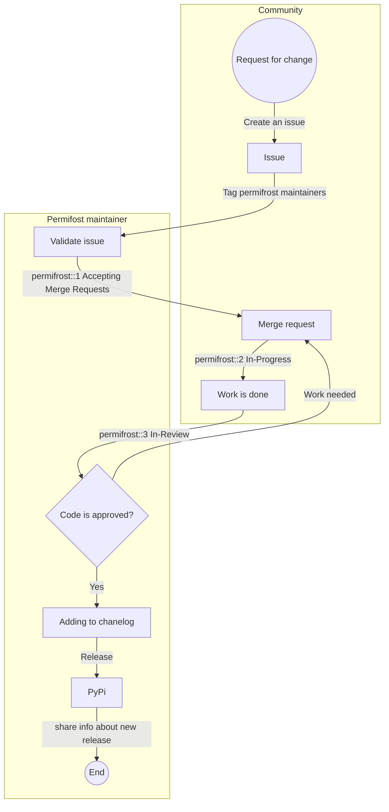

## Quick Links

[Permifrost Project](https://gitlab.com/gitlab-data/permifrost/){:.btn .btn-purple-inv}

[PyPI](https://pypi.org/project/permifrost/){:.btn .btn-purple-inv}

## Permifrost


Permifrost is a Python tool for managing permissions on a Snowflake data warehouse. The main documentation for using the tool is available in the project and on PyPI.

### Caveats

#### :white_check_mark: What Permifrost is and what it is doing

* Supports Snowflake only
* Permifrost takes care of roles and privileges only
* Objects that exist but are not in the config file do not lead to errors
* Is a fully open-source package and everyone can contribute

#### :x: What Permifrost is not and what it is not doing

* Object creation and deletion is not managed by permifrost
  * That is, if entire roles are removed from the `roles.yml` file, it will **not** delete them from Snowflake

## Contributing

### Development

Follow these steps to create and prepare your virtual environment.

```bash
## create a virtualenv
python -m venv ~/.venv/permifrost

## activate your virtualenv
source ~/.venv/permifrost/bin/activate

## install dependencies
pip install -r requirements.txt

## pip3 install all the development dependencies
pip install -e '.[dev]'
```

Once you've committed your changes, submit a merge request and update the default template.

### Communication

* For any additional question, contribution or ide, feel free to open a [**new issue**](https://gitlab.com/gitlab-data/permifrost/-/issues/new) in the Permifrost project and, if needed, tag `@gitlab-data/permifrost_maintainers` _(the project maintainers)_
* If you prefer to announce or ask, Slack channel [#tools-permifrost](https://getdbt.slack.com/archives/C01LWQJMMGS) is also a good option.

### Release Process

The release process is described in the template [Release process for Permifrost](https://gitlab.com/gitlab-data/permifrost/-/blob/master/RELEASE.md) with using [Release Permifrost](https://gitlab.com/gitlab-data/permifrost/-/blob/master/.gitlab/issue_templates/Releasing%20update.md) template. For real life example, use [Release `0.15.1`](https://gitlab.com/gitlab-data/permifrost/-/issues/175) as a template.

We set a goal to release a new version of Permifrost at least twice per year. Meanwhile, check our [release history](https://pypi.org/project/permifrost/#history).

#### Versioning

Permifrost uses [Semantic Versioning 2.0.0](https://semver.org/) as its version number scheme.

#### Workflow

Permifrost uses tags to create its artifacts. Pushing a new tag to the repository will publish it as docker images and a `PyPI` package. For details, refer to the [Release guideline](https://gitlab.com/gitlab-data/permifrost/-/blob/master/.gitlab/issue_templates/Releasing%20update.md).

Below is the entire workflow for Permifrost contribution and development:


