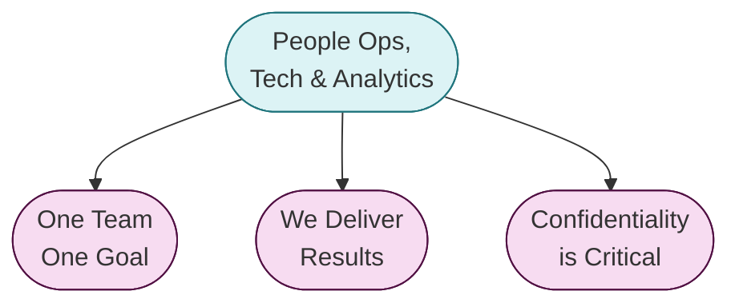

## People Operations, Technology & Analytics Operating Principles

**Our primary goal is to support GitLab team members through their entire lifecycle with dignity.**

There are three **People Operations, Technology & Analytics Operating Principles**:

### One Team, One Goal

- [CREDIT](/handbook/values/#credit)
- We listen to each other's ideas and are open & honest with each other
- We treat everyone with dignity and respect
- We assume positive intent towards GitLab's success
- We can agree to disagree, but we move forward as one team committed to our common goal
- We don't hide from difficult conversations
- We critique our process, tackle mistakes as a team, and seek to get better
- We are invested in our team members development
- We honor our commitments
- We have fun!

### We Deliver Results

- We know how our work aligns with strategic initiatives and how it will help the People Group deliver impactful results
- We maximize the capabilities and services of our vendor-partners
- We actively look for ways to improve existing processes

### Confidentiality is Critical

- We all have a responsibility for People Data Security, Compliance and Confidentiality
- The confidential information we have access to must always be processed fairly and lawfully, and limited to only what is necessary
- Confidential information is never shared other than strict and specific guidelines and processes, according to our [Privacy Policy](/handbook/legal/privacy/employee-privacy-policy/)

### Additional beliefs held by the People Ops, Tech & Analytics Team include
