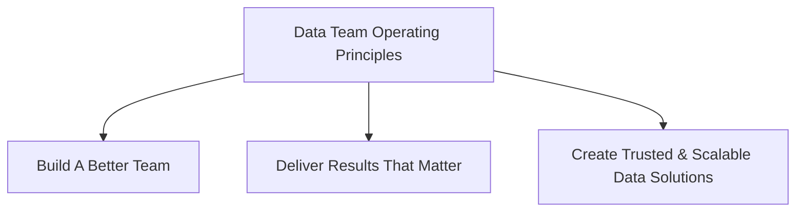

---

## Data Management Principles

**Decisions about our data are guided and aliged to 10 Enterprise Data Management Principles

### Maximize the Value of Data

- We treat data as a **shared strategic asset** with the same disciplines as other recognized (tangible and intangible) assets, including managing the risks associated with it.
- **Data belongs to the organization**, not to teams or individuals.
- We promote **innovation** through data insights, recommendations and solutions.

### Data Protection & Privacy

- We ensure that GitLab data is **appropriately protected**.
- We manage our data products in a **transparent manner**.
- We have **data governance** practices in place to clarify data roles, responsibilities, standards and policies.

### Data Management

- We **manage the complete data journey** from creation, through storage, transformation, and usage to archival and deletion.
- **Business functions own and are accountable** for the quality of our data.
- We ensure our data is **discoverable, traceable, and classified**.
- We proactively design for and **manage the quality** of our data.

## Data & Insights Operating Principles

**We are proud, yet humbled to be the Center of Excellence for Data & Insights at one of the world's most innovative companies.**

There are three **Data Team Operating Principles**:

### Build A Better Team

- [CREDIT](/handbook/values/#credit)
- We treat everyone with respect
- We assume best intent towards GitLab success
- We are honest with ourselves and with each other
- We have permission to disagree, but must drive to commitment
- We don't hide from difficult conversations
- We're in this together as a team
- We tackle mistakes as a team and seek to get better

### Deliver Results That Matter

- Data-Driven First, Data-Informed Second, Principles & Stories Third
- We believe in built to last, not built too fast
- We operate with a [growth mindset](https://hbr.org/2016/01/what-having-a-growth-mindset-actually-means), continually raising the standard
- We don't confuse activity with progress
- We know how our work aligns with strategic initiatives and how it will help our Business Partners deliver impactful results
- We go the extra mile to provide Context, Facts, and Insights
- We define expectations up front: Scope, Time, and Success Criteria
- We proactively engage with our Business Partners to ensure regular progress for important initiatives

### Create Trusted & Scalable Data Solutions

- We all have a responsibility for Data Security and Data Quality
- We lead with well-tested and accurate Data Solutions
- We operate and maintain the production solutions we create
- We design for GitLab +2 years, while delivering for GitLab today
- We maximize the capabilities and services of our vendor-partners
- We believe the best way to align on a complex outcome is to picture it
- Automated tests are the best tests and we implement tests at every step of the data delivery process

### Additional beliefs held by the Data Team include

- Everything can and should be defined in code and version controlled
- Data implementations should integrate best practices from DevOps into their workflow
- Partner with each Business function while having a high-quality, maintainable code base
- Open source our code, keeping data security and data sensitivity in mind
- There is a single source of truth for every analytic question within a company, and it is also important to represent multiple perspectives to provide the most thorough data insights
- [Glue work](https://www.locallyoptimistic.com/post/glue-work/) is important for the health of the team and is recognized individually for the value it provides. We expect [everyone to contribute](/handbook/values/#mission).
- Focus our limited resources where data will have the greatest impact
- All business users should be able to learn how to interpret and calculate simple statistics

---
