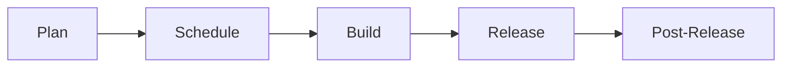

## Discussions

Discussions are documented in this [GitLab project](https://gitlab.com/gitlab-org/geo-team/discussions/-/issues/?sort=created_date&state=opened&first_page_size=100).

## Planning

### Hierarchy of Work Items

One aspect of planning that provides clarity for development execution is the breakdown of roadmap into a hierarchy of informational pieces that are organized in GitLab's own [work items](https://docs.gitlab.com/ee/development/work_items.html) as part of product management.

This section describes the approach that the Geo team takes to break down the requirements into work-in-progress items that engineers move through the workflow of implementation.

First, we describe general agile work item terminology to create alignment and use common industry vocabulary. We then map these general terms to the specific work item terminology used by GitLab.

Finally we provide some guidelines and rules of thumb when creating new ites and about choosing the right level of granularity for them.

The details of this are documented in our [Geo's Hierarchy of Agile Work Items](../agile-work-items.html) page.

### Kanban

We work in a continuous Kanban manner while still aligning with Milestones.

Epics and issues have the following lifecycle:

Three boards are used to monitor this process

- [Plan](https://gitlab.com/groups/gitlab-org/-/boards/1181258)
- [Schedule](https://gitlab.com/groups/gitlab-org/-/boards/981066)
- [Build](https://gitlab.com/groups/gitlab-org/-/boards/1181257)

#### Plan

We use the [Kanban Plan board](https://gitlab.com/groups/gitlab-org/-/boards/1181258)
to triage issues that are not yet planned for a milestone. Issues in this board are labeled "group::geo" and use the workflow labels "workflow::validation backlog", "workflow::problem validation", "workflow::design", "workflow::solution validation",  "workflow::planning breakdown" and "workflow::scheduling".

The Product Manager(PM) owns this board and uses it to advance issues through to becoming feasible Epics. When work leaves this
board, it is in a fit state for the engineering team to implement the issue.

In this stage, the PM establishes new work that they would like to see in the Geo feature. The planning process is as follows:

##### Problem validation

The PM tries to establish that the issue describes a problem with the Geo feature that is customer-relevant (internal and external),
or has some other clear merit (e.g. a technical improvement in the backend). The PM will draw on other group members, customers and the UX organisation where necessary.
If the problem is validated, the issue is moved forward to the next stage, otherwise it is closed with a short explanation on *why* the problem will not be considered. This explanation should also contain
a link [to the category strategy](/handbook/product/product-processes/#category-direction).

##### Solution validation

Once the problem is validated, the PM will consider creating a work item as per our guidelines for [hierarchy of work](../agile-work-items.html).
They will then reach out to the Engineering Manager(EM) for a technical contact in the team. The EM assigns [ownership](#work-ownership) of the work item to an engineer. The engineer will work with the PM
to determine a technical solution for the problem.

Occasionally, a proof-of-concept (POC) is necessary to determine a feasible technical path. When one is required, the PM
will create a POC issue that contains the context of the research to be conducted along with the goals of the POC. This
issue will be scheduled for work before any further breakdown of tasks is performed.

POC issues are also time-boxed with a due date applied to these items and should be labeled ~"POC". On the due date, the engineer is expected to
provide a comment on the issue regarding the outcome of the POC. Time-boxing these issues is meant to constrain the
scope of the work.

It is also important to note that not all POCs will be successful, and that is OK! Some avenues of research may not be
successful, and the POC will have saved us from investing significant time in a solution that will not meet our needs. The goal is to fail fast!

The PM and the engineer will work together to create all of the [work items](../agile-work-items.html) required to build the solution. These items account for

- Documentation
- Testing
- Post-release items such as rake tasks, migrations or monitoring issues

Ideally, [epics, features and user stories](../agile-work-items.html) should be broken down by external functionality rather than by implementation details. Even refactors and performance improvements should highlight the customer value and be described with a user-centric approach.

Post-release tasks that need to be performed by SRE's are created in the Infrastructure team project and cannot be
added to work items as related issues. For these, it's useful to list them in the highest level work item description.

When they are satisfied that they have a reasonable solution including an estimation of effort for each work item, this breakdown should be shared with the rest of the team
for discussion and feedback. Planning is transparent anyway, but this serves to notify the team that the new work items are ready
for development.

For issues that include a feature that uses a Feature Flag (FF), we follow the feature flag [lifecycle doc](/handbook/product-development-flow/feature-flag-lifecycle/#development).
The original issue should remain open and blocked on the FF rollout issue until the rollout issue is closed, in case the rollout does not go as planned.

#### Schedule

On an ongoing basis, the PM and EM will meet to discuss the work that is currently active, and queue prepared items for development.

In this process, prepared items will be given the milestone label along with `workflow::ready for development`, which will pull items into the Build board.

Part of the ongoing prioritization and scheduling effort includes providing answers to these questions

1. What is active now?
1. What needs to be active next?
1. Are there any deliverables?
1. Is the active list in priority order?
1. Bugs list
1. Technical debt items arising

The outcome of these scheduling activities are reflected in an [Outlook Issue](https://gitlab.com/gitlab-org/geo-team/discussions/-/issues/?search=Geo%20Outlook&sort=due_date&state=all&first_page_size=100) that the PM prepares and which encapsulates the direction and scope of the upcoming iteration.

#### Build

We use the [Kanban Build board](https://gitlab.com/groups/gitlab-org/-/boards/1181257)
to look at issues that have the `%Started` milestone in combination with the `group::geo` label.

The Engineering Manager(EM) owns this board and uses it to facilitate building out the Epics and issues that the team have decided
are ready for development.

Issues are added in the "ready for development" column in priority order. When an engineer is open, they can pick
unassigned issues from the top of this list. As their work progresses, they advance the issue through the "in dev" and
"in review" columns. Engineers need to keep the issues aligned with the status of the corresponding merge requests.

When an issue is "in review", the MR should be assigned to both the original engineer and the reviewer so that it is
clear that the merge request has an active reviewer. This helps the EM to see how much work is allocated to each person.

The column for "verification" is where the owner of the Epic, or the PM will ensure that the issue fits into the context
of the solution. This is also where we confirm if a release note is required for this issue, and assign the correct
milestone.

#### Release and Post-Release

For some issues, there are tasks that need to be performed by SRE's after the release is completed. Because these tasks
are often in the infrastructure project, they cannot be added to Epics. We still need to track these and follow them
through to completion.

Finally, we ensure that any communication that needs to go out for this issue is delivered. These can take the form of
release posts, blog posts, video tutorials, or demos.

### Work Ownership

The Geo team uses a variety of [work items](../agile-work-items.html) to describe features or capabilities that will increase the maturity of the Geo categories over time.

Each high-level work item (i.e. Epics and/or Features) should be owned by an engineer who is responsible for all technical aspects of that work item. If at any point, the
owner needs to take leave that is more than a few days, they should assign another engineer to act as owner until they return.

**In the planning phase**, the engineering owner will work closely with the Product Manager to understand what the requirements
are and why they are important to customers. The engineer will decide on how best to deliver the solution and create [Tasks](../agile-work-items.html#task)
that encapsulate the technical work required. They may need to consult with other team members and stable counterparts
to come up with the right approach to delivering the requirements.

They should include Tasks for documentation changes and additional testing requirements that are required. A task should be created to inform Geo experts in the Support group about the change if needed. The engineer
should also consider if there is any technical debt that is appropriate to address at the same time. Additional Tasks are also
needed for any rollout or post-release todos.

The engineer that is the owner does not need to be the only person implementing the Tasks.
They should keep watch of the work that is done on the tasks so that they can verify that the work is progressing correctly.
Ideally, they should also be an approver on each MR for the work items. If there are problems with the work, or lengthy delays,
they need to make sure the Product Manager and Engineering Manager are aware.

**When work is nearing completion**, the owner engineer should check the release note and work with the PM on any changes.
They should also make sure that any additional issues that may have come up during the build process are either
addressed, or scheduled for work. This will help to make sure that we do not build up technical debt while building.

**Finally**, owners should also monitor any work that needs to occur while rolling out the Epic or Feature in production. If there are
rake tasks, database migrations, or other tasks that need to be run, they need to see those through to being
run on the production systems with the help of the Site Reliability counterpart. They may also need to assist the
Product Manager with creating the release note for the work item.

This places a lot of responsibility with the owner, but the PM and EM are always there to support them. This ownership
removes bottlenecks and situations where only the PM or EM is able to advance a work item. In addition, the best people
to decide on how to implement a task are often the people who will actually perform the work.

The responsibility of the Product Manager is to make sure that there is enough information for the engineer to develop the
correct solution that meets the requirements. They are also available to answer clarifying questions or consider how to
approach edge cases. At the end of a work item they also communicate this out to customers and other interested parties.

The Engineering Manager is responsible for clearing the path. They need to make sure the engineers performing the work
have the access to the right information, people, tools, and other resources to get the work done. They try to foresee
problems and clear any blockers that may arise while the work is in progress.

### Opening an Issue

Within the Geo Team we utilize Issue Templates to create consistency in our Backlog to help us be more Efficient and deliver more Results.
Using Issue Templates has been found to help the team in the following ways:

1. Ensures an Issue has all the required information so that any contributor can pick up and start or join a conversation without any outside context.
2. Empowers our Refinement Process to work more efficiently which results in higher Community Contributions and less SME reliance.
3. Helps Issues stay relevant and not unintentionally sink to the bottom of our Backlog.

We use the following Issue Templates:

- [Bug (template)](https://gitlab.com/gitlab-org/gitlab/-/blob/master/.gitlab/issue_templates/Bug.md)
  - Used as the template for Bugs and their investigation.
- [Feature - lean (template)](https://gitlab.com/gitlab-org/gitlab/-/blob/master/.gitlab/issue_templates/Feature%20Proposal%20-%20lean.md)
  - Used as the template for larger Feature requests. These will often drive a conversation and ultimately be promoted to Epics with Implementation Issues being broken off into MVC changes.
- [Implementation (template)](https://gitlab.com/gitlab-org/gitlab/-/blob/master/.gitlab/issue_templates/Implementation.md)
  - Used as the template to break down large Epics, organize MVC level changes, and assist in our Refinement Process.

*Note: Many sections in a template should be treated as optional if there is no relevant information to be added.*

### Addressing new issues quickly

When new issues arise (through testing, customer support issues, or other means) we still want to be able to address them
quickly without being delayed by process.
If you think a new issue needs to be worked on immediately:

1. Make sure there is enough detail on the work item description for someone else to understand the issue and for someone else to have
enough context to review your work
2. Make sure there is a weight
3. Assign it into the current milestone
4. Add the `workflow::STATUS`, `group::geo` and the `unplanned` label
5. Assign it to yourself

### Weights

We use the weights from the set [1, 2, 3, 4, 5, 10] where the value represents a "best work day". A "best work day" means
a day where there are no interruptions, emails or other demands on your time.
For example, if an issue is assigned a weight of 5 then an engineer should be able to complete the work in 5 days if
this were the only thing that they needed to do for those five days.

If an issue is assigned a weight of 10, then the issue is too big and will need to be broken down further. This usually means promoting the issue to an epic and raising individual issues that have a lower weight.

If any issue is weighted above a 3, we should ask ourselves if it can be further broken down. We should do this even if the issue was already broken out from an even larger issue.

### Backlog Refinement Process 

Backlog refinement equals moving issues from `workflow::validation backlog` through each stage toward `workflow::ready for development`. Engineers will follow instructions provided in a weekly assigned "refinement issue", which generally aligns with [Product Development Flow](../../../../product-development-flow).

Issues in the [GitLab.org group](https://gitlab.com/groups/gitlab-org/-/issues) labeled `~"group::geo`, `workflow::validation backlog` will be refined. 
Each week 3 issues will be randomly selected by a bot and refined by the team. Bugs will be prioritized over feature requests and a go/no go will be given.

1. Refinement issue is created and assigned to engineers. It contains instructions for what to do with each issue and is the source of truth for this part of the process. The rest of the steps below are an overview.
2. Phase 1: Engineers will select 1-3 issues each and put the label `~"workflow::problem validation` on when they start taking a look.
   1. If the issue doesn't have the right issue template/enough details, it will be sent back to the author/PM for clarification 
   2. If the issue is a go, move to `~"workflow::refinement` for Phase 2
3. Phase 2: Engineers will add an implementation guide, the right labels and weights for the issue. Once that is ready, move it to `~"workflow::ready for development` for the PM/EM to schedule.
   1. For bug issues, the bug first needs to be reproduced as a part of the refinement process. If the bug issue isn't reproducible, the issue can be closed off. Bug issues also need to be assigned a priority/severity in addition to the regular labels. 
   2. For features/maintenance issues, a timebox of 1 hour or so is expected per issue and for bugs this could take 2-3 hours as we need to reproduce it before adding implementation details 
   3. Please also label as `~"Seeking Community contributions"` if an implementation guide has been added and weights are 1-3.

The refinement script can be found [here](https://gitlab.com/gitlab-org/geo-team/bots/-/tree/main/cmd/refinement?ref_type=heads)

#### Engineering Customer/Support Rotation Process

Every week, a Geo engineer is assigned to be the DRI for doing the technical assessment of customer support tickets + monitoring [#g_geo](https://gitlab.enterprise.slack.com/archives/C32LCGC1H) channel for support issues.

A different backend engineer is assigned to support rotation each week and we schedule shifts 2 to 6 months in advance. This is a discussion documented here in this [issue](https://gitlab.com/gitlab-org/geo-team/discussions/-/issues/5118)

Process summary:

- Every week, a slack reminder in [#geo-lounge](https://gitlab.enterprise.slack.com/archives/C7U95P909) channel will let the group know that a new support shift is starting for technical assessment triage.
- Every Geo engineer is expected to be aware of their upcoming rotation (as per the schedule below) and take action as per the slack reminder.
- The DRI currently assigned to the rotation should then dedicate their week to review issues from the customer support [backlog](https://gitlab.com/gitlab-com/request-for-help/-/issues/?sort=created_date&state=opened&label_name%5B%5D=Help%20group%3A%3AGeo&first_page_size=100) and support in the [#g_geo](https://gitlab.enterprise.slack.com/archives/C32LCGC1H) channel.
  - Be first on point to triage questions in our [#g_geo](https://gitlab.enterprise.slack.com/archives/C32LCGC1H) channel. Now that we have a slack workflow -> this should be taught/triggered per more complex questions and quickly answer anything that's short and sweet.
  - Expected duties are: triaging, creating issues, documenting initial research, adding priority labels etc. so that a customer support issue can enter our usual workflow. One dev continuing to take ownership of an issue they started on is preferred over handing it over.
- If the DRI is unable to perform an upcoming triage rotation shift due to any reason (e.g. PTO, sick leave, other responsibilities taking precedence), they are expected to swap their rotation with another team member or notify the EM to facilitate. Once the swap is identified, the schedule should be updated with via a MR.
- The DRI needs to update this [issue](https://gitlab.com/gitlab-org/geo-team/discussions/-/issues/5120) for example for the 2024 rotation similiar to the bug triage process.
- The DRI should estimate the amount of time spent on support and track this via `Time Tracking` in each issue approximating to the hour how much they have spent on tickets and triaging. This is a new part of the process which is in a trial phase.

##### Schedules

Schedules are tracked in a [Google Sheet(internal link)](https://docs.google.com/spreadsheets/d/1-kvptYZfhCSV9WTVEs4epfUSVvxIMSf5wHxnT6BmjSw/edit?gid=1214041762#gid=1214041762).

## Retrospectives

Retrospectives are a [crucial component](https://www.retrium.com/blog/i-was-wrong-retrospectives-are-not-the-most-critical-part-of-agile-but-they-are-close) of the agile methodology. However, having a retro should not be about checking-off a mark in our agile todo list. The purpose of the retro is to learn and then take action that leads to a better place. We learn from our past actions and results and we use that knowledge to improve our future execution.

At GitLab there is a general guideline to conduct [group retrospectives](/handbook/engineering/management/group-retrospectives/) and a process automation to run retrospectives [asynchronously](https://gitlab.com/gitlab-org/async-retrospectives). The Geo team however is working with a new process that combines elements of fully asynchronous work with the benefits of active conversation and the increased level of engagement that these types of interactions bring.

The details of this process is documented in our [Geo Team Retrospectives](./retrospectives.md) page.

## FAQ

### What work should I pick up next?

"Pull from the right". That means, start at the right hand side of the build board, and move towards the left.

In order, that means:

- Can you help anyone with reviews?
- Can you unblock anyone in development?
- Pick from the top of the "ready for development" column on the [Kanban Build board](https://gitlab.com/groups/gitlab-org/-/boards/1181257?milestone_title=%23started&&label_name[]=Geo).
