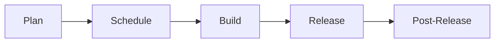

## Discussions

Discussions are documented in this [GitLab project](https://gitlab.com/gitlab-org/geo-team/discussions/-/issues/?sort=created_date&state=opened&first_page_size=100).

## Planning

### Hierarchy of Work Items

One aspect of planning that provides clarity for development execution is the breakdown of roadmap into a hierarchy of informational pieces that are organized in GitLab's own [work items](https://docs.gitlab.com/ee/development/work_items.html) as part of product management.

This section describes the approach that the Geo team takes to break down the requirements into work-in-progress items that engineers move through the workflow of implementation.

First, we describe general agile work item terminology to create alignment and use common industry vocabulary. We then map these general terms to the specific work item terminology used by GitLab.

Finally we provide some guidelines and rules of thumb when creating new ites and about choosing the right level of granularity for them.

The details of this are documented in our [Geo's Hierarchy of Agile Work Items](../agile-work-items.html) page.

### Kanban

We work in a continuous Kanban manner while still aligning with Milestones.

Epics and issues have the following lifecycle:

Three boards are used to monitor this process

- [Plan](https://gitlab.com/groups/gitlab-org/-/boards/1181258)
- [Schedule](https://gitlab.com/groups/gitlab-org/-/boards/981066)
- [Build](https://gitlab.com/groups/gitlab-org/-/boards/1181257)

#### Plan

We use the [Kanban Plan board](https://gitlab.com/groups/gitlab-org/-/boards/1181258)
to triage issues that are not yet planned for a milestone. Issues in this board are labelled "geo::planning".

The Product Manager(PM) owns this board and uses it to advance issues through to becoming feasible Epics. When work leaves this
board, it is in a fit state for the engineering team to implement the issue.

In this stage, the PM establishes new work that they would like to see in the Geo feature. The planning process is as follows:

##### Problem validation

The PM tries to establish that the issue describes a problem with the Geo feature that is customer-relevant (internal and external),
or has some other clear merit (e.g. a technical improvement in the backend). The PM will draw on other group members, customers and the UX organisation where necessary.
If the problem is validated, the issue is moved forward to the next stage, otherwise it is closed with a short explanation on *why* the problem will not be considered. This explanation should also contain
a link [to the category strategy](/handbook/product/product-processes/#category-direction).

##### Solution validation

Once the problem is validated, the PM will consider creating a work item as per our guidelines for [hierarchy of work](../agile-work-items.html).
They will then reach out to the Engineering Manager(EM) for a technical contact in the team. The EM assigns [ownership](#work-ownership) of the work item to an engineer. The engineer will work with the PM
to determine a technical solution for the problem.

Occasionally, a proof-of-concept (POC) is necessary to determine a feasible technical path. When one is required, the PM
will create a POC issue that contains the context of the research to be conducted along with the goals of the POC. This
issue will be scheduled for work before any further breakdown of tasks is performed.

POC issues are also time-boxed with a due date applied to these items and should be labeled ~"POC". On the due date, the engineer is expected to
provide a comment on the issue regarding the outcome of the POC. Time-boxing these issues is meant to constrain the
scope of the work.

It is also important to note that not all POCs will be successful, and that is OK! Some avenues of research may not be
successful, and the POC will have saved us from investing significant time in a solution that will not meet our needs. The goal is to fail fast!

The PM and the engineer will work together to create all of the [work items](../agile-work-items.html) required to build the solution. These items account for

- Documentation
- Testing
- Post-release items such as rake tasks, migrations or monitoring issues

Ideally, [epics, features and user stories](../agile-work-items.html) should be broken down by external functionality rather than by implementation details. Even refactors and performance improvements should highlight the customer value and be described with a user-centric approach.

Post-release tasks that need to be performed by SRE's are created in the Infrastructure team project and cannot be
added to work items as related issues. For these, it's useful to list them in the highest level work item description.

When they are satisfied that they have a reasonable solution including an estimation of effort for each work item, this breakdown should be shared with the rest of the team
for discussion and feedback. Planning is transparent anyway, but this serves to notify the team that the new work items are ready
for development.

#### Schedule

On an ongoing basis, the PM and EM will meet to discuss the work that is currently active, and queue prepared items for development.

In this process, prepared items will be given the label "geo::active", which will pull items into the Build board.

Part of the ongoing prioritization and scheduling effort includes providing answers to these questions

1. What is active now?
1. What needs to be active next?
1. Are there any deliverables?
1. Is the active list in priority order?
1. Bugs list
1. Technical debt items arising

The outcome of these scheduling activities are reflected in an [Outlook Issue](https://gitlab.com/gitlab-org/geo-team/discussions/-/issues/?search=Geo%20Outlook&sort=due_date&state=all&first_page_size=100) that the PM prepares and which encapsulates the direction and scope of the upcoming iteration.

#### Build

We use the [Kanban Build board](https://gitlab.com/groups/gitlab-org/-/boards/1181257)
to look at issues that have the `geo::active` label in combination with the `group::geo` label.

The Engineering Manager(EM) owns this board and uses it to facilitate building out the Epics and issues that the team have decided
are ready for development.

Issues are added in the "ready for development" column in priority order. When an engineer is open, they can pick
unassigned issues from the top of this list. As their work progresses, they advance the issue through the "in dev" and
"in review" columns. Engineers need to keep the issues aligned with the status of the corresponding merge requests.

When an issue is "in review", the MR should be assigned to both the original engineer and the reviewer so that it is
clear that the merge request has an active reviewer. This helps the EM to see how much work is allocated to each person.

The column for "verification" is where the owner of the Epic, or the PM will ensure that the issue fits into the context
of the solution. This is also where we confirm if a release note is required for this issue, and assign the correct
milestone.

#### Release and Post-Release

For some issues, there are tasks that need to be performed by SRE's after the release is completed. Because these tasks
are often in the infrastructure project, they cannot be added to Epics. We still need to track these and follow them
through to completion.

Finally, we ensure that any communication that needs to go out for this issue is delivered. These can take the form of
release posts, blog posts, video tutorials, or demos.

### Work Ownership

The Geo team uses a variety of [work items](../agile-work-items.html) to describe features or capabilities that will increase the maturity of the Geo categories over time.

Each high-level work item (i.e. Epics and/or Features) should be owned by an engineer who is responsible for all technical aspects of that work item. If at any point, the
owner needs to take leave that is more than a few days, they should assign another engineer to act as owner until they return.

**In the planning phase**, the engineering owner will work closely with the Product Manager to understand what the requirements
are and why they are important to customers. The engineer will decide on how best to deliver the solution and create [Tasks](../agile-work-items.html#task)
that encapsulate the technical work required. They may need to consult with other team members and stable counterparts
to come up with the right approach to delivering the requirements.

They should include Tasks for documentation changes and additional testing requirements that are required. A task should be created to inform Geo experts in the Support group about the change if needed. The engineer
should also consider if there is any technical debt that is appropriate to address at the same time. Additional Tasks are also
needed for any rollout or post-release todos.

The engineer that is the owner does not need to be the only person implementing the Tasks.
They should keep watch of the work that is done on the tasks so that they can verify that the work is progressing correctly.
Ideally, they should also be an approver on each MR for the work items. If there are problems with the work, or lengthy delays,
they need to make sure the Product Manager and Engineering Manager are aware.

**When work is nearing completion**, the owner engineer should check the release note and work with the PM on any changes.
They should also make sure that any additional issues that may have come up during the build process are either
addressed, or scheduled for work. This will help to make sure that we do not build up technical debt while building.

**Finally**, owners should also monitor any work that needs to occur while rolling out the Epic or Feature in production. If there are
rake tasks, database migrations, or other tasks that need to be run, they need to see those through to being
run on the production systems with the help of the Site Reliability counterpart. They may also need to assist the
Product Manager with creating the release note for the work item.

This places a lot of responsibility with the owner, but the PM and EM are always there to support them. This ownership
removes bottlenecks and situations where only the PM or EM is able to advance a work item. In addition, the best people
to decide on how to implement a task are often the people who will actually perform the work.

The responsibility of the Product Manager is to make sure that there is enough information for the engineer to develop the
correct solution that meets the requirements. They are also available to answer clarifying questions or consider how to
approach edge cases. At the end of a work item they also communicate this out to customers and other interested parties.

The Engineering Manager is responsible for clearing the path. They need to make sure the engineers performing the work
have the access to the right information, people, tools, and other resources to get the work done. They try to foresee
problems and clear any blockers that may arise while the work is in progress.

### Addressing new issues quickly

When new issues arise (through testing, customer support issues, or other means) we still want to be able to address them
quickly without being delayed by process.
If you think a new issue needs to be worked on immediately:

1. Make sure there is enough detail on the work item description for someone else to understand the issue and for someone else to have
enough context to review your work
1. Make sure there is a weight
1. Assign it into the current milestone
1. Add the `workflow::STATUS`, `geo::active` `group::geo` and the `unplanned` label
1. Assign it to yourself

### Weights

We use the weights from the set [1, 2, 3, 4, 5, 10] where the value represents a "best work day". A "best work day" means
a day where there are no interruptions, emails or other demands on your time.
For example, if an issue is assigned a weight of 5 then an engineer should be able to complete the work in 5 days if
this were the only thing that they needed to do for those five days.

If an issue is assigned a weight of 10, then the issue is too big and will need to be broken down further. This usually means promoting the issue to an epic and raising individual issues that have a lower weight.

If any issue is weighted above a 3, we should ask ourselves if it can be further broken down. We should do this even if the issue was already broken out from an even larger issue.

### Bugs Process

Issues in the [GitLab.org group](https://gitlab.com/groups/gitlab-org/-/issues) labeled `~"group::geo` and `~"type::bug"` will be triaged. These issues are represented at a high-level in the [Geo Bug Triage issue board](https://gitlab.com/groups/gitlab-org/-/boards/1077712). The current high-level state of each issue is indicated by its [`workflow` label](/handbook/product-development-flow/).

#### Bug Triage

Triaging bugs is a team effort. Ultimately the process of triage is necessary to avoid the following problems:

- Bugs that are actually quite complex to address and the "bug" might be a symptom of a bigger architectural problem rather than a simple deficiency in existing functionality.
- Bugs that are defined inconsistently and that are not easy to immediately comprehend.
- Bugs that don't always have clear steps to reproduce the problem or clear "expected" outcomes or behaviours.
- Some bugs can't be easily replicated because they require setting up complex configuration scenarios
- Some bugs are not strictly bugs but rather investigations into customer-reported problems
- Engineers struggle to tackle these kinds of large, ill-defined, or difficult-to-reproduce bugs along with the rest of their priorities in a given iteration

The following process attempts to mitigate these issues and increase the efficiency of engineers working toward a resolution.

The entire process is broken down into phases, where issues classified as bugs are reviewed by different stakeholders, labelled in specific ways to be classified, and moved through a workflow through their resolution.

##### Phase 1: Screening

This phase involves the initial review of newly created bugs to screen them for consistent formatting, labelling and prioritization.

The initial screening should ensure all the necessary information about the nature of the problem, its severity, priority, how it can be reproduced and the expected result (i.e. success criteria) is defined before an engineer starts to look at it.

The description for Bug issues should include the following key pieces of content:

- Context: A short sentence that describes the context (systems, users, customers, conditions) under which the problem occurs.
- Problem: A short sentence describing the problem
- Steps to reproduce: A bullet list of step-by-step instructions to reproduce the problem
- Expected result: What should happen when you follow the steps
- Actual result: What currently happens when you follow the steps
- Optionally, additional information: i.e. video, screenshots, error logs/logs etc.

The group Product Manager (PM) is the DRI to do the initial screening soliciting support from the Engineering Manager when required. The PM and EM should make sure bugs are clear and completely defined, asking follow-up questions from authors of the bug issues before they are scheduled and moved ahead in the workflow.

The PM should also make a determination if certain bugs should be immediately closed as "won't fix" for any reason. The PM should also stop "Bugs" that may actually be customer support requests and should be channelled to follow that process.

The PM should use the [Triage Report](https://gitlab.com/gitlab-org/quality/triage-reports/-/issues/?sort=updated_desc&state=opened&label_name%5B%5D=group%3A%3Ageo&label_name%5B%5D=triage%20report&first_page_size=20) generated and sent through email as one of the sources of untriaged bugs that need screening. Another source is any bug with the `group::geo` tag that does not have a workflow label.

Once a Bug is under screening, it can be labelled with `geo::planning` and `workflow::problem validation`. If during screening the DRI needs to ask for more information, the bug can be labelled with `awaiting feedback`

Once the bug has passed screening it should be relabelled to `workflow::solution validation`.

Bugs that have been screened should meet the following criteria:

- Labelled with: `group::geo`, `geo::planning` and `workflow::solution validation`
- A `severity` label has been set
- The body of the issue is fully completed with the template information cited above
- Should no longer have an `awaiting feedback` label

Refer to the [Geo Bug Triage issue board](https://gitlab.com/groups/gitlab-org/-/boards/1077712).

##### Phase 2: Technical Assessment

Bugs that have gone through screening can then be assessed by the engineer that has the bug-triage rotation for the month (see below for the rotation schedule). The goal of the assessment is to:

- Go through the steps to reproduce the bug, and confirm that it is reproducible
- Identify any workarounds and update the severity label accordingly
- Devise a high-level possible resolution approach and identify the type of bug it is
- Roughly estimate the effort for resolution by assigning a weight

The backlog from where the DRI engineer works are all bugs labelled with `group::geo`, `geo::planning` and `workflow::solution validation`. These are the bugs that have gone through screening.

When trying to reproduce, the engineer may recruit help from the QA stable counterpart if needed (e.g. to get help setting up a test framework and/or environment that meets the conditions to reproduce the problem).

When in doubt about the resolution approach, the DRI engineer can ask for help from other engineers. If during the technical assessment, the DRI needs to ask for more information, the bug can be labelled with `awaiting feedback`

Once the engineer has been able to reproduce and assigned a weight, the bug should be moved to `workflow::scheduling`

Bugs that have been technically assessed should meet the following criteria:

- Labelled with: `group::geo`, `geo::planning` and `workflow::scheduling`
- A `bug::<subtype>` label has been assigned
- The severity label has been updated (if necessary) according to workaround options found
- Weight value has been assigned
- A conversation thread comment posted with the possible workarounds
- A conversation thread comment posted with the possible approach to resolution
- Should no longer have an `awaiting feedback` label

If after investing some time and reasonable effort the engineer is unable to reproduce the bug, the DRI engineer can work with the PM to close the issue with a note about the inability to reproduce.

If the bug was triggered by a customer, the PM can then work with the customer to open a customer support request to investigate the problem in the context of the customer's own data and infrastructure. This investigation may lead to a new bug being opened with more specific and reliable reproduction steps.

Refer to the [Geo Bug Triage issue board](https://gitlab.com/groups/gitlab-org/-/boards/1077712).

##### Phase 3: Scheduling

The PM is the DRI for scheduling bugs that have already been technically assessed. There are two scheduling scenarios to be considered:

1. Bug issues estimated at weight = 1 or 2. These may be added to the active Geo build board for asap execution. For this purpose, the bug can be labelled with `geo::active` and `workflow::ready for development`. Engineers are then responsible to pick these up at their own discretion "in parallel" to their regular work during any given iteration. Engineers are expected to take at least one of these "small" bugs per iteration.

2. Bugs weighted > 3. These should be treated as other feature work and prioritized in relation to other roadmap items. When the PM is ready to have these move ahead they can assign the labels `geo::active` and `workflow::ready for development`. It will then wait for an engineer to finish their long-term assignments before they can shift their focus to one of them.

In both of these instances, the PM must assign a `priority` label to the issue.

For a bug to be ready for execution it must meet the following criteria:

- Passed screening, technical assessment and scheduling phases
  - Description is complete with all template sections filled out
  - Validated that it is a bug and the PM agrees that it must be resolved
  - The bug has been reproduced in staging or local development environment
  - The possible resolution approach is understood
  - An effort estimate has been provided
  - Its severity and priority are understood
- Labelled with: `group::geo`, `geo::active` and `workflow::ready for development`
- Labels for `severity` and `priority` have been set

Refer to the [Geo Bug Triage issue board](https://gitlab.com/groups/gitlab-org/-/boards/1077712).

#### Engineering Triage Rotation Process

Every month, a Geo engineer is assigned to be the DRI for doing the technical assessment of bugs (see section above on Phase 2 of the triage process).

A different backend engineer is assigned to triage rotation each month and we schedule monthly shifts 3 to 6 months in advance.

Process summary:

- Every month, a slack reminder in #geo-lounge channel will let the group know that a new shift is starting for technical assessment triage.
- Every Geo engineer is expected to be aware of their upcoming rotation (as per the schedule below) and take action as per the slack reminder.
- The outgoing DRI should connect with the incoming DRI and transfer the knowledge of the current bug issues being triaged. Anything still `awaiting feedback` should be highlighted and discussed.
  - The outgoing DRI should post a summary to the current year's Geo Bug Triage - Rotation discussion issue (i.e. [this one](https://gitlab.com/gitlab-org/geo-team/discussions/-/issues/5066) for 2023).
  - The summary should list the bugs that were triaged during the month with the corresponding outcome (i.e. either moved to `workflow::scheduling` or closed)
  - The summary should highlight any triage bugs that are in transition and awaiting feedback with a knowledge transfer note indicating the work that has been done and the next steps.
- The DRI currently assigned to the rotation should then dedicate a portion of their week (4-6 hours) to review issues from the bug backlog as defined in the "Phase 2: Technical Assessment" section of the triage process described above.
- If the DRI is unable to perform an upcoming triage rotation shift due to PTO, they are expected to find a backup or notify the EM to find a backup.

##### Schedule

| Month     | Name                                                   |
| --------- | ------------------------------------------------------ |
| **2024**  |                                                        |
| December  |  [`@aakriti.gupta`](https://gitlab.com/aakriti.gupta)  |
| November  | [`@kyetter`](https://gitlab.com/kyetter)               |
| October   | [`@dbalexandre`](https://gitlab.com/dbalexandre)       |
| September | [`@ibaum`](https://gitlab.com/ibaum)                   |
| August    | [`@mkozono`](https://gitlab.com/mkozono)               |
| July      | [`@kyetter`](https://gitlab.com/kyetter)               |
| June      |  [`@aakriti.gupta`](https://gitlab.com/aakriti.gupta)  |
| May       | [`@dbalexandre`](https://gitlab.com/dbalexandre)       |
| April     | [`@ibaum`](https://gitlab.com/ibaum)                   |
| March     | [`@brodock`](https://gitlab.com/brodock)               |
| February  | N/A                                                    |
| January   | [`@mkozono`](https://gitlab.com/mkozono)               |
| **2023**  |                                                        |
| December  | [`@ibaum`](https://gitlab.com/ibaum)                   |
| November  | [`@jtapiab`](https://gitlab.com/jtapiab)               |
| October   | [`@aakriti.gupta`](https://gitlab.com/aakriti.gupta)   |
| September | [`@brodock`](https://gitlab.com/brodock)               |
| August    | [`@dbalexandre`](https://gitlab.com/dbalexandre)       |
| July      | [`@vsizov`](https://gitlab.com/vsizov)                 |
| June      | [`@mkozono`](https://gitlab.com/mkozono)               |
| May       | [`@ibaum`](https://gitlab.com/ibaum)                   |
| April     | [`@jtapiab`](https://gitlab.com/jtapiab)               |
| March     | [`@aakriti.gupta`](https://gitlab.com/aakriti.gupta)   |
| February  | [`@brodock`](https://gitlab.com/brodock)               |
| January   | [`@brodock`](https://gitlab.com/brodock) (missed)      |

## Retrospectives

Retrospectives are a [crucial component](https://www.retrium.com/blog/i-was-wrong-retrospectives-are-not-the-most-critical-part-of-agile-but-they-are-close) of the agile methodology. However, having a retro should not be about checking-off a mark in our agile todo list. The purpose of the retro is to learn and then take action that leads to a better place. We learn from our past actions and results and we use that knowledge to improve our future execution.

At GitLab there is a general guideline to conduct [group retrospectives](/handbook/engineering/management/group-retrospectives/) and a process automation to run retrospectives [asynchronously](https://gitlab.com/gitlab-org/async-retrospectives). The Geo team however is working with a new process that combines elements of fully asynchronous work with the benefits of active conversation and the increased level of engagement that these types of interactions bring.

The details of this process is documented in our [Geo Team Retrospectives](../retrospectives.html) page.

## FAQ

### What work should I pick up next?

"Pull from the right". That means, start at the right hand side of the build board, and move towards the left.

In order, that means:

- Can you help anyone with reviews?
- Can you unblock anyone in development?
- Pick from the top of the "ready for development" column on the [Kanban Build board](https://gitlab.com/groups/gitlab-org/-/boards/1181257?milestone_title=%23started&&label_name[]=Geo).
