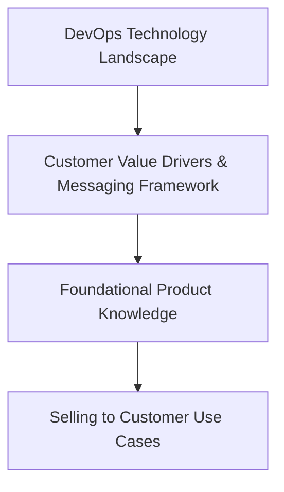

---

title: "Product Certification for GitLab Field Team Members"
description: "Training and certification program to ensure field team members have the requisite knowledge to serve as trusted advisors to customers, prospects, and partners by properly positioning the right GitLab solutions based on customers’ or prospects’ expressed needs and/or challenges"
---

## Overview

As part of the [Field Certification Program](/handbook/sales/training/field-certification/), the objective of this program is to ensure field team members have the requisite knowledge to serve as trusted advisors to customers, prospects, and partners by properly positioning the right GitLab solution(s) based on customers’ or prospects’ expressed needs and/or challenges.

Note: This GitLab product training and certification program is different from resources like the ones below that focus on how to *use GitLab* (though we encourage field team members to take these as well)!

- [GitLab Certifications](https://about.gitlab.com/learn/certifications/public/)
- [GitLab Technical Certifications](/handbook/customer-success/professional-services-engineering/gitlab-technical-certifications/)

## Architecture and Approach

1. Field team members are first trained on the [DevOps Technology Landscape](https://gitlabfieldenablement.s3.us-east-2.amazonaws.com/DevOps+Technology+Landscape+-+Storyline+output/story.html) during [Sales & Customer Success Onboarding](/handbook/sales/onboarding/)
1. New field team members are then trained on [customer value drivers](/handbook/sales/command-of-the-message/#customer-value-drivers) and [GitLab’s value-based messaging framework](/handbook/sales/command-of-the-message/) (also during onboarding)
1. After onboarding, field team members will be encouraged to complete lightweight role-based product training learning paths (see below)
1. Field team members will then be encouraged to complete [customer use case courses](/handbook/sales/training/field-certification/#gitlab-use-cases-overview) that focus on how to sell GitLab

### What the Field Needs to Know

Product training and certification learning objectives are defined for [customer use cases](/handbook/marketing/brand-and-product-marketing/product-and-solution-marketing/usecase-gtm/) based on what and how key GitLab features and capabilities deliver against prioritized [market requirements](/handbook/marketing/brand-and-product-marketing/product-and-solution-marketing/usecase-gtm/#market-requirements) for each customer use case.

 Learning objectives are also defined for what the field needs to know about GitLab’s [product tiers](/handbook/marketing/brand-and-product-marketing/product-and-solution-marketing/tiers/). Two sets of prioritized product learning objectives are maintained--one for Sales roles and one for Customer Success roles.

### Training

Lightweight role-based product training learning paths (one for Sales roles and one for Customer Success roles) are being developed to support the learning objectives outlined above with the goal of launching by or before early FY22. Until that time, team members and partners are encouraged to leverage and consume existing Handbook resources and participate in existing informal continuing education programs. New field team members will be encouraged to complete this training during their first few months in the role after successfully completing the [Sales Quick Start field onboarding](/handbook/sales/onboarding/sales-learning-path/#sales--customer-success-quick-start-learning-path---core-curriculum) training program as outlined above.

### Certification

New team members will earn their GitLab product certification after completing the above learning path and scoring 80% or higher on the appropriate role-based product knowledge assessment.

Because GitLab launches a new release [every month](/handbook/engineering/releases/), role-based product knowledge learning objectives, assessments, and learning paths will be refreshed on a regular cadence (every six months) by the Use Case Activation, Product Marketing, and Field Enablement teams. Likewise, field team members must be recertified every six months (in early Q1 and again in early Q3). To be recertified, field team members must score 80% or higher on the appropriate role-based product knowledge assessment. If a team member scores less than 80%, they must complete the appropriate role-based product training learning path and will then have a chance to retake the knowledge assessment until they score 80% or higher. GitLab partner certifications will leverage the same training and assessment content (details TBD).

Current product knowledge assessments:

- [Q3FY21 GitLab Product Knowledge Assessment for Sales roles](https://forms.gle/pWvmdo8Sqo9bTaui7)
- [Q3FY21 GitLab Product Knowledge Assessment for SAs and CSMs](https://forms.gle/NjsCYAfgFkrCBQvd9)
