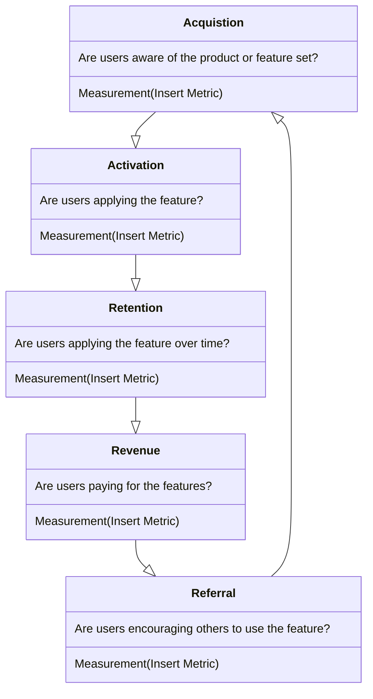
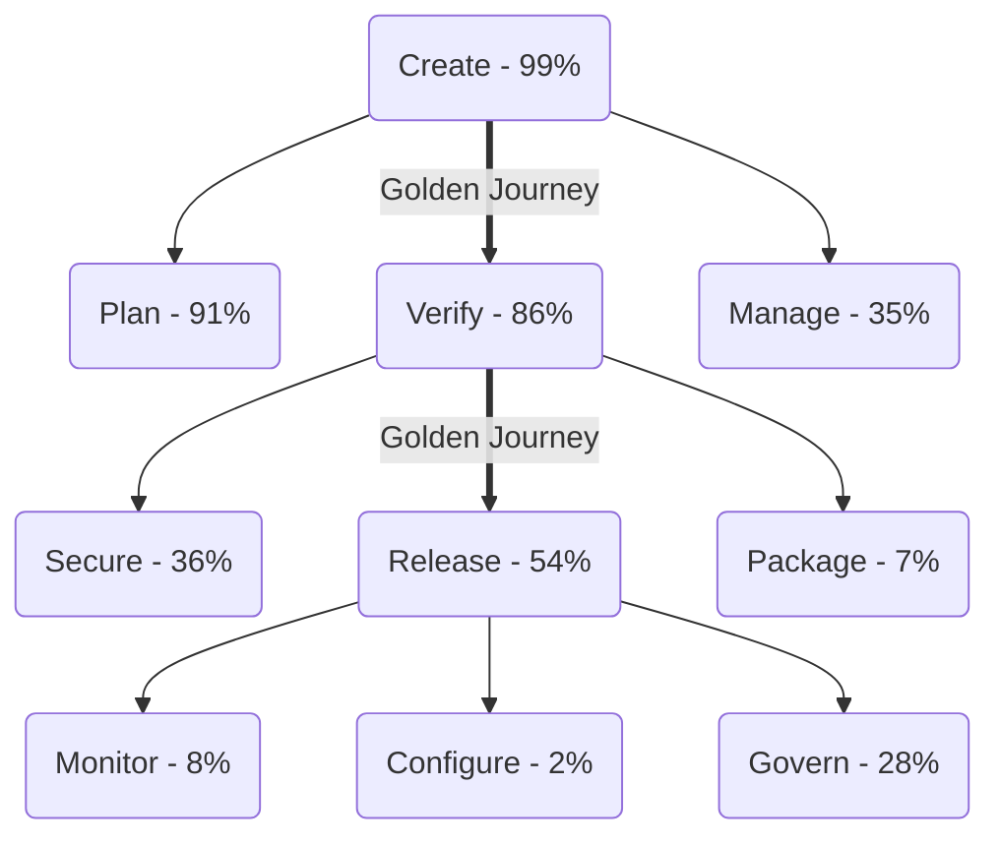

---

title: Product Principles
description: "These are core principles we believe world class product organizations exhibit. The goal is to build a PM system that fosters and honors these principles, in a way that works for GitLab."
---

{}

## Our Product Principles

These are core principles we believe world class product organizations exhibit. The goal is to build a PM system that fosters and honors these principles, in a way that works for GitLab.

1. **Hiring is Job One.** "A" players attract "A" players. Given the strategic importance of the PM role, a strong PM creates enormous leverage. We should strive to raise the average competency for the team with each new hire.
    - Helpful resource: [Recruit Rockstars](https://www.amazon.com/Recruit-Rockstars-Playbook-Winners-Business/dp/1619618168/ref=sr_1_fkmrnull_3?keywords=recruit+rockstars&qid=1558392544&s=gateway&sr=8-3-fkmrnull)
1. **Care personally & challenge directly**. Employees that feel safe plus managers that coach honestly is how people do their best work. We encourage timely and actionable feedback, as well as managers that take the time to get to know their people as humans with feelings and personal lives, not just resources.
    - Helpful resource: [Radical Candor](https://www.amazon.com/Radical-Candor-KIM-SCOTT/dp/1509845380/ref=sr_1_3?keywords=radical+candor&qid=1558392325&s=gateway&sr=8-3)
1. **Always be learning.** Continuously invest in skill development, and have a growth mindset as individuals and as a team.
    - Helpful resource: [Peak](https://www.amazon.com/Peak-Secrets-New-Science-Expertise/dp/0544947223/ref=sr_1_3?keywords=peak&qid=1558392290&s=gateway&sr=8-3)
1. **You’re not the customer.** Talk to them. It is tempting to assume that we understand our customers, but we are often wrong. We validate our assumptions through qualitative and quantitative customer input.
    - Helpful resources: [Inspired](https://www.amazon.com/INSPIRED-Create-Tech-Products-Customers/dp/1119387507/ref=sr_1_3?keywords=marty+cagan&qid=1558392207&s=gateway&sr=8-3). [Competing Against Luck](https://www.amazon.com/Competing-Against-Luck-Innovation-Customer/dp/0062435612/ref=sr_1_3?keywords=competing+against+luck&qid=1558392608&s=gateway&sr=8-3). [Get in the Van](https://firstround.com/review/the-power-of-interviewing-customers-the-right-way-from-twitters-ex-vp-product/).
1. **Start with the problem, not the solution.** It is tempting to dive right into solutioning, but we are often wrong about the underlying problem. A well formed problem statement is the key to a successful project.
    - Helpful resources: [Love the Problem Not Your Solution](https://blog.leanstack.com/love-the-problem-not-your-solution-65cfbfb1916b). [Great PM’s Don’t Spend Their Time on Solutions](https://www.intercom.com/blog/great-product-managers-dont-spend-time-on-solutions/).
1. **Prioritize relentlessly.** It is better to do a few things well than many things poorly. We should focus first on what we’re best at and what our customers need most, with a preference for simplicity. Customers will tell us when we’re missing something they need, but they’re unlikely to tell us when we’re overwhelming them with unwanted features.
    - Helpful resources: [Essentialism](https://www.amazon.com/Essentialism-Disciplined-Pursuit-Greg-McKeown/dp/0804137382/ref=sr_1_3?keywords=essentialism&qid=1558392393&s=gateway&sr=8-3). [RICE](https://www.intercom.com/blog/rice-simple-prioritization-for-product-managers/).
1. **Assume you are wrong.** Human intuition is often wrong. To fight this, have a hypothesis and try to invalidate it quickly.
    - Helpful resource: [Thinking, Fast & Slow](https://www.amazon.com/Thinking-Fast-Slow-Daniel-Kahneman/dp/0374533555/ref=sr_1_3?crid=CT91NU8162ED&keywords=thinking%2C+fast+and+slow&qid=1558392435&s=gateway&sprefix=thinking%2C+fas%2Caps%2C169&sr=8-3)
1. **Iterate.** Leverage a fast-paced build-measure-learn feedback loop to iterate your way to a good solution, rather than trying to plan it all out up front.
    - Helpful resource: [Lean Startup](https://www.amazon.com/Lean-Startup-Entrepreneurs-Continuous-Innovation/dp/0307887898/ref=sr_1_3?keywords=lean+startup&qid=1558392463&s=gateway&sr=8-3)
1. **Be data driven.** Always have success metrics, track them, and try to move them in the right direction with our actions.
    - Helpful resource: [How to Measure Anything](https://www.amazon.com/How-Measure-Anything-Intangibles-Business/dp/1118539273/ref=sr_1_3?crid=34TJSQF3Z49AR&keywords=how+to+measure+anything&qid=1558392490&s=gateway&sprefix=how+to+measure+an%2Caps%2C167&sr=8-3)
1. **Product-led growth.** Strive to build a delightful product and user experience that seamlessly acquires, activates, and retains customers in partnership with Marketing, Growth, Pricing, Fulfillment, and Sales.
    - [Product-Led growth](https://www.productled.org/foundations/what-is-product-led-growth) does not mean _product-management-led growth_. However, following this principle product becomes a central piece in driving growth and is used for many activities that were traditionally outside of the product to provide a scalable approach.

## How we follow our Principles

### Enabling Collaboration

From development teams to marketing organizations, everyone needs to collaborate
on digital content. Content should be open to suggestions by a wide number of
potential contributors. Open contribution can be achieved by using a mergeable
file format and distributed version control. The [mission of GitLab](/handbook/company/mission/#mission)
is to **allow everyone to collaborate on all digital content** so people can
cooperate effectively and achieve better results, faster.

### Bringing Ideas to Reality

Ideas flow through many stages before they are realized. An idea originates in a
chat discussion, an issue is created, it is planned in a sprint, coded in an
IDE, committed to version control, tested by CI, code reviewed, deployed,
monitored, and documented. Stitching together all these stages of the DevOps
lifecycle can be done in many different ways. You can have a marketplace of
proprietary apps from different suppliers or use a suite of products developed
in isolation.

As a single-application for the entire DevOps lifecycle GitLab strives to enable you to bring ideas to production rapidly. We will do so AND avoid demonstrating our capabilities with toy app demos and simple trivial examples. That's because we understand that [building a prototype is easy, but building a production line is hard](https://www.businessinsider.com/elon-musk-says-building-factory-100-times-harder-than-making-car-2019-3).

### The Minimal Viable Change (MVC)

We only ship in a Minimal Viable Product (MVP) style. We call it Minimal Viable Change (MVC) because our business model is focused on adding additional value to our integrated product suite instead of building separate, new products.

MVC means we deliver the smallest possible solution that **offers value** to our users. To avoid [feature bloat](https://www.productplan.com/glossary/feature-bloat/), we rely on user research to validate whether our idea addresses a market need in a desirable way. This approach sets us up to expend the smallest possible amount of effort to build new capabilities, while learning more about how to best add additional functionality over time.

While an MVC may not have the robust functionality of a fully developed feature, it should still address fundamental user needs through a bug-free and highly usable experience. The minimal viable change should not be a [broken feature](https://blog.crisp.se/2016/01/25/henrikkniberg/making-sense-of-mvp).

Advantages of an MVC approach:

- It prevents over-engineering.
- It forces everyone involved to look for the simplest solution to a problem,
which is often the best solution.
- It forces working towards an 80/20 solution. While competing products might cater
to the last 20% of the market, a minimal viable solution is _good enough_ for 80%.
- A bigger change is harder to review.
- A bigger change is harder to roll back.
- The bigger the change, the larger the risk of a conflict with someone else's contribution.
- The bigger the change, the longer it takes before everyone can benefit from the change.
- Further changes or enhancements to the change are driven by feedback from
actual users. This is a much more informative mechanism than the intuition
of a product person (this doesn't mean we should just build
whatever feedback tells us, however.)

When considering how to scope a feature for a release, remember that it is ok to ship an "incomplete" feature to customers, assuming that it still offers value, is not broken, does not hurt usability, for UI changes (see the [definition of done](https://docs.gitlab.com/ee/development/contributing/merge_request_workflow.html#definition-of-done)). When introducing a new component or pattern not found within Pajamas, it is the responsibility of that team to follow our [component lifecycle guidelines](https://design.gitlab.com/get-started/lifecycle) to [determine whether it should be added](https://design.gitlab.com/get-started/lifecycle#determining-whether-a-component-should-be-included-in-pajamas) and, if so, contribute the addition/update back to Pajamas.

MVC means reducing the scope so we can ship quickly. It doesn’t mean shipping something that hurts the usability of GitLab. First impressions are important. A feature that does not offer enough value or hinders the user experience may have a negative effect that discourages users from trying that feature again in the future. If there are obvious gaps in your MVC or you can anticipate follow-up requests, consider whether your feature is complete enough to be released to users. If you are unsure whether your feature is complete enough to be an MVC (or if you know your feature is not complete enough to be an MVC and you want to gather additional feedback), you can use approaches such as dogfooding, [beta programs](https://docs.gitlab.com/ee/policy/experiment-beta-support.html), feature flags, and/or user research to help build confidence in your decision. In terms of talking about your feature, it's ok to add a release post item that announces your incomplete feature (making clear that it is an early iteration, and points to the direction for the feature) and follow up in a later release post with a new item when you've completed more of the functionality. As long as you call it cookie dough, not a cookie, it manages user expectations.

Examples:

- Ship a feature through the API and not the UI -  [See this release post](https://about.gitlab.com/releases/2022/09/22/gitlab-15-4-released/#graphql-api-endpoint-for-deleting-attachments-from-project) as a great example of this approach was used to build a GraphQL endpoint for deleting attachment from a project.
- Exposing a minimal set of functionality  - [See this release post](https://about.gitlab.com/releases/2022/11/22/gitlab-15-6-released/#admin-area-runners-job-queued-and-duration-times) where a basic read-only page displaying queued jobs was added and more capabilities were added in subsequent releases.

There are scenarios when an MVC approach is not advised. These include:

- When changing core parts of the experience - An example of a core experience is [comments](https://docs.gitlab.com/ee/user/discussions/#comments-and-threads). When building this out for work items, we waited to release the new feature to end users until we reached parity with comments in Issues and MRs.

### Iteration

An MVC approach is a byproduct of our spirit of iteration. That means we [break problems down](/handbook/product-development-flow/#build-phase-1-plan) as [small as possible](/handbook/values/#make-small-merge-requests), use [merge request rate as a performance indicator](/handbook/engineering/development/performance-indicators/#development-department-mr-rate), and focus on [reduced cycle time](/handbook/values/#reduce-cycle-time). Thinking iteratively is not always intuitive, and breaking certain topics or projects down can be challenging. Here's a helpful [video](https://www.youtube.com/watch?v=zwoFDSb__yM) from our CEO with guidance on how to think more iteratively.

Here is a [great video](https://www.youtube.com/watch?v=MwHHErfX9hI) that illustrates how to build MVCs using Iteration. It shows Lego climbing obstacles. The first design fails. The second one can climb a book and so on. It also illustrates how modularity and good interfaces help with iteration as things get complex.

#### Subtractive thinking

Humans tend to [favor solutions that add features than solutions that remove them, even when removing features is more efficient](https://www.nature.com/articles/d41586-021-00592-0) - great PMs recognize this bias and utilize subtractive thinking to create great user experiences. Customers will tell us when we’re missing something they need, but they’re unlikely to explicitly tell us when we’re overwhelming them with unwanted features. However, we do have evidence that this challenge is already a consideration for us, as reflected consistently in our [System Usability Scale verbatims](/handbook/product/ux/performance-indicators/system-usability-scale/). Here is [an episode on the Hidden Brain podcast](https://hiddenbrain.org/podcast/do-less/) that explores this bias further.

#### SaaS First

Our customers choose SaaS because it reduces their operating costs, helps them adopt the latest capabilities without performing upgrades, and provides them peace of mind of high availability. This implies we adhere to SaaS first principles. SaaS first implies the following:

- Release features in SaaS alongside self-managed or earlier
- Design features so that they can be implemented in SaaS without downtime. If each team does a rearchitecture once every 2 years that requires downtime, then, as of this writing, it would imply 20 downtimes a year.
- Involve infrastructure team early in your design process to ensure that not only is there no downtime, but that the deployment to SaaS can be low toil.

SaaS First does not mean SaaS only. For more information on parity between SaaS and self-managed, see our parity principle: #parity-between-saas-and-self-managed-deployments

#### Feedback issues

An MVC approach allows for maximum feedback while iterating. To help gather that feedback, Product Managers are encouraged to create feedback issues ([example](https://gitlab.com/gitlab-org/manage/general-discussion/-/issues/15367)) to consolidate suggestions and experiences from users. Consider mentioning the feedback issue in any release post items and related implementation issue(s) for awareness.

- Feedback issues allow GitLab team members and the wider GitLab community to offer thoughts and suggestions for future iteration.
- Feedback issues are particularly encouraged for major new customer-facing features.
- These issues can be closed at the end of the milestone following the milestone when they were introduced.

### Celebrate and Learn from Failures

It's important that team members know they are encouraged by E-group to continue moving fast as GitLab grows and gets bigger as a company. This involves moving quickly even in the face of risk and complexity. In alignment with our [transparency value](/handbook/values/#transparency), we'd like to celebrate examples of failures or mistakes that were made while moving fast, where we ultimately learned from it and moved on.

The following failures provided by the product team are celebrated as opportunities to gain insight, share learnings and move on with additional knowledge:

1. We initially believed we should create a lift and shift translator for Jenkins, but learned from users and technical experts that it wasn't technically feasible and it would be better to invest in more detailed documentation and guidance.
1. With Auto DevOps, we discovered the desire for composability and the need to iterate on your DevOps platform makes a one-pipeline fits all capability miss the mark for tackling that user pain.
1. We integrated with some monitoring and observability tools as MVCs (Jaeger) that were just too MVC to give us data points on their success.
1. We relied upon "MVC" not including on by default and usable by default - resulting in lots of MVCs that we thought would garner us new information, but did not.
1. We spent time delivering a marketplace offering, and had very little traction. We learned marketplace offerings alone are not a vehicle for adoption, and we need a sales alignment with the marketplace vendor to achieve success.
1. We had duplication of effort between Quality and Distribution. We didn't recognize / resolve this for too long. We have learned to better integrate Quality into the planning process.
1. Data telemetry in general has been one of our failures. We didn't invest in telemetry seriously or early enough, and we attempted to accelerate via a 3rd party, but didn't do a good enough job talking to our community on the best ways to roll that out.
1. We failed to capture significant users with APM. [Internal Deck for Reference](https://docs.google.com/presentation/d/1Iw79oaSZg1OVAmubIhXQZOAsKd_snxKUXrLCjSsawzs/edit#slide=id.g29a70c6c35_0_68)
1. Historically, designers had been instructed to not spend time on problem validation, but we had a PM who realized in order for her group to be successful, she needed her design counterpart to be deeply involved in validation work.
1. We learned that GitLab's original Serverless strategy was dependent on immature technology and not necessarily aligned with the market winner Lambda. This resulted in GitLab stopping investment in Serverless.
1. We recognized a big gap in security concerns with GitLab managed clusters, which was prohibiting this feature from being adopted by customers. Once we learned from this 'failure' we introduced the Kubernetes agent instead.

_If you have a failure that can serve as a learning opportunity, please make an MR to this page_

### Avoid "Not Invented Here" Syndrome

Just because something is [not invented here](https://en.wikipedia.org/wiki/Not_invented_here)
doesn't mean it doesn't have a perfect home within our solution. GitLab is an
Open Core product and is part of the broader ecosystem of Open Source tools in
the market. Every day there are new innovative tools out there that solve
real-world customer problems; we should not be afraid of embedding these tools
into our own products in order to solve those same problems for our customers
too. Leveraging existing technology allows us to get to market much more quickly,
to contribute to Open Source (and help strengthen Open Source as a whole), and
allows us to focus our own people on making GitLab itself better. Building
professional relationships with these tool creators also is a positive for GitLab
since they may have important user perspectives around your categories.

We have achieved many successes following this approach:

- [Code Quality](https://docs.gitlab.com/ee/user/project/merge_requests/code_quality.html) in CI/CD pipelines by embedding [CodeClimate](https://codeclimate.com/)
- [Feature Flags](https://docs.gitlab.com/ee/operations/feature_flags.html) by using the [Unleash](https://github.com/Unleash/unleash) client library
- [Mobile publishing](https://about.gitlab.com/blog/2019/03/06/ios-publishing-with-gitlab-and-fastlane/) by writing about how to utilize [FastLane](https://fastlane.tools/) with GitLab

There are also many more examples throughout the company where this has been successful.
As a product manager you should be monitoring the world of Open Source as it
relates to your area to see where new innovative tools are being developed, and
not be afraid of integrating those. One thing to keep in mind, integrating could
be anything from a blog post describing how the tool works together with GitLab
all the way up to bundling it inside of our own installation, and this can
evolve iteratively.

### Convention over Configuration

We understand that a natural inclination when using application development tools is to create an array of buttons to press and knobs to turn. We believe, however, that adding options to an application does not necessarily improve the user's experience of that application. The best way to serve our users is to create an application that reduces complexity while still offering the features they need.

#### Inspiration

We admire other "convention over configuration" tools—like [Ruby on Rails](http://rubyonrails.org/) (the doctrine of which perfectly describes the [value of integrated systems](http://rubyonrails.org/doctrine#integrated-systems)), [Ember](http://emberjs.com/), and
[Heroku](https://www.heroku.com/)—and we strive to offer the same advantages for continuous delivery of software.

Furthermore, Ruby on Rails has significantly and positively influenced the Ruby community, uplifting the tool and making it more powerful and useful than ever before. We want GitLab to be to Kubernetes what Rails is to Ruby.

You should prefer well-considered choices based on current best practices. Avoid unnecessary configuration. Avoid configuration to support fragile workflows.

#### Configuration Principles

When considering adding new configuration, we follow the following principles:

- **Ensure a great experience by default** - GitLab should work perfectly right out of the box for most users. While it should be resisted, sometimes configuration is inevitable or preferable. Your configuration must not make that [experience worse](https://gitlab.com/gitlab-org/gitlab/issues/14432) and should always _get out of the way of the user_.
  - **GitLab.com values should be the default** - the settings used on GitLab.com should be the defaults for self-managed. Not only does this provide a consistent experience for users, but we get the highest fidelity feedback via GitLab.com. If we find that the GitLab.com setting is wrong, it is usually wrong for self-managed too. If you believe you have a strong case for using custom (non-default) settings for GitLab.com, please document the justification in alignment with your Product Section Lead. Any custom (non-default) settings for GitLab.com need to be [tracked here](https://docs.gitlab.com/ee/user/gitlab_com/).
- **Encourage favorable behaviors by limiting configuration** - Convention also implies that we're encouraging our customers to do things
in a certain way. A very concrete example of this is the ability to disable pipelines. We believe that our integrated solution will give a superior user experience and we're motivated to encourage this behavior. For this reason, adding a configuration to allow disabling this permanently (be that in a template or instance-wide), is something that should be avoided.
- **Design for users not intermediaries** - GitLab should avoid falling into the [Blackboard trap](https://twitter.com/random_walker/status/1182637292869115904) of building a product that administrators of GitLab love because it is configurable, but developers and other users of GitLab hate because it is overly complex and confusing.
- **Working by Default** - From the perspective of someone using GitLab, the feature does not exist until it works by default. This means, with few exceptions, features should simply work on GitLab.com and self-managed installations of GitLab without setup, toggling feature flags, modifying GitLab Omnibus (`gitlab.rb`) or Charts configurations, or installing extra components. This is more difficult than "enabled by default," which implies that features may be available by default but then require additional effort to set up. Working by default is worth the extra thoughtfulness and effort, because it enables an extremely important outcome: It allows customers to easily adopt our entire platform and experience the benefits of a single app for the entire DevOps lifecycle. In order to be properly working by default a feature needs two things:
  - **Enabled-by-default** - it must not require modifying GitLab Omnibus (`gitlab.rb`) or Charts configurations, installing extra components on the host machine, or be behind a feature flag. When features are not enabled-by-default most people will never benefit from it because admin access to the GitLab application or the host machine will be needed. Feature flags should be consistently ON for both GitLab.com and self-managed users whenever possible.
  - Enabled-by-default can be rolled out incrementally. A feature can sometimes be activated within days via a feature flag on [GitLab.com](https://gitlab.com). Other times a feature can take months to prove that it has the performance and visibility enterprises need.
  - **Setup-by-default** - it should not require the setup before the feature can be used. We should ensure every feature has sensible defaults, and automatically migrate existing users/groups/projects to have the new features setup by default, while ensuring that the security and infrastructure costs would not be substantially affected. It is important to remember that most people are not likely to take the extra effort to setup a new feature, nor will they be aware that the feature has been added. The vocal proponents of issues who a Product Manager might interact with would likely be inclined to take the extra effort to setup a feature, but most people will not.
- **Avoid Limits** - Limits should be in place to [protect the system](https://gitlab.com/gitlab-com/www-gitlab-com/issues/5617) but not to "slowly try out" a feature. By limiting the usefulness of a feature right from the start the only thing you are achieving is limiting its adoption and usefulness. If you are going to default to OFF or limited, you must have a good, documented reason for this.
- **Avoid configuration completely when possible** - Requests for configuration can be a proxy for trying to support a fragile workflow. Rather than enabling bad habits and incurring product debt, effort should be spent helping customers adopt best practices.
  - **Configuration builds up over time** - Every configuration option in GitLab multiplies its complexity, which means the application is harder to use, harder to develop, and less friendly to users.
  - **Configuration is hard to remove** - Removing a configuration after it shipped and in use is much more work than not introducing it in the first place. This is because you change the behavior for customers that selected the less popular option.
  - **Configuration is an expensive testing mechanism** - It's a natural reaction to propose a big change to be configurable, as you worry it'll negatively affect certain users. However, by making a feature configurable, you've now created [two problems](https://xkcd.com/927/) to maintain going forward. Adding a configuration is a [one way door](/handbook/values/#make-two-way-door-decisions) that should be avoided if possible. As a result, consider using feature flags instead of configuration.

#### Always Allow for Deploying to Production

Sometimes fast deployments are needed to fix a service or application outage that can cost a business money and reputation, we understand time is of the essence in these situations. That’s why we believe giving the team control over this is important in crucial moments of the development lifecycle. Controls that prevent changes from reaching Production are okay as safeguards, but they should be able to be quickly removed or disabled if necessary. When controls are changed in this way, logs or records should be created to support post-mortem analysis and allow for understanding why the control needed to be removed or disabled.
<figure class="video_container"><iframe src="https://www.youtube.com/embed/03ODv1cEO6E"></iframe></figure>

#### Parity between SaaS and Self-managed deployments

We want to provide the same capabilities to end users regardless of the method they choose to use GitLab (GitLab SaaS or Self-managed). At the same time, we believe in the power of a [single code base](/handbook/product/single-application/#single-codebase). Therefore we strive to maintain feature parity between SaaS and Self-managed installations.

In line with our [SaaS-first](#saas-first) principle, some features may be released on SaaS to gain operational experience prior to recommending and supporting customers using it. All features will eventually be made available across SaaS and self-managed once those learnings have been applied.

For functionality where implementation may be especially challenging without cloud services, for example with AI, self-managed functionality may be dependent on an underlying SaaS service. This allows us to provide end users the same capabilities regardless of deployment type, and not overly constrain our feature set or impose significant operational complexities on each deployment. Product managers need to be aware that this may impact the adoption of these features, as not all customers may be willing or able to leverage underlying SaaS services, such as air-gapped deployments.

#### Principled adherence to the established knowledge architecture

**Exception to this product principle requires CEO approval. Work with VP, Product Management to add your request to the Product Scale agenda describing the situation and request for exception to gain CEO approval.**

Our [simplicity](/handbook/product/product-principles/#simplicity) and [SaaS/Self-Managed Parity](/handbook/product/product-principles/#parity-between-saas-and-self-managed-deployments) principles require that we adhere to our established knowledge architecture. Our established architecture is [Organization](https://gitlab.com/groups/gitlab-org/-/epics/4257#proposal), [Group](https://docs.gitlab.com/ee/user/group/) and [Project](https://docs.gitlab.com/ee/user/project/).

- When we need to add capabilities that an admin needs to apply across the entire organization, then we provide them at the organization level.
- When we need to add capabilities that need to apply across all projects in a group, but not applicable to all groups in an organization, then we provide them at a group level.
- When we need to add capabilities that need to apply across a specific project, but not all projects in a group, then we provide them at a project level.
- For capabilities our users want applied to a set of groups, it is tempting to create another aggregation concept for a “set of groups”. We do not consider that until it is available both at the project and group level for a few months. The solution is to implement it for all groups at the organization level or for each group in the set individually.
- For capabilities our users want applied to a set of projects, it is tempting to create another aggregation concept for a “set of projects”. We do not consider that until it is available both at the project and group level for a few months. The solution is to implement it for all projects at the group level or for each project in the set individually.

Note: This implies that we will take pains to avoid instance-level features as we expect to move all capabilities from instance to organization over time.

### Take pains to avoid instance-level features

After making a tier decision on a new feature, we should strive to maximize the number of users who can use it.

As part of this objective, we should avoid building instance-level features when possible. Building at the instance level (in the [admin area](https://docs.gitlab.com/ee/administration/)) leads to
[a separation between GitLab.com and self-managed](https://gitlab.com/gitlab-com/customer-success/tam/-/issues/324#note_394401193) and limits
your audience to self-managed customers only:

> Historically (and even net-new proposed features) we've often started with an "instance-wide" mindset which then means we need to iterate and adjust features to work at a group-level. This often delays functionality for our SaaS customers and makes GitLab.COM feel like a second-class citizen.

There are factors that may justify an instance-level feature, like [engineering efficiency](https://gitlab.com/groups/gitlab-org/-/epics/4147#note_415603249) and [high infrastructure cost](https://gitlab.com/gitlab-org/gitlab/-/issues/276583#note_473354281), but we should always have a clear view on how we might bring the feature to GitLab.com and clearly document why we started with the instance-level in the issue.

#### Deciding whether to add configuration

##### For a GitLab instance in `gitlab.yml`

Product Managers at GitLab are frequently confronted with the choice of whether to add new configurations or not. These can frequently be times where an outside perspective is important. That's why we've created the option to request a [New Config Review](/handbook/product/product-processes/#mvc-and-new-config-reviews).

Here's an example of how to consider whether to add new configuration. Let's say you are proposing we add a checkbox or two radio boxes in a feature dialog box. Think carefully about what users really want. Most of the time, you'll find you really only need one solution, so remove the other option. When two possible choices really are necessary, the best or most common one should be the default, and the other one
should be available. If the non-default choices are significantly less common, then consider taking them out of the main workflow for making decisions, by putting them behind an Advanced configuration tab, for example.

Avoiding configurations is not always possible. When we have no choice,
the secondary priority is to configure something in the GitLab
interface.

A configuration should only appear in a file (`gitlab.rb` or
`gitlab.yml`) as a last resort.

- [`gitlab.yml`](https://gitlab.com/gitlab-org/gitlab/blob/master/config/gitlab.yml.example)
is the configuration file used by the Rails application. This is where the domain is configured. Other configurations should be moved to the UI as much as possible and no new configurations should be added here.
- [`gitlab.rb`](https://gitlab.com/gitlab-org/omnibus-gitlab/blob/master/files/gitlab-config-template/gitlab.rb.template)
is the configuration file for Omnibus-GitLab. It acts not only as
an abstraction of the configuration of `gitlab.yml` for GitLab-Rails, but also
as the source for _all configurations_ for services included and managed within
the Omnibus-GitLab. Newly introduced services probably need to be configured
here.

When you have to add a new configuration, make sure that the features and services are on by default. Only add a configuration line to either of these configuration files if the feature or service cannot be fully disabled from the admin UI.

##### For a GitLab CI configuration in `.gitlab-ci.yml`

If the decision to add a configuration follows the [principles above](/handbook/product/#principles), add it to the repository-specific CI configuration options and be sure to default it to the option that results in the best user experience. We are much more liberal with additions to CI configurations than Instance configurations.

#### Every feature is owned by a group

Features should be owned by one group, including the respective DRIs of that group. Make sure that the documentation metadata and the `features.yml` for your team are kept up to date to make it easier for other teams to find the correct owner.

This principle is important because unowned product features are unsupervised, and continue to accrue technical debt over time. This increases the risk of performance and maintenance issues, which tend to only get resolved once the situation has become critical. In addition, by having clear DRIs for our entire surface area, teams are able to advocate for investment and/or removal of features. If you encounter a feature that does not seem to be owned or documented, work with the team that originally introduced the functionality to decide on ownership. If the feature is large and needs to be broken down, document which elements are owned by which team. If you cannot decide who should own the feature, escalate the decision to the lowest common reporting line between the involved teams. If there are features that no group wants to own, or features that a group no longer wants to own, that feature should be considered for deprecation and removal.

### User Experience

Within each stage, the learning curve must be at least comparable to our best-in-class competitors, with clear, cohesive workflows, a highly usable interface, and comprehensive documentation. Product works closely with the [User Experience](/handbook/product/ux/) team to achieve our user experience goals.

Below are some general user experience principles we should always keep in mind. Additionally, you can familiarize yourself with the [UX team mission](/handbook/product/ux/how-we-work/#ux-team-mission) and [GitLab's Pajamas design system principles](https://design.gitlab.com/get-started/principles).

#### Simplicity

Using GitLab should be easy. Users should be thinking about the applications they are building and teams they are collaborating with, not about how to make our app work. [Don't make users think!](https://www.goodreads.com/book/show/18197267-don-t-make-me-think-revisited?)

This sounds obvious, but it can be hard to keep things simple as an application becomes more complex, with more features and more options to cover more use cases and more user types.

The good news is that the product designer assigned to your stage group has a high level of expertise in how to simplify the complex, and how to make decisions about when to add or avoid complexity. Involve product design in all changes that impact the UI.

### Be Ambitious

Many crazy, over-ambitious ideas sound like they are impossible just
because no one else is doing them.

Since we have amazing engineers and a culture of shipping minimal
viable changes, we are able to accomplish many more "impossible" things than other organizations.

That's why we're shipping merge conflict resolution, why we shipped built-in CI
before anyone else, why we built a better static pages solution, and why
we're able to compete.

#### How this impacts Planning

Here at GitLab, we are an [ambitious](#be-ambitious) company and this means we
aim for big things with every release. The reality of taking chances and
planning aspirationally means that we won't always be able to deliver everything
that we wanted to try in every release, and similar to our [OKRs](/handbook/ceo/#three-levels-of-performance),
we believe this is a good thing. We don't want to shy away from challenging
ourselves and always want to keep a sense of urgency, and aiming for more helps
us do that. Also see [the importance of velocity](/handbook/engineering/development/principles/#the-importance-of-velocity)

We arrived at our preference for ambitious planning after measuring our velocity and finding that our velocity was unchanged whether we scheduled ambitiously or scheduled for providing slack.

### Discoverability without being annoying

Discovering new features can enhance the experience and unlock significant value for users. And the more users see and try our features, the faster we can get feedback to improve them.

However, excessive feature discovery efforts can become irritating for users. This erodes trust and reduces engagement with other UI elements in the future. Even worse, they might leave GitLab due to this deteriorating experience. Context plays a significant role in how users engage with new functionality. By presenting features in a way that resonates with a user's current situation and needs you increase the liklihood of them using this new functionality.

Work with your product designer to improve the discoverability of your features. The Pajamas Design System has best practices and examples to support [feature discoverability](https://design.gitlab.com/usability/feature-discovery). We can also design new patterns. The Growth team can also help you with this, as they think about things like onboarding new users and promoting feature use within the app while supporting, not annoying, the user.

### Product Qualified Leads (PQLs)

As the GitLab userbase and team members who work on GitLab continue to grow we need to support both our users and team members by helping to connect users who may be interested in speaking with a member of the sales team to that particular person. We can call this a Product Qualified Lead or a PQL.

#### A PQL can be further broken down into two types, usage and hand-raise

- Usage: A usage-based PQL is a user or a team (group or instance) that adopted the product to the level that we had data to support that they are statistically more likely to upgrade to a subscription compared to our remaining userbase. When this level of product adoption is achieved by the user or team an alert is triggered for the sales team to follow up with the user and/or team. The level of usage that triggers a usage-based PQL is something that will be determined and agreed upon between Product, Marketing, and Sales as the goal is to generate quality leads for the sales team. When the usage-based definition is agreed upon it will be added here.
- Hand-Raise: A hand-raise PQL is a user who requests to speak to sales from within the product. Our goal is to introduce these hand-raise moments throughout the product at feature discovery moments, or moments where a user is learning more about a paid feature or tier of GitLab that they may find valuable. These moments should be contextually relevant to their usage and non-obtrusive [see Discoverability Without Being Annoying](/handbook/product/product-principles/#discoverability-without-being-annoying). A hand-raise moment in the product should be accompanied by either a trial CTA or a touchless upgrade CTA or both. We want to always provide options to our users as we want them to decide the path that best suits their needs.

#### Clarifiying out what a PQL is not

- A PQL is not a user that has only signed up for the product, they have not achieved a qualified status.
- A PQL is not a trial, a trial is a separate user adoption path. It’s important to note that a user could start a trial and then become a PQL or vice versa.

#### The future vision of PQLs within the GitLab product

Our goal is to develop a world-class PQL system whereby we monitor product usage to understand and constantly iterate on what constitutes a usage-based PQL and provide a unified intelligent interface in the product where users can submit a hand-raise, start a trial or upgrade touchlessly.

By monitoring product usage, usage PQL volume, SAO rate, and ASP we will be able to work in partnership with marketing and sales to ensure we’re sending high quality leads to the sales team.

In the product experience, we will develop an intelligent module for feature discovery moments whereby we help recommend what we believe should be the preferred option for the user whether it’s a hand-raise, trial or touchless upgrade by updating the default CTA based on their usage of the product along with demographic and firmographic data. This experience will be present on both SaaS and self-managed instances for air-gapped instances the CTAs will provide the user with external URLs to visit to complete the associated step. This experience should be able to be deployed by any stage to further their paid adoption rate.

### Drive Product Usage

Users can only experience GitLab's value when they actively use the product features. Therefore the Product team's mission isn't only shipping features and building products, but also driving usage and delivering value.

There are two frameworks we use to think about driving GitLab's product usage: we use the AARRR framework to think about how to drive a single feature's usage, and use the Customer Adoption Journey to think about cross-adoption of product features. These two frameworks are also interconnected with each other.

#### Single Feature usage: AARRR framework

AARRR stands for _Acquisition_, _Activation_, _Retention_, _Revenue_, and _Referral_ which is often referred to as ["Pirate Metrics"](https://amplitude.com/blog/2016/02/25/actionable-pirate-metrics). These five words represent the customer journey and the various means a product manager may apply Product Performance Indicators to drive a desired behavior in the funnel.

While the AARRR framework is commonly used to drive overall active users, it is also a great way for PMs to think about how to drive feature usage.

- Acquisition measures user actions that show awareness of the feature
- Activation illustrates a user has begun to apply the feature
- Retention is the continued use of the feature over time
- Revenue captures the monetary value acquired from feature usage
- Referral focuses on measuring behaviors that drive users to encourage others to consume the feature

Add AARRR funnels for your stage or group's Product Performance Indicators directly with mermaid markdown. It's easy if you use this [live editor](https://mermaid-js.github.io/mermaid-live-editor/#/edit/eyJjb2RlIjoiY2xhc3NEaWFncmFtXG4gIEFjcXVpc3Rpb24gLS18PiBBY3RpdmF0aW9uXG5cdEFjcXVpc3Rpb24gOiBBcmUgdXNlcnMgYXdhcmUgb2YgdGhlIHByb2R1Y3Qgb3IgZmVhdHVyZSBzZXQ_ICAgIFxuXHRBY3F1aXN0aW9uOiBNZWFzdXJlbWVudCAoSW5zZXJ0IE1ldHJpYykgXG4gIEFjdGl2YXRpb24gLS18PiBSZXRlbnRpb25cblx0QWN0aXZhdGlvbiA6IEFyZSB1c2VycyBhcHBseWluZyB0aGUgZmVhdHVyZT9cblx0QWN0aXZhdGlvbjogTWVhc3VyZW1lbnQgKEluc2VydCBNZXRyaWMpIFx0XHRcdFx0XG4gIFJldGVudGlvbiAtLXw-IFJldmVudWVcblx0UmV0ZW50aW9uIDogQXJlIHVzZXJzIGFwcGx5aW5nIHRoZSBmZWF0dXJlIG92ZXIgdGltZT9cblx0UmV0ZW50aW9uOiBNZWFzdXJlbWVudCAoSW5zZXJ0IE1ldHJpYykgXG4gIFJldmVudWUgLS18PiBSZWZlcnJhbFxuXHRSZXZlbnVlIDogQXJlIHVzZXJzIHBheWluZyBmb3IgdGhlIGZlYXR1cmVzP1xuXHRSZXZlbnVlOiBNZWFzdXJlbWVudCAoSW5zZXJ0IE1ldHJpYykgXG4gIFJlZmVycmFsIC0tfD4gQWNxdWlzdGlvblxuXHRSZWZlcnJhbCA6IEFyZSB1c2VycyBlbmNvdXJhZ2luZyBvdGhlcnMgdG8gdXNlIHRoZSBmZWF0dXJlP1xuXHRSZWZlcnJhbDogTWVhc3VyZW1lbnQgKEluc2VydCBNZXRyaWMpICIsIm1lcm1haWQiOnsidGhlbWUiOiJkZWZhdWx0In0sInVwZGF0ZUVkaXRvciI6ZmFsc2V9).

Product managers can use these various states to prioritize features that drive a desired action. This could mean focusing on the Activation metric to drive awareness and generate more `top of funnel` leads. As an example, in the [Release stage](https://about.gitlab.com/direction/ops/#release) the Release Management group tracks actions on the Release Page in GitLab. Users that view a Release Page have been `acquired` and those that create a release on a Release Page are `activated` users. The Product Manager can choose to target features that drive users to view the Release Page more, resulting in a greater interest in the number of users that become activated and create their own Releases.

#### Multi-feature usage: Adoption Journey

GitLab is a complete DevOps platform. Our customers get the most value out of the GitLab product when they use multiple features together. Below is the most common path our customers follow to adopt GitLab's product stages.

As PMs, in addition to driving usage of individual features, we should also proactively think about how to design product and user experiences to help users adopt more stages and features, therefore benefiting more from using GitLab.

- The percentage here is defined as % of monthly active paid ultimate-tier self-managed instances that adopted that stage. The data is captured directly in the Golden Journey Paths chart (which has been deprecated).
- The Golden Journey: The bolded path is the "Golden Journey" where we observe as the most common stages adopted by paid customers and serve as foundation to adopt other stages: it starts from Create, then goes to Verify and Release. If the Golden Journey is complete, all stages of GitLab are available for use. Our biggest opportunity is to improve Verify to Release adoption rate.

Note: There are numerous potential variants to this adoption journey, but it's important to keep this representation simple and consistent. Please check with David DeSanto first before making any changes to the adoption journey image.

### Flow One

Shipping only MVCs can result in a large set of loosely connected pieces that
don't necessarily combine into a single, great user experience.

An obvious solution to this would be to plan out the future in detail,
creating a long-term detailed plan. However, this is unwanted as it can restrict
your flexibility and ability to respond to changing needs or feedback.

Flow One offers an alternative. You draw out a workflow consisting of
MVCs (that can be shipped individually). The workflow should only cover a
specific, narrow use-case, and nothing more.

This means you:

- avoid creating an inflexible, long-term plan
- can more easily construct a full feature/ capability, which is more easily marketed
- can provide context to each individual change ("we need this as part of X")
- can continue to ship MVCs
- work concurrently on several items, none of which are blocking

Flow One should cover the first iteration of a particular workflow.
After this, individual MVCs can be introduced to expand the use-cases
or loosen the assumptions (e.g. from a feature that can only be used
if you're using feature branches, to one that works for other git strategies).

### Data-driven work

Using data to learn from our users is important. Our users are spread across GitLab.com
and self-managed instances, so we have to focus our efforts on learning and
providing benefit to both when we decide to collect more data, or build and use
additional analytics tools. If we do this, we can help make the rest of the
company successful as well. This means that we should:

- Build and use tools that work for both GitLab.com and self-managed.
- Start from a question, and build / collect what we need to answer that question. This avoids wasting time with data we don’t need.
- Use and improve existing tools we have inside of GitLab before leaning towards off-the-shelf products.
- Our customers, sales team and customer success teams all benefit greatly from similar insights into their usage as the product team does. Make things that help all of these people.

### No artificial limits in Core

Per [GitLab Stewardship](/handbook/company/stewardship/#promises), we will not introduce _artificial_ limits in Core. Artificial means
arbitrarily setting a small number (such as: 1) as a limit on a given GitLab object category,
that would incur _no additional_ effort or cost had we chosen a larger number. The additional
effort includes product, design, and engineering effort to create the feature in the first place,
and to maintain it over time.

For example, GitLab Core has the [issue board feature](https://docs.gitlab.com/ee/user/project/issue_board.html) in every project.
In GitLab EE, each project supports [multiple boards](https://docs.gitlab.com/ee/user/project/issue_board.html#multiple-issue-boards).
This _does not_ mean that Core has an artificial limit of one board per project, because there is additional effort
to manage multiple boards such as supporting the navigation interface, and all the associated engineering work.

This principle does not apply to our SaaS offering as limits are occasionally introduced to limit our hosting costs and protect other users from potential abuse. As an example we have [shared runner](https://docs.gitlab.com/ee/user/gitlab_com/#shared-runners) minute quotas and implement [rate limiting](https://docs.gitlab.com/ee/user/gitlab_com/#gitlabcom-specific-rate-limits).

### Avoid enforced workflows but allow enterprise flexibility

We're discussing enforced workflows [in this issue](https://gitlab.com/gitlab-org/gitlab/-/issues/2059).

Enforced workflows should be avoided in GitLab. For example, there are three issue
states (`Open`, `In Progress` (as of 10.2), and `Closed`), and any issue should be
allowed to transition from one state to any other state
without workflow restrictions. (Roles and permissions is a separate concern.)

- Enforced workflows restrict GitLab to a smaller number of use cases, thus reducing the value of GitLab.
- Enforced workflows require overhead to maintain in the product. Each new feature
must account for any existing enforced workflows.
- We should trust our users to use GitLab responsibly, giving them freedom, instead
of imposing enforced workflows that we think made sense at the time of design and implementation.

[A comment on Hacker News](https://news.ycombinator.com/item?id=16056678) perfectly details what can go wrong when enforcing workflows:

"The down side for the true end-users, those who actually use the software day-to-day,
is that most business processes are awful. If your experience is the hellish existence
that I see strolled about on threads where JIRA comes up ...:

1. Your admin(s) set it up once and hasn't bothered to iterate on those workflows.
1. The business mapped their autonomy stripping processes onto JIRA intentionally.
I'd guess that most of your work experience is similar. Process stifled nonsense."

But that comment also specifies the advantage:

"JIRA's most powerful feature is that it affords for mapping businesses processes onto software.
This is incredibly compelling to enterprise customers. Software that enforces workflows, procedures
and requirements can be an incredible lever and JIRA's price point makes build vs buy decisions an absolute no-brainer."

We should ensure that GitLab makes it easy to help with enterprise workflows:

- When starting a branch with an issue (number) we link it to the branch.
- When merging an MR you automatically close the issue(s) it fixes.
- In GitLab CI you can define your deployment stage progression (staging, pre-production, production) including manual approval.
- We run quality and security tools automatically and provide dashboards to check status instead of making it a step in the process.
- We limit the impact of mistakes with incremental rollout and automatic rollback.

When considering a customer need for enforcement or limitations:

- Deeply understand and document the underlying customer problem. It's our responsibility to understand the need we are solving for before we even consider imposing controls.
- Solve for individual use cases first. Trying to solve a specific problem with a non-specific solution is risky and not [iterative](/handbook/product/product-principles/#iteration). Instead, start with a single use case and build a specific, non-enforced solution in GitLab.
- Consider the smallest group of users first. Don't reach for instance-wide controls, but instead iterate from the smallest segment possible (e.g. a sub-set of projects).
- Provide simple workarounds and overrides. Consider extreme scenarios like recovering from a SEV-1 incident; there should always be a simple, fast escape hatch.

As an example, customers requested instance-wide enforcement through required CI jobs. Doing this would have been a mistake. Instead:

- We understood their problem more deeply, and realized we could build capabilities to perform these checks in existing primitives (like [external rules](https://gitlab.com/groups/gitlab-org/-/epics/3869) in MR approvals).
- We limited the scope of the problem, and avoided any limitations at the instance-level. Instead, we planned to keep the impact as small as possible by requiring customers to scope this feature to only projects with a particular [compliance framework](https://docs.gitlab.com/ee/user/project/settings/#compliance-framework).
- We intentionally planned for workarounds. A developer should be able to override these limitations inside merge requests, such as with [two-person approvals](https://gitlab.com/gitlab-org/gitlab/-/issues/219386). They should also be able to create subgroups that aren't subject to these controls.

<figure class="video_container"><iframe src="https://www.youtube.com/embed/QCfOQs8S4OQ"></iframe></figure>While workflow enforcement should be avoided in most cases, there are organizations that rely on enforced workflows for a variety of reasons. These organizations have problems adapting existing workflows as they move to GitLab and as a result, we should consider allowing some enforcement at the group level in order to balance team efficiency and organizational policy. Page 79 of [Accelerate](https://www.amazon.com/Accelerate-Software-Performing-Technology-Organizations/dp/1942788339) outlines "teams that reported no approval process or used peer review achieved higher software delivery performance." As we implement features to allow organizations to enforce workflows, we should do so at the group level and default them off. GitLab should be a product teams use to accelerate product development, but flexible enough to solve for requirements of all sizes of organizations.

### Prefer small primitives

Small primitives are building blocks in GitLab. They are an abstraction _not_ at
the technical level, but truly at the product level. Small primitives can be combined,
built-upon further, and otherwise leveraged to create new functionality in GitLab.
For example, the label lists in [issue boards](https://docs.gitlab.com/ee/user/project/issue_board.html)
use the smaller primitive of [labels](https://docs.gitlab.com/ee/user/project/labels.html).

They are especially powerful because they usually take less effort _and_ provide
higher leverage than you would get from a more "complete" but standalone feature.
Think of how simple Unix command line utilities can be chained together to do
really complicated things, much easier (and certainly more flexibly) than you
could have done with a dedicated tool.

When iterating on GitLab, strongly consider using small primitives instead
of creating new abstractions, especially when considering MVC features
that will provide the foundations for further improvements. To do this
you can start with easy to apply concepts that meet the needs of intermediate
to advanced users; from here document the usage clearly and be sure to think about
discoverability. The UX can very often be refactored or enhanced later when there's
a demonstrated need for refinement, onboarding for less sophisticated users, or
other new abstractions needed that were identified through real-world usage.

### Component Principles

In GitLab the product, it is sometimes the case that optional software or infrastructure is required to enable new capabilities. Some examples include:

- Infrastructure in the form of Runners are required to enable use of GitLab CI/CD
- Infrastructure and software in the form of Elasticsearch is required to enable Advanced Search
- Software in the form of the Kubernetes Agent is required to enable GitOps pull-based workflows

The following are best practices we consider when building such components.

#### Start with enabling Developers

As we learned with GitLab CI/CD, the ability for developers to quickly attach needed Runners to enable their own use of GitLab CI/CD allowed for rapid adoption of GitLab CI/CD within an organization. When considering the workflow to enable additional capabilities, start with enabling developers first. A guiding principle should be **low-friction** developer enablement, which will positively impact adoption.

#### Build for production use, not demo use

As we learned from the certificate-based Kubernetes Integration, building starting experiences that support demoing a getting-started process doesn't necessarily translate into real usage. For example, the certificate-based integration lacked strong security primitives and the ability to manage the integration on an ongoing basis. As a result, we should build capabilities that target real-world production use first, even as part of MVCs.

### Integrate other applications thoughtfully

GitLab's vision is to be the best single application for every part of the DevOps toolchain. However, some customers use tools other than our included features, and we respect those decisions. With this in mind, it's sometimes valuable to integrate with 3rd-party services and products to help _bridge the gaps_ in their toolchain. While a single application is the best approach, multiple applications that work well together is better than ones that don't.

With this in mind, below are some product guidelines to consider:

- **Don't clone everything**
  - Don't feel like we need to _clone every feature_ of an integrated product. Ultimately, this approach costs us the most possible resources, while creating an experience that will always be sub-par compared to the native one offered by the other application. We should focus our efforts on places where we can deliver value by helping bridge the gap between the two applications.
  - Here are some potential (completely theoretical) examples, highlighting the difference between cloning vs. bridging:
    - In an event log, surface only recent activity and link to a full log on the other system, instead of trying to display all records inside of GitLab.
    - In an issue/ticket, offer only the most used functionality, like commenting or status changes, instead of trying to replicate all possible actions.
- **Prevent broken workflows for free**
  - Based on the quote above: _"While a single application is the best approach, multiple applications that work well together is better than ones that don't."_
  - Features and UX that might break a customers workflow should be offered freely. In particular, we should offer features that help customers avoid productivity antipatterns like allowing multiple sources of truth (multiple wikis) or duplicating work (not showing work activity on an issue).
- **Charge for adding value to an interaction**
  - By having such an incredible breadth, GitLab has _the opportunity to add value to external features that they could never otherwise have_, if not integrated with GitLab. For example, our excellent **To Dos** feature puts actionable work at the fingertips of developers, and it's a feature somewhat unique to GitLab. Many other tools make it harder to identify work that needs immediate action, so by integrating those tools with this part of GitLab, **we can make them even more powerful than they'd be alone.**
- **Consider the right buyer for pricing**
  - While we typically think about who is _using the functionality_ as an indicator of our buyer, this may not be appropriate for your integration.
  - When an integration is driven by an organizational requirement (such as having all teams in the company use Jira), [Buyer Based Tiering](/handbook/company/pricing/#buyer-based-tiering-clarification) likely indicates that the integration is for _multiple team_ (Premium) or _strategic organizational_ (Ultimate) use.
  - When an integration is _extending GitLab capabilities_, the buyer is more likely to be the end-user, similar to how we'd think about pricing other GitLab functionality.
- **Low level of shame still applies here**
  - When we start to integrate with another product, it's almost like opening a whole new Category of work. With this in mind, a friendly reminder that [low level of shame](/handbook/values/#low-level-of-shame) applies, just like it would anywhere else. The integration may not be very valuable _today_, but it's just a starting place, and we should use our first iteration to validate what belongs in the next one.
- **Track the maturity of the integration**
  - Like any other category of work, we should track the maturity of the integration somewhere that's visible. Consider adding your integration to the Ecosystem Integrations direction page, which contains a table that tracks our high-priority integrations and their maturity levels.
- **Respect security and permissions**
  - External applications may have security and permissions concerns that we don't have in our application. We should take careful consideration of these, since ignoring them could be potentially disastrous for our users. For example, if we ask a user for an administrative token with full access and then display content in our UI based on those privileges, we could potentially display sensitive data that shouldn't leave that application.
- **Navigation**
  - Integrations should be as discoverable as any native GitLab feature, if they're enabled. In cases where the two features are mutually exclusive, we should allow the user to hide our native functionality to prevent confusion. For example, having two project management tools is a (generally) _bad_ idea. Collaborators may end up filing issues in the wrong tool, slowing down their velocity and worsening their overall experience. Reducing velocity is antithetical to the value GitLab provides.
  - When features _aren't_ mutually exclusive (there's nothing wrong with using _multiple_ security scanning services, for example), we should group navigation to those integrations near our own.
- **Use empty states for feature discovery**
  - Consider adding an [_empty state_](https://design.gitlab.com/regions/empty-states) that highlights the availability of this integration. If someone is not using the GitLab feature _and also not_ integrating their tool of choice, that's the worst possible experience. We should respect the choices of our users, and if they've decided to use a 3rd-party tool that we integrate with, we shouldn't hide that option in a dark corner.
  - This is also a great opportunity to educate the user on what GitLab can offer relative to other products. It's the best of both worlds: promoting our own features while helping them improve their current experience, regardless of choice.
- **Use our own design language**
  - Just because we're leveraging _functionality_ from a 3rd-party service doesn't mean we should allow that service's UI to dictate what ours looks like. GitLab has its own [design language](https://design.gitlab.com/), and by keeping it cohesive across the application, we create a significantly better experience for our users.
- **Be transparent about the data source**
  - When data is populated from an external source, make it clear that it comes from elsewhere. This prevents confusion, reduces cognitive load, and ensures that users are well informed about the choices they're making when interacting with the application.

#### Avoid plugins and commercial marketplaces

_Note_ - We intend to provide a place where everyone can contribute, such as [code snippets](https://gitlab.com/gitlab-examples), [project templates](https://docs.gitlab.com/ee/development/project_templates.html) and CI components in the [CI/CD Catalog](https://docs.gitlab.com/ee/ci/components/#cicd-catalog). Marketplaces are traditionally transaction based, where users are purchasing solutions. GitLab CI/CD components on the other hand, will offer an in product experience for consuming components for YAML configuration from a library of [GitLab maintained components](https://gitlab.com/components).

Closed source software vendors commonly depend on plugins and commercial marketplaces because:

1. These allow third parties the ability to add functionality without needing access to the underlying codebase.
1. Third parties can charge for the plugins, which gives them an incentive to build them.

Because GitLab is an [open core product](https://en.wikipedia.org/wiki/Open-core_model), third parties can add functionality directly to GitLab. Adding directly to the GitLab codebase (as opposed to building a plugin) _may_ mean more work for them and will limit the ways in which they can charge for that functionality.

However, for **users of GitLab**, this has significant advantages:

1. They are more likely to use this functionality, because it's distributed to all users by default.
1. The functionality always works out of the box, [requiring no additional software](/handbook/product/product-principles/#convention-over-configuration).
1. Users don't have to search for what plugins are available, or test multiple options to see which one works the best.
1. Installations can't have varying combinations of plugins, making it easier to use and support the product.
1. Administrators never have to avoid an upgrade for fear that it might break an important plugin since all code is tested together.

And for **developers of GitLab** including the third parties, this has significant advantages as well:

1. Their work isn't limited in functionality, because they're changing the code of the product itself.
1. Their code will be tested along with the rest of the product as things change refactoring is easier, reducing the likelihood that it suffers from [software atrophy](https://vijay.tech/articles/wiki/SoftwareEngineering/SoftwareAtrophyAnExample) because something is hard to change.
1. Community effort is not wasted on developing multiple plugins that all ultimately do the same thing and compete with each other for usage.
1. Developers don't have to sacrifice [velocity in favor of predictability](/handbook/engineering/development/principles/#velocity-over-predictability), since they don't have to worry about breaking the plugin API.

Overall, we believe that this approach creates the best possible experience for both the users of and the contributors to GitLab, and to that end we encourage people to [contribute functionality to GitLab directly](https://about.gitlab.com/community/contribute/).

If adding code directly to GitLab isn't an option, we encourage third-parties to integrate through our [APIs](https://docs.gitlab.com/ee/api/).

_Note: GitLab does support [plugins that respond to system hooks](https://docs.gitlab.com/ee/administration/file_hooks.html), which tie directly to application events and are primarily used for administrative purposes such as auditing, logging, and other administrative tasks._

### Product and feature naming guidelines

#### Give products and features descriptive, not distinctive, names

GitLab is a DevOps Platform, not a collection of DevOps point solutions; the naming of GitLab products and features should reflect this. Adopting descriptive names brings other advantages:

- It's [efficient](/handbook/values/#efficiency). Descriptive names are generally not eligible for trademark registration, avoiding the time, effort, and expense of clearing, filing, and maintaining trademark registrations.
- It's [inclusive](/handbook/values/#diversity-inclusion). Descriptive names are most accessible to a global audience because they can be directly translated into other languages, reducing the risk of loss of meaning inherent in translating abstract, metaphorical, or colloquial names.

As an [example](https://gitlab.com/gitlab-com/legal-and-compliance/-/issues/815), `CI/CD Components Library` is a descriptive name while `CI/CD ATOM` is a distinctive name.

Exceptions to this principle are considered in limited circumstances - if a product or feature is a differentiator in the market, adopting a descriptive name risks it getting lost in the _sea of same_. Here, a distinctive name may be justified. To discuss an exception, reach out to [#marketing](https://app.slack.com/client/T02592416/C0AKZRSQ5) in Slack.

#### Use prepositions when referring to third-party products and services in names

When naming a GitLab extension, plugin, app, or integration for a third-party product or service (a "tool"), either include the third-party service name with a preposition like `for`, or don't include it at all. A preposition is important as it indicates that the third party isn't officially affiliated with the tool. For example, our [integration with Jira Cloud](https://docs.gitlab.com/ee/integration/jira/connect-app.html) is called `GitLab.com for Jira Cloud`.

Provided we use the tool's full name in marketing materials and technical documentation, as exceptions to this general principle we can: (1) refer to the tool solely by the third-party service name in places where we list GitLab's tools in product; and (2) refer to the tool solely as "GitLab" in the third-party product's app directory. For example, we refer to the GitLab for Slack app as "Slack" in our lists of GitLab integrations, and as "GitLab" in the [Slack App Directory](https://gitlab.slack.com/apps/A676ADMV5-gitlab?tab=more_info).

For more guidance on the feature naming process, see [naming features](/handbook/product/gitlab-the-product/#naming-features).

### Next Generation

While our [big, hairy, audacious goal](https://www.jimcollins.com/concepts/bhag.html) spans all development processes, personas, and use-cases, there are primary targets in each one of these venues.
When considering prioritization we should first aim to provide complete [maturity](https://about.gitlab.com/direction/maturity/) for developers building cloud native applications in a modern way prior to moving to other development methodologies, personas, and application types.

#### Modern first

When developing features to compete with existing competitors, make sure to
solve problems for modern development teams first, and _then_ see what's missing
for legacy teams. e.g. For project management, make great project management
capabilities for teams doing conversational development, lean, or even agile
development before doing Scaled Agile Framework (SAFe) or waterfall.

It's important that modern first does not mean non-modern never. It means that
we should first learn how teams are using the feature in a modern way, and then
see what's missing. The modern way provides the path forward, and then we can add
customizability or the path to modern for teams who are not quite there yet.

#### Developer first

Our strategy includes going after a lot of new personas, going from developers to
operations, security, product managers, designers, etc. But when developing
features in these new areas, it's important to remember to start with the
developer. If we can make security great for developers and _then_ great for
security professionals, we'll be much more successful.

#### Cloud-native first

Development teams deploy to tons of different platforms, from bare metal to
cloud VMs to cloud-native Kubernetes clusters. We build features for
cloud-native first, and _then_ support the rest. This allows us to focus on
where development is going, and deliver solutions that every company aspires to
use eventually, even if they're not ready to today.

#### Prioritize current adopters

By focusing on next-generation development flows, personas, and use cases - we build features and experiences where our initial users are in the relatively small population of early adopters. While we might build experiences to support them today, we presume there will always be a much larger population of future users of these experiences. Therefore, we optimize GitLab to support the larger number of current and future adopters of next-generation principles - those who are beginning to operate in the workflow (modern), team setup (developer first), or application architectures (cloud native) we support. We focus our investment in the most modern workflows that will best support those current adopters. This will come at the cost of sustained investment in initial workflows for early adopters. When doing so we will ensure we clearly communicate with our users what the preferred path is.

For example - We first provided the ability to attach Kubernetes Clusters via the Certificate method. After realizing this wasn't optimal for production use cases we added the GitLab Agent for Kubernetes method of cluster attachment. As soon as we were certain that the certificate method was no longer the preferred method we communicated via our docs and in the product that the Agent was the preferred path for current adopters. This should not mean an immediate [deprecation](https://docs.gitlab.com/ee/development/deprecation_guidelines/), but a clear signal that the legacy method will become deprecated once the alternative approach is able to substitute it.

#### Customer Support on all features

{: #support-all-features}

We provide customer support to paying customers on all features that are in the tier of their paid license as well as any lower tiers.
This means a feature in Core, should get customer support in all paid tiers.
For example, when there is a feature that is available in the lowest paid tier, but only has customer support in higher tiers,
the feature should be removed from that lowest paid tier.
In accordance with our [stewardship policy](/handbook/company/stewardship/) we can never remove features from Core into paid tiers,
but we can build additional features around it which are available to paying customers only.
