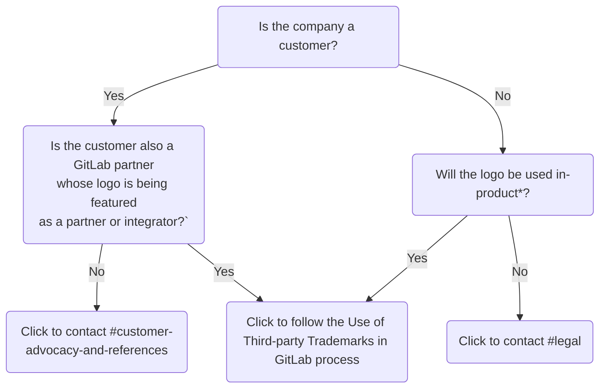

## Scope

These guidelines apply to the use of third-party trademarks in the GitLab product. Use of third-party trademarks on GitLab websites, marketing or sales materials, or in other customer or public-facing materials is not covered by these guidelines. For guidance on using third-party trademarks in such public-facing materials, refer to the [Guidelines for Use of Third-party IP in External Materials](/handbook/legal/ip-public-materials-guidelines/).

Some requests for use of third-party trademarks in the GitLab product will need to be reviewed by the Customer Advocacy Team, while other requests will follow this process and be reviewed by Legal, depending on whether the logo is owned by a GitLab customer/partner and/or if the logo will be used in-product. See the chart below:

`*` *In-product* means that the logo will appear on both GitLab.com and self-managed. If it appears only on GitLab.com, it is not in-product.

## What is a trademark?

Registered trademarks can be unstylized words or letters ("**wordmarks**"), like *GitLab*, or pictures ("**logomarks**"), like the [GitLab Tanuki](https://about.gitlab.com/images/press/logo/png/gitlab-icon-rgb.png). Sometimes, wordmarks and logomarks are combined to create a logo. These guidelines apply to wordmarks, logomarks and logos, but some parts of it only apply to logomarks and logos. For brevity, throughout these guidelines references to *logo* shall be taken to mean both logomark and logo.

Trademarks (including logos, and company, product and service names) are the property of the trademark owner. Using a third-party trademark without the owner's authorisation can constitute trademark infringement and may expose GitLab to liability. Follow these guidelines to minimise the risk of trademark infringement when adding any third-party trademarks to the GitLab product.

## Fair use of third-party trademarks

In certain limited circumstances, use of a trademark is permitted without the authorisation of the owner. This is sometimes referred to as *fair use* of the trademark.

Use of a third-party trademark must meet **all** of the following criteria to constitute *fair use*:

- The company, product or service in question cannot be identified without using the trademark.
- Only so much of the trademark as is necessary to identify the company, product or service is used. This means that using a logo will usually not constitute fair use. For example, you can identify GitLab just by using the wordmark *GitLab*; there is no need to use [GitLab's logo](https://about.gitlab.com/images/press/logo/png/gitlab-logo-gray-rgb.png).
- Use of the trademark does not imply sponsorship or endorsement by the owner.

## Process for adding third-party trademarks to GitLab

Follow these steps when adding new third-party trademarks to GitLab, or intending to use an already approved third-party trademark in GitLab for a new purpose.

1. **Check the proposed use complies with the Dos and Don'ts.**
    - Legal will not approve requests for proposed uses of third-party trademarks that do not comply with the [Dos and Don'ts](/handbook/legal/policies/product-third-party-trademarks-guidelines/#dos--donts-for-use-of-third-party-trademarks-in-gitlab) set out in these guidelines.
1. **Check if the proposed trademark and use have already been approved.**
    - Legal operates a [Third-party Trademark Tracker](https://docs.google.com/spreadsheets/d/1fa4pzDgbtXSbjw1hex-jouoYu_NDwHpwQwJMbcBHmI4/edit?usp=sharing), which details the trademarks and uses which are approved for use in GitLab. Search this tracker to check if the trademark you are proposing to add, and the proposed use, are already approved.
        - If the trademark you are proposing to add has been approved previously, but the proposed use has not, or if the trademark and use have not previously been reviewed, according to the tracker, a new approval is required.
        - If the trademark you are proposing to add and the intended use have already been approved, there is no need to seek legal approval again. If in doubt, reach out to #legal on Slack.
        - If you need to obtain official assets or guidelines for a trademark, consult with legal using the issue created in Step 5 first to determine how to proceed with making the requst.
1. **Consider whether the proposed use constitutes *fair use* or if it is permitted under the trademark owner's published guidelines**.
    - If proposing to add a plain text **wordmark** to GitLab that constitutes *fair use*, legal approval is not required to proceed. The [criteria for fair use](/handbook/legal/policies/product-third-party-trademarks-guidelines/#fair-use-of-third-party-trademarks) are set out in these guidelines above. If unsure whether the proposed use constitutes *fair use*, create a [new legal issue](https://gitlab.com/gitlab-com/legal-and-compliance/-/issues/new?issuable_template=general-legal-template) to discuss this with legal before proceeding.
    - If intending to add a **wordmark** for a purpose that doesn't constitute *fair use*, or intending to use a third party logo in-product, review the trademark owner's published trademark guidelines to determine if this grants GitLab a license to use the trademark, as intended.
        - If the trademark guidelines grant permission to use the trademark as intended, proceed to the next step of this process.
        - If the trademark guidelines do not grant permission to use the trademark as intended, or if unable to locate the trademark guidelines, continue to the next step of this process, and flag this with Legal in the issue you create in step 5 of this process.
1. **Add details of the new trademark, and proposed use, to the tracker**.
    - Before contacting legal in Step 5, add as many details you can about the new trademark, or proposed use, to the [Third-party Trademark Tracker](https://docs.google.com/spreadsheets/d/1fa4pzDgbtXSbjw1hex-jouoYu_NDwHpwQwJMbcBHmI4/edit?usp=sharing).
1. **Create a new third-party trademark approval issue**.
    - Using the [Third-party Trademark Approval issue template](https://gitlab.com/gitlab-com/legal-and-compliance/-/issues/new?issuable_template=thirdparty-trademark-approval), create a new issue to obtain approval from legal for the proposed trademark, or the intended use.
1. **Add the trademark to the SVGs project**.
    - Once legal have approved the use of the trademark, create a merge request adding the `.svg` file of the new trademark to the [SVGs project third-party logos repo](https://gitlab.com/gitlab-org/gitlab-svgs/-/tree/main/illustrations/third-party-logos).
1. **Check for revisions to this process for future requests to use third-party trademarks in-product**
    - Refer back to these guidelines and this process each time you want to add a new third-party trademark to GitLab, or use an existing trademark for a new purpose, to ensure the most up-to-date process is being followed.

## Dos & Don'ts for use of third-party trademarks in GitLab

When using a third-party trademark in GitLab:

Do not:

- Use the trademark as part of the name of a GitLab product, service, or feature. Refer to the [Product Principles](/handbook/product/product-principles/#give-products-and-features-descriptive-not-distinctive-names) for guidance on product and feature naming.
- Use the trademark in a way that implies sponsorship or endorsement by the owner.
- For logos, alter the trademark in any way. If you need to alter the iconography, colour or interaction of a third-party logo to conform to GitLab's CSS, reach out to legal to discuss.
- For logos, combine the trademark with any other symbol, words, image or design.

Do:

- Use the trademark for referential purposes only, i.e. to refer to another company, product, or service, and for no other purpose.
- Review the trademark owner's published trademark guidelines to see if it permits the proposed use, if:
  - the proposed trademark and use have not already been approved by legal, or
  - if the proposed use does not constitute *fair use*.
- For logos, comply with any applicable trademark or brand guidelines, or other terms of use imposed by the trademark owner.
- For logos, obtain the image file from the owner's repository of brand assets or another owner-authorized source. The file format can be changed, or the logo recreated in another file format, provided the result is visually identical to the original.
- For logos, save the image file in the [illustrations/third-party-logos](https://gitlab.com/gitlab-org/gitlab-svgs/-/tree/main/illustrations/third-party-logos) directory in the [gitlab-svgs](https://gitlab.com/gitlab-org/gitlab-svgs) project.
