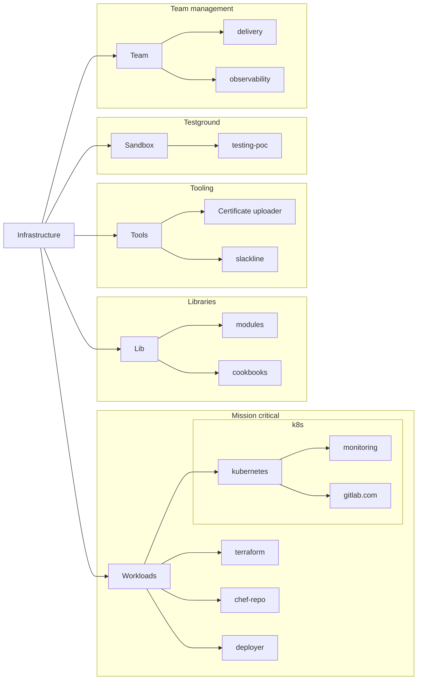

The Infrastructure department uses GitLab projects to operate GitLab.com, and supporting services for GitLab Inc., in addition to [GitLab Engineering projects](/handbook/engineering/projects/).

This page aims to provide a clear definition of a `project`:

1. type
1. data classification
1. canonical and mirror locations
1. ownership and access

## Types

| Type        | Description                                                                                                                                                  |
|-------------|--------------------------------------------------------------------------------------------------------------------------------------------------------------|
| Workload | Projects that span multiple teams/depts, often contain information that can be sensitive, or are mission critical at runtime. Frequently customer impacting. |
| Library     | Projects that support workloads. Generally do not contain sensitive information, but can process sensitive information.  |
| Tooling     | Projects that support automation around library and application management and general day-to-day project maintenance.  |
| Team        | Projects that are supporting team workflows, team automation and processes. |
| Work In Progress | Projects used in a sandbox, proof of concept or one off automation. Cannot process production workloads until graduating to a different type of project.|

## Data Classification

| Name       | Description  |
|------------|--------------|
| Restricted  | Projects contain code/data that can, amongst other things, expose access to individuals that wouldn't have access as part of their role. Access could also aid malicious users in harming company reputation, or if improperly used cause damage to mission critical systems. |
| Private | Projects contain code that can be visible to GitLab team-members and in some cases to wider community. At runtime, they can access or work with sensitive data. |
| Public     | Projects containing code that contains no sensitive data and at runtime does not directly process sensitive data |

## Canonical locations

Infrastructure department workflows are split through a number of GitLab instances that are used both to dogfood our product but also to support our general workflows. In general, we have two instances that are used by the Infrastructure department to support day-to-day workflows:

1. GitLab.com
1. ops.gitlab.net

The Infrastructure department does the necessary work on GitLab.com to organize and plan work.

To operate and run GitLab.com, we use ops.gitlab.net. We use ops.gitlab.net to mirror all required dependencies, but also to run mission critical projects.

Canonical location is chosen based on the following criteria:

| Location   | Description  |
|----------------|-----------|
| GitLab.com     | Synchronization tooling mirrors the project to the second location.  Some sync delay is acceptable, and does not hinder regular work (even if it is causing minor inconvenience to team members). Projects at this location can receive (department) external contributions. |
| ops.gitlab.net | Sync delay and lack of availability of these projects is generally considered unacceptable and can cause GitLab.com degradation. (department) External  contributions are rare.|

## Ownership and access

Project ownership and access is closely tied to data classification and project purpose, as well as the canonical source.

Project ownership should not exclude others from collaborating on the project, where possible. Instead, it should provide widest possible access while respecting project workflows.

Table below shows an illustrative example.

| Canonical location | Type     | Data classification | Access     |
|--------------------|----------|---------------------|------------|
| ops.gitlab.net     | Workload | Restricted          | Department |
| GitLab.com         | Workload | Private             | Company    |
| GitLab.com         | Workload | Public              | Community  |
| ops.gitlab.net     | Library  | Restricted          | Department |
| GitLab.com         | Library  | Public              | Community  |
| GitLab.com         | Tooling  | Public              | Community  |

For example, restricted project classified as a workload on ops.gitlab.net will have access granted to everyone in the department requiring access for their day to day work. However, if this same project does not contain sensitive code that can be safely mirrored to GitLab.com, the project can be fully accessible to the wider community in the mirrored location.

A specific example of a project that fits this description is our `deployer` project. At runtime, this project contains sensitive information since its pipelines connect to the production systems. This is why the project is on ops.gitlab.net and only Infrastructure department has access. The mirror on GitLab.com however, is fully public accessible to everyone due to scripts in this project not containing any sensitive information.

We will be reviewing projects on case by case basis to ensure that [our value of transparency is honored](/handbook/values/#transparency), but also honoring the [values hieararchy](/handbook/values/#hierarchy).

## Workflow

GitLab projects have various features that make our work easier to accomplish. At its core, our workflows usually consist of:

1. Project management - issues, epics, issue boards
1. Code collaboration - merge requests with peer reviews
1. Testing and deployment - CI and CD pipelines

GitLab allows us, with varying levels of complexity, to separate these workflows across different locations to address workflows in a similar way as if the projects are in one location. As an example of a project that has processes sensitive information at runtime, but has code that can be accessible to public, the following GitLab features that can be leveraged to support the workflow can be found in the table below:

|  Resource          |    Canonical           |      Mirror             |
|--------------------|------------------------|-------------------------|
| Instance           | ops.gitlab.net         | gitlab.com              |
| Visibility options | Private/Internal       | Private/Internal/Public |
| Issues             | Disabled               | Enabled                 |
| MRs                | Enabled                | Disabled                |
| Pipelines          | Enabled                | Disabled                |
| Packages           | Enabled                | Disabled                |
| Access             | Least privilege access | Company/Public          |

This means that a project that has a canonical repository on ops.gitlab.net, and has the least privilege access at runtime, can still be public on gitlab.com. The source code can be mirrored to gitlab.com where the Issues can be raised and discussed. Development through MR's that requires CI, and deployment would be only enabled on ops.gitlab.net.
In this example, we show that we can ensure that we can deliver results efficiently and safely, while still being transparent in sharing the code that supports our workflow.

## Project organization in canonical locations

### ops.gitlab.net

The diagram below shows how the Infrastructure department projects are organized on the operations instance.

The top level group is named `Infrastructure` and it contains all projects that the infrastructure department uses for their day to day work. The group is not named `gl-infra` because existing groups already exist with that name, and from the name and the location it is clear that it's related to GitLab.
Access to this group is only granted to the group owners, and instance admins. Access to the subgroups and projects in those subgroups is granted to specific team groups. Individual user accounts are not added to projects/subgroups outside of team groups.

### GitLab.com

The projects currently located on GitLab.com are split across multiple groups/subgroups and individual projects. At the time when this page was introduced, the focus was set on organizing ops.gitlab.net, after which GitLab.com project reorganization would follow.

## Choosing the right project workflow

There are a lot of variables that make up a decision on which workflow is right for a project. While the easiest approach to take would be to have a single workflow for all projects, this approach would be against our [value of Transparency](/handbook/values/#transparency). In the past, we've also taken the approach of making everything public, which was challenging because it prevented us to [deliver results quickly](/handbook/values/#hierarchy) during incidents affecting GitLab.com as a platform, and providing too much public information provided unnecessary negative security exposure.

This section will provide some examples of general workflows and how to approach the decision of classifying a project.

### Mission critical projects with sensitive information

An example of this type of project would be our [Terraform environments](https://ops.gitlab.net/gitlab-com/gl-infra/config-mgmt). This project contains all details of our infrastructure, including instance types, names of service accounts and similar. While those details on their own are not an issue and should not necessarily be private, they make it infinitely easier for a malicious actor to create an attack vector. Additionally, any accidental change has the potential of impacting the platform immediately.

These types of projects should be configured based on the table below:

| Resource   | Canonical              | Mirror     |
|------------|------------------------|------------|
| Instance   | ops.gitlab.net         | gitlab.com |
| Visibility | Internal               | Private    |
| Issues     | Disabled               | Enabled    |
| MRs        | Enabled                | Disabled   |
| Pipelines  | Enabled                | Disabled   |
| Packages   | Enabled                | Disabled   |
| Access     | Least privilege access | Company    |
| Location   | infrastructure/workloads | TBD |

This type of organization allows for the whole company to have access to the source code and provide feedback in issues. Links to MR's need to be manually added by the DRI of the work being done on the canonical repository. At runtime, this type of project will only be accessible to people that need access to do their day to day work.

**IMPORTANT** When a project is classified this way, the project README file has to contain a section answering the question `Why is access to this project limited?`. At any point in time, there should only be a handful of projects fitting this classification.

### Mission critical project sensitive at runtime

An example of this type of project would be our [Kubernetes gitlab.com project](https://ops.gitlab.net/gitlab-com/gl-infra/k8s-workloads/gitlab-com). This project contains code that has some information that can be considered sensitive, but the majority of the information can be public. However, at runtime this project will connect to production sensitive workflows and is likely to interact with admin level tokens. The MR's can technically be worked on in GitLab.com, but since the pipelines are executed on a separate instance, a mistake can cause platform downtime. For this reason, the project should be configured as:

| Resource   | Canonical              | Mirror     |
|------------|------------------------|------------|
| Instance   | ops.gitlab.net         | gitlab.com |
| Visibility | Internal               | Public     |
| Issues     | Disabled               | Enabled    |
| MRs        | Enabled                | Disabled   |
| Pipelines  | Enabled                | Disabled   |
| Packages   | Enabled                | Disabled   |
| Access     | Least privilege access | Company    |
| Location   | infrastructure/workloads | TBD      |

### Projects supporting mission critical workloads

An example of this type of project would be our [omnibus-gitlab cookbook](https://gitlab.com/gitlab-org/cookbook-omnibus-gitlab/). This project supports mission critical workflow because it installs the omnibus-gitlab packages across our infrastructure. At runtime, it is likely that this project will work with sensitive information.
However, sensitivity of this project is only in that it being unavaliable would cause an inconvenience at the time of an operation emergency, which can be resolved by having the project mirror always available. The wider community benefits from this project being available, and will likely contribute fixes as they would be able to leverage the code for their own installation. The project can be configured as follows:

| Resource   | Canonical  | Mirror         |
|------------|------------|----------------|
| Instance   | gitlab.com | ops.gitlab.net |
| Visibility | Public     | Internal       |
| Issues     | Enabled    | Disabled       |
| MRs        | Enabled    | Disabled       |
| Pipelines  | Enabled    | Disabled       |
| Packages   | Enabled    | Disabled       |
| Access     | Public     | Company        |
| Location   | TBD        | infrastructure/lib |

Projects meeting this classification criteria are likely to be public terraform modules, ansible scripts and similar.

### Maintenance tooling and automation projects

An example of this type of project would be our [certificate management](https://gitlab.com/gitlab-com/gl-infra/certificates-updater) set of scripts. This type of project automates our day-to-day functions and is likely to require sensitive resources to operate. However, that is the only sensitivity in the project itself and with careful consideration of the work, issues can be avoided. The wider community might not have direct benefit from seeing the project, but there is also no benefit for keeping the project private. These types of projects can be configured as follows:

| Resource   | Canonical  | Mirror         |
|------------|------------|----------------|
| Instance   | gitlab.com | ops.gitlab.net |
| Visibility | Public     | Internal       |
| Issues     | Enabled    | Disabled       |
| MRs        | Enabled    | Disabled       |
| Pipelines  | Enabled    | Disabled       |
| Packages   | Enabled    | Disabled       |
| Access     | Public     | Company        |
| Location   | TBD        | infrastructure/tools |

### Work in Progress projects

Projects located in the sandbox group are projects that might graduate into one of the above referenced workflows. Proof of concepts, quick scripts for one off migrations, or scripts to support one time maintenance would all belong in this group.

If the project will be reused periodically, it has to be migrated to one of the other groups **before** it is used. This also indicates that the project is going to be maintained by the whole department. Once migrated there, these projects will be treated per classification of that group. Until then, these projects should be on GitLab.com as a canonical location.

### Team projects

Projects in the team group are projects that support specific teams workflows. Status gathering, project triage and similar team facing projects should be added here. Since these projects can contain team sensitive information, their canonical location can be on ops.gitlab.net. This decision is at team's discretion.
