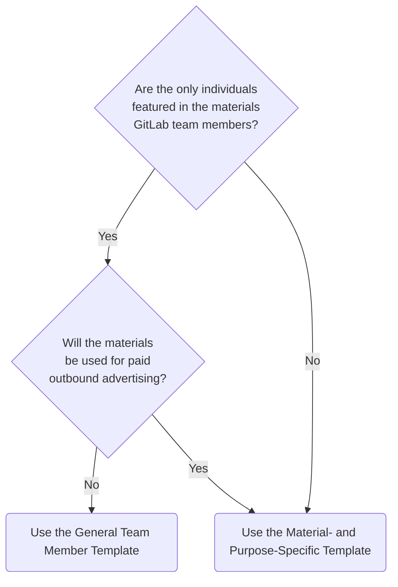

## Is a Publicity Waiver and Release agreement required?

Subject to the exceptions listed below, a Release is required when:

- The name, image, likeness and appearance, voice, or professional biographical information (the "**Likeness**") of any team member, former team member, or non-team member is used in [external](/handbook/legal/materials-legal-review-process/#external-vs-internal-use) materials such that the individual is identifiable.
- Photography or videography by or on behalf of GitLab will take place at an internal or external event, such as a conference.

A Release is **not** required when:

- Using a current team member's name, job title, or photo taken from the [Meet Our Team page](/handbook/company/team/) in [external](/handbook/legal/materials-legal-review-process/#external-vs-internal-use) materials. This does not include the use of a former team member's photo taken from that page.
- Using screenshots of GitLab.com which include a team member's public GitLab profile information, including their name, GitLab username, and avatar.
- Streaming or publishing [AMAs](/handbook/communication/ask-me-anything/), [Key Review](/handbook/company/key-review/) meetings, and [Group Conversations](/handbook/company/group-conversations/) containing the Likeness of team members [publicly](/handbook/marketing/marketing-operations/youtube/#visibility) to GitLab Unfiltered.

## Release templates

If a Release is required, the circumstances dictate which Release templates should be used:

- If you're organising an event at which photography or videography by or on behalf of GitLab will be captured, use the [Event Photography and Videography Likeness Release](./#event-photograph-and-videography-likeness-release).
- For all other circumstances, refer to the diagram below to determine which Release template to use.

## Team Member General Publicity Waiver and Release

Use the Team Member General Publicity Waiver and Release template when the individuals featured in the materials are GitLab team members, and the materials will **not** be used for paid outbound advertising. For materials featuring individuals other than team members, and materials that will be used in paid outbound advertising, use the [Material- and Purpose-specific Publicity Waiver and Release](./#material--and-purpose-specific-publicity-waiver-and-release) instead.

Each team member need only sign the Team Member General Publicity Waiver and Release once.

{}

1. Search the [GitLab Team Member General Publicity Waiver and Release Tracker](https://docs.google.com/spreadsheets/d/1fOENNDeCoAzXSdHIcD7GGJnwpUYL1qlqzwB1WbHrdlg/edit#gid=249560389) to determine whether a Release is already in place with the team members featured in the materials. If a Release is in place with all team members featured, no further action is required as the requisite Releases are already in place.
1. If no Release is in place, send the [Team Member General Publicity Waiver and Release form](https://docs.google.com/forms/d/1QACcbwfmEZzGSvBQ-UzPtQjsgduSxy5B5cV-C0DUmWs/edit) to all team members feaured in the materials.
1. Team members featured in the materials review the Release and complete the form.
1. Once all team members featured in the materials have completed the form accepting the Release, verify this in the [Tracker](https://docs.google.com/spreadsheets/d/1fOENNDeCoAzXSdHIcD7GGJnwpUYL1qlqzwB1WbHrdlg/edit#gid=249560389).
{}

## Material and Purpose Specific Publicity Waiver and Release

Use the Material- and Purpose-specific Publicity Waiver and Release template for materials featuring individuals who are no GitLab team members, or for materials featuring individuals that will be used for paid outbound advertising. For materials that will not be used for paid outbound advertising and feature only GitLab team members, use the [Team Member General Publicity Waiver and Release](./#team-member-general-publicity-waiver-and-release) instead.

{}

1. If you don't have DocuSign access, open an [Access Request](/handbook/business-technology/end-user-services/onboarding-access-requests/access-requests/) to get it.
1. Once you has DocuSign access, access the [Material- and Purpose-specific Publicity Waiver and Release template](https://app.docusign.com/templates/details/0716de66-3f1e-4969-b305-4562b9af665d).
1. Click `USE`.
1. On the `Recipients` page:
   - Under `DRI`, enter your name and GitLab email address;
   - Under `Signatory` enter the name and email address of the individuals featured in the materials who needs to sign the Release; and
   - Under `Email Message`, enter a message to the signatory explaining the purpose of the Release and asking them to sign it.
1. Click `ADVANCED EDIT`.
1. On the following page, click `NEXT`.
1. On page 2 of the Release, you as the DRI, complete the definition of `Materials`:
    - Describe the specific topic(s) that the materials covers, e.g., "Video: Jane Doe discusses the topic, "Explaining Kubernetes."
1. On page 2 of the Release, you as the DRI, complete the definition of `Authorized Purposes`:
    - All purposes
    - Describe a specific purpose, e.g., "Video: For use in 2022 - 2023 Partner campaigns." (Note that if you include a specified purpose, the material can only be used for the specific purpose, and no other.)
1. Click `SEND`.
1. You will be notified by email when the Signatory has signed the Release.
1. Upload the signed Release to the relevant issue.  If there's no issue, send a copy of the signed Release to intellectualproperty@gitlab.com.
1. Repeat this process for each individual appearing in the materials. If you need to obtain Releases for the same materials from 10 or more individuals, reach out to [#legal in Slack](https://app.slack.com/client/T02592416/C78E74A6L) to discuss bulk sending.
{}

## Event Photography and Videography Likeness Release

When capturing photos or video at events, don't capture attendee name badges, or blur them where they appear.

For internal and external events at which photography or videography by or on behalf of GitLab will be captured, include the [Event Photography and Videography Likeness Release](https://docs.google.com/document/d/11ihdyShiPngTZg9gtl2LvoU6Uixp2ohEE5mVQEv18NM/edit) Registration form language as a provision in the event registration terms and conditions, ensuring you have first completed the yellow-highlighted fields.

In addition, place [Notice of Photography and Filming posters](https://docs.google.com/document/d/11ihdyShiPngTZg9gtl2LvoU6Uixp2ohEE5mVQEv18NM/edit#bookmark=id.9bgkjm7gij8e) throughout the event space, or at the GitLab booth as appropriate, to notify attendees that photography and filming are taking place.
