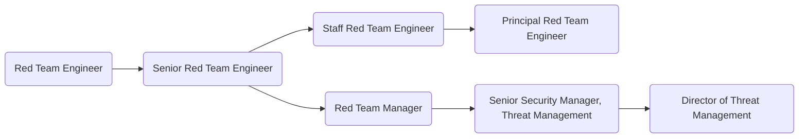

As members of GitLab's [Threat Management sub department](/handbook/security/threat-management/), the [Red Team](/handbook/security/security-operations/red-team/) conducts security exercises that emulate real-world threats. We do this to help assess and improve the effectiveness of the people, processes, and technologies used to keep our organization secure.

The Red Team does not perform penetration tests, and the work we do is not focused on delivering a list of vulnerabilities in a specific application or service. Instead, we emulate the real-world tactics, techniques, and procedures (TTPs) of threats that are most relevant to our organization.

GitLab's environment is very different than traditional organizations, and attacking it takes creativity. There are no wireless corporate networks to sniff, there is no Active Directory to roast, and you won't find a single hash being passed. To be successful on our Red Team, you must be able to adapt traditional attack techniques to an all-remote, all-cloud, and SaaS-based environment.

Our Red Team works **together** with our Blue Team. Even when planning attacks, we are collaborating to make these attacks more difficult to succeed. Our ultimate goal is never to successfully attack a system, but instead to help ensure our organization is prepared when that attack becomes a reality.

## Responsibilities

- Maintain a deep understanding of GitLab's product offerings, how they work, and how they could be attacked or abused
- Propose, plan, and execute [Red Team operations](/handbook/security/security-operations/red-team/#what-the-red-team-does) based on realistic threats to the organization
- Automate attack techniques, creating custom tooling for specific operations and contributing to general-purpose open source tools
- Write detailed reports covering the goals and outcomes of Red Team operations, including significant observations and recommendations
- Collaborate with GitLab's [Security Incident Response Team (SIRT)](/handbook/security/security-operations/sirt/) to improve detection and response capabilities
- Collaborate with GitLab's [Infrastructure Security Team](/handbook/security/product-security/infrastructure-security/) to propose defensive improvements to cloud environments
- Collaborate across multiple product teams to propose enhancements and additions to GitLab's SaaS and self-hosted offerings
- Collaborate with non-technical teams to propose process and policy enhancements and additions
- Stay informed on current security trends, advisories, publications, and academic research that is relevant our organization

## Requirements

- Ability to use GitLab
- Understanding of the MITRE ATT&CK framework
- Ability to automate tasks by writing basic scripts/programs - we often use Python and Go
- Ability to read and understand multiple programming languages, especially Ruby and Go
- Command-line experience with Linux-based operating systems
- Experience exploiting vulnerabilities in at least two of the following areas:
  - Web applications
  - Cloud environments (GCP / AWS)
  - Linux and/or MacOS workstations
  - Software supply chain
- Basic hands-on experience with at least one of the major cloud providers (GCP, AWS, Azure)
- An adversarial mindset - you must be able to put yourself in the mind of the attacker
- Excellent and professional communication skills (written and verbal) with an ability to articulate complex topics in a clear and concise manner

## Levels

### Red Team Engineer (Intermediate)

This position reports to the [Manager, Red Team](#manager-red-team).

#### Red Team Engineer (Intermediate) Job Grade

The Red Team Engineer is a [grade 6](/handbook/total-rewards/compensation/compensation-calculator/#gitlab-job-grades).

#### Red Team Engineer (Intermediate) Responsibilities

- Includes [base-level responsibilities](#responsibilities).

#### Red Team Engineer (Intermediate) Requirements

- Includes [base-level requirements](#requirements).

### Senior Red Team Engineer

This position reports to the [Manager, Red Team](#manager-red-team).

#### Senior Red Team Engineer Job Grade

The Senior Red Team Engineer is a [grade 7](/handbook/total-rewards/compensation/compensation-calculator/#gitlab-job-grades).

#### Senior Red Team Engineer Responsibilities

- Includes [base-level responsibilities](#responsibilities).
- Deploy and manage attack infrastructure for stealth operations
- Create and deliver short video summaries of completed Red Team operations
- Publish blogs on offensive-security topics
- Teach and mentor other engineers, within the Red Team and beyond
- Participate in candidate interviews during the hiring process

#### Senior Red Team Engineer Requirements

- Includes [base-level requirements](#requirements).
- Several years experience conducting adversary-emulation exercises
- Deep knowledge of the MITRE ATT&CK framework
- Experience deploying, managing, and operating a Command & Control (C2) framework
- Senior-level command-line skills with Linux-based operating systems
- Senior-level technical skills in one or more of the following:
  - CI/CD and software supply-chain exploitation
  - Google Cloud administration and exploitation
  - MacOS administration and exploitation

### Staff Red Team Engineer

This position reports to the [Manager, Red Team](#manager-red-team).

#### Staff Red Team Engineer Job Grade

The Staff Red Team Engineer is a [grade 8](/handbook/total-rewards/compensation/compensation-calculator/#gitlab-job-grades).

#### Staff Red Team Engineer Responsibilities

- Includes [Senior-level responsibilities](#senior-red-team-engineer-responsibilities)
- Identify new Red Team open source project opportunities and internal tooling needs
- Identify areas of Red Team process improvement (efficiency, automation)
- Collaborate closely with defensive and infrastructure teams
- Show thought leadership both internally at GitLab and externally with the general community
- Follow up team OKRs and take ownership to drive some to completion

#### Staff Red Team Engineer Requirements

- Includes [Senior-level requirements](#senior-red-team-engineer-requirements)
- Strong knowledge of the GitLab application and its components
- Experience designing/creating automation using well known tools/pipelines
- Profound knowledge of exploit techniques, and common TTPs
- Senior knowledge of one or more programming or scripting languages
- Extensive knowledge of offensive cloud security and common vulnerabilities

### Principal Red Team Engineer

Refer to the "[Principal Security Engineer](../security-engineer/#principal-security-engineer)" description.

### Manager, Red Team

This position reports to the [Senior Manager, Red Team](#senior-manager-red-team).

#### Manager, Red Team Job Grade

The Red Team Manager is a [grade 8](/handbook/total-rewards/compensation/compensation-calculator/#gitlab-job-grades).

#### Manager, Red Team Responsibilities

- Hire a world class team of security engineers to work on their team
- Help their team grow their skills and experience
- Provide input on security architecture, issues, and features
- Hold regular 1:1's with all members of their team
- Create a sense of psychological safety on their team
- Be your team's role model in terms of positive thinking, de-escalating conflict, and taking time off
- Identify the need to, and drive the implementation of security-related technical and process improvements
- Author project plans for security initiatives
- Draft and succesfully deliver quarterly OKRs
- Train team members to screen candidates and conduct managerial interviews
- Draft and deliver operation reports and hold retrospectives
- Build a substantial, collaborative partnership with Legal, Infrastructure, Alliances, and Product teams
- Draft and present findings from Red Team operations to relevant stakeholders and business owners

#### Manager, Red Team Requirements

- Proven track record as a member of offensive security, security research, or similar teams
- Experience with leading security teams
- Experience with working at a SaaS, or product company
- Willingness to be part of the Security Manager on-call rotation
- Robust sense of ownership, urgency, and drive
- Excellent written and verbal communication skills, especially experience with executive-level communications
- Capability to make sound decisions in the face of ambiguity and imperfect knowledge
- Willingness to be part of the Security Manager On-Call rotation
- First hand experience with major cloud providers - GCP, AWS, Azure, Digital Ocean
- Share our [values](/handbook/values/), and work in accordance with those values
- Alignment with Manager responsibilities as outlined in [Leadership at GitLab](/handbook/company/structure/#management-group)

### Senior Manager, Red Team

This role extends the Security Incident Response Team Manager role by adding vision and strategy. It consolidates all SIRT teams' efforts and drives them towards a set of strategic goals. The Senior Manager, Red Team reports to the [Director of Security Operations](/job-families/security/security-leadership/#director-security-operations).

#### Senior Manager, Red Team Job Grade

The Security Incident Response Team Senior Manager is a [9](/handbook/total-rewards/compensation/compensation-calculator/#gitlab-job-grades).

#### Senior Manager, Red Team Responsibilities

- Extends Manager, Red Team responsibilities, plus;
- Provide tactical oversight of the teams' daily efforts
- Maintain vision for the teams' immediate and near-term future
- Develop and maintain teams' KPIs
- Be your teams' role model in terms of positive thinking, de-escalating conflict, and taking time off
- Help teams prioritise efforts and ensure they align with the overall direction of the company
- Draft and successfully deliver on quarterly OKRs
- Train team members to screen candidates and conduct managerial interviews
- Build a substantial, collaborative partnership with peers from Legal, Infrastructure, Alliances, and Product departments
- Take the role of an Incident Manager during larger security events not necessarily related to Red Team efforts
- Take part in the Security Escalation On-Call rotation

#### Senior Manager, Red Team Requirements

- Experience with leading people managers
- Experience with leading Security or security-focused Site Reliability teams
- Experience with working at a SaaS, or product company
- Excellent written and verbal communication skills, especially experience with executive-level communications
- Capability to make concrete progress in the face of ambiguity and imperfect knowledge
- Being comfortable with rapid context switching
- Willingness to be part of the Security Escalation On-Call rotation
- Robust understanding of security issues, mitigations, and a solid grasp of the current global threat landscape
- Experience with the role of an incident manager during large scale security events
- Familiarity with major cloud providers - GCP, AWS, Azure, Digital Ocean
- You share our [values](/handbook/values/), and work in accordance with those values
- Alignment with Manager responsibilities as outlined in [Leadership at GitLab](/handbook/company/structure/#management-group)

## Performance Indicators

- Improve the security posture of the organisation by [executing operations that mimic real-world adversaries](/handbook/security/performance-indicators/).

### Career Ladder

For details on the Security organization leadership roles, to include the Director of Threat Management and VP of Security, see the Security Leadership page.

## Hiring Process

Candidates for this position can expect the hiring process to follow the order below. Please keep in mind that candidates can be declined from the position at any stage of the process. To learn more about someone who may be conducting the interview, find their job title on our [team page](/handbook/company/team/).

- Qualified candidates will be invited to schedule a 30 minute [screening call](/handbook/hiring/interviewing/#screening-call) with one of our Global Recruiters.
- Next, candidates will be invited to schedule an interview with Red Team Manager
- Candidates will then be invited to schedule an interview with Senior Red Team Engineer, Security Incident Response Team Manager, Trust & Safety Manager
- Candidates will then be invited to schedule an interview with Director of Security Operations
- Successful candidates will subsequently be made an offer via email

Additional details about our process can be found on our [hiring page](/handbook/hiring/).
