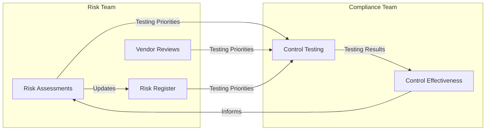

## On this page

- [Overview](#overview)
- [Risk-Based Control Testing](#risk-based-control-testing)
- [Evolution of Our Approach](#evolution-of-our-approach)
- [Industry Validation](#industry-validation)
- [Risk and Compliance Collaboration](#risk-and-compliance-collaboration)
- [Impact on External Audits and Regulatory Compliance](#impact-on-external-audits-and-regulatory-compliance)
- [Additional Resources](#additional-resources)

## Overview

Risk-based compliance is our strategic approach to using risk intelligence for informing compliance activities and testing priorities, rather than treating all compliance requirements equally. At GitLab, we sometimes also refer to this as risk-based control testing to differentiate the ongoing continuous monitoring of our SaaS platforms to maintain our certifications/attestations. This strategy recognizes that not all systems, vendors, or controls carry the same level of risk to the organization.

## Risk-Based Control Testing

Risk-based control testing focuses on evaluating the effectiveness of internal controls based on the risk they mitigate. By concentrating on controls associated with higher-risk functions, we ensure critical controls are functioning properly without expending unnecessary resources on lower-risk functions.

### Key Aspects

1. **Control Identification:** Determining which controls are in place to mitigate identified risks
1. **Testing Prioritization:** Allocating testing efforts to controls that address the most significant risks
1. **Evidence Collection:** Gathering sufficient evidence to assess control effectiveness, with more rigorous testing for higher-risk controls

## Evolution of Our Approach

While achieving and maintaining certifications for our SaaS platforms remains a core priority of our team, an effective security compliance program must look beyond certifications and audit results. Some of our most sensitive data and critical systems fall outside traditional compliance boundaries. This reality demands that our security policies, standards, and best practices are implemented comprehensively across the enterprise.

With finite resources, we've adopted a risk-based framework to optimize our efforts. This approach enables us to:

- Maintain our certification requirements
- Ensure proper safeguards for our [crown jewels](https://internal.gitlab.com/handbook/security/security_operations/threat_intelligence/crown-jewels/) as well as [customer (RED) data](/handbook/security/standards/data-classification-standard/#red)
- Allocate resources based on actual risk exposure
- Adapt quickly to emerging threats and changes in our environment

This evolution from traditional compliance to risk-based compliance reflects our commitment to meaningful security outcomes rather than just "checking boxes" for auditors.

## Industry Validation

Industry trends and best practices supporting this shift include:

- Moving away from checkbox compliance toward risk-informed testing
- Increasing use of automated continuous control monitoring
- Greater emphasis on data-driven prioritization
- Organizations increasingly adopting risk-based approaches to compliance management
- Development of shared risk/compliance taxonomies
- Regular joint risk-compliance working sessions

## Risk and Compliance Collaboration

A beautiful synergy and feedback loop is created when Risk and Compliance collaborate together. Although we are completely separate teams with separate focuses, a risk-based compliance program allows us to:

- Establish formal coordination processes
- Share data and insights systematically
- Perform regular joint reviews of findings
- Provide unified reporting to leadership

### Feedback Loop

#### Risk Team's Input to Compliance

- [Risk assessments](/handbook/security/security-assurance/security-risk/storm-program/#risks-identified-during-risk-assessments) identify highest operational risks (testing priorities)
- [TPRM Assessments](/handbook/security/security-assurance/security-risk/third-party-risk-management/#procedures) highlight critical third-party relationships
- [Risk Register](https://gitlab.com/gitlab-com/gl-security/security-assurance/security-risk-team/storm-risk-register/-/issues) provides thematic view of operational risk across the organization

#### Compliance Team's Input to Risk

- Control testing results identify gaps and weaknesses
- Compliance findings map back to Risk Register items including [risk treatment plans](/handbook/security/security-assurance/security-risk/storm-program/#remediate-the-risk)
- Testing coverage data informs [risk response decisions](/handbook/security/security-assurance/security-risk/storm-program/#risk-response)
- Control effectiveness metrics are leveraged as Key Risk Indicators (KRIs) in [Quarterly Risk Reporting](/handbook/security/security-assurance/security-risk/storm-program/#storm-reporting-schedule)

### Benefits of Integration

- More efficient resource allocation focused on highest-risk functions
- Agility to quickly adapt to evolving threats and regulatory changes
- Stronger justification for compliance activities
- Better data to drive risk reporting accuracy and inform risk decision-making
- More comprehensive view of organizational security posture
- Reduced redundancy in assessment activities

## Impact on External Audits and Regulatory Compliance

Our risk-based compliance program complements rather than conflicts with our formal audit and certification obligations. This approach is carefully designed to enhance our security posture while maintaining clear boundaries around regulated activities.

We maintain strict separation between:

- SOX compliance activities and associated Section 302 reporting
- Existing certification and attestation requirements (SOC 2, ISO 27001, etc.)
- Risk-based compliance activities focused on enterprise security

By explicitly excluding systems and controls in scope for SOX and other certifications/attestations from our testing scope, we ensure our risk-based testing does not interfere with or create confusion around formal audit activities. We maintain distinct documentation, testing schedules, and reporting processes for each domain.

Our findings and metrics remain internal to the security organization and inform our continuous improvement efforts. They are not:

- Reported to internal audit
- Shared with external auditors
- Used for regulatory compliance purposes
- Included in formal attestations

Note: While our program's findings are for internal security use, standard incident reporting obligations remain in effect should any testing identify an active security incident.

## Additional Resources

The Security Compliance team maintains details on how we execute this program in our [team issue tracker](https://gitlab.com/gitlab-com/gl-security/security-assurance/security-compliance/team). There you can learn how we:

- Prioritize which systems and applications to test
- Determine which controls are important
- Collaborate with [Security Risk](/handbook/security/security-assurance/security-risk/)
- Share inputs and outputs between teams
