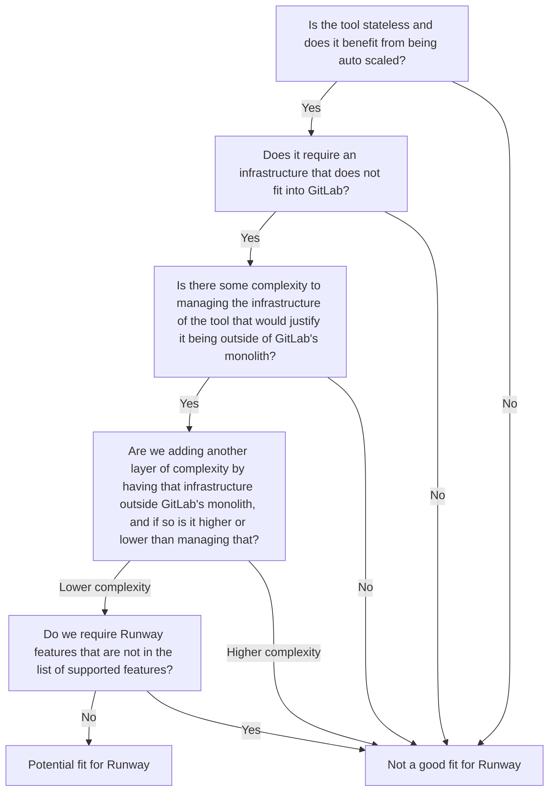

## Runway tooling guidelines

This runbook is intended to help determine whether a tool is a good fit for [Runway](/handbook/engineering/infrastructure/platforms/tools/runway.md). In certain cases, it may be beneficial to use Runway to ease [tooling integration work](/handbook/security/product-security/security-platforms-architecture/product-security-engineering/_index.md#tooling-integration-work).

## What is Runway ?

The [proposal of the design document](/handbook/engineering/architecture/design-documents/runway/#proposal) sums up what Runway seems to be today:

> Runway is a means for deploying a service, packaged up as a Docker image to a production environment. It leverages GitLab CI/CD as well as other GitLab product features to do this.

## Why Runway?

The [executive summary](/handbook/engineering/architecture/design-documents/gitlab_ml_experiments/) of the Runway blueprint gives a good explanation on the motivation behind it.

> This document proposes a service-integration approach to setting up infrastructure to allow teams within GitLab to build new application features that leverage AI, ML, and data technologies at a rapid pace. [...] The current application architecture runs most GitLab application features in Ruby. However, many ML/AI experiments require different resources and tools, implemented in different languages, with huge libraries that do not always play nicely together, and have different hardware requirements. Adding all these features to the existing infrastructure will increase the size of the GitLab application container rapidly, resulting in slower startup times, increased number of dependencies, security risks, negatively impacting development velocity, and increasing complexity due to different hardware requirements. As an alternative, the proposal suggests adding services to avoid overloading GitLabs main workloads. These services will run independently with isolated resources and dependencies. By adding services, GitLab can maintain the availability and security of GitLab.com, and enable engineers to rapidly iterate on new ML/AI experiments.

If we extract away the ML/AI parts to any tools that requires different resources and tools than Ruby for its function, it becomes clear that an advantage of Runway is being able to use different technologies than what is typically used within GitLab when appropriate.
The goals section of the design document of Runway gives the following:

> Development teams aiming to deploy their service without having to worry too much about managing the infrastructure, scaling, monitoring.
> We are focusing on satellite services that are stateless and thus can be autoscaled to meet demand.
> We aim to integrate with existing GitLab features and tooling to provide a streamlined experience.

The following list of questions can help determine if a tool may be a potential fit for Runway:

1. Is the tool stateless and does it benefit from being auto scaled?
1. Does it require an infrastructure that does not fit into GitLab?
1. Is there some complexity to managing the infrastructure of the tool that would justify it being outside of GitLab's monolith?
1. Are we adding another layer of complexity by having that infrastructure outside GitLab's monolith, and if so is it higher or lower than managing that?
1. Do we require Runway features that are not in the list of [supported features](https://docs.runway.gitlab.com/welcome/supported-features/)?
1. In terms of [tooling handover](/handbook/security/product-security/security-platforms-architecture/product-security-engineering/_index.md#tooling-handover-epics), does the team have any experience with Runway and are they willing to take it over if it is deployed using that method?

Which can be visualized as the following mermaid diagram:

## How to start with Runway?

If the [Candidate Services for Runway Deployment issue](https://gitlab.com/gitlab-com/gl-infra/platform/runway/team/-/issues/48) is still around, comment on it and set up a chat with the team to discuss whether Runway would actually be a good fit for the intended purpose. Then the [docs](https://docs.runway.gitlab.com/guides/onboarding/) offer a good onboarding guide to get started.

A conversation should be started with the team that will own the tool down the road about using Runway as a tool as part of the [tooling handover epic](/handbook/security/product-security/security-platforms-architecture/product-security-engineering/_index.md#tooling-handover-epics).
