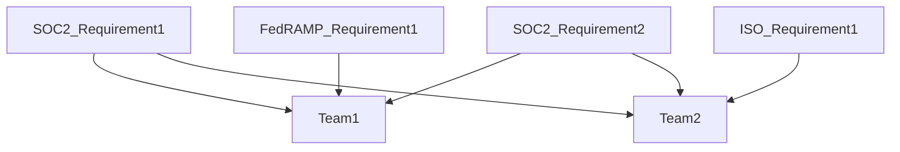
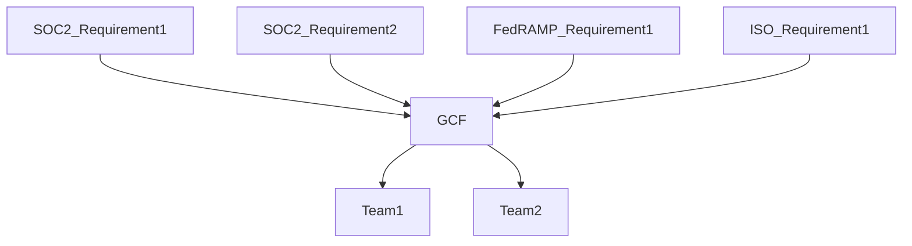

Security controls are a way to state our company's position on a variety of security topics. It's not enough to simply say "We encrypt data" since our customers and teams will naturally want to know "what data do we encrypt?" and "how do we encrypt that data?". When all of our established security controls are operating effectively this creates a security program greater than the sum of its parts. It demonstrates to our stakeholders that GitLab has a mature and comprehensive security program that will provide assurance that data within GitLab is reasonably protected.

## GitLab Control Framework (GCF)

We have tried to take a comprehensive approach to our immediate and future security compliance needs. Older and larger companies tend to treat each security compliance requirement individually which results in independent security compliance teams going out to internal teams with multiple overlapping requests. For example, at such a company you might have one database engineer that is asked to provide evidence of how a particular database is encrypted based on SOC2 requirements, then again for ISO requirements, then again for FedRAMP requirements. This approach can be visualized as follows:

Given our [efficiency value](/handbook/values/#efficiency) here at GitLab we wanted to create a set of security controls that would address multiple underlying requirements with a single security control which would allow us to make fewer requests of our internal teams and efficiently collect all evidence we would need for a variety of audits at once. This approach can be visualized as follows:

As our security compliance goals and requirements have evolved so have our requirements and constraints related to our security control framework. Our GCF is currently based on NIST SP 800-53.

## Security Control Lifecycle

The lifecycle of our security controls can be found at [this handbook page](). As part of the security control lifecycle, all GCF security controls are reviewed and tested at a minimum on an annual basis or as required by regulation.

GCF security controls are assessed at the entity level or the system level depending upon the nature of the control.

GCF security controls assessed at system level are based upon the system's [critical system tiering](). Dependent upon the system's tier, a subset of GCF controls are evaluated based upon overall risk and impact to the organization. This is broken out as follows:

|Tier |     GCF Control Scope |     Hyperproof Link|
|--|--|--|
|Tier 0 Entity|Entity-Level Controls| [Link](https://hyperproof.app/org/d7c741c0-4cdc-11ee-b76d-562ad257a689/controls?filters=cf-f6f3a9aa-9dd6-11ee-92d4-760afca11dae%3DTier%25200%2520Entity&sortGridBy=scopeName&view=grid)|
|Tier 1 Mission Critical|All "In-Scope" System-Level Controls| [Link](https://hyperproof.app/org/d7c741c0-4cdc-11ee-b76d-562ad257a689/controls?filters=cf-f6f3a9aa-9dd6-11ee-92d4-760afca11dae%3DTier%25201%2520Mission%2520Critical&sortGridBy=scopeName&view=grid)|
|Tier 2 Business Critical|Subset of System-Level Controls| [Link](https://hyperproof.app/org/d7c741c0-4cdc-11ee-b76d-562ad257a689/controls?filters=cf-f6f3a9aa-9dd6-11ee-92d4-760afca11dae%3DTier%25202%2520Business%2520Critical&sortGridBy=scopeName&view=grid)|

## Control Ownership

Control Owner - Ensures that the design of the control and the control activities operate effectively and is responsible for remediation of any control activities that are required to bring that control into a state of audit-readiness.

Process Owner - Supports the operation of the control and carries out the process designed by the control owner. The process owner is most likely to be interviewed by an auditor to determine whether or not the process is operating as intended.

## Security Control Changes

The GitLab Security Compliance team is responsible for ensuring the consistency of the documentation of the security controls listed below. While normally we welcome any GitLab team member to make edits to handbook pages, please be aware that even small changes to the wording of any of these controls impacts how they satisfy the requirements for the security frameworks they map to. Because of this, we ask any changes that need to be made to this page and the underlying guidance pages to start with a message in the [#sec-assurance](https://slack.com/app_redirect?channel=sec-assurance) slack channel. The compliance team will then engage with you and make any appropriate changes to these handbook pages.

## GitLab IT General Controls (ITGCs)

ITGCs are a subset of the GCF controls. Please refer to [GitLab SOX ITGC Compliance](https://internal.gitlab.com/handbook/finance/sox-internal-controls/) (internal only) for details.

## Security System Intake

To assess newly acquired/developed systems that enable security controls OR are/may be in scope for compliance programs for potential inclusion into our [GitLab Control Framework (GCF)]() and compliance programs  (e.g., [Security Compliance Program]() and [SOX Program](/handbook/internal-audit/sarbanes-oxley/)).

### 1. System identification

Our goal is to identify systems that enable security controls (e.g., access management system) OR systems that are (or may be) subject to regulatory (e.g., SOX) or compliance requirements (SOC2) as early as possible. As we develop new features/systems and engage with third parties for services, we assess the use of the system and whether or not it meets the criteria described above. Existing systems can also be ingested into the Security Compliance Intake process. Examples of these could include systems whose functionality has expanded to support security controls or instances where our understanding of a security control has improved resulting in the identification of a previously uncredited supporting system.

If the system meets the criteria, we open up a new [Security Compliance Intake Issue](https://gitlab.com/gitlab-com/gl-security/security-assurance/security-compliance-commercial-and-dedicated/security-compliance-intake/-/issues/new?issue[title]=System%20Intake:%20%5BSystem%20Name%20FY2%23%20Q%23%5D&issuable_template=intakeform).

### 2. Creating Security Compliance Intake Issue

[Security Compliance Intake Issue](https://gitlab.com/gitlab-com/gl-security/security-assurance/security-compliance-commercial-and-dedicated/security-compliance-intake/-/issues/new?issue[title]=System%20Intake:%20%5BSystem%20Name%20FY2%23%20Q%23%5D&issuable_template=intakeform) asks the author to include details related to the system including:

- System overview
- Implemented security controls or impacted regulatory or compliance program
- Link to TPRM reviews or Production Readiness reviews
- [Critical System Tier]() (CST)
- Key Contact Details
- Deployment model and implementation status
- Data classification
- Regulatory scope (supported by Security Compliance and [Internal Audit](/handbook/internal-audit/))
The author of the issue completes as much of the issue as they can and assigns it to the Security Risk team for completion/triage (if the issue is not originally created by the Security Risk team).

### 3. Security Compliance workflow

Once the Security Compliance Intake issue is populated, Security Risk assigns the issue to the Security Compliance team to complete the following tasks to incorporate the system into our Security Compliance Program:

- Notify stakeholders and system owners of upcoming testing requirements
- Incorporate testing requirements (driven by CST and regulatory/compliance requirements) and recommendations into the fiscal year audit schedule
- Determine when [user access reviews]() for the new system need to start and communicate to compliance teams

## NIST 800-53

The GCF is based on a subset of NIST SP 800-53 security and privacy controls (common controls), which are mapped to other control frameworks, standards, and regulations.

For full control descriptions where they have yet to be completed OR where full details of the control are required, please visit the corresponding control page on the [official NIST page](https://csrc.nist.gov/projects/cprt/catalog#/cprt/framework/version/SP_800_53_5_1_0/home)

Note: In some instances, GitLab has created custom controls for the GCF which expand upon the NIST framework. GitLab has applied the NIST naming convention to these controls for ease of control family grouping. If you cannot find corresponding NIST control guidance for a GCF control on the [official NIST page](https://csrc.nist.gov/projects/cprt/catalog#/cprt/framework/version/SP_800_53_5_1_0/home), it's likely a custom control. Please reach out to #sec-assurance in Slack for any questions regarding any controls.

## References

<a href="" class="btn bg-primary text-white btn-lg">Return to the Security Compliance</a>
