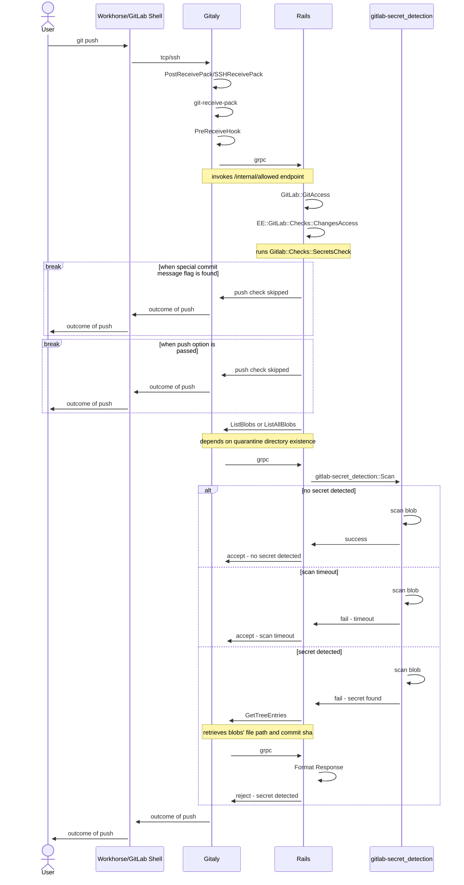

### When to use this runbook?

This runbook is intended to be used when monitoring the [secret push protection](https://docs.gitlab.com/ee/user/application_security/secret_detection/pre_receive/index.html) feature to identify and mitigate any reliability issues or performance regressions that may occur when it is enabled on Gitlab.com. The runbook can also be used to understand more about relevant dashboards below and how to improve them:

* [Secret Push Protection – Overview Dashboard](https://dashboards.gitlab.net/d/fdk7i56zibv28d/secret-push-protection-e28093-overview?orgId=1)

### What to monitor?

While the feature, in its [current form](https://docs.gitlab.com/ee/architecture/blueprints/secret_detection/#high-level-architecture), doesn't have any external components and is entirely encapsulated within the application server as a dependency, it does interact with a number of components as can be seen in this [push event sequence diagram](https://docs.gitlab.com/ee/architecture/blueprints/secret_detection/#push-event-detection-flow). Those components are:

* GitLab Shell (Git over SSH):
  * `git-receive-pack`
* Workhorse (Git over HTTP/S):
  * `git-receive-pack`
* Gitaly:
  * `SSHReceivePack`
  * `PostReceivePack`
  * `PreReceiveHook`
  * `ListAllBlobs()` RPC
  * `ListBlobs()` RPC
  * `GetTreeEntries()` RPC
* Rails:
  * `/internal/allowed` Endpoint

Below is a sequence diagram showing the entire workflow whether a `git push` takes place over HTTP or SSH:



_Note: `PreReceiveHook` is not to be confused with git's [pre-receive hook](https://git-scm.com/docs/githooks#pre-receive). In fact, the former is a [binary wrapper](https://gitlab.com/gitlab-org/gitaly/-/tree/master/cmd/gitaly-hooks) around the actual git hook. Please read more about the [hook setup](https://gitlab.com/gitlab-org/gitaly/-/blob/master/doc/hooks.md#hook-setup) in Gitaly's documentation._

These components are therefore the main elements we are trying to focus on when monitoring the feature.

### How we monitor the feature?

As discussed above, the functionality spans a number of components. Therefore, are three main tools we could use for monitoring the feature:

* Kibana (Logs)
  * [Staging](https://nonprod-log.gitlab.net)
    * `pubsub-rails-inf-gstg`
    * `pubsub-gitaly-inf-gstg`
    * `pubsub-workhorse-inf-gstg`
    * `pubsub-shell-inf-gstg`
  * [Production](https://log.gprd.gitlab.net)
    * `pubsub-rails-inf-gprd`
    * `pubsub-gitaly-inf-gprd`
    * `pubsub-workhorse-inf-gprd`
    * `pubsub-shell-inf-gprd`
* Prometheus/Grafana (Metrics)
  * [Internal API](https://dashboards.gitlab.net/dashboards/f/internal-api/internal-api)
  * [Gitaly](https://dashboards.gitlab.net/dashboards/f/gitaly/gitaly-service)
  * [GitLab Shell](https://dashboards.gitlab.net/d/git-main/git3a-overview)
* Sentry (Error Tracking)
  * [Gitlab.com](https://new-sentry.gitlab.net/organizations/gitlab/projects/gitlabcom)
  * [Gitaly](https://new-sentry.gitlab.net/organizations/gitlab/projects/gitaly)
  * [Workhorse](https://new-sentry.gitlab.net/organizations/gitlab/projects/workhorse-gprd)

This runbook focuses primarly on the Prometheus metrics available in Grafana, but also shares brief information about other tools and how they could be used. In later iterations, this may change as the feature grows and develops.

### How to check the logs emitted from the feature?

To check the logs emitted from the feature, please look at the following Kibana views:

* 📖 [Kibana: Logs for all scans](https://log.gprd.gitlab.net/app/discover#/view/31afcbb2-28e9-466f-a6c3-486e869e1ee3).
* 📖 [Kibana: Logs for blocked pushes](https://log.gprd.gitlab.net/app/discover#/view/db7ba29d-d406-46df-8b43-e6d9c47fbed7).

>**Note:** Kibana [retain logs for only 7 days](/handbook/support/workflows/kibana/#using-kibana).

### How to identify and mitigate a reliability or performance issue with the feature?

The [overview dashboard](https://dashboards.gitlab.net/d/fdk7i56zibv28d/secret-push-protection-e28093-overview?orgId=1) is the main dashboard we have built to monitor the feature. That's where anyone should start to look when trying to identify reliability or performance issues.

The dashboard itself is split into 4 rows (or sections), with each containing a number of panels as below.

#### GitLab Shell (Git over SSH)

This section monitors the stability of certain operations related to the feature within `Gitlab Shell`, which is a set of executables created to handle Git SSH sessions. The tool itself does not handle SSH directly, but instead the SSH server/daemon [`gitlab-sshd`](https://docs.gitlab.com/ee/development/gitlab_shell/gitlab_sshd.html) maintain all connections with clients and calls up Rails via GitLab Shell to perform authorization or access checks. Please check [this diagram](https://docs.gitlab.com/ee/development/gitlab_shell/index.html#git-push-over-ssh) and [this description of a request cycle](https://docs.gitlab.com/ee/development/architecture.html#ssh-request-22) for more information on how that works.

The section can be used to ensure there are no performance degradations related to `git-receive-pack` operations when a `git push` operation is carried out over SSH. It is dividend into two rows/sections as follows.

**Note**: Most of available metrics for both `gitlab-shell` and `gitlab-sshd` aren't aggregated by the command used, so for a more better overview of the performance of `git-receive-pack` operation, take a look at the Kibana logs linked in those sections instead.

##### gitlab-shell

**[RPS (Requests Per Seconds)](https://dashboards.gitlab.net/d/fdk7i56zibv28d/secret-push-protection-e28093-overview?orgId=1&viewPanel=17)**

This panel displays average number of requests per second (RPS) made to gitlab-shell over time. The panel can be used to monitor request rates and understand if there's a performance or scalability issue. Use the link for more detailed overview of this metric. Note: this isn't specific to `git-receive-pack` command.

_Panel Information_

* Metric: `gitlab_component_ops:rate_5m`
* Label Filters:
  * `component` = `gitlab_shell`
  * `env` = `gprd`
  * `monitor` = `global`
  * `stage` = `main`
  * `type` = `git`
* Operations:
  * Avg over time: `range | $__interval`
* Legend:
  * RPS

**[Total Established Gitaly Connections](https://dashboards.gitlab.net/d/fdk7i56zibv28d/secret-push-protection-e28093-overview?orgId=1&viewPanel=15)**

This panel displays the total number of Gitaly connections that have been established by gitlab-shell at a given time. This panel can be used to determine if there's a sudden drop in connections between both components, which may indicate a performance or an availability issue. Note: this isn't specific to `git-receive-pack` command.

_Panel Information_

* Metric: `gitlab_shell_gitaly_connections_total`
* Label Filters:
  * `env` = `gprd`
  * `stage` = `main`
* Operations:
  * Count:
    * Label: `status`
* Legend:
  * Auto

**[Established SSH Sessions](https://dashboards.gitlab.net/d/fdk7i56zibv28d/secret-push-protection-e28093-overview?orgId=1&viewPanel=22)**

This panel displays the minimum number of established SSH sessions at a given time. The panel can be used to understand if there's an availability issue together with the panel adjacent to it which shows how the maximum number of SSH sessions that failed to establish at a given time. Note: this isn't specific to `git-receive-pack` command.

_Panel Information_

* Metric: `gitlab_sli:shell_sshd_sessions:total`
* Label Filters:
  * `env` = `gprd`
  * `stage` = `main`
  * `type` = `git`
* Operations:
  * Min
* Legend:
  * Auto

**[Failed SSH Sessions](https://dashboards.gitlab.net/d/fdk7i56zibv28d/secret-push-protection-e28093-overview?orgId=1&viewPanel=19)**

This panel displays the maximum number of failed SSH sessions at a given time. The panel can be used to understand if there's an availability issues together with the panel adjacent to it which shows how the minimum number of SSH sessions established over a given time. Note: this isn't specific to `git-receive-pack` command.

_Panel Information_

* Metric: `gitlab_sli:shell_sshd_sessions:errors_total`
* Label Filters:
  * `env` = `gprd`
  * `stage` = `main`
  * `type` = `git`
* Operations:
  * Max by:
    * Label: `app`
* Legend:
  * Auto

**[Established Session Average Duration](https://dashboards.gitlab.net/d/fdk7i56zibv28d/secret-push-protection-e28093-overview?orgId=1&viewPanel=27)**

This panel displays the average duration of establish SSH sessions summed up over a range of 24 hours. The panel can be used to determine if there's an increase in the duration of a git pull/push over SSH which may indicate a performance or availability issue. Note: this isn't specific to `git-receive-pack` command.

_Panel Information_

* Metrics:
  * `gitlab_shell_sshd_session_established_duration_seconds_sum`
  * `gitlab_shell_sshd_session_established_duration_seconds_count`
* Label Filters:
  * `env` = `gprd`
  * `stage` = `main`
  * `type` = `git`
* Operations:
  * Divison: `/`
  * Rate: `range | 24h`
  * Sum
* Legend:
  * `{{label_name}}`

**[All Sessions Average Duration](https://dashboards.gitlab.net/d/fdk7i56zibv28d/secret-push-protection-e28093-overview?orgId=1&viewPanel=20)**

This panel displays the average duration of all SSH sessions (whether established or failed) summed up over a range of 24 hours. The panel can be used to determine if there's an increase in the duration of a git pull/push over SSH which may indicate a performance or availability issue. Note: this isn't specific to `git-receive-pack` command.

_Panel Information_

* Metrics:
  * `gitlab_shell_sshd_session_duration_seconds_sum`
  * `gitlab_shell_sshd_session_duration_seconds_count`
* Label Filters:
  * `env` = `gprd`
  * `stage` = `main`
  * `type` = `git`
* Operations:
  * Divison: `/`
  * Rate: `range | 24h`
  * Sum
* Legend:
  * `{{label_name}}`

##### gitlab-sshd

**[SLI Apdex](https://dashboards.gitlab.net/d/fdk7i56zibv28d/secret-push-protection-e28093-overview?orgId=1&viewPanel=24)**

This panel displays the application performance index (Apdex) for the `gitlab-sshd` SSH daemon/server. This Service Level Indicator (SLI) averages close to 99.9%, most of the time but a drop in the indicator could point to an outage or degradation. Use the link for more detailed overview of this metric. Note: this isn't specific to `git-receive-pack` command.

_Panel Information_

* Metric: `gitlab_component_apdex:ratio_5m`
* Label Filters:
  * `component` = `gitlab_sshd`
  * `env` = `gprd`
  * `monitor` = `global`
  * `stage` = `main`
  * `type` = `git`
* Operations:
  * Min over time: `range | $__interval`
* Legend:
  * Apdex

**[SLI Error Ratio](https://dashboards.gitlab.net/d/fdk7i56zibv28d/secret-push-protection-e28093-overview?orgId=1&viewPanel=25)**

This panel displays the max ratio of errors clamped to maximum value received for the `gitlab-sshd` SSH daemon/server. This Service Level Indicator (SLI) averages close to 0.01%, most of the time but an increase in the indicator could point to an outage or degradation. Use the link for more detailed overview of this metric. Note: this isn't specific to `git-receive-pack` command.

_Panel Information_

* Metric: `gitlab_component_errors:ratio_5m`
* Label Filters:
  * `component` = `gitlab_sshd`
  * `env` = `gprd`
  * `monitor` = `global`
  * `stage` = `main`
  * `type` = `git`
* Operations:
  * Clamp max:
    * Maximum Scalar: `1`
    * Max over time: `range | $__interval`
* Legend:
  * Error %

**[SLI RPS (Requests Per Second)](https://dashboards.gitlab.net/d/fdk7i56zibv28d/secret-push-protection-e28093-overview?orgId=1&viewPanel=26)**

This panel displays average number of requests per second (RPS) made to `gitlab-sshd` SSH daemon/server over time. The panel can be used to monitor request rates and understand if there's a performance or scalability issue. Use the link for more detailed overview of this metric. Note: this isn't specific to `git-receive-pack` command.

* Metric: `gitlab_component_ops:ratio_5m`
* Label Filters:
  * `component` = `gitlab_sshd`
  * `env` = `gprd`
  * `monitor` = `global`
  * `stage` = `main`
  * `type` = `git`
* Operations:
  * Avg over time: `range | $__interval`
* Legend:
  * Error %

#### Workhorse (Git over HTTP/S)

This section monitors the stability of certain operations related to the feature within `Workhorse`, which is a smart reverse proxy intended to handle resource-intensive and long-running requests. It intercepts all HTTP requests and either propagates them without changing or handles them itself by performing additional logic. Please check [this diagram](https://docs.gitlab.com/ee/development/workhorse/handlers.html#git-push) and [this description of a request cycle](https://docs.gitlab.com/ee/development/architecture.html#web-request-80443) for more information on how that works.

The section can be used to ensure there are no performance degradations related to `git-receive-pack` operations when a `git push` operation is carried out over HTTP/S.

**[Processed `/.git/git-receive-pack` Requests](https://dashboards.gitlab.net/d/fdk7i56zibv28d/secret-push-protection-e28093-overview?orgId=1&viewPanel=2)**

This panel displays the number of HTTP requests that have been processed by `workhorse` over time, increasing in range of 24 hours. The panel partitions these requests by the HTTP verb/method and response code. This panel can be used to determine if the amount of `git-receive-pack` requests with a response code that isn't `200` had increased recently, indicating an issue with processing such requests.

_Panel Information_

* Metric: `gitlab_workhorse_git_http_requests`
* Label Filters:
  * `exported_service` = `git-receive-pack`
  * `env` = `gprd`
  * `stage` = `main`
  * `code` != `0`
* Operations:
  * Increase: `range | 24h`
  * Sum:
    * Label: `code`
    * Label: `method`
* Legend:
  * `{{code}} | {{method}}`

**[Total Established Gitaly Connections](https://dashboards.gitlab.net/d/fdk7i56zibv28d/secret-push-protection-e28093-overview?orgId=1&viewPanel=6)**

This panel displays the total number of `Gitaly` connections that have been established by `workhorse` at a given time. This panel can be used to determine if there's a sudden drop in connections between both components, which may indicate a performance or an availability issue.

_Panel Information_

* Metric: `gitlab_workhorse_gitaly_connections_total`
* Label Filters:
  * `env` = `gprd`
  * `stage` = `main`
* Operations:
  * Count:
    * Label: `status`
* Legend:
  * `{{status}}`

**[Average Latency for `/.git/git-receive-pack` Request [All Nodes]](https://dashboards.gitlab.net/d/fdk7i56zibv28d/secret-push-protection-e28093-overview?orgId=1&viewPanel=7)**

This panel displays the average latency (duration) in seconds for the `/.git/git-receive-pack` request for all nodes running `workhorse`. This panel can be used to determine if there is an increase in response times for that specific request, which could indicate performance degradation issue if it surpassed a certain thershold.

_Panel Information_

* Metrics:
  * `gitlab_workhorse_http_request_duration_seconds_sum`
  * `gitlab_workhorse_http_request_duration_seconds_count`
* Label Filters:
  * `env` = `gprd`
  * `stage` = `main`
  * `route` = `^/.+\\.git/git-receive-pack\\z` (double escaping is used for backslash )
* Operations:
  * Divison: `/`
  * Rate: `range | 24h`
  * Sum:
    * Label: `node`
* Legend:
  * Auto

**[SLI Apdex](https://dashboards.gitlab.net/d/fdk7i56zibv28d/secret-push-protection-e28093-overview?orgId=1&viewPanel=29)**

This panel displays the application performance index (Apdex) for the `workhorse` component. This Service Level Indicator (SLI) averages close to 99.9%, most of the time but a drop in the indicator could point to an outage or degradation. Use the link for more detailed overview of this metric. Note: this isn't specific to `/.git/git-receive-pack` route.

_Panel Information_

* Metric: `gitlab_component_apdex:ratio_5m`
* Label Filters:
  * `component` = `workhorse`
  * `env` = `gprd`
  * `monitor` = `global`
  * `stage` = `main`
  * `type` = `git`
* Operations:
  * Min over time: `range | $__interval`
* Legend:
  * Apdex

**[SLI Error Ratio](https://dashboards.gitlab.net/d/fdk7i56zibv28d/secret-push-protection-e28093-overview?orgId=1&viewPanel=30)**

This panel displays the max ratio of errors clamped to maximum value received for `workhorse`. This Service Level Indicator (SLI) averages close to 0.001%, most of the time but an increase in the indicator could point to an outage or degradation. Use the link for more detailed overview of this metric. Note: this isn't specific to `/.git/git-receive-pack` route.

_Panel Information_

* Metric: `gitlab_component_errors:ratio_5m`
* Label Filters:
  * `component` = `workhorse`
  * `env` = `gprd`
  * `monitor` = `global`
  * `stage` = `main`
  * `type` = `git`
* Operations:
  * Clamp max:
    * Maximum Scalar: `1`
    * Max over time: `range | $__interval`
* Legend:
  * Error %

**[SLI RPS (Requests Per Second)](https://dashboards.gitlab.net/d/fdk7i56zibv28d/secret-push-protection-e28093-overview?orgId=1&viewPanel=31)**

This panel displays average number of requests per second (RPS) made to `workhorse` over time. The panel can be used to monitor request rates and understand if there's a performance or scalability issue. Use the link for more detailed overview of this metric. Note: this isn't specific to `/.git/git-receive-pack` route.

* Metric: `gitlab_component_ops:ratio_5m`
* Label Filters:
  * `component` = `workhorse`
  * `env` = `gprd`
  * `monitor` = `global`
  * `stage` = `main`
  * `type` = `git`
* Operations:
  * Avg over time: `range | $__interval`
* Legend:
  * Error %

#### Gitaly

This section monitors the stability of `gitaly`, a tool providing high-level RPC access to `git` repositories. We focus in this section on the hooks and RPCs used by the feature. This can be used to ensure there are no performance degradations related any of them.

The section is divided into four sub-sections as follows, with most focus being on latency.

1. GitLab Shell <=> Gitaly:
    * `SSHReceivePack`
1. Workhorse <=> Gitaly:
    * `PostReceivePack`.
1. Gitaly <=> Rails API:
    * Gitaly / Before `/internal/allowed`:
        * `PreReceiveHook`.
    * Gitaly / During `/internal/allowed`:
        * `ListAllBlobs()` RPC
        * `ListBlobs()` RPC
        * `GetTreeEntries()` RPC

##### GitLab Shell <=> Gitaly

**[PostReceivePack – Average Latency [All Hosts]](https://dashboards.gitlab.net/d/fdk7i56zibv28d/secret-push-protection-e28093-overview?orgId=1&viewPanel=36)**

This panel displays the average latency on all hosts in milliseconds for calls to the `PostReceivePack` RPC, which is the RPC responsible for calling `git-receive-pack` command, that in turn executes the `PreReceiveHook`. The latter goes on to call `/internal/allowed` endpoint that runs access checks on Rails side.

_Panel Information_

* Metric: `gitaly:grpc_server_handling_seconds:avg5m`
* Label Filters:
  * `job` = `gitaly`
  * `grpc_method` = `PostReceivePack`
* Operations:
  * Avg: `1000 * avg`
* Legend:
  * `{{method}}`

##### Workhorse <=> Gitaly

**[SSHReceivePack – Average Latency [All Hosts]](https://dashboards.gitlab.net/d/fdk7i56zibv28d/secret-push-protection-e28093-overview?orgId=1&viewPanel=37)**

This panel displays the average latency on all hosts in milliseconds for calls to the `SSHReceivePack` RPC, which is the RPC responsible for calling `git-receive-pack` command (for git push over SSH), that in turn executes the `PreReceiveHook`. The latter goes on to call `/internal/allowed` endpoint which runs access checks on Rails side.

_Panel Information_

* Metric: `gitaly:grpc_server_handling_seconds:avg5m`
* Label Filters:
  * `job` = `gitaly`
  * `grpc_method` = `SSHReceivePack`
* Operations:
  * Avg: `1000 * avg`
* Legend:
  * `{{method}}`

##### Gitaly <=> Rails API

###### Gitaly / Before `/internal/allowed`

**[PreReceiveHook – Average Latency [All Hosts]](https://dashboards.gitlab.net/d/fdk7i56zibv28d/secret-push-protection-e28093-overview?orgId=1&viewPanel=38)**

This panel displays the average latency on all hosts in milliseconds for calls to the `PreReceiveHook` hook, that in turn calls `/internal/allowed` endpoint to runs access checks on Rails side.

_Panel Information_

* Metric: `gitaly:grpc_server_handling_seconds:avg5m`
* Label Filters:
  * `job` = `gitaly`
  * `grpc_method` = `PreReceiveHook`
* Operations:
  * Avg: `1000 * avg`
* Legend:
  * `{{method}}`

###### Gitaly / During `/internal/allowed`

**[ListAllBlobs – Average Latency [All Hosts]](https://dashboards.gitlab.net/d/fdk7i56zibv28d/secret-push-protection-e28093-overview?orgId=1&viewPanel=10)**

This panel displays the average latency in milliseconds for all calls to the `ListAllBlobs` RPC, which is responsible (within the context of the feature) for enumerating all blobs of a repository under a certain size limit (i.e. exactly 1MiB). This procedure is usually fast because it is mostly used with the size limit set to 0 for checking file sizes of blobs in a certain git push.

_Panel Information_

* Metric: `gitaly:grpc_server_handling_seconds:avg5m`
* Label Filters:
  * `job` = `gitaly`
  * `grpc_method` = `ListAllBlobs`
* Operations:
  * Avg: `1000 * avg`
* Legend:
  * `{{method}}`

**[ListBlobs – Average Latency [All Hosts]](https://dashboards.gitlab.net/d/fdk7i56zibv28d/secret-push-protection-e28093-overview?orgId=1&viewPanel=11)**

This panel displays the average latency in milliseconds for all calls to the `ListBlobs` RPC, which is responsible (within the context of the feature) for enumerating all blobs of a repository under a certain size limit (i.e. exactly 1MiB), similar to `ListAllBlobs`, but it also loads up file paths for those blobs. The procedure is often slower than `ListAllBlobs` because it loads up blob contents when enumerating them.

_Panel Information_

* Metric: `gitaly:grpc_server_handling_seconds:avg5m`
* Label Filters:
  * `job` = `gitaly`
  * `grpc_method` = `ListBlobs`
* Operations:
  * Avg: `1000 * avg`
* Legend:
  * `{{method}}`

**[GetTreeEntries – Average Latency [All Hosts]](https://dashboards.gitlab.net/d/fdk7i56zibv28d/secret-push-protection-e28093-overview?orgId=1&viewPanel=9)**

This panel displays the average latency in milliseconds for all calls to the `GetTreeEntries` RPC, which is responsible (within the context of the feature) for retrieving blob metadata (i.e. file path and commit sha) for all blobs that were scanned and found to include a leaked secret.

_Panel Information_

* Metric: `gitaly:grpc_server_handling_seconds:avg5m`
* Label Filters:
  * `job` = `gitaly`
  * `grpc_method` = `GetTreeEntries`
* Operations:
  * Avg: `1000 * avg`
* Legend:
  * `{{method}}`

#### Rails

This section monitors the stability of the [`/internal/allowed` endpoint](https://docs.gitlab.com/ee/development/internal_api/internal_api_allowed.html) which is a focal point in the feature's journey to protect against leaked secrets in a `git` push. The endpoint is part of GitLab's [Internal API](https://docs.gitlab.com/ee/development/internal_api/), and is responsible for assessing if a user has permission to perform certain operations on the repository.

The section can be used to ensure there are no performance degradations related to the `/internal/allowed` endpoint when changes in a certain `git` push are scanned for secrets.

**[Internal API / Request Latency](https://dashboards.gitlab.net/d/fdk7i56zibv28d/secret-push-protection-e28093-overview?orgId=1&viewPanel=40)**

This panel displays the average, p95, p99, and mean latencies for requests made to the `/internal/allowed` endpoint over time. The panel can be used to monitor request latency and understand if there's a performance or scalability issue with that specific endpoint. Use the link for more detailed overview of this metric.

_Panel Information_

* Metrics:
  * `controller_action:gitlab_transaction_duration_seconds_sum:rate5m`
  * `controller_action:gitlab_transaction_duration_seconds:p95`
  * `controller_action:gitlab_transaction_duration_seconds:p99`
  * `controller_action:gitlab_transaction_duration_seconds_sum:rate1m`
  * `controller_action:gitlab_transaction_duration_seconds_count:rate1m`
* Label Filters:
  * `action` = `POST /api/internal/allowed`
  * `controller` = `Grape`
  * `environment` = `gprd`
  * `stage` = `main`
  * `type` = `internal-api`
* Operations:
  * Avg over time: `range | $__interval`
  * Avg:
    * Label: `controller`
    * Label: `action`
* Legends:
  * `{{action}} – avg`
  * `{{action}} – p95`
  * `{{action}} – p99`
  * `{{action}} – mean`

**[Internal API / RPS (Requests Per Second)](https://dashboards.gitlab.net/d/fdk7i56zibv28d/secret-push-protection-e28093-overview?orgId=1&viewPanel=41)**

This panel displays average number of requests per second (RPS) made to the `/internal/allowed` endpoint over time. The panel can be used to monitor request rates and understand if there's a performance or scalability issue with that specific endpoint. Use the link for more detailed overview of this metric.

_Panel Information_

* Metrics:
  * `controller_action:gitlab_transaction_duration_seconds_count:rate1m`
* Label Filters:
  * `action` = `POST /api/internal/allowed`
  * `controller` = `Grape`
  * `environment` = `gprd`
  * `stage` = `main`
  * `type` = `internal-api`
* Operations:
  * Avg over time: `range | $__interval`
  * Sum:
    * Label: `controller`
    * Label: `action`
* Legends:
  * `{{action}}`

**[Internal API / Memory Saturation Rate](https://dashboards.gitlab.net/d/fdk7i56zibv28d/secret-push-protection-e28093-overview?orgId=1&viewPanel=42)**

This panel displays the memory saturation rate for two components of the internal API, which are [Ruby VM](https://dashboards.gitlab.net/goto/ptHVRjsIR?orgId=1) and [Puma Workers](https://dashboards.gitlab.net/goto/dJXnRjyIR?orgId=1). This is helpful to understand if the memory consumption in Rails had increased to the point of saturation, which indicates a performance and a scalability issue and requires attention. Note: this panel isn't specific to `/internal/allowed` endpoint.

_Panel Information_

* Metrics:
  * `gitlab_component_saturation:ratio`
* Label Filters:
  * `env` = `grpd`
  * `environemnt` = `gprd`
  * `stage` = `main`
  * `type` = `internal-api`
  * `component` = `ruby_thread_contention` | `puma_workers`
* Operations:
  * Max over time: `range | $__interval`
  * Max:
    * Label: `component`
* Legends:
  * Auto

### Where else to look for help?

If you're unsure, you can always ask for help in `#g_secure-secret-detection` channel.

### How to improve this runbook?

The runbook needs to be updated as the feature evolves and progresses. Please follow guidelines below to keep it updated.

#### When a panel is updated in a dashboard

If a panel is updated in a dashboard, please update the panel information and description as needed.

#### When a new panel is added

If a new panel is created in a dashboard, please add the name, description, and information using the same format outlined below.

```markdown
**PANEL NAME IN BOLD**

A few sentences describing what the panel does and what it could be used for to identify a performance regression or reliability issue.

_Panel Information_

* Metric: `NAME_OF_METRIC_USED`
* Label Filters:
  * `LIST_OF_LABELS_USED_TO_FILTER_BY_IN_KEY_AND_VALUE`
* Operations:
  * `LIST_OF_OPERATIONS_APPLIED_ON_DATA`
* Legend:
  * `LEGEND_USED_IF_NOT_AUTOMATIC`
```

#### When a panel is removed

In case a panel is removed from the dashboard, please consider removing the corresponding section from this runbook.

### How to contribute to relevant dashboards?

Dashboards discussed in this runbook can be improved as follows.

#### When a new component is utilised by the feature

If a new component is utilised by the feature, please follow the steps below.

* Identify endpoints or services the feature interacts with in the component.
* Explore metrics available for the endpoint or service.
* If no metrics are available, consider [creating them](https://docs.gitlab.com/ee/administration/monitoring/prometheus/) to monitor the performance of the endpoint/service.
* Create a new row for the component in the dashboard you are editing.
* Add as many panels as for available metrics in the new row. Use your best judgement on what is should be added.
* Create a merge request updating this runbook with information about the panel. Use panels above for guidance.

#### When a component is no longer relevant

If a component is no longer relevant, please remove its corresponding row from the dashboard.
