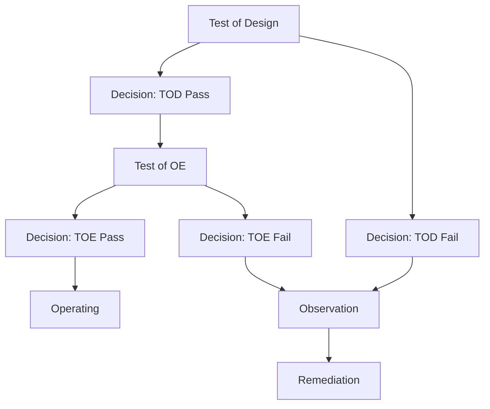

## Process Overview

{: width="600px"}

## Purpose

As new GitLab security controls are identified that need to be implemented by the Security Compliance Teams for compliance or regulatory reasons, these controls follow an established process in order to make that implementation successful.

These lifecycle phases are managed via GitLab's governance, risk and compliance (GRC) application.

## Scope

This document applies to GitLab's security controls being assessed by the Security Compliance Team(s).

## Roles & Responsibilities

| Role | Responsibility|
| ---- | ------ |
| GitLab Team Members | Responsible for following the requirements of the controls |
| Security Compliance Team | Responsible for execution of security control tests and maintenance of this handbook page |
| Security Compliance Management | Responsible for oversight, escalation and approval of exceptions for this process |
| Security Assurance Management (Code Owners) | Responsible for approving significant changes and exceptions to this procedure |

## Procedure

### Lifecycle Phases Explained

#### Preparation

As new [GCF security controls](/handbook/security/security-assurance/security-compliance/sec-controls.md) are identified they first must be contextualized to GitLab as a company and to the applicable GitLab systems. The Preparation phase of the control lifecycle covers this initial work required to get controls into a state of ready to be tested.

Additionally, GCF controls that have been previously tested but have an upcoming requirement for renewed testing enter this Preparation phase as well to research and confirm that any changes to the control processes are captured in the updated testing activity.

#### Testing

The testing activity consists of 3 major components:

1. Assessing the Design and Operating Effectiveness of the control
1. Validating observations (if any were noted during testing) with the observation owners
1. Recording those observations (if any) according to the [Security Compliance Observation Management process](/handbook/security/security-assurance/observation-management-procedure/)
   - **Note:** These observations can only be recorded after being validated by the observation owner to ensure that observation is accurate and represents a material deficiency in the security control process

After assessment and validation, the status field in the GRC tool should be updated as follows:

- If a gap exists with no current control implementation, create a placeholder control and list the status as 'gap'
  - Controls with a status of 'gap' should have a corresponding observation issue.
- If a control was designed and operating effectively with no observations, create a control ID, control description, map it to the appropriate control domain and list the status as 'in existence'.

#### Remediation

Remediation is the phase of the lifecycle where required changes are made to the design of the security control or the process of the control's operation. Remediation is either performed by the observation owner or is tracked by the observation owner if the observation remediation is blocked by another GitLab team's work. The Security Compliance Team is responsible for tracking all validated observations and continually reporting on those observations to ensure they are tracked, prioritized appropriately, and escalated as needed to meet security compliance program goals.

#### Operating

Controls that are tested with no observations noted during that testing activity are determined to be in an operational state. This indicates that the design and operating effectiveness of this control are at or above the level required to meet the current needs of the security compliance program.

Controls in an operating state will still need to be re-tested as determined by the risk rating of the control to ensure no substantive changes have occured which would impact the design or operating effectiveness of that control.

## Exceptions

Exceptions to this procedure will be tracked as per the [Information Security Policy Exception Management Process](/handbook/security/controlled-document-procedure/#exceptions).

## References

- [Controlled Document Procedure](/handbook/security/controlled-document-procedure/)

<a href="../security-compliance/" class="btn bg-primary text-white btn-lg">Return to the Security Compliance</a>
