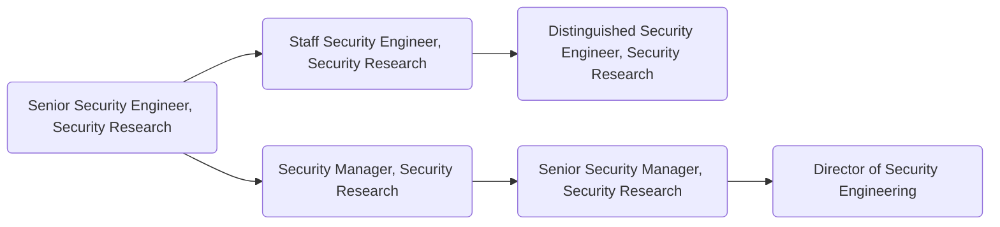

Security research engineers are subject matter experts (SME) that conduct research in their personal area of expertise to protect GitLab the product and GitLab company assets. They are also expected to participate in the larger security community through blog posts and participation in industry conferences.

## Responsibilities

- Conduct research in their area of expertise to protect GitLab and GitLab.com assets.
- Research security posture of FOSS tools that are integrated with GitLab.
- Report findings to tool developers and track mitigation process, following [responsible disclosure guidelines](https://about.gitlab.com/security/disclosure/#disclosure-guidelines-for-vulnerabilities-in-3rd-party-software).
- Author blogs posts and presentations on topics and research in their area of expertise.
- Author documentation and/or tooling for security training.
- Apply [Secure tools](https://about.gitlab.com/stages-devops-lifecycle/secure/) to [secure GitLab](/handbook/security/#secure-the-product) and contribute to the improvement of the tools by providing feedback to the engineering team.
- Identify gaps in existing security test automation and develop tools to close the gap.
- Support other GitLab initiatives as a SME.

## Requirements

- Ability to use GitLab
- Expected experience of 5+ years working in a security engineer role (Application Security, Security Operations, Security Development), with 2+ years of those dedicated to research-related work, or equivalent education.
- Have a keen eye for identifying complex security problems in software and/or infrastructure, and defining their solutions.
- Be a team player and enjoy collaborating on cross-functional teams.
- Have a passion for security and open source.
- Excellent and professional communication skills (written and verbal) with an ability to articulate complex topics in a clear and concise manner.

## Levels

### Senior Security Research Engineer

This position reports to the [Security Manager, Security Research](#security-manager-security-research) role at GitLab.

#### Senior Security Research Engineer Job Grade

The role is a [grade 7](/handbook/total-rewards/compensation/compensation-calculator/#gitlab-job-grades).

#### Senior Security Research Engineer Responsibilities

- Leverages security expertise in at least one specialty area
- Conducts focused security research and makes recommendations
- Triages and handles/escalates security issues independently
- Great written and verbal communication skills
- Write public blog posts and represent GitLab in the wider security community
- Participate in candidate interviews during hiring process

#### Senior Security Research Engineer Requirements

- Includes all [requirements listed above](#requirements).

### Staff Security Research Engineer

This position reports to the [Security Manager, Security Research](#security-manager-security-research) role at GitLab.

#### Staff Security Research Engineer Job Grade

The role is a [grade 8](/handbook/total-rewards/compensation/compensation-calculator/#gitlab-job-grades).

#### Staff Security Research Engineer Responsibilities

- Conduct security research in 2+ specialty areas.
- Participate in defining GitLab security requirements in area(s) of expertise.
- Define and implement security technical and process improvements.
- Provide actionable and constructive feedback to cross-functional teams.
- Great written and verbal communication skills
- Write public blog posts and represent GitLab in the wider security community
- Participate in candidate interviews during hiring process

#### Staff Security Research Engineer Requirements

- Includes all Senior level requirements listed.
- Be a subject matter expert (SME) of at least 2 technical areas impacting the security of the product.
- Passion for participation in the security community, demonstrated through published research and community involvement.
- Have experience leading technical objectives in cross-functional teams

### Principal Security Research Engineer

This position reports to the [Senior Security Manager, Security Research](#senior-security-manager-security-research) role at GitLab.

#### Principal Security Research Engineer Job Grade

The role is a [grade 9](/handbook/total-rewards/compensation/compensation-calculator/#gitlab-job-grades).

#### Principal Security Research Engineer Responsibilities

- Conduct and lead security research projects across multiple functional areas.
- Solve technical problems of the highest scope, complexity, and ambiguity.
- Assist in developing team and sub-department roadmap.
- Lead integration of security research results into relevant engineering and business functions.
- Collaborate and makes proposals across several teams on cross-functional security initiatives.
- Look for innovation opportunities between several teams with a willingness to experiment and to boldly confront problems of large complexity and scope.
- Guides conversations to remove blockers and encourage collaboration across teams.
- Teach, mentor, grow, and provide advice to other domain experts, individual contributors, across several teams in their sub-department.
- Write public blog posts and represent GitLab in the wider security community.
- Participate in candidate interviews during hiring process.

#### Principal Security Research Engineer Requirements

- Includes all Staff level requirements listed.
- Demonstrated deep technical expertise in multiple security areas.
- Demonstrated ability to enact change cross-functionally through efficiency, inclusion, and iteration.
- Knowledge of current and emerging security technologies that affect the business.
- Knowledge of current and emerging security threats that affect the business.
- Passion for participation in the security community, demonstrated through published research and community involvement.

### Distinguished Security Research Engineer

This position reports to the [Threat Management Director](/job-families/security/security-leadership/) role at GitLab.

#### Distinguished Security Research Engineer Job Grade

The role is a [grade 10](/handbook/total-rewards/compensation/compensation-calculator/#gitlab-job-grades).

#### Distinguished Security Research Engineer Responsibilities

- Includes all [Principal level responsibilities listed](#principal-security-research-engineer-responsibilities).
- Conduct security research across multiple functional areas within the Engineering department.
- Take lead role in decision making for GitLab security requirements in area(s) of expertise.
- Evangelize successful adoption and use of tooling, technologies, and security solutions.
- Define, own, and implement security technical and process improvements.
- Teach, mentor, grow, and advise other domain experts, individual contributors, and teams in the organization.
- Drive the business value relation of metrics calculations for the Security Research program.
- Represent the Security Engineering team across and outside of GitLab as a subject matter expert in technology, development, and security concepts.
- Work in a leveraged manner influencing other organizations and teams across GitLab with security research approaches and a focus on problem solving.

#### Distinguished Security Research Engineer Requirements

- Includes all [Principal level requirements listed](#principal-security-research-engineer-requirements).
- Expected 10+ years previous experience on a Security team, including Security Research, and 4+ years in lead position, or relevant education.
- Creative thinker and problem solver, able to distill complex problems down to actionable items with boring solutions.
- Deep and broad knowledge of current and emerging security technologies that affect the business.
- Deep and broad knowledge of current and emerging security threats that affect the product.
- Expert in designing and implementing security best practices and troubleshooting security issues.
- Have a portfolio of public communication of complex security concepts.

### Security Manager, Security Research

This position reports to the [Security Engineering Director](/job-families/security/security-leadership/#director-security-engineering--research) role at GitLab.

#### Job Grade

The {Security Research Manager} is a [grade 8](/handbook/total-rewards/compensation/compensation-calculator/#gitlab-job-grades).

#### Responsibilities

- Hire and oversee a world class team of security researchers
- Help their team grow their skills and experience
- Provide input on security architecture, issues, and features
- Hold regular 1:1's with all members of their team
- Create a sense of psychological safety on their team
- Recommend security-related technical and process improvements
- Author project plans for security initiatives
- Draft quarterly OKRs
- Train team members to screen candidates and conduct managerial interviews
- Sense of ownership, urgency, and drive
- Excellent written and verbal communication skills, especially experience with executive-level communications
- Ability to make concrete progress in the face of ambiguity and imperfect knowledge
- Prepare and deliver meaningful metrics to Security Engineering leadership
- Successfully execute on quarterly OKRs

#### Requirements

- Demonstrable prior people management experience
Enjoys working efficiently; is action oriented and full of energy for the things he/she sees as challenging; not fearful of acting with a minimum of planning; seizes more opportunities than others.
- Can effectively cope with change; can shift gears comfortably; can decide and act without having the total picture; isn’t upset when things are up in the air; doesn’t have to finish things before moving on; can comfortably handle risk and uncertainty.
- Knows how businesses work; knowledgeable in current and possible future policies, practices, trends, and information affecting their business and organization; knows the competition; is aware of how strategies and tactics work in the marketplace.
- Deals with problem reports firmly and in a timely manner; doesn’t allow problems to fester; regularly reviews performance and holds timely discussions; can make negative decisions when all other efforts fail; deals effectively with troublemakers.
- Makes good decisions (without considering how much time it takes) based upon a mixture of analysis, wisdom, experience, and judgment; most of their solutions and suggestions turn out to be correct and accurate when judged over time; sought out by others for advice and solutions.
- Provides challenging and stretching tasks and assignments; holds frequent development discussions; is aware of each report’s career goals; constructs compelling development plans and executes them; pushes reports to accept developmental moves; will take reports who need work; is a people builder.
- Is good at establishing clear guidance; sets stretching goals; distributes the workload appropriately; lays out work in a well-planned and organized manner; maintains two-way dialogue with others on work and results; brings out the best in people; is a clear communicator.
- Is widely trusted; is seen as a direct, truthful; can present the unvarnished truth in an appropriate and helpful manner; keeps confidences; admits mistakes; doesn’t misrepresent him/herself for personal gain.
- Doesn’t hold back anything that needs to be said; provides current, direct, complete, and “actionable” positive and corrective feedback to others; lets people know where they stand; faces up to people problems on any person or situation (not including direct reports) quickly and directly; is not afraid to take negative action when necessary.
- Assigns responsibility for tasks and decisions; sets clear goals and measures; monitors process, progress, and results; designs feedback loops into work.
- Creates a climate in which people want to do their best; can motivate many kinds of reports and team or project members; can assess each persons hot button and use it to get the best out of him/her; pushes tasks and decisions down; empowers others; invites input from each person and shares ownership and visibility; makes each person feel their work is important; is someone people like working for and with.
- Scopes out length and difficulty of tasks and projects; sets goals; breaks down work into the process steps; develops schedules and task/people assignments; anticipates and adjusts for problems and roadblocks; measures performance against goals; evaluates results.
- Uses rigorous logic and methods to solve difficult problems with effective solutions; probes all fruitful sources for answers; can see hidden problems; is excellent at honest analysis; looks beyond the obvious and doesn’t stop at the first answers.
- Can be counted on to exceed goals successfully; is constantly and consistently one of the top performers; very bottom-line oriented; steadfastly pushes self and others for results.

### Senior Security Manager, Security Research

This position reports to the [Security Engineering Director](/job-families/security/security-leadership/#director-security-engineering--research).

#### Job Grade

The {Security Research Senior Manager} is a [grade 9](/handbook/total-rewards/compensation/compensation-calculator/#gitlab-job-grades).

#### Responsibilities

- The same responsibilities of a Security Research Manager, plus the below:
- Maintain reliable, up-to-date, information regarding automation technology changes and trends
- Execute strategic vision for the Security Research program
- Draft and successfully execute on quarterly OKRs

#### Requirements

- At least 5 years prior experience managing security engineering teams

## Segment

### Security Leadership

For details on the Security organization leadership roles, to include the Security Engineering Director and VP of Security, see the Security Leadership page.

## Performance Indicators

- To Be Defined (TBD)

## Career Ladder

## Hiring Process

Candidates for this position can expect the hiring process to follow the order below. Please keep in mind that candidates can be declined from the position at any stage of the process. To learn more about someone who may be conducting the interview, find their job title on our [team page](/handbook/company/team/).

- Qualified candidates will be invited to schedule a 30 minute [screening call](/handbook/hiring/interviewing/#screening-call) with one of our Global Recruiters.
- Next, candidates will be invited to schedule 2 separate 50-minute interviews with Security Research team member peers.
- Then, candidates will be invited to schedule a 50-minute interviews with the Security Research team hiring manager.
- Finally, candidates will be invited to schedule a 30-minute interview with the Director, Security Engineering.

Additional details about our process can be found on our [hiring page](/handbook/hiring/).
