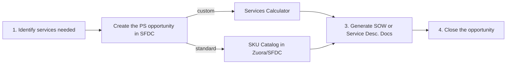

You can also [watch the sales enablement session](/handbook/customer-success/professional-services-engineering/sales-enablement) about how to sell services.

## A Note on Partner Professional Services

Please remember to follow the [Rules of Engagement for Selling Professional Services](/handbook/sales/selling-professional-services) with the following highlights:

- Always start by finding out if your customer/prospect has a qualified and preferred professional services partner and start by engaging with that partner to explore a solution for your customer/prospect
- **SMB** clients are welcome to purchase [SKU offerings](/services/catalog/). Please route all custom **SMB** needs through professional services Channel Partners as outlined in the [ROE](/handbook/sales/selling-professional-services). Please see additional detail in the FAQ below.
- Remember to update the SFDC Professional Services Opportunity to **"closed lost"** if for any reason after you have created a GitLab Professional Services Opportunity in SFDC the work is transitioned to being sold and delivered by a partner.  Then make sure that any Services Attach Registration that the partner registers for that work is attached to the relevant Licensing Opportunity in SFDC.  Please work with the Channel Account Manager for the partner (found in SFDC account for the partner) if you have any questions about this process.

## Workflow for GitLab selling Professional Services

There are 4 main steps for selling GitLab Professional Services:

1. Identify the right services needed.
1. Create the GitLab Professional Services opportunity in SFDC.
1. Generate the SOW / Service Description Docs
1. Close the opportunity

### Step 1: Identify the right service

The SAE/ISR can find the general services the PS team offers on the [services page](/services/) or for more details specific SKU offerings, on the [full catalog](/services/catalog/). The SAE/ISR can pull the SA/CSM in for help selecting services needed based on customer requirements.

### Step 2: Create the opportunity in SFDC

The SAE/ISR [creates a Professional Services Only opportunity](/handbook/sales/field-operations/gtm-resources/).

### Standard Services Only

If the customer only needs standard services from the service catalog, the SAE/ISR can generate the quote from within the newly created SFDC PS opportunity by:

1. Click `New Quote`.
1. Choose the proper billing account. In the _Quote Type_ section Select `New Subscription`. Click `Next`.
1. On the _Create New Subscription Quote_ screen, update required fields (e.g. _Start Date_) as needed. Click `Next`.
1. On the _New Quote Flow_ screen, click the drop down box next to the _New Quote Flow_ and select `Add Add on Products`.
1. In the Professional Services and Training Row, click the drop down that says `Select Plan` to see the current SKU offerings that can be added to the opportunity. Click `Next`.

After following the above process steps, click `Generate PDF` to obtain an Order Form to share with the customer for signature.  The AE should meet with the customer to review the service deliverables, duration, and pricing and should confirm no customizations are needed. Again, they can pull in the EM for assistance if needed.

### Custom-Scoped Services

If the account team (SAE/ISR/SA/CSM) determines that the customer requires additional services outside of those listed in the [full catalog](/services/catalog/), they should initiate a scoping engagement with the PS team by opening the [Services Calculator](http://services-calculator.gitlab.io/) and submitting with the information required (customer name, GitLab username and email address). If you don't know the specifics, you can submit with the defaults. This will add an issue to the  PS Engagement Manager's queue to follow up with you on next steps. Check out the [detailed steps below](#custom-scoped-services-detailed-workflow) for custom-scoped engagements for more details.

### Instructions for creating a Professional Services Quote

Deal Desk with require a quote for either Service option above.  How to create a quote can be found [here](/handbook/sales/field-operations/sales-operations/deal-desk/#professional-services-quote).

### Step 3: Create and add the SOW

For standard SKUs, the Order Form is generated directly from SFDC via the quote object [here](/handbook/sales/field-operations/sales-operations/deal-desk/#professional-services-quote). Upload the signed version of this document when you receive it from the customer.

For custom scoped SOWs, once you receive the SOW from the Sr. Engagement Manager and have gotten it back from the customer with signature, attach it to the SOW doc to the SFDC PS opportunity.

### Step 4: Close the opportunity

### Closed Won

Once the services have been rendered and the project is closed, the SAE/ISR should obtain signatures from the customer. The SAE/ISR should move the opportunity to `Closed Won` status

As the agreement approaches `Closed Won`, make sure to request `@ps-scheduling` to  identify a potential start date in the [professional services slack channel](/handbook/customer-success/professional-services-engineering/working-with/#slack) given the [typical lead times for starting a PS engagement](/handbook/customer-success/professional-services-engineering/working-with/#lead-time-for-starting-a-professional-services-engagement).

### Transitioned to a Partner - Closed Lost

Remember to update the SFDC Professional Services Opportunity to **"closed lost"** if for any reason after you have created a GitLab Professional Services Opportunity in SFDC the work is transitioned to being sold and delivered by a partner.  Then make sure that any Services Attach Registration that the partner registers for that work is attached to the relevant Licensing Opportunity in SFDC.  Please work with the Channel Account Manager for the partner (found in SFDC account for the partner) if you have any questions about this process.

### Custom-Scoped Services Detailed Workflow

1. Account team: Create scoping issue from Services Calculator
1. SA/CSM: Add initial scoping details to the issue around customer requirements
1. SA/CSM & PS Engagement Manager: Conduct detailed scoping call with the customer
1. PSEM: Develop Custom SoW and pricing for customer
1. Account team: Deliver SoW to the customer, add to the Salesforce (SFDC) opportunity
1. Send for signature (just like software terms)
1. When Closed Won, the PS team will handle staffing. Average lead times are updated weekly -  please check with the EM to set expectations with the client

<!-- ### Detailed Process

1. Sales and account team to introduce early in discussions.
1. The SA can do basic scoping and use the [calculator](/handbook/customer-success/professional-services-engineering/selling/#services-calculator) for an estimate.
  - This should be a good estimate to secure budget.
1. Customer should execute Subscription Agreement AND Consulting Services Agreement.
1. The SA can use the [custom SoW scoping details](/handbook/customer-success/professional-services-engineering/scoping/) page to help drive the conversation and uncover required capabilities for the custom SoW.
1. The SA will create the SoW from the [calculator](/handbook/customer-success/professional-services-engineering/selling/#services-calculator), scoping the project and estimating both schedule and cost for the SoW.
1. The calculator automatically creates an approval issue on the [SoW Proposal Approval board](https://gitlab.com/groups/gitlab-com/customer-success/professional-services-group/-/boards/1353982?&label_name[]=Services%20Calculator).
1. SA: Check and add any more details to the issue created on the SoW Proposal Approval board.
1. SA: Fill out any additional scoping details. Ensure the issue is assigned to a Solutions Manager for review, and move it to the `proposal::Scoping` step.
1. SA & PSE: Conduct more detailed scoping call (only when needed) to [prepare SoW](/handbook/customer-success/professional-services-engineering/#statement-of-work-creation).
1. If there are additional scoping questions needed to scope the engagement, Professional Services Engineering will inform the account team within three (3) business days of this call.
1. Once all scoping questions are complete, move the SoW to the `proposal::Writing` step.
1. Once written, move the SoW to the `proposal::Cost Estimate` step where a Manager of Professional Services will provide a [cost estimate](/handbook/customer-success/vision/#professional-services-standard-cost) used to calculate the expected margin for the project. It will be completed and ready for the account team review within one (1) business week.
1. Move the SoW to the `proposal::ReadyForApproval` step.
1. The SoW is approved by the Senior Director of Professional Services or VP of Customer Success.
1. Move the SoW to the `proposal::Approved` step. Assign the issue to the SA for delivery to the customer via the account team. -->

## FAQ

### Do we have set SKUs I can use?

Yes - for off the shelf items, we have [SKUs](/services/catalog/).

### What are our daily or hourly rates?

We do not currently have an hourly or daily rate.  Nor do we plan to have an hourly rate.  Just as with GitLab support, the mission of our Professional Service group is not to bill hours, but to achieve success for our Customers.  So just as we don't offer support by the call or by the hour, we do not offer Professional Services by the day or the hour.

In the future, we may have a daily rate or a daily rate for on-site support.  However, we currently do not for the same reasons listed above.

### What if the customer only wants training?

If the customer is an EE customer, we can offer training.  However, training will need to be scoped out by the Customer Success department before quoting a price.  The account executive will also be required to provide the use case for the need for just training.

Example use case might be:

Customer is under license utilization and we need to prevent churn, help expand usage into additional groups and other business units.

### What options exist for CE Customers?

GitLab CE is ideal for personal projects or small groups with minimal user management and workflow control needs.  Because these groups don't typically need a lot of focus on scaled implementation or training, we currently do not offer implementation, integration or training services to our CE customers.  Many of our [partners](/partners/) offer such services.  However, we find that many customers who have been running a CE instance and are looking to transition to a scaled implementation of GitLab may require a [Discovery Engagement](/handbook/customer-success/professional-services-engineering/offerings/#discovery-engagement) to determine the customer's long-term needs.

If a customer is upgrading from CE to EE, Professional Services should be engaged to scope out the requirements for the transition if the customer will need services in the transition.

### What options exist for SMB Customers?

SMB customers often do not have sufficient budget for our professional services offerings, and we traditionally try to meet their needs through [channel partners](https://about.gitlab.com/partners/). If your client had budget for one or more of our [SKUs](/services/catalog/), you are welcome to attach the SKU and do not need to create a scoping issue with the professional services team.

Please note: Migrations to GitLab SaaS currently require the use of an admin token, which is unavailable to partners. Therefore, these migrations **must** run through our GitLab professional services team currently.
