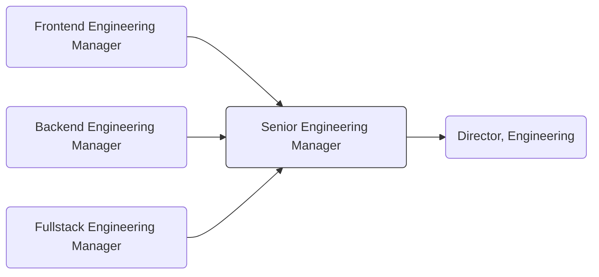

Engineering Managers at GitLab see their team as their product.
While they are technically credible and know the details of what engineers work on,
their time is spent safeguarding their team's health, hiring a world-class team,
and putting them in the best position to succeed. They own the delivery of product commitments and are always looking to improve productivity.
They must also coordinate across departments to accomplish collaborative goals.
Engineering Leadership at GitLab is cross-discipline.
A [Senior Engineering Manager](/job-families/engineering/development/management/senior-manager)
manages [Engineering Managers](/job-families/engineering/development/management/engineering-manager/)
with fullstack teams (frontend, backend, and fullstack engineers), and/or Engineering Individual Contributors (frontend, backend, and fullstack engineers)

## Responsibilities

- Build a globally-distributed, sustainable, and [high-performing](/handbook/people-group/learning-and-development/manager-development/high-performing-teams/) team through hiring, retention, and strategic organizational design
- Plan and execute long term strategies that move your team and the product stage(s) toward business objectives. This includes decision-making, alignment, staffing, prioritization, leading through change, and working through ambiguity.
- Understand [Engineering KPIs](/handbook/engineering/performance-indicators/#key-performance-indicators) and seek to improve them
- Lead and drive significant results for multiple teams that have a direct impact on the broader mission they contribute to. Examples include, but are not limited to:
  - Managing multiple [engineering teams](/handbook/engineering/#engineering-departments-sub-departments--teams) with engineering manager direct reports, covering a significant product/program scope.
  - Managing [engineering teams](/handbook/engineering/#engineering-departments-sub-departments--teams) with a complex product/program scope.
  - Leading business critical cross-functional initiatives in addition to managing a team.
- Conduct managerial interviews for candidates, and train engineering managers to do managerial interviews
- Develop and execute process enhancements while strategically influencing leadership decisions across multiple organizational levels.
- Hold regular [1:1s](/handbook/leadership/1-1/) with team members and [skip-level](/handbook/leadership/skip-levels/) 1:1s with indirect reports
- Grow and develop engineering leadership (ICs or people managers) through mentorship, coaching, and learning and development opportunities
- Enable [quad planning team](/handbook/product/product-processes/#pm-em-ux-and-set-quad-dris) [collaboration](/handbook/values/#collaboration) within [product groups](/handbook/company/structure/#product-groups)
- Enable [Product](https://internal.gitlab.com/handbook/company/performance-indicators/product/), [Quality](/handbook/engineering/infrastructure/performance-indicators/), and [UX](/handbook/product/ux/performance-indicators/) performance via solid [stable-counterpart](/handbook/leadership/#stable-counterparts) partnership
- Contribute to the sense of psychological safety of multiple teams.
- Give regular and clear feedback around the [individual's performance](/handbook/leadership/1-1/suggested-agenda-format/)
- Draft quarterly [OKRs](/handbook/company/okrs/) and [Engineering KPIs](/handbook/engineering/performance-indicators/#key-performance-indicators)
- Improve product quality, security, and performance
- Participate in the [Incident Management on-call rotation](/handbook/engineering/infrastructure/incident-management/#incident-manager-responsibilities) to help ensure the availability goals for GitLab.com and GitLab Dedicated are met, by working with reliability engineers and development team members
- Identify and resolve problems proactively, even in ambiguous situations or where negotiations are necessary, through advanced thinking, partnership and foresight

## Requirements

- Exquisite brokering skills: regularly achieve consensus amongst stakeholders
- [Collaborate](/handbook/values/#collaboration) effectively with others
- Excellent written and verbal communication skills
- Share [our values](/handbook/values/), and work in accordance with those values
- Build teams that excel through our values. Recognize when to course-correct or restructure a team to improve performance or alignment with our mission.
- Professional experience as an engineer in at least one primary language or framework of the organization, or a closely related language or framework.
- Ability to discuss architectural concepts and systems design, and to broker technical decisions at a high-level between individual contributors.
- Experience across the devops lifecycle, with deep understanding of at least one area.
- Exposure to automation through CI/CD pipelines.
- An understanding of multiple delivery and distribution strategies, including an ability to maintain velocity within GitLab's dual cadence of continuous deployment and a monthly release cycle.
- Understanding of a variety of security principles and best practices including the ability to ensure a secure development process.
- Understands how to maintain and enforce Quality Assurance through testing frameworks and code review standards.
- Ability to communicate technical concepts to non-technical stakeholders.
- Past experience (3 to 5 years) as an engineering manager.
- Proven track record of execution that demonstrates an understanding of the software development lifecycle.
- Ability to understand, communicate and improve the quality of multiple teams
- Demonstrate longevity at, at least, one recent job
- Ability to be successful managing at a remote-only company
- Demonstrated successful partnership with stable counterparts
- Exemplify [diversity, inclusion, and belonging](/handbook/values/#diversity-inclusion) in leadership
- Humble, servant leader
- Ability to use GitLab

## Nice-to-haves

- Experience in a peak performance organization
- Enterprise software company experience
- Computer science education or equivalent experience
- Passionate about open source and developer tools
- Experience contributing to open source software
- Experience working with modern frontend frameworks (for example React, Vue.js)
- Working knowledge of Ruby on Rails and/or Golang
- Domain knowledge relevant to the product stage in which you are looking to join (for example someone with CI/CD experience applying for the Verify and Release team)
- Be a user of GitLab, or familiar with our company
- Prior Developer Platform or Tool industry experience
- Prior high-growth startup experience
- Experience working on systems at massive, consumer scale
- Deep open source experience
- Experience working with global teams
- Be inquisitive: Ask great questions

## Job Grade

The Senior Engineering Manager is a [grade 9](/handbook/total-rewards/compensation/compensation-calculator/#gitlab-job-grades).

## Performance Indicators

- [Development Hiring Actual vs. Plan](/handbook/engineering/development/performance-indicators/#development-hiring-actual-vs-plan)
- [Team/Group MR Rate](/handbook/engineering/development/performance-indicators/#development-department-member-mr-rate)
- [Development Handbook Update Frequency](/handbook/engineering/development/performance-indicators/#development-handbook-update-frequency)

## Career Ladder

### Promotion Guidance

- When justifying a Senior Engineering Manager role, provide a comprehensive analysis that includes before-and-after org charts, specific responsibilities, and the impact on existing leadership. Demonstrate how this addition will enhance team efficiency, project delivery, and organizational goals. This approach will illustrate that an SEM is a strategic investment in innovation and long-term success, not just a staffing increase.
- Promotion to Senior Engineering Manager is based on a combination of individual readiness and organizational need. While personal growth and skill development are highly valued, advancement to this role is contingent upon business requirements and capacity within the existing SEM structure. Promotions are considered when:
  1. The candidate demonstrates readiness for increased responsibilities
  2. There is a clear business need for an additional SEM
  3. Existing SEMs are at full capacity in their current roles
- Because existing SEM capacity would be a factor in new promotions, it is likely that a business need will occur outside of the promotion cycle, requiring an existing engineering manager to take the SEM role in an acting, interim, or temporary capacity in order to alleviate pressure quickly from other SEMs and Directors. For this reason, SEM promotions might occur [outside of the promotion cycle](/handbook/people-group/promotions-transfers/#twice-per-year-promotion-calibration-process--timeline).

### Career Matrix

The Senior Engineering Manager (SEM) role accommodates managers who have a broad span of control (multiple teams) and/or a broad sphere of influence (multiple initiatives). We want to ensure that both dimensions are considered when assessing readiness so that these two organizationally different roles have equitable opportunities to advance. To do this, we are [trialing this rubric](https://docs.google.com/spreadsheets/d/1Qo2pdkLuzcodFVojQgQXOhmK4VOBFbg0VOIKav-Fpyw/edit?gid=0#gid=0) as a guideline to help us visualize the differences while maintaining core competencies overall. It is aligned to the roles job family (this page) and [job framework](https://docs.google.com/spreadsheets/d/1FX4NBwF099uMBm7mGBtf1orIJZuHEjtiEa3jSbg9jJs/edit?gid=0#gid=0), and can be used by Engineering Managers, Directors, or mentors who are interested in an Engineering Manager achieving the next level or when reviewing promotion documents themselves. However, it should be used as a guideline only, and the results of this rubric are not meant to be exact at this stage.

**How to use:**
  
- Scores range from 1 (no examples of this behavior) to 5 (strong and frequent examples of this behavior)
- Span of control and Sphere of influence sections have required minimums
- Competencies have weighted percentages in the top right corner of each section to allow equitability in Senior Managers who have different strengths. These percentages are meant to indicate the weight each section has on the overall score and cannot be used as a career development indicator.
- While demonstrating competencies at level 3 is acceptable, exceptional candidates should consistently aim to perform at levels 4 and 5, showcasing strong and frequent application of skills
- Use this rubric loosely to allow for nuances, and as a career development discussion starter
- Consider organizational readiness to accommodate a new SEM, and seek out other opportunities within the organization that might have these capabilities

## Hiring Process

Candidates for this position can generally expect the hiring process to follow the order below. Note that as candidates indicate preference or aptitude for one or more specialties, the hiring process will be adjusted to suit. Please keep in mind that candidates can be declined from the position at any stage of the process. To learn more about someone who may be conducting the interview, find their job title on our [team page](/handbook/company/team/).

1. Selected candidates will be invited to schedule a 30 minute [screening call](/handbook/hiring/#screening-call) with one of our Technical Recruiters
1. Candidates will be invited to schedule a 60 minute first interview with a VP of Development
1. Candidates will be invited to schedule a 45 minute second interview with a Director of Engineering
1. Candidates will be invited to schedule a 45 minute third interview with another member of the Engineering team
1. Candidates will be invited to schedule a 45 minute fourth interview with a member of the Product team
1. Candidates will be invited to schedule a 45 minute fifth interview with a VP of Engineering
1. Candidates may be asked to schedule a 50 minute final interview with our CEO
1. Successful candidates will subsequently be made an offer via email

Additional details about our process can be found on our [hiring page](/handbook/hiring/).
