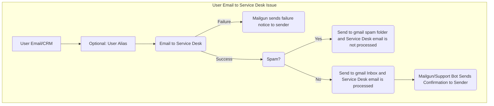

## Overview

Users can experience various issues while utilizing [Service Desk](https://docs.gitlab.com/user/project/service_desk/). This guide walks through troubleshooting when an email does not generate a Service Desk issue.

See also, the [Service Desk runbook doc](https://gitlab.com/gitlab-com/runbooks/-/tree/master/docs/service_desk).

## Troubleshooting Steps

1. When an issue related to Service Desk is received, verify with the customer these common occurrences are not applicable:
    1. [Attachments cannot be over 100MiB](https://docs.gitlab.com/user/gitlab_com/#account-and-limit-settings)
    1. [Emails with `Auto-Submitted` or `X-Autoreply` in the header are ignored](https://docs.gitlab.com/administration/incoming_email/#rejected-headers)
    1. See the [Participants in Service Desk](https://gitlab.com/groups/gitlab-org/-/epics/3758) epic for known limitations.

1. If known issues above are not the cause, request the following from the user:
    1. The source email (including headers) for an example email sent to the Service Desk which did not create an issue. If possible, request the source email be provided as an `.eml` file to preserve the email headers.
    1. A link to the GitLab.com project which the email was attempting to send to.
    1. Did the sender receive a reply (failure)? **If yes**,
        1. Request a screenshot of the failure message.
        1. Search [Kibana](https://log.gprd.gitlab.net/app/kibana#/) by any of the following:
           1. In Rails: Sender's IP address (`json.remote_ip`)
           1. In Sidekiq: Service Desk Email (`json.to_address`)
           1. In Sidekiq: Message ID (`json.mail_uid`)
        1. Search the `mg.gitlab.com` mail logs in [Mailgun](https://app.mailgun.com/app/sending/domains/mg.gitlab.com/) for suppressions
        1. Create an issue in the [GitLab issue tracker](https://gitlab.com/gitlab-org/gitlab/-/issues) providing all information found
    1. Did the sender receive a reply (failure)? **If no**,
        1. Send a Slack message to [#production](https://gitlab.enterprise.slack.com/archives/C101F3796), asking for a check of the spam folder in the `incoming` gmailbox for the Service Desk target email

## Email to Service Desk Email Flow



Mermaid source:

```text
    ```mermaid
        graph TD;
          subgraph "User Email to Service Desk Issue"
          SubGraph1Flow(Email to Service Desk)
          SubGraph2Flow(Spam?)
          SubGraph3Flow(Mailgun/Support Bot Sends Confirmation to Sender)
          Node1[User Email/CRM] --> Node2[Optional: User Alias]
          Node2[Optional: User Alias] --> SubGraph1Flow
          DoChoice1(Mailgun sends failure notice to sender)
          SubGraph1Flow -- Failure --> DoChoice1
          SubGraph1Flow -- Success  --> SubGraph2Flow
          DoChoice3(Send to gmail spam folder and Service Desk email is not processed)
          DoChoice4(Send to gmail Inbox and Service Desk email is processed)
          SubGraph2Flow -- Yes --> DoChoice3
          SubGraph2Flow -- No  --> DoChoice4 --> SubGraph3Flow
        end
    ```
```
