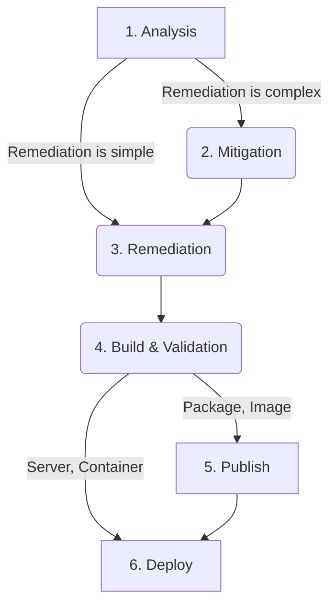

## Overview

The purpose of this runbook is to define the distinct stages of addressing a vulnerability finding.
Overall, this process is broken down into several major phases, as shown as numbered stages in the below flow diagram.
Each numbered phase is further described in a section of this runbook.
Not all phases will be applicable to every finding, as the work required to fully remediate a vulnerability finding will differ based on the actual finding.
The environment where the vulnerability is detected, the complexity of remediation, and the type of asset (container, package, image, etc.) where the finding is detected, can all influence the steps required.

## Remediation Flow

## Vulnerability Remediation Phases / Steps

### 1. Analysis

During this phase of vulnerability remediation the impact of the vulnerability is assessed in the context of the code, package, image or infrastructure where it has been detected.
Depending on who is alerted to the vulnerability detection first, this may be initially performed by GitLab Security, or other GitLab team members.

The goal of this step is to understand:

- What is required to exploit a vulnerability
- If exploitation is possible, and its likelihood
- The impact of successful exploitation
- The general complexity of the changes required to prevent exploitation

If the vulnerability finding is analyzed and found to be not exploitable, this does not remove the need to address the finding. It lowers the impact of the finding, and in turn can be used to adjust the SLA for resolving a vulnerability finding. For more detail on this, please see the [Why Should We Fix Vulnerabilities?](../why-should-we-fix-vulnerabilities.md) handbook page.

If assistance is required in assessing impact, please reach out to [Product Security](/all-content/).

Once the impact is understood, a high level plan to fully remediate the finding should be documented on the associated GitLab issue used to track the vulnerability finding.

### 2. Mitigation

This step is typically not required for most vulnerability findings. Typically, you'll focus on remediation of the finding.

A mitigation is any change to the system, container, built image, package or code which reduces or removes the risk of exploitation for a vulnerability finding. This differs from a remediation in that it doesn't remove the vulnerability. If you think about a building being renovated to add more secure door locks, a mitigation would be building a big wall around the building whilst the remediation work (upgrading the locks) happens. Mitigations should only make sense if it makes sense to add them to address risk, as it may make more sense to instead put that effort directly into remediation work if the risk is already low, or the remediation is simple and can be performed quickly.

If a vulnerability finding is complex to remediate or there are other logistical challenges to fully remediating a vulnerability finding, it may be appropriate to add mitigations which prevent exploitation or reduce the risk or impact of exploitation to an acceptable level. If the vulnerability finding cannot be remediated within the appropriate [SLA](../sla.md), this can be a good point to decide if a mitigation should be put in place.

### 3. Remediation

Remediation refers to the work required to fully remove the cause of a vulnerability finding from the system, container, image, package or code where it was detected. The actual work required will differ based on the vulnerability finding and where it was detected.

For many findings coming from external or internal research, code changes will be required to remediate a vulnerability.
For advice on remediating findings from specific scanner types, and for specific finding types, see the [Fixing vulnerabilities](fixing-vulnerabilities.md) runbook.

Remediation should always be performed, even when a mitigation is in place, as it reduces the risk of vulnerable code paths or dependencies remaining resident in code, images or systems where they may become a useful part of an [exploit chain](https://en.wikipedia.org/wiki/Exploit_(computer_security)#Classification) in the future.

For more specific information based on finding and scanner type, see the [Fixing Vulnerabilities](fixing-vulnerabilities.md) runbook.

### 4. Build & Validation

Depending in the impacted asset (container image, running container, server, package or code), and the finding, the steps to validate the fix has been applied correctly will differ. The purpose of validation is to work out how to validate the change is effective, and the vulnerability finding is no longer detected. Typically, this will require rebuild of impacted images and packages so the updated images or packages can be tested.

In the case of container image scanning, validation can be as simple as re-running the scanner manually on the image, or rerunning the pipeline which generated the finding originally, after updating packages in the image or the base image itself.

In the case of dependency scanning, validation can involve pushing updated branches or running dependency scanning tools directly to validate the finding is no longer detected, after updating impacted libraries.

For deployed servers and containers, it may be required to test the upgrade first on a test server or a test Kubernetes environment to ensure impacted components are no longer detected. If findings have come from infrastructure scanning tools, such as Wiz, it may be required to review the test environment where the changes are being validated to ensure the finding is no longer detected. It is recommended that any changes to production systems are tested in a testing environment as a form of validation prior to deploying changes or updates.

### 5. Publishing and 6. Deploying Fixes

For security issues being remediated and made available in GitLab code or images, please refer also to the [GitLab Security Release Project](https://gitlab.com/gitlab-org/release/docs/-/tree/master/general/security) for additional documentation and guidance on how to follow the GitLab release process.

Once the remediation has been validated, based on the type of asset (server, container, container image, package or code) impacted, it is typically required that for built artifacts (container images, packages), a new version is published with a fix. This is like any other software bug in this way, and regular build and publishing steps should be followed to make the fixed asset available to users of the image or package. The published container image or package may also need to be published if the finding was detected on a deployed server or container, as publishing a built asset is usually a prerequisite step to deploying the changes to the impacted server or running container.

In the case of published assets like container images and packages, typically publishing is where this process ends, as a new release is made and users can upgrade to access fixes.

In the case of deployed systems and environments, deployment tasks will be required, including change control as appropriate, to deploy the updated code, packages, or images to the impacted servers or containers. In the case of vulnerabilities in GitLab-owned code, images and packages, we will typically be dependant on those assets being published before deployment can happen. In the case of OS & container base image vulnerability findings in 3rd party dependencies, it may be possible to skip the publishing step, as no new images or packages need to be published, and instead use built-in update mechanisms (such as OS package managers) to update the vulnerable dependencies directly.

Once these steps are concluded as appropriate, the findings should no longer be detected by the scanner or internal or external reporter who reported them, and once that is validated, the vulnerability finding can be considered fully remediated, and closed.
