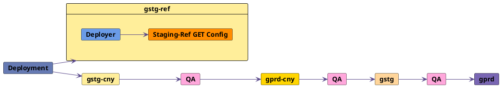

## Staging Ref

Staging Ref is a sandbox environment used for pre-production testing of the latest Staging Canary code with full access to the environment and control over data.

| **Name** | **URL** | **Purpose** | **Deploy** | **Database** | **Terminal access** | **Slack channel** |
| ---- | --- | ------- | ------ | -------- | --------------- | --------- |
| Staging Ref | [staging-ref.gitlab.com](https://staging-ref.gitlab.com/users/sign_in) | Pre-production testing | Frequently (Parallel to `gstg-cny`) | Separate and local | All engineers | [`#staging-ref`](https://gitlab.slack.com/archives/C02LN0K1N3Y) |

### Purpose

- Cover testing needs of Test Platform and Development teams in a production-like environment
- Admin testing access
  - Current Staging (`gstg`) has customer data which is a blocker for giving more access to Development and Test Platform teams.
- Testing different paid tiers
- Democratizing testing and better test data
- Better access to test accounts and wider permissions
- Performant sandbox environment for engineers

### Environment information

- [Geo](https://docs.gitlab.com/ee/administration/geo/) is setup on Staging Ref with these configurations:
  - Staging Ref US site - *primary* - [3k Cloud Native Hybrid Reference Architecture](https://docs.gitlab.com/ee/administration/reference_architectures/3k_users.html#cloud-native-hybrid-reference-architecture-with-helm-charts-alternative) environment - stateless components (Webservice, Sidekiq, NGINX) deployed to Google Kubernetes Engine cluster and the remaining stateful components installed to GCP virtual machines
  - Staging Ref EU site - *secondary* - [3k Reference Architecture](https://docs.gitlab.com/ee/administration/reference_architectures/3k_users.html) full Omnibus environment
- Deployed with [GitLab Environment Toolkit (GET)](https://gitlab.com/gitlab-org/gitlab-environment-toolkit) and [Deployer](https://ops.gitlab.net/gitlab-com/gl-infra/deployer)
- SSL Certificates automated with [Let's Encrypt](https://letsencrypt.org/)
- [Google OAuth](https://docs.gitlab.com/ee/integration/google.html) gives access to environment for GitLab team members
- [Outgoing email](https://docs.gitlab.com/charts/charts/globals.html#outgoing-email) configured with Mailgun
- [Advanced Search](https://docs.gitlab.com/ee/user/search/advanced_search.html) is configured with Elasticsearch and [GET](https://gitlab.com/gitlab-org/gitlab-environment-toolkit/-/blob/main/docs/environment_advanced.md#advanced-search-with-elasticsearch)
- Ultimate license with [Free paid plan by default](#upgrade-paid-plans)
- [Sentry](https://new-sentry.gitlab.net/organizations/gitlab/projects/staging-ref/) configured for error reporting
- [Snowplow](https://docs.gitlab.com/ee/development/internal_analytics/internal_event_instrumentation/local_setup_and_debugging.html#configure-a-remote-event-collector) tracking is enabled and collected to `snowplow.trx.gitlab.net`

#### Deployment process

Staging Ref deployment runs parallel to Staging Canary deployment. [Deployer](https://ops.gitlab.net/gitlab-com/gl-infra/deployer) triggers a job in [Staging-Ref GET Config](https://ops.gitlab.net/gitlab-org/quality/gitlab-environment-toolkit-configs/staging-ref) to update the environment. Notifications about new deployments are sent to the [`#announcements`](https://gitlab.slack.com/archives/C8PKBH3M5) Slack channel.

Staging Ref pipelines do not block the deployment. If there are any failures with deployment to `gstg-ref`, please reach out to `@release-managers`.

### How to use Staging Ref

Staging Ref is a safe playground for engineers who want to test latest Staging(`gstg-cny`) code. Staging Ref has several advantages that allow it to be a full-fledged sandbox environment:

- Staging Ref deployments do not block the deployment process and can be tweaked or updated by any GitLab engineer. Hence GitLab engineers have wide permissions and full control over the environment.
- Environment follows 3k hybrid architecture, so it is more performant than existing Staging(`gstg`) and could be used for load testing if needed.

To sign in to the environment, navigate to [staging-ref.gitlab.com](https://staging-ref.gitlab.com/users/sign_in) and use your GitLab Google account in 'Sign in with Google' option.

After signing in you can proceed using the environment as required. If destructive changes were done to the environment or it ended up in a bad state after testing, create a request to rebuild the environment. Please reach out to the [`#staging-ref`](https://gitlab.slack.com/archives/C02LN0K1N3Y) Slack channel or raise an issue in [Staging-Ref GET Config](https://gitlab.com/gitlab-org/quality/gitlab-environment-toolkit-configs/staging-ref). The process is automated with [Staging-Ref GET Config](https://gitlab.com/gitlab-org/quality/gitlab-environment-toolkit-configs/staging-ref) and will take about an hour to finish.

#### Enable Feature Flags

[ChatOps commands](/handbook/support/workflows/chatops/#feature-flags) can be used to enable or disable Feature Flags on Staging Ref. You can run this command in the [`#staging-ref`](https://gitlab.slack.com/archives/C02LN0K1N3Y) Slack channel.

#### Admin access

To promote your user to Admin, please sign in as Admin using the `Staging Ref credentials` from 1Password `Engineering` vault. Then navigate to the [Admin Area's Users page](https://docs.gitlab.com/ee/administration/admin_area.html#administering-users) and edit your user's Access Level.

Note that Staging Ref environment is shared across all engineers. If you plan to perform changes to GitLab Admin settings, use the [`#staging-ref`](https://gitlab.slack.com/archives/C02LN0K1N3Y) Slack channel to communicate changes broadly.

#### SSH access and Rails console

If you have `gcloud` or `kubectl` set up locally, then follow [Connect from your local terminal](#connect-from-your-local-terminal). If not, then you can opt to [connect via your browser](#connect-via-your-browser).

##### Connect via your browser

1. Get [access to the GCP project `gitlab-staging-ref`](#request-access-to-gcp-project-and-environment)
1. Visit [`gitlab-toolbox`](https://console.cloud.google.com/kubernetes/deployment/us-east1-c/staging-ref-3k-hybrid-us/default/gitlab-toolbox/overview?project=gitlab-staging-ref) workload in the `gitlab-staging-ref` project
1. In the **Managed pods** section, click on the **Name** of a Running pod. For example, the **Name** looks like `gitlab-toolbox-5955db475c-ng2xr`.
1. Click the **Kubectl** dropdown near the top
1. Hover over **Exec** to reveal a sub menu
1. Click **toolbox**
1. A Cloud Shell should start up
1. Edit the command `kubectl exec -it gitlab-toolbox-5955db475c-ng2xr -- bash` (the toolbox will have a different suffix) to execute the `bash` command with the [interactive and TTY options](https://docs.docker.com/reference/cli/docker/container/exec/).
1. At this point, you should be logged in to the toolbox pod. For Rails console, run `gitlab-rails console`.
1. See [Kubernetes cheat sheet](https://docs.gitlab.com/charts/troubleshooting/kubernetes_cheat_sheet.html#gitlab-specific-kubernetes-information) for more

##### Connect from your local terminal

1. Navigate to the [staging-ref cluster](https://console.cloud.google.com/kubernetes/clusters/details/us-east1-c/staging-ref-3k-hybrid-us/details?project=gitlab-staging-ref&cloudshell=false) or to the [staging-ref geo cluster](https://console.cloud.google.com/kubernetes/clusters/details/europe-west6-c/staging-ref-3k-hybrid-eu/details?cloudshell=false&project=gitlab-staging-ref)
1. Click **Connect**
1. Copy the command and run it locally to get `kubeconfig`
1. Follow [Kubernetes cheat sheet](https://docs.gitlab.com/charts/troubleshooting/kubernetes_cheat_sheet.html#gitlab-specific-kubernetes-information)
1. Also see [additional developer tools](https://docs.gitlab.com/charts/development/environment_setup.html#additional-developer-tools)

#### Request access to GCP project and environment

If you need access to Staging Ref components in the GCP project(`gitlab-staging-ref`), please reach out in the `#staging-ref` Slack channel. Someone can add you to [`gcp-staging-ref-sg@gitlab.com` Google group](https://groups.google.com/a/gitlab.com/g/gcp-staging-ref-sg/members).

As another option you can create an issue in [the access-request project](https://gitlab.com/gitlab-com/team-member-epics/access-requests/-/issues/new?issuable_template=Individual_Bulk_Access_Request). Requests for access to server environments requires the approval of your manager and an Infrastructure manager.

Note that GitLab configuration changes will be overwritten by a new deployment to the environment. Environment updates can be locked if needed by a request to `@release-managers` in the `#staging-ref` Slack channel.

A simplified process to request SSH access to Staging Ref virtual machines and the GKE cluster is being worked on in [issue#343938](https://gitlab.com/gitlab-org/gitlab/-/issues/343938).

#### Trigger E2E test pipelines

The full or smoke E2E test suite may be triggered on demand in the [staging-ref](https://ops.gitlab.net/gitlab-org/quality/staging-ref/-/pipeline_schedules) project. Results will also be posted to the `#staging-ref` Slack channel.

#### Monitoring

Monitoring implementation was done in ([epic#594](https://gitlab.com/groups/gitlab-com/gl-infra/-/epics/594)). Documentation can be found in the [runbooks](https://gitlab.com/gitlab-com/runbooks/-/blob/master/docs/staging-ref/get-monitoring-setup.md).

Dashboards for Staging Ref can be found in Grafana under the [staging-ref folder](https://dashboards.gitlab.net/d/Fyic5Wanz/server-performance?orgId=1). There are other existing dashboards which may also show Staging Ref information if you select `environment=gstg-ref`.

The Geo secondary site is running Grafana at <https://geo.staging-ref.gitlab.com/-/grafana>. Credentials can be found in `EU site monitoring` section in `Staging Ref credentials` in 1Password `Engineering` vault.

If you need a specific dashboard or an existing dashboard does not work please reach out to [`#staging-ref`](https://gitlab.slack.com/archives/C02LN0K1N3Y) channel.

#### Upgrade paid plans

By default, all users and groups are on the `Free` plan. To upgrade a paid plan use [Admin account](#admin-access) and do the following:

1. Navigate to [Admin area](https://docs.gitlab.com/ee/administration/).
1. Select Users or Groups section depending on what entity you would like to upgrade.
1. Search for user or group by name and click "Edit".
1. Select the required paid plan in "Plan".
1. Click "Save changes".

Watch [this demo](https://gitlab.com/gitlab-org/gitlab/uploads/43733f0e0b58ded0e964909cfe4489e8/admin_paid_plan.gif) to see an example when a group was promoted to Premium plan.

#### Pre-existing test accounts

Staging Ref environment has pre-existing accounts that can be used for testing. For example, Admin accounts on different paid plans, Auditor user, QA users. All credentials are stored in `Staging Ref credentials` in 1Password `Engineering` vault.

#### Working with a SAML SSO enabled group

An Okta application has been setup to act as SAML idP for [https://staging-ref.gitlab.com/groups/saml-sso-group](https://staging-ref.gitlab.com/groups/saml-sso-group).
Two users with names `gitlab-qa-saml-sso-user1` and `gitlab-qa-saml-sso-user2` have been created and added to Okta and assigned the application. These users are also available in staging-ref environment.

Please note that all credentials and values for fields mentioned below are saved in 1Password Engineering Vault in "Staging Ref credentials" under "User credentials for saml-sso-group Group".

For using SAML SSO, you will need to:

1. As an [admin](#admin-access), create the group at [https://staging-ref.gitlab.com/groups/saml-sso-group](https://staging-ref.gitlab.com/groups/saml-sso-group) if it does not already exist.
1. [Upgrade the pricing plan](#upgrade-paid-plans) of this group to "Premium".
1. Visit [https://staging-ref.gitlab.com/groups/saml-sso-group/-/saml](https://staging-ref.gitlab.com/groups/saml-sso-group/-/saml) and:

   - Check "Enforce SSO-only authentication for web activity for this group"
   - Update the value of "Identity provider single sign-on URL" to the value saved in 1Password
   - Update the value of "Certificate fingerprint" to the value saved in 1Password

1. Save the changes.
1. Sign out.

The first time you visit [https://staging-ref.gitlab.com/groups/saml-sso-group](https://staging-ref.gitlab.com/groups/saml-sso-group) and try to log in, you will be asked to sign in to GitLab with an existing account to
link the SAML identity. Use username `gitlab-qa-saml-sso-user1` or `gitlab-qa-saml-sso-user2` to sign in. The credentials are in 1Password.

### Future iterations and known limitations

Staging Ref environment has some known limitations that will be worked on:

- Test data configuration will be explored ([epic#7020](https://gitlab.com/groups/gitlab-org/-/epics/7020))
- Configure Shared Runners ([issue#353284](https://gitlab.com/gitlab-org/gitlab/-/issues/353284))
- Setup Kibana for Staging Ref([issue#351816](https://gitlab.com/gitlab-org/gitlab/-/issues/351816))
- Configure CustomersDot portal for Staging Ref ([issue#352594](https://gitlab.com/gitlab-org/gitlab/-/issues/352594))
- Incoming email setup ([issue#348970](https://gitlab.com/gitlab-org/gitlab/-/issues/348970))
- Configure Unified URL on Staging Ref ([issue#370312](https://gitlab.com/gitlab-org/gitlab/-/issues/370312))
- Load testing ([issue#344223](https://gitlab.com/gitlab-org/gitlab/-/issues/344223), [issue#344224](https://gitlab.com/gitlab-org/gitlab/-/issues/344224))
- Increase Staging Ref adoption and gather feedback - ([issue#350744](https://gitlab.com/gitlab-org/gitlab/-/issues/350744))
- Configure Pages on Staging Ref ([issue#383243](https://gitlab.com/gitlab-org/gitlab/-/issues/383243))

Other outstanding work for Staging Ref is tracked [in GitLab issue tracker](https://gitlab.com/groups/gitlab-org/-/issues/?sort=updated_desc&state=opened&label_name%5B%5D=staging-improvements&label_name%5B%5D=Future&first_page_size=20).

### Feedback

If you need some additional custom configuration for Staging Ref to be explored or you have other feedback and ideas for improvements, please reach out to [`#eng-allocation-new-staging`](https://gitlab.slack.com/archives/C02BA0YKRUH) Slack channel or add a comment to the feedback [issue#350744](https://gitlab.com/gitlab-org/gitlab/-/issues/350744).
