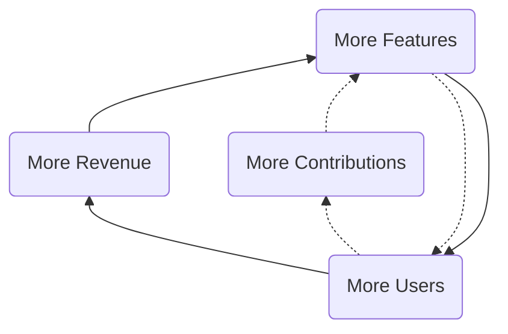
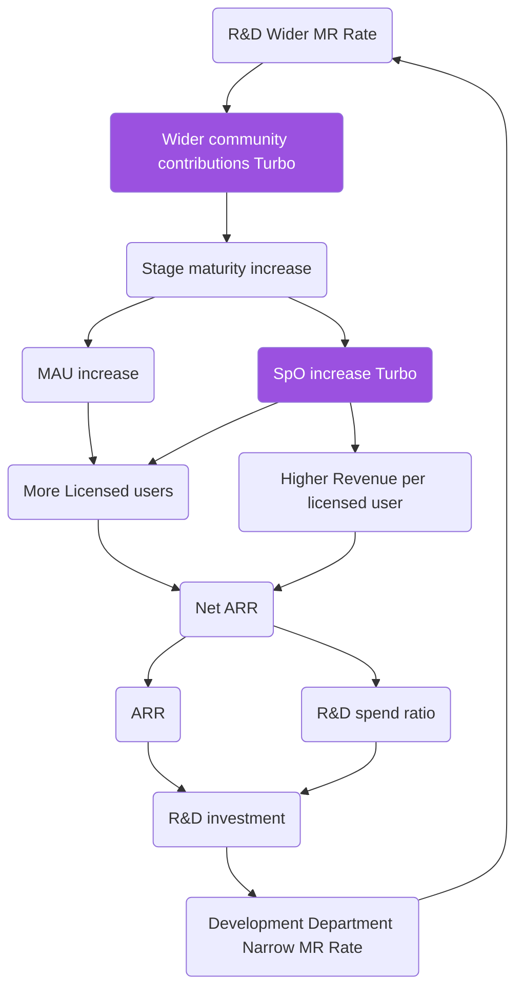

## Current strategy

**[Current strategy is in the internal handbook](https://internal.gitlab.com/handbook/company/three-year-strategy/).** The rest of this page desribes the strategy process.

## Three Year Outlook

Our strategy is looking 3 years out and [fits into our cadences](/handbook/company/cadence/#strategy). It also maps to and reflects GitLab's [mission](/handbook/company/mission/), [vision](/handbook/company/vision/) and [values](/handbook/values/). It is a living strategy, so we will revisit on a regular basis and [iterate](/handbook/values/#iteration) when there is reason to do so.

Along the road to realizing our mission of **everyone can contribute**, our
strategic goal is to be the leading complete [DevSecOps Platform](https://about.gitlab.com/solutions/devops-platform/). We help our customers build better software faster including developing cloud native applications, building mobile applications, and incorporating machine learning and artificial intelligence into their products and solutions. We believe that our [dual flywheels](#dual-flywheels) (single application + open-core model) will propel us to efficiently be the default choice in the Enterprise market.

As we execute on our strategy, it is important to use our financial targets as guide rails and mature our internal processes for building a durable business for the long-term.

## Principles

1. Fast follower: we don't have to be first to market and we don't suffer from Not Invented Here (NIH)
1. Values: make decisions based on [our values](/handbook/values/), even if it is inconvenient.
1. Reach: go for a broad reach, no focus on business verticals or certain programming languages.
1. Seed then nurture: [plant seeds and nurture the product to build out depth](#seed-then-nurture).
1. Speed: ship every change in the next release to maximize responsiveness and learning.
1. Life balance: we want people to stay with us for a long time, so it is important to [take time off](/handbook/people-group/paid-time-off/) and work on life balance; being [all-remote](/handbook/company/culture/#all-remote-work) is a large part of the solution.
1. Open Source Stewardship: be a good [steward of GitLab](/handbook/company/stewardship/) and [collaborate with the wider community](https://about.gitlab.com/community/contribute/) to [improve the product together](/handbook/engineering/development/performance-indicators/#mr-rate).

### Seed then nurture

Our GitLab product [vision](https://about.gitlab.com/direction/#vision) is to deliver a single application for the entire DevOps lifecycle.  This is a very expansive product vision that requires us to build an enormous amount of product surface area.  Because we want to be efficient with capital, we want to build GitLab as a community. When we are early in a particular area of the product, we will plant seeds by shipping a small [MVC](/handbook/values/#minimal-viable-change-mvc). Shipping functionality that is incomplete to expand the scope sometimes goes against our instincts. However, planting those seeds even in an incomplete state allows others to see our path and contribute. With others contributing, we'll iterate faster and will accelerate the [maturity](https://about.gitlab.com/direction/maturity/) of our offering faster than GitLab could on its own.  We can have a **long tail** of categories that are at a minimal [maturity](https://about.gitlab.com/direction/maturity/) that don't get investment until they show traction. While these come with a [low level of shame](/handbook/values/#low-level-of-shame) they allow the wider community to contribute and people to express interest. It is much more common for people to contribute to categories that already exist and express interest in categories already shipping in the product. A minimal category is the placeholder to channel energy, and it is our responsibility to till the earth with minimal iterations.

GitLab the product should eventually have depth in every category it offers.  To build out real depth requires a shift in focus, from planting seeds to nurturing the product area to maturity. We should concentrate our nurture investments in the categories that have demonstrated [monthly active usage](/handbook/product/performance-indicators/#structure), revenue contribution, and demonstrated customer demand.  As a product team, we'll be particularly focused on driving monthly active usage at the stage and group level.  This should lead to more Stages per Organization, which is important as each stage added [triples paid conversion](https://about.gitlab.com/direction/#product-strategy)!  We'll also be heavily focused on driving usability, by measuring our [system usability score](/handbook/product/ux/ux-resources/#system-usability-score), which is a measure of the user perception of GitLab's usability.

If we effectively seed and then nurture, we can fully activate GitLab's [two growth turbos](/handbook/company/strategy/#flywheel-with-two-turbos), by creating wider community contributions and driving more stages per user.

## Assumptions

1. [Open source user benefits](http://buytaert.net/acquia-retrospective-2015): significant advantages over proprietary software because of its faster innovation, higher quality, freedom from vendor lock-in, greater security, and lower total cost of ownership.
1. [Open Source stewardship](/handbook/company/stewardship/): the wider community comes first, we [play well with others](/handbook/product/gitlab-the-product/#plays-well-with-others) and share the pie with other organizations commercializing GitLab.
1. [Innersourcing](https://about.gitlab.com/blog/2014/09/05/innersourcing-using-the-open-source-workflow-to-improve-collaboration-within-an-organization/) is needed and companies will choose one solution top-down.
1. A single application where [interdependence creates exceptional value](https://medium.com/@gerstenzang/developer-tools-why-it-s-hard-to-build-a-big-business-423436993f1c#.ie38a0cls) is superior to a collection of tools or a network of tools. Even so, good integrations are important for network effects and making it possible to integrate GitLab into an organization.
1. To be sustainable we need an open core model that includes a proprietary GitLab EE.

## Pricing

Please see our [pricing model](/handbook/company/pricing/) for details

## Dual flywheels

GitLab has two flywheel strategies that reinforce each other: our open core flywheel and our development spend flywheel.
A flywheel strategy is [defined as](https://medium.com/evergreen-business-weekly/flywheel-effect-why-positive-feedback-loops-are-a-meta-competitive-advantage-6d0ed55b67c5) one that has positive feedback loops that build momentum, increasing the payoff of incremental effort.
You can visualize how the flywheels work in congruence via the diagram below. The KPI and responsibilities table lists the relevant indicator and department for every part of the flywheel.

In the open core flywheel, more features drive more users which in turn drive more revenue and more contributions which lead to more users.

The driving force behind the flywheel is that by using a DevOps platform to replace multiple point solutions, GitLab customers can achieve cost saving and efficiency gain. Therefore, when GitLab develops more features to improve the product maturity, it becomes easier to replace point solutions and GitLab will attract more users.

### KPIs and Responsible departments

| Part of flywheel | Key Performance Indicator (KPI) | Department |
|-----------------|---------------------------------|------------|
| More Users | [Stage Monthly Active Users](/handbook/product/performance-indicators/) | Product |
| More Contributions | [Unique Wider Community Contributors per month](/handbook/engineering/quality/performance-indicators/#unique-wider-community-contributors-per-month) | Developer Relations and Engineering |
| More Contributions | [MRARR](/handbook/engineering/quality/performance-indicators/#mrarr) | Developer Relations and Engineering |
| More Contributions | [Wider community contributions per release](/handbook/marketing/developer-relations/performance-indicators/#wider-community-merged-mrs-per-release) | Developer Relations and Engineering |
| More Features | [Merge Requests per release per engineer in product development](/handbook/engineering/development/performance-indicators/#average-mrs-development-engineers-month) | Engineering and Product Management |
| More Revenue | [IACV](/handbook/sales/#incremental-annual-contract-value-iacv) vs. plan | Sales and Marketing |

### Flywheel with two turbos

GitLab is a [complete DevOps platform](https://about.gitlab.com/solutions/devops-platform/), delivered as a [single application](/handbook/product/single-application/), with [contributions from the wider community](https://about.gitlab.com/community/contribute/).

Compared to other DevOps platforms, GitLab leverages one or two unique turbos that boost the company:

1. [Advantages of a single application](/handbook/product/single-application/), leading to more [Stages per Organization](/handbook/product/performance-indicators/#stages-per-organization-spo)
1. [Open Source stewardship](/handbook/company/stewardship/), leading to [Wider community contributions](https://about.gitlab.com/community/contribute/)

The advantage of a single application manifests itself if people start using more stages of the application.
In the graph below this is visualized with [Stages per Organization (SpO), knowing that an organization using an extra stage triples conversion](https://about.gitlab.com/direction/#product-strategy).
Increasing SpO drives both more seats and higher revenue per seat.

In the development spend flywheel, we capture the relationship between merge requests (MRs), changes in ARR from one period to the next (Delta ARR), hyper growth R&D spend and the resulting impact on MRs. We see that more MRs increase stage maturity which drives more monthly active users and stages per user which in turn drives more seats and more revenue which funds R&D spend and leads to more MRs.

Legend with links to the relevant metrics:

1. [Wider community contributions Turbo](/handbook/marketing/developer-relations/performance-indicators/#wider-community-merged-mrs-per-release)
1. [R&D Overall MR Rate](/handbook/engineering/performance-indicators/#rd-overall-mr-rate)
1. [Stage maturity](https://about.gitlab.com/direction/maturity/) increase
1. [MAU](/handbook/product/performance-indicators/) increase
1. [SpO](/handbook/product/performance-indicators/#stages-per-organization-spo) increase Turbo which is only possible in a [single application with multiple stages](/handbook/product/single-application/)
1. More [Licensed users](/handbook/sales/#licensed-users) is due to an increase in unlicensed users (MAU) and the increase in [SpO](/handbook/product/performance-indicators/#stages-per-organization-spo) leading to a higher conversion from free to paid and a higher gross retention.
1. Higher [Revenue per licensed user](/handbook/sales/#revenue-per-licensed-user-also-known-as-arpu) due to the [Advantages of a single application](/handbook/product/single-application/)
1. [Net ARR](https://docs.google.com/document/d/1UaKPTQePAU1RxtGSVb-BujdKiPVoepevrRh8q5bvbBg/edit#bookmark=id.a35sth38hahw) stands for Annual Recurring Revenue is our [most important KPI](/handbook/company/kpis/#gitlab-kpis)
1. [ARR](/handbook/sales/#annual-recurring-revenue-arr) stands for Annual Recurring Revenue and IACV increases it.
1. R&D spend ratio becomes higher if the growth rate is higher due to the [Hypergrowth Rule](/handbook/finance/financial-planning-and-analysis/hypergrowth-rule/)
1. R&D investment is the amount of money spend on Product Management and Engineering excluding Support
1. [Development Department Narrow MR Rate](/handbook/engineering/development/performance-indicators/#development-department-narrow-mr-rate)

## Publicly viewable OKRs and KPIs

To make sure our goals are clearly defined and aligned throughout the organization, we make use of [Objectives and Key Results (OKRs)](/handbook/company/okrs/) and [Key Performance Indicators (KPIs)](/handbook/company/kpis/) which are both publicly viewable.

## North Star KPI

Our North Star KPI is [revenue](/handbook/company/kpis/#sales-kpis) vs. plan. While our revenue data is [limited access](/handbook/communication/confidentiality-levels/#limited-access) given that it is [material nonpublic information (MNPI)](/handbook/product/product-safe-guidance/#materially-non-public-information), revenue versus plan is a leading indicator of our likelihood of success in achieving revenue targets. Predictable revenue attainment is critical for continued business success.

## Plan

Our yearly plans are linked from the [relevant cadence section](/handbook/company/cadence/#year).

### How will the three year strategy process work

1. The first phase of the strategy process is the Market Vision, SWOT and Positioning Strategy.
   1. Market Vision is our shared view of the market over the next ~3 years. Where is the market headed? What factors are influencing the market direction? Where are the points of change, as these will be the points of control?
   1. SWOT stands for Strengths, Weaknesses, Opportunities and Threats.
   1. Positioning strategy will highlight the way we want to position the company over the next three years. This will drive key decisions and tradeoffs we need to make in the strategy.
1. The second phase of the strategy process is taking the SWOT, positioning strategy and define the go-to-market (GTM), Product and Operations strategy. The output of these three strategies will be the strategic priorities for each, capabilities needed that we have and that we need to develop and the things we will explicitly not do.  In addition we will define 3-5 big bets the company will take - this will fold in under the strategic themes. Once we have these 3 to 5 themes we will synthesize them into a corporate strategy that ensures alignment among GTM, Product and Operations strategy.
1. Third phase will be the [Long Range Plan](/handbook/finance/financial-planning-and-analysis/#long-range-outlook-lro) process.
1. Fourth phase will be defining yearlies and the [annual operating plan](/handbook/finance/financial-planning-and-analysis/#plan).

### Big Bet Process

Activity

Positioning and SWOT published in [internal handbook](https://internal.gitlab.com/handbook/company/swot-and-positioning/) with description of strategy process two weeks post offsite

- May 15th eGroup review (Complete)

eGroup capability gap exercise at eGroup offsite (prework)

- Stella
- Complete: Jun 28th

Complete capability gap exercise at VP level to bring more input into the group

- Directs Group
- Drafts: July 12th
- Final: July 19th

Pull together comprehensive view of capabilities from eGroup and VP sessions
Craig/Dave

- July 24th

eGroup June Virtual Offsite Sessions:

- Decide on GTM, Ops and Product strategies
- Decide on top capabilities for investment (feed into LRO)
- Craig/Dave
- Aug 1-3rd

Kickoff LRO with inputs from this process
