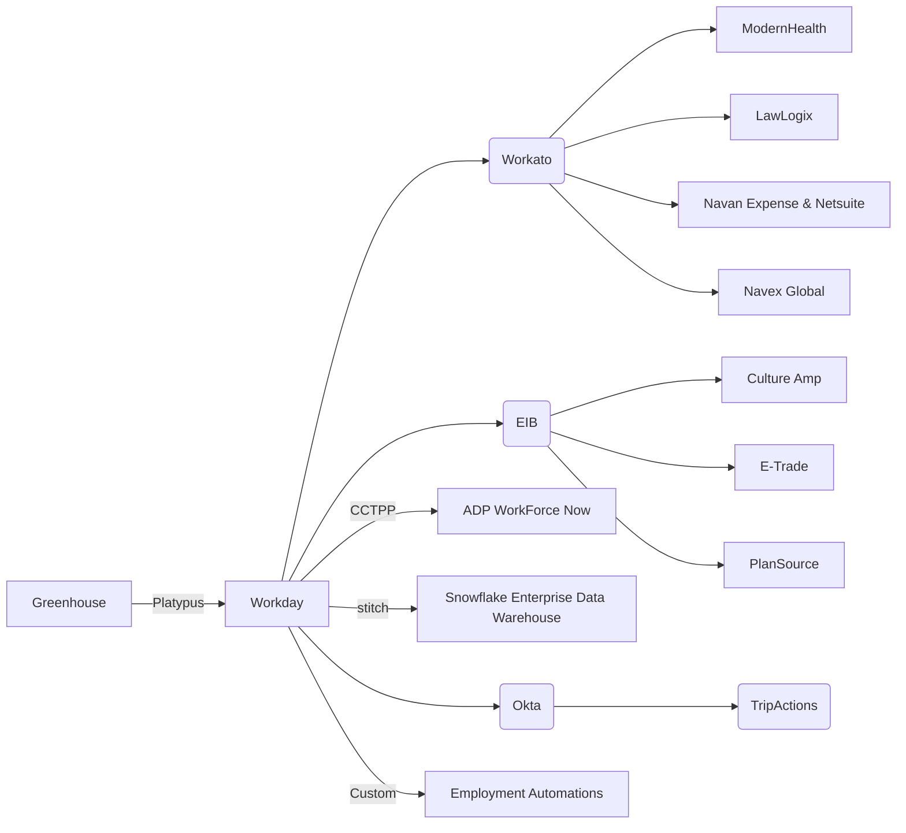

## People Group Tech Stack Guide

> **Note:** Refer to the **[Tech Stack Index](/handbook/business-technology/tech-stack/)** to browse Apps and **[Tech Stack Applications](/handbook/business-technology/tech-stack-applications/)** to manage Apps.

{}

### Implementation

Workday is being implemented in 3 phases:

#### Phase 1 (completed)

**Go live date:** 2022-06-16

Modules/functionality being implemented:

- Human Capital Management (core team member information)
- Job change workflows and processes (onboarding, offboarding, job changes)
- Core Compensation
- Integrations with other applications across GitLab

| Workday will replace | Workday will enhance |Workday will integrate with |What remains the same in this phase|
| ------ | ------ |------ |------ |
| BambooHR (with a few exceptions to certain business processes) | Reporting, Auditing, Organization hierarchy, Management hierarchy, Business process workflows |Greenhouse, Culture Amp, Navan Expense, LawLogix, Modern Health, Navex, Netsuite, E-trade, ADP, Okta, Nominator bot, People Connect bot, Employment Automations | Time Off by Deel, BambooHR Documents, BambooHR Contractor Invoices |

> Details of each integration including frequency can be found in the [Workday Guide]()

#### Phase 2

**Go live date for:** 2022-10-14 (in progress)

Modules/functionality being implemented:

- Talent Optimization

**Go live date for:** 2023-01-06 (in progress)

Modules/functionality being implemented:

- Benefits - US Only
- Absence Management
- Advanced Compensation
- Integrations

| Workday will replace |
| ------ |
| Talent Assessment Tool, Compaas (Compensation planning tool), PlanSource, Internal Employment Automations |

#### Phase 3

**Go live date:** To be determined

Modules/functionality being implemented:

- Continuation of absence management plans

### System Diagrams

Workday is GitLab's new People technology cloud solution that will help us scale as we grow and is designed to provide a simple team member experience. It will replace our current BambooHR system.

### Integrations

> CCTP = Cloud Connect Third Party Payroll
> EIB = Enterprise Interface Builder

### Key Reports / Dashboards

[People Analytics Tableau Dashboards](/handbook/people-group/people-ops-tech-analytics/people-analytics/people-tableau/) - This is a location on the handbook that lists key dashboards that exist around People Data.
