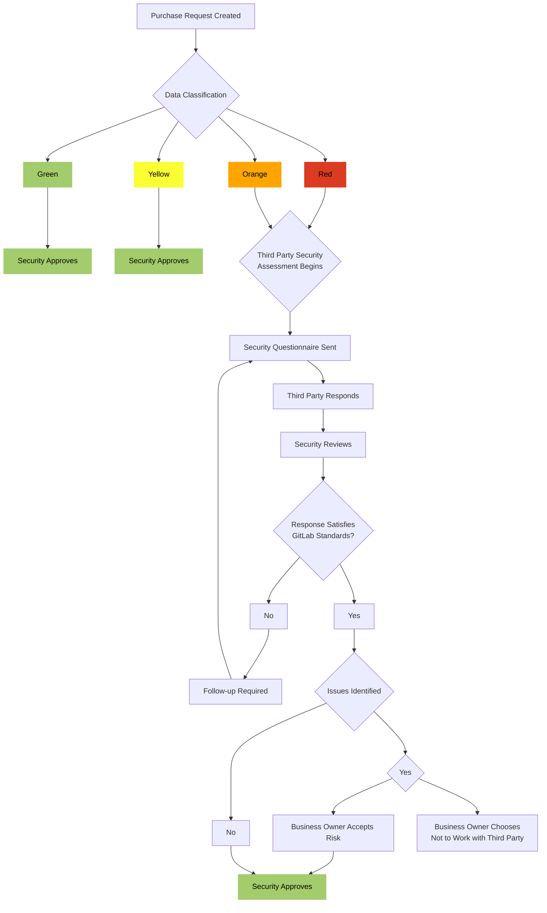

## GitLab's Integrated Third-Party Risk Management Program

GitLab maintains an industry-leading Third Party Risk Management (TPRM) Program through the use of automation, continuous monitoring, and deep integration across business functions to validate the security of GitLab data shared with external parties.

The integration of GitLab's TPRM program within the vendor Procurement flow enables cross-functional [collaboration](/handbook/values/#collaboration) between Privacy, Legal, IT, and People Operations to facilitate [transparent](/handbook/values/#transparency), risk-based decision making, Business and Stakeholder-focused [Results](/handbook/values/#results), and adherence to GitLab's Regulatory and [Compliance Obligations](/handbook/security/security-assurance/security-compliance/certifications/). The vendor relationships maintained through this program are leveraged to create efficiencies across the organization.

## Purpose

GitLab's Security Third Party Risk Management (TPRM) Program helps guard against security threats posed by third parties who have access to GitLab data or that of our customers. These risks may include data breaches, unauthorized use or disclosure, and corruption or loss of data. Adequate TPRM is a best practice that helps [mitigate security concerns](https://internal.gitlab.com/handbook/leadership/mitigating-concerns/#security-breach) and enables GitLab to meet our contractual obligations. TPRM also enables GitLab to meet regulatory requirements and standards related to ISO, SOX, GDPR and other state and federal laws requiring vendor oversight.

GitLab's Security TPRM program involves three components which are integrated in to our [Procurement](/handbook/finance/procurement/) processes:

1. Performing due diligence to ensure the third party implements safeguards to enforce data privacy and security.
    - This activity is performed via our Security Assessment Process.
1. [Contractually](/handbook/finance/procurement/#contracting) obligating the third party to implement these safeguards.
1. Monitoring third party safeguards and compliance with these contracted provisions.
    - Certain high risk Third Parties are reviewed annually while those posing lower risk are reviewed at intervals defined further within this document.

## Scope

This procedure applies to all third party providers that access, store, process or transmit GitLab data.

## Roles & Responsibilities

| Role | Responsibility |
| ------ | ------ |
| Security Risk Team |  Maintain a mechanism to intake and respond to TPRM Activities   Assess Third Party inherent and residual security risk   Inform business owners of the result of TPRM assessments |
| Business or System Owner |  [Describe the nature of the Third Party Relationship](/handbook/finance/procurement/#step-2-submit-your-zip-request)   Work with the Security Risk team to facilitate the TPRM review, to include remediation activities  * Ensure the responsiveness of the third party as part of the security review requirements |
| Security Assurance Management (Code Owners) | Responsible for approving significant changes and exceptions to this procedure |

## Security Considerations for Vendor Selection

Security is a top priority in GitLab's vendor selection process, and GitLab is committed to partnering with vendors who prioritize the protection of sensitive data and maintain robust security measures. As such, Security Risk thoroughly evaluates each vendor's security practices, including their adherence to industry standards, compliance with relevant regulations, and health of their BitSight security ratings. GitLab's aim is to establish partnerships with vendors who share our commitment to maintaining the highest standards of security to safeguard GitLab's data and uphold the trust of our stakeholders. Below are some examples of how Security Risk evaluates vendors of different types and some recommendations for vetting vendors when making purchasing decisions.

Software as a Service (SaaS)

When considering new software to address business needs and objectives, see below for some high level recommendations to leverage when evaluating the software's capabilities.

- Does the vendor support Single Sign-On (SSO) to enable team members to authenticate using their network credentials?
  - Security requires that software has the ability to integrate with Okta or Google Oauth for authentication.
- Does the vendor complete an annual independent third party audit of their security controls to show adherence to industry standards and best practices?
  - Security requires software vendors complete and share an annual independent third party audit of their security controls. Some examples of these are a [SOC 2 or ISO 27001 certification](/handbook/security/security-assurance/security-risk/third-party-risk-management/#acceptable-third-party-attestations).
- Does the vendor require an independent third party penetration test of their systems to identify and remediate vulnerabilities and weaknesses?
  - Security requires that vendors conduct annual independent penetration testing on all systems supporting their SaaS solution and attest to the remediation or mitigation of any High or Critical findings.

*Note: Proof of concept (Poc) and pilot software engagements may require the exchange of sensitive GitLab data and must adhere to the same evaluation of the vendor's security practices for new software requests. Security Risk recommends anonymizing sensitive GitLab data and ensuring contract language defines expectations and requirements around data security, [privacy considerations](/handbook/legal/privacy/), and [deletion of data](/handbook/finance/procurement/vendor-guidelines/vendor-agreement/#7-termination) after the PoC or pilot is complete.*

Professional Services

See below for high level recommendations to leverage when evaluating professional services vendors.

- Will GitLab documents be shared with the vendor?
  - Security recommends using GitLab's Google Drive to share sensitive data with external parties.
- Does the professional services vendor adhere to strict human resource security practices including acceptable use and data protection training, background screenings, and regular security awareness trainings?
  - GitLab requires professional service vendors have background screenings and security awareness training.
- Does the vendor perform work from personal devices?
  - Security requires that GitLab data is protected by adequate endpoint security controls.

 

## Procedure

Where GitLab controls, owns, or is otherwise responsible for data, the diagram below depicts TPRM procedures based on the [Data Classification]() of data shared with the third party.

{}

{}

### TPRM Assessment Requirements

The following table defines the procedures followed by TPRM engineers for vendors accessing or being transmitted different [classifications of GitLab data](). The below procedures are initiated during the [Procurement](/handbook/finance/procurement/#--what-is-the-procurement-process-at-gitlab) process and are followed in all instances where applicable vendors have not been reviewed within the approval windows defined below.

If a Security Notice was documented at the time of the previous assessment, inquiry should be performed with the vendor or relevant stakeholder to determine the current status of the identified risk(s). Any updates should be documented within the Security Notice Issue. This can be performed in tandem with the requisition or after its approval.

| Data Classification | Request | Supplemental Questionnaire | Okta SSO? | New BIA / Tech Stack Entry? | BitSight Review? | Evidence of PenTest and BCP Testing |
| ------ | ------ |------ |------ |------ |------ | ------ |
|Red     |3rd Party Attest & [SIG Lite Plus](https://docs.google.com/spreadsheets/d/1wvpY3oF8sG_UbnQzzlbXs85ahsfLiDQp/edit?usp=drive_link&ouid=103289635706160914358&rtpof=true&sd=true) (or equiv)|     Yes|          If applicable|     Yes|    If Applicable | Yes |
|Orange SaaS Systems or Locally Hosted/Installed Systems with Data Exchange| 3rd Party Attest & [SIG Lite Plus](https://docs.google.com/spreadsheets/d/1wvpY3oF8sG_UbnQzzlbXs85ahsfLiDQp/edit?usp=drive_link&ouid=103289635706160914358&rtpof=true&sd=true) (or equiv)|     Yes|          Yes|     Yes|     Yes | Yes |
| Orange Individual Use Software* | 3rd Party Attest or [SIG Lite Plus](https://docs.google.com/spreadsheets/d/1wvpY3oF8sG_UbnQzzlbXs85ahsfLiDQp/edit?usp=drive_link&ouid=103289635706160914358&rtpof=true&sd=true) (or equiv) | No | No | No | Yes | No|
|Orange Professional Services | 3rd Party Attest or [SIG Prof Svcs](https://docs.google.com/spreadsheets/d/1xiReZd5heUl5YVFCqPxEfXJIYlqtz_LS/edit?usp=drive_link&ouid=103289635706160914358&rtpof=true&sd=true)|          N/A|     N/A| N/A|   N/A | N/A|
|Yellow/Green     | N/A |  N/A |  N/A |     No | N/A  | N/A  |

*Professional Services vendors utilizing a web-facing application to collect and store GitLab sensitive data are generally treated as an Orange SaaS system.*

#### Material Changes

Material Changes to services provided to GitLab or to a vendor's security environment could present an increased risk that may not have been present at the time of the previous review. As such, requisitions for vendors within the [**Approval Window**](#tprm-approval-windows) of their previous assessment must be reviewed by the TPRM Engineer to determine whether a material change has occurred to the service(s) provided. Examples of these changes include:

1. **Change in data classification**, such as going from Yellow to Orange data classification.
1. **Addition of a new system not in the scope of the previous review.** For example, vendor XYZ was reviewed for procurement of their **Billing** system, but a new request has come in for the purchase of their **Revenue** system.
1. **Change of location where data is stored or transmitted**, such as migrating data from a GitLab-hosted environment to a vendor's SaaS solution.
1. **Addition of new contractors that are not subject to the vendor's security controls**.
1. **Introduction of new AI functionality within a system resulting in the addition of a new sub-processor**.

To determine whether the previous review provides assurance over the new service or system, review the previously-leveraged documentation for coverage or ask the vendor directly. If sufficient assurance does not exist, or the change is believed to introduce additional risk to GitLab, the Security Risk team may need to complete a new TPRM review prior to approving the requisition.

Vendors occasionally implement changes between contracting cycles that could introduce previously unidentified risks, such as the introduction of new AI features and/or [subservice providers](https://www.schellman.com/blog/soc-examinations/subservice-organizations-vs-vendors-within-soc). Team members should [notify the Security Risk team](/handbook/security/security-assurance/security-risk/#contact) when these changes occur, and if necessary may be directed not to allow, utilize, or enable such functionality until a new assessment has been completed. Upon notification of such changes, the Security Risk team will follow the above procedures to determine whether a new review is necessary.

**Note:** Circumstances may exist outside of those defined above that could necessitate further review. TPRM Engineers should use professional discretion in identifying these circumstances and perform additional review or validation as needed. Questions or concerns regarding the materiality of a change or the appropriate approval window should be escalated to the Security Risk Team within the #Sec-Assurance-Team channel.

### Usage of Artificial Intelligence (AI)

Usage of Artificial Intelligence (AI) services by GitLab Team Members carries unique Security, Privacy, and Legal implications and is governed by [GitLab's AI Acceptable Use Policy](/handbook/product/ai-strategy/ai-integration-effort/legal_restrictions/#acceptable-use-of-ai-services-and-gitlab-features). While TPRM has integrated procedures to gain assurance over the security of AI functionality, we may be unable to make determinations in some scenarios as to whether usage of these services is in alignment with GitLab's AI Acceptable Use Policy. As such, TPRM may engage the Legal and CorpSec teams prior to requisition approval to understand whether the usage of this functionality could result in additional risks. Adverse findings by these teams may result in denial of the requisition by the TPRM Engineer.

### Acceptable Third-Party Attestations

GitLab obtains and reviews third-party attestations to provide assurance over the design and operating effectiveness of a service provider's internal control environment. These attestations commonly include, but are not limited to, an ISO 27001 certificate or a Service Organization Control (SOC) 2 Type 2 report. Alternate forms of attestations can be leveraged in the absence of these more common documents, though diligence should be performed by the assessor in determining whether the attestation provides sufficient coverage over the control environment and aligns with our assessment criteria.

**ISO 27001:** An ISO 27001 certificate can be leveraged as evidence of compliance with industry-standard security best practices. Though review of the certificate itself is not revelatory to the specific controls in place at the organization, the presence of a valid ISO 27001 certificate providing coverage over applicable services indicates that an external certifying body has performed testing to validate the design and operating effectiveness of controls related to the management team's continued performance of the following:

- Systematic examination of the organization's information security risks, taking account of the threats, vulnerabilities, and impacts;
- Design and implementation of a coherent and comprehensive suite of information security controls and/or other forms of risk treatment (such as risk avoidance or risk transfer) to address those risks that are deemed unacceptable; and
- Adoption of an overarching management process to ensure that the information security controls continue to meet the organization's information security needs on an ongoing basis. ([Source](https://en.wikipedia.org/wiki/ISO/IEC_27001#:~:text=2020.%5B5%5D-,How%20the%20standard%20works,-%5Bedit%5D))

*Be aware that ISO 27001 certificates include an expiration date. Once this date has passed, the certificate is no longer valid and should not be leveraged in our assessment.*

**SOC 2 Type 2:** The SOC 2 Type 2 report is the preferred attestation when assessing third party risk, as this report details  the design of an organization's information system and how various forms of risk are addressed. This report not only details the controls in place within an organization, but it also includes independent validation of whether or not each of those controls functioned effectively during the audit period. This report should be reviewed to validate the following:

- The report provides coverage over the service being provided to GitLab;
- The report was issued within the last 12 months;
  - If the most recent report is older than 12 months, a Bridge Letter should be obtained to provide assurance that material changes have not occurred to the vendor's control environment since the report's issuance.
- The report is issued without a qualified opinion or exceptions otherwise impacting the security of GitLab data.
  - A report designated as "qualified" indicates that one or more controls assessed were found to be inadequately designed or implemented during the audit period. The nature of the qualification should be reviewed and understood to determine whether the control failure could impact the security of GitLab data, and if so should be reported to the Business Owner via TPRM Security Notice.
  - Exceptions may be identified within the report that do not result in the issuance of a qualified opinion, though any exceptions should still be reviewed for the following to determine if they may present a risk to GitLab data:
    - **Nature of the Exception:** The related control and the exception itself should be reviewed to determine whether GitLab relies upon that control to safeguard our data.
    - **Management's Response:** A management response is often included to address the reason for the exception and any steps that have been taken to address and remediate it. This may be accompanied by re-testing performed by the external auditor to validate that remediation was successful.
  - These items, if present, should be noted within the TPRM Assessment Report. If the nature of the qualification or exception is found to impact GitLab's security, and management's response provides insufficient assurance that remediation steps have been taken, this should be reported to the Business Owner via the TPRM Security Notice Process.

**SOC 2 Type 1:** The SOC 2 Type 1 report is often published as part of a preliminary assessment during the SOC 2 Type 2 "readiness" process. This is a limited scope, point in time assessment of the design of controls in place within a service provider's environment, and **does not include a validation of control operating effectiveness. As such, the Type 1 report should not be leveraged on its own to address our third-party attestation requirements for Orange SaaS / Red systems**, however it may be leveraged in addition to an ISO 27001 certificate or equivalent attestation in providing assurance over a service provider's environment.

### The Standard Information Gathering (SIG) Questionnaire

The Security Risk Team leverages the [Standard Information Gathering (SIG)](https://sharedassessments.org/sig/) Questionnaire to gain a more in-depth understanding of a vendor's Security environment beyond what is attained by reviewing a Third-Party Attestation such as an ISO certification or SOC-2 report. Responses within the SIG questionnaire, or an equivalent document such as a CAIQ, should be reviewed alongside the vendor's third-party attestation (if available) and their responses to our Security Questionnaire when assessing the Security environment in place within the service organization.

Security Risk maintains multiple templated versions of the SIG questionnaire for use depending on the product or service being assessed, as some vendors may not have a SIG questionnaire or equivalent to provide. The SIG templates include instructions noting that we only require Inquiry responses within Columns D and E of the main questionnaire tab, as additional requests for information or documentation within the SIG are generally not required. Note that potential fringe cases *could* exist wherein professional discretion may dictate the necessity for additional documentation requests to supplement vendor responses. Further, professional discretion should be applied when making decisions as to which version of the SIG questionnaire should be sent. For cases in which the level of review required is unclear, engineers are encouraged to discuss with the @Security-Risk team in the #Sec-Assurance-Team channel to come to a decision considering factors such as the services offered, data exchanged and the outcome of previous assessments.

{}

- [SIG Lite Plus](https://docs.google.com/spreadsheets/d/1wvpY3oF8sG_UbnQzzlbXs85ahsfLiDQp/edit?usp=drive_link&ouid=103289635706160914358&rtpof=true&sd=true)
  - The SIG Lite Plus questionnaire is leveraged most commonly and should be utilized for all Red vendors and Orange SaaS systems. We refer to our SIG Lite as the "SIG Lite Plus" as it includes full scope SIG questionnaires for domains "E. Human Resource Security and V. Cloud Services". All other domains include standard SIG Lite content. Our objective here is to obtain additional information related to cloud security and the use of personal computers and employee background checks.
  - The following 20 domains are included within the scope of the SIG Lite Plus questionnaire:
    - A. Enterprise Risk Management
    - B. Nth Party Management
    - C. Information Assurance
    - D. Asset and Info Management
    - E. Human Resources Security (Full SIG Content)
    - F. Physical and Environmental Security
    - G. IT Operations Management
    - H. Access Control
    - I. Application Management
    - J. Cybersecurity Incident Mgmt
    - K. Operational Resilience
    - L. Compliance Management
    - M. Endpoint Security
    - N. Network Security
    - O. Environmental, Social, Governance (ESG)
    - P. Privacy Management
    - R. Artificial Intelligence
    - S. Supply Chain Risk Mgmt
    - T. Threat Management
    - U. Server Security
    - V. Cloud Services (Full SIG Content)
{}

{}

- [SIG Professional Services](https://docs.google.com/spreadsheets/d/1xiReZd5heUl5YVFCqPxEfXJIYlqtz_LS/edit?usp=drive_link&ouid=103289635706160914358&rtpof=true&sd=true)
  - The Professional Services SIG Lite Plus questionnaire features a reduced scope and can be leveraged for scenarios in which an **Orange** vendor is only providing contracted services or services not otherwise resulting in the introduction of a system being transmitted sensitive GitLab data. In these cases it may not be necessary to perform a full-scope review of the vendor's Security environment, as many controls within the full SIG Lite questionnaire may not apply or present a material risk to GitLab data.  **Please note this guidance applies only to Orange professional services providers. Service providers being granted access to Red data in the provision of services should be assessed utilizing the SIG Lite Plus questionnaire defined above due to the greater obligation for Data Security with these providers.**
  - The following domains are included within the scope of the Professional Services SIG Lite Plus questionnaire.
    - D. Asset and Info Management
    - E. Human Resources Security (Full SIG Content)
    - F. Physical and Environmental
    - H. Access Control
    - L. Compliance Management
    - M. Endpoint Device Security
    - N. Network Security
    - P. Privacy Management
    - T. Threat Management

{}

{}
Vendor responses documented within the SIG questionnaire should be reviewed in the context of the services provided by the vendor, with care taken to understand the broader control environment and how certain control deficiencies may be mitigated by other existing controls. For example, a vendor that does not rely on 3rd party service providers in the provision of services would be unlikely to maintain a Third Party Risk Management program, which is unlikely to pose a risk to GitLab in the broader context of services being provided. Significant deviations such as this should be flagged during the review and noted within the SIG questionnaire with an explanation on why the deficiency does not present a risk to GitLab data. Mitigating controls, if identified, should be defined within these notes as well. Engineers are encouraged to perform follow-up inquiries with vendors as necessary to determine whether a control deficiency exists. These inquiries should be further noted within the SIG document or within the TPRM Assessment Report.

Deficiencies identified that may present a material risk to GitLab data should be noted within the TPRM assessment report and presented to the business owner via the TPRM Security Notice Process detailed below.

*SIG questionnaires (or equivalent) provided by a vendor **not** utilizing a GitLab-provided template should be reviewed to ensure they meet our due diligence standards. Domains not sufficiently addressed by a vendor-provided questionnaire should be identified, with additional inquiries performed to gain assurance over all in-scope domains.*
{}

### Determining Vendor Inherent Risk

Inherent risk is the vendor's baseline risk level before accounting for mitigating controls required by GitLab's Third Party Risk Management Program. GitLab uses the [sensitivity of the data exchanged with the vendor](/handbook/security/data-classification-standard/#data-classification-levels) to establish the baseline risk level, which determines [assessment requirements](/handbook/security/security-assurance/security-risk/third-party-risk-management/#tprm-assessment-requirements)

|Inherent Risk Level|Data Classification|
|:---------:|:--------------:|
|Very High|Red|
|High|Orange SaaS1|
|Moderate|Orange2|
|Low|Yellow|
|Very Low|Green|

<html>
<small>
  <ol>
    <li> <i> Due to increased risk with vendor engagements providing cloud services (such as SaaS offerings), the inherent risk level has been elevated to account for emerging threats and vulnerabilities associated with these types of services. </i> </li>
    <li><i>Orange Individual-Use Software is assessed as moderate inherent risk under a reduced scope due to the decreased risk associated with these types of requests. See <a href="https://handbook.gitlab.com/handbook/security/security-assurance/security-risk/third-party-risk-management/#individual-use-software-requests">here</a> for further guidance.</i></li>
  </ol>
</small>
</html>

### Determining Vendor Residual Risk

Residual risk is the level of risk that remains after the vendor has implemented risk mitigation measures and controls to address potential threats associated with the vendors' products and services. Effectively managing vendor residual risk requires a balanced approach that considers the criticality of the vendor's services or products, the sensitivity of the data involved, and the overall risk tolerance at GitLab.

Vendors that meet GitLab's security requirements will have residual risks levels as follows:

|Inherent Risk Level| Residual Risk Level|
|:---------:|:--------------:|
|Very High|High|
|High|Moderate|
|Moderate|Low|
|Low|Very Low|
|Very Low|Very Low|

Vendors that fail to meet GitLab's Third Party Risk Assessment requirements will have a residual risk score equivalent to the inherent risk score and may require a [Security Notice.](#tprm-security-notice-process)

### Leveraging BitSight

Bitsight's partnership with GitLab provides the Security Risk team with a comprehensive and continuous view of the external security posture of GitLab's vendor ecosystem. BitSight enables Security Risk to identify and assess potential security risks across our vendors in real-time, allowing us to prioritize our resources and focus on addressing the potentially critical vulnerabilities that could impact GitLab. BitSight offers GitLab two services:

- **BitSight Total Risk Monitoring**

BitSight's Total Risk Monitoring is leveraged to obtain additional assurance over the security of a vendor's externally accessible environment by use of public scans and peer benchmarking. When assessing a vendor, their BitSight report is downloaded and reviewed to determine whether their scoring is adequate, as evidenced by an "Advanced" security rating. BitSight ratings of "Basic" or "Intermediate" are reviewed in further depth to understand the rationale behind the lower rating and whether the deficiencies identified may indicate a risk to GitLab. Due to the wide scope of BitSight's scans, some deficiencies may exist within areas that do not impact GitLab's usage of a vendor's service(s), and thus do not contribute to the vendor's residual risk. If deficiencies are identified that may present a material risk to GitLab, further inquiry may be performed with the vendor to determine whether they have been resolved. Un-resolved material deficiencies should be documented within the TPRM Assessment Report and reported to the Business Owner via the [TPRM Security Notice Process](#tprm-security-notice-process) defined below.

- **BitSight Daily Alerting**

Bitsight's Daily Alerting is leveraged to establish a system for continuously monitoring the security posture of GitLab's highest criticality vendors to identify and respond to potential risks and vulnerabilities promptly. The use of this service enables Security Risk to maintain a proactive approach to third party security management, operating 24/7 to help safeguard GitLab sensitive data and infrastructure effectively. Changes in GitLab's Tier 1 vendor's environments could lead to further security inquiries and investigations, a new security review, or TPRM Security Notice, depending on the severity and impact to GitLab.

### TPRM Approval Windows

The Security Risk team has established approval windows dictating the lifecycle of our TPRM assessments and their reliance in approving requisitions, after which a new assessment must be completed prior to approval of subsequent requisitions to ensure continued adherence to GitLab's regulatory and due diligence requirements. These windows are defined in alignment with the sensitivity of data shared and the nature of the associated requisition.

- **Red and Orange Vendors:** [Tier 1 - 3 vendors](/handbook/security/security-assurance/security-risk/storm-program/critical-systems/#determining-critical-system-tiers) being transmitted Red or Orange data are subject to a 12-month approval window from the previous assessment, with the exception of Low Risk Orange Vendors defined below.
- **Low-Risk Orange Vendors:** [Tier 4 Vendors](/handbook/security/security-assurance/security-risk/storm-program/critical-systems/#determining-critical-system-tiers) and those receiving Orange data elements limited to GitLab Team Member physical addresses and phone numbers are subject to a 24-month approval window. An example may be a SWAG provider that receives GitLab employee names and addresses for the purposes of delivering shipments. The transmission of this type of GitLab Team Member personal data presents a low level of risk and does not present a Security Risk that could impact GitLab customers.

Requisitions must be reviewed to determine whether a scope change has occurred since the previous assessment that could indicate a material change in the data transmitted to the vendor. See the [Material Changes](#material-changes) section for guidance.

### Tech Stack Additions and New System Onboarding

As an output of our integration with the vendor procurement flow, the Security Risk team partners with [Information Technology](/handbook/business-technology/it/) to inventory the usage, administration, and integration of new applications supporting various GitLab functions. This inventory lives within the [Tech Stack](https://gitlab.com/gitlab-com/www-gitlab-com/-/blob/master/data/tech_stack.yml), GitLab's [single source of truth (SSOT)](/handbook/values/#single-source-of-truth) for technology that supports the business.

The Security Risk team facilitates multiple functions to maintain accuracy of Tech Stack data, including [Critical System Tiers](/handbook/security/security-assurance/security-risk/storm-program/critical-systems/#determining-critical-system-tiers). This data is leveraged to ensure critical applications are appropriately supported. Functions consist of:

- Merge Requests upon system procurement to update the [Tech Stack](/handbook/business-technology/tech-stack-applications/#what-data-lives-in-the-tech-stack).
- Initial [Business Impact Analyses (BIA)](/handbook/security/security-assurance/security-risk/storm-program/business-impact-analysis/#business-impact-analysis) to help determine the systems critical to serving GitLab’s Customers.
- Recurring procedures to validate the accuracy of existing Tech Stack data, including an annual Business Impact Analysis for Tier 1 Systems.
- Design and maintenance of a Post-Implementation Checklist to help ensure business owners implement security best practices during and after new system onboarding

 More information on how Critical System Tiering is leveraged in support of GitLab can be found within the [StORM Handbook page](/handbook/security/security-assurance/security-risk/storm-program/).

### Complementary User Entity Controls (CUECs)

Complementary User Entity Controls (CUECs) can be found in SOC Reports and are commonly leveraged by vendors to support data security and service commitments. Some vendor's control objectives cannot be met without proper design and implementation of these CUECs by GitLab. It is GitLab's responsibility to address these controls to support data security and prevent unauthorized data disclosure.

In the performance of our TPRM reviews, the Security Risk team will obtain the vendor's SOC 2 report and determine whether CUECs are defined and relied upon by the vendor. If CUECs are defined, the Business Owner will be notified upon approval of the Zip requisition and instructed to review the CUECs and ensure controls are in place to address them. If controls are not already in place, the Business Owner is responsible for coordinating the implementation of these controls. This can be completed in collaboration with the Security Assurance team. We recommend creating an epic in your primary GitLab project titled `Application/Service Name CUEC Mapping`. An issue should be created for each CUEC that requires action. Issues would be closed once a documented plan or process is in place, ideally in the Handbook, including a mechanism for ensuring the controls take place periodically if needed. Common CUECs and guidance for each can be found in the table below. Note that the specific language defined in the vendor's SOC report may differ from the language below and may require a modified course of action.

{}

| # | CUEC | Guidance | Related [GCF Control(s)](/handbook/security/security-assurance/security-compliance/sec-controls/#gitlab-control-framework-gcf) |
|---|:-----|:---------| -----------------------|
|1|Ensuring accuracy of data shared with vendor|We should reduce the risk of [data quality problems](/handbook/business-technology/data-team/data-quality/#types-of-data-quality-problems) which can arise when moving data from one system to another. This can be done by comparing source data to destination data. Queries used to generate the data should be reviewed to ensure things aren't filtered out inappropriately.| SC-8 |
|2|Adding and removing access to the application|For new applications, the Tech Stack Add process should facilitate on-boarding applications into our [access request](/handbook/business-technology/end-user-services/onboarding-access-requests/access-requests/) and [off-boarding](/handbook/business-technology/tech-stack-applications/#updating-the-offboarding-templates) processes. For existing applications, ensure that the processes mentioned above are followed for your application.| AC-2|
|3|Controlling access to our network|We don't have a [traditional enterprise network](/handbook/security/product-security/architecture/zero-trust//#zero-trust). Integrating with [Okta](/handbook/business-technology/okta/#why-isnt-an-application-i-need-available-in-okta) should help ensure access to the application is gated behind multi-factor authentication and is accessible only through Okta.|AC-17|
|4|Reviewing access to the application|Access Reviews for Tier 1 and Tier 2 systems that are in scope for our [compliance and regulatory programs](/handbook/business-technology/tech-stack-applications/#compliance). System owners of Tier 1/2/3 systems that are not in scope for our compliance and regulatory program are highly encouraged to perform a minimum of an annual terminated access review for their owned systems using [this process](/handbook/security/security-assurance/security-compliance/access-reviews/) as a guide. Access reviews for Tier 4 systems are not required. To request an ad-hoc access review, create a request issue [here](https://gitlab.com/gitlab-com/gl-security/security-assurance/team-commercial-compliance/user-access-review/-/issues/new?issuable_template=Ad-Hoc%20User%20Access%20Review%20Request). Reminders of the periodic review can be set up as Google Calendar events on a shared calendar or an issue can be created on scheduled pipeline in GitLab.| AC-6 |
|5|Notify vendor of changes timely|Work with the vendor to understand which changes need to be communicated. A common instance is when someone leaves a company that was considered a primary or secondary point of contact for the vendor or in the event of a security breach. Establish a process for documenting these scenarios, how they're communicated, and SLAs for doing so.| SR-8 |
|6|Establishing disaster recovery procedures|We should be prepared for an outage of the application. Would we be able to reproduce the data that isn't available due to the outage? Document a procedure for how we would respond to an outage of an application.| CP-2 |

{}

Questions regarding CUECs can be directed to the #sec-assurance channel in Slack.

### Exceptions to the TPRM Process

In specific instances, requirements for the performance or contents of TPRM reviews may vary from the standard process defined above:

1. For privacy-driven TPRM reviews, instances where GitLab **receives** personal data from a third party in a [Controller-to-Controller](/handbook/legal/privacy/#privacy-terms) transfer do not require a TPRM review. The Privacy team will classify the nature of the relationship as part of the Privacy assessment during the procurement process.
1. Law Firms, Accountants and Auditors may receive data, including red data, in a [Controller-to-Controller relationship](/handbook/legal/privacy/#privacy-terms), meaning these types of entities have direct obligations and standards for processing data under law. As such, these entities may be treated as Orange vendors.
1. Instances where GitLab team members provide their own data to a third-party [Data Controller](/handbook/legal/privacy/#privacy-terms), in which the team member personally acknowledges the third-party's terms, may not require a TPRM assessment.  Examples may include signing up for health, coaching or counseling benefits where GitLab only finances the service but does not send or receive data on behalf of team members and team members voluntarily decide to enter the program.
1. Field Marketing events do not require the completion of a Security review as the gathering of contact information for GL Team Members and prospects is considered to be standard for the normal course of business for the Field Marketing team. Note that if the Field Marketing Team is commissioning the use of software to facilitate its operations or have hired a Vendor to collect data on behalf of GitLab, these vendors may be subject to TPRM review as they could be considered a [Data Processor](/handbook/legal/privacy/#privacy-terms)(see 1. above for more information). GitLab receiving event data from another organizer or GitLab sharing event data with other independent organizations and/or sponsors does not require a TPRM assessment.

### Other Types of Third Party Assessments

#### Annual High-Risk Vendor Assessments

GitLab places particular reliance on a subset of vendors that either have access to Red data or are in-scope for compliance activities. With this in mind, Security Risk follows an annual assessment cadence for these vendors to ensure ongoing coverage and identification of potential security risks. This is scheduled to take place between late-Q3 and Q4 of each Fiscal Year.

Scoping for this activity is based on the below populations, and is finalized in coordination with various teams within GitLab to ensure accuracy in our scoping:

1. [GitLab's Third Party Sub-Processors](https://about.gitlab.com/privacy/subprocessors/#third-party-sub-processors)
1. [GitLab's Professional Services Sub-processors](https://about.gitlab.com/privacy/subprocessors/#professional-services-sub-processors)
1. SOC 2-scoped Applications
1. Red Applications

Vendors within the above populations are assessed in alignment with our Red vendor assessment criteria. Deficiencies identified are reported to Business Owners in alignment with our TPRM Security Notice process.

*Is there a vendor you'd like to see included in our annual assessment procedures? Reach out to @Security-Risk in the #Sec-Assurance channel.*

#### Change Requests

Change requests relating to previously-approved requisitions will be reviewed by the on-call Engineer to determine whether a [material change](#material-changes) is being requested to the scope of services or the timeframe of the services provided. Changes requested specific to the cost of services and that do not present a material change impacting Security can be approved based on inheritance of approval from the parent requisition.

*For example: We performed a TPRM assessment for Vendor X which was completed on December 31, 2021, resulting in a 12 month coverage period lasting to December 31, 2022. A change request was created in January 2023 (outside of coverage period) related to overage charges for services provided during November 2022 (within coverage period). This example change request can be approved without a new TPRM assessment.*

Engineers are advised to use professional judgment in determining the scope of changes and are encouraged to perform additional review prior to approving the Change Request if there is potential for introduction of additional risk. For other non-material adjustments not defined here that may not warrant additional review, Engineers should ping the Security Risk team or discuss with the Security Risk Manager prior to moving forward to ensure alignment with GitLab's due diligence requirements. Rationale should be documented when approving the Change Order in alignment with the low-risk approval language in the [TPRM README](https://gitlab.com/gitlab-com/gl-security/security-assurance/security-risk-team/third-party-vendor-security-management/-/blob/master/Readme.md).

#### Third Party Application Integrations

Integrations between systems within GitLab's environment are subject to the above-defined TPRM assessment procedures to obtain assurance over the security of data transmitted between each system. The Security Risk team will review the request to obtain an understanding of the data being shared. Application Integration Requests can be opened using the 'app_integrations' template located [here](https://gitlab.com/gitlab-com/Finance-Division/procurement-team/procurement/-/issues/new?issuable_template=app_integrations).

The Application Integration Request process functions to allow visibility and oversite of systems interacting with each other in support of GitLab. This process also functions as a "soft gate" for the Security Risk team to identify and assess existing systems that have aged out of their approval window. Each system within the integration request is reviewed to determine whether an assessment has previously been completed to address the sensitivity of data being transmitted as a result of the proposed integration. New systems, or integrations resulting in increased sensitivity of data being transmitted to a system, will require a TPRM review be completed prior to approval of the request. If each system listed within the request has been previously assessed at any point in alignment with the data shared in the new integration, the request can be approved prior to additional review.

If the review for either system in question has aged out of its approval window, the request can be approved with a new review of either system being launched and completed afterwards. This is intended to support GitLab's values of Iteration and Results by not delaying integrations that we believe to be of lower risk. If our review criteria have been met, but areas of concern have otherwise been identified, assessors are encouraged to use professional judgment in not approving the request until the items are resolved or until a new assessment has been completed. Deficiencies identified as a result of Application Integration Requests are reported to the Business Owner of the related system, which may or may not be the individual that opened the Integration Request.

#### Individual-Use Software Requests

GitLab Team Members leverage [Individual Use Software](/handbook/finance/procurement/individual-use-software/) for various tasks on a user-by-user basis. Generally, these tools are categorized as having a [Critical System Tier](/handbook/security/security-assurance/security-risk/storm-program/critical-systems/#determining-critical-system-tiers) of '4'. Because Individual Use Software does not have a technical and/or business owner, it is not required to be represented in the [Tech Stack](/handbook/business-technology/tech-stack-applications/). Security Risk reserves the right to disallow or not approve the use of Individual Use Software that does not meet GitLab Security requirements. Exceptions to this process will be considered on a case-by-case basis and reported to relevant stakeholders via the TPRM Security Notice process. For more information, refer to GitLab's [Internal Acceptable Use Policy](/handbook/people-group/acceptable-use-policy/).

Commonly requested individual-use software is added to the Pre-Approved Application Listing located [here](https://gitlab.com/gitlab-com/content-sites/internal-handbook/-/blob/main/data/Approved_Software_and_Integrations.yml?ref_type=heads). This listing is used to document approved vendors, their data classification, and the expiration of their most recent TPRM assessment where applicable. Assessments that have aged out are re-performed on an ad-hoc basis or upon entry of a new procurement request.

Orange Individual-Use Software is assessed under a reduced scope in consideration of vendor resourcing and the limited scope of usage within GitLab. See the [TPRM Assessment Requirements](/handbook/security/security-assurance/security-risk/third-party-risk-management/#tprm-assessment-requirements) section above for more detail on requirements for these vendors. Assessors are encouraged to perform a full-scope assessment if they feel one is warranted.

#### Independent Assessments

Want to vet a third party before initiating a new procurement request? [Click here to open a new Third Party Risk Intake Request](https://gitlab.com/gitlab-com/gl-security/security-assurance/security-risk-team/third-party-vendor-security-management/-/issues/new?issuable_template=TPRM%20Intake%20Request).

#### Documentation Requests

Looking for compliance reports for an active GitLab vendor? [Open a new issue](https://gitlab.com/gitlab-com/gl-security/security-assurance/security-risk-team/third-party-vendor-security-management/-/issues/new) within the TPRM workspace using the 'Vendor Documentation Request' template, and we'll be happy to track it down.

## Third Party Minimum Security Standards

TPRM utilizes a risk-based approach when assessing third parties. Specific procedures used to assess different vendor types / risk profiles can be found within the [TPRM Assessment Requirements](#tprm-assessment-requirements) section above.

The Security Risk Team will take reasonable steps to collaborate with vendors and obtain the documentation necessary to complete our review. Depending on the service provided and the data being transmitted, this may include requests for a Third Party Security Attestation and other relevant documentation such as a penetration testing summary and business continuity plan test. In the event that a vendor does not maintain this documentation, or refuses to provide it, the Security Risk team may suggest that the requestor find an alternative solution to meet their needs. In the event that the requestor decides to move forward with the vendor or service in question, a [TPRM Security Notice](#tprm-security-notice-process) may be drafted and presented to relevant members of the business to ensure an understanding of the identified risk.

In the performance of these reviews, deficiencies may be identified that could present a risk to GitLab data that exceeds our tolerance. These deficiencies commonly include the below items:

1. Lack of third-party Security attestation (ISO 270001, SOC2 Type 2)
1. Lack of background checks for employees and contractors
1. Inability to integrate with [Okta](/handbook/business-technology/okta/#what-is-okta)* (in alignment with [GitLab's Password Standard](/handbook/security/password-standard/#application-authentication-requirements))
   - If the Okta integration is not in place or not possible, native multi-factor authentication (MFA) capabilities can be a mitigating control.
1. Systems lacking evidence of a recent penetration test
1. Unresolved deficiencies documented within the penetration test with no apparent remediation plan or expected remediation date

*While Okta SSO integration is GitLab's preferred method of authentication, IT Engineering can review and approve alternative SSO methods (such as Google Oauth) on a case by case basis.

Deficiencies identified are reviewed in the context of the vendor's greater Security environment and the data transmitted. If a material risk to GitLab data is identified, this will be reported to the Business Owner via the [TPRM Security Notice Process](#tprm-security-notice-process).

### TPRM Security Notice Process

Deficiencies identified during a TPRM review are reported to the Business Owner via a [TPRM Security Notice](https://gitlab.com/gitlab-com/gl-security/security-assurance/security-risk-team/third-party-vendor-security-management/-/issues/new?issuable_template=Security%20Notice%20%20Template) within GitLab. This issue contains (1) background information pertinent to the vendor or requisition, (2) a description of the validations performed by the Security Risk team,  and (3) a description of Security deficiencies and resulting risk that may be present to GitLab data shared with the vendor. A "worst case" scenario is included to portray the potential real-world impact of a security incident resulting from the risk. Where possible, TPRM will also include a recommendation for either mitigating or avoiding the identified risk. For deficiencies resulting from a failure in the design of operating effectiveness of a system's Security controls, a [Technical Security Validation](/handbook/security/security-assurance/security-risk/third-party-risk-management/#technical-security-validations) may be requested prior to stakeholder delivery to provide greater context within the Security Notice. These items are documented in order to support an informed decision by the business owner.

Circumstances may arise in which a Security deficiency exists that is unavoidable or does not otherwise warrant the allocation of resources necessary to mitigate it. In these scenarios the Business Owner and other relevant stakeholders **may elect to accept the documented risk as not to negatively impact business operations.** Security Risk will provide their opinion regarding whether or not this is warranted based upon the information available. If the Business Owner decides to move forward with the vendor in light of the reported deficiencies, they are responsible for completion of the below items:

1. **Acknowledgement** of the [Accept the Risk](/handbook/security/security-assurance/security-risk/storm-program/#accept-the-risk) section of the StORM handbook page and their understanding of its contents.
1. **Justification** for moving forward with the vendor in light of the identified deficiencies.
1. **Approval** of the risk. Note that this may require multiple levels of approval based on the level of risk identified. See below.
1. **Annual recertification** is required in the event that the risk is unremediated. This will include a new assessment of the vendor or system along with associated approvals.

Deficiencies require different stakeholder input based on the level of risk associated with the deficiency. Note that additional levels of approval may be required at the discretion of the Security team. For example, if a "Moderate Risk" system has financial reporting implications, **eGroup approval may be required**. IT approval may also be required to promote transparency across the organization.

- **Moderate Risks** are defined as risks that could result in the loss or improper disclosure of (Orange) GitLab data from a limited professional services engagement or individual use software. These risks are reported to the Business Owner for approval. Moderate risk acceptances also require the approval of a VP or greater.
- **High Risks** are defined as risks that could result in the loss or improper disclosure of (Orange) GitLab data from a persistent SaaS provider. These risks are reported to the Business Owner for approval. High risk acceptances also require the approval of a VP or greater.
- **Very High Risks** are risks that could result in the loss or improper disclosure of higher sensitivity (Red) data belonging to GitLab customers. Due to the higher level of sensitivity and potential impact on GitLab's obligations for securing this data, approvals are required from the Business Owner, their VP, and an appropriate member of the E-Group as determined by the Security Risk team. This is done to ensure appropriate stakeholder visibility and understanding of the risk being undertaken.

In some circumstances, the business may require accelerated approval of a requisition prior to completion of a security review. In these scenarios, a TPRM Security Notice will be documented and presented to relevant stakeholders in alignment with the procedures defined above. Failure to obtain the requisite materials within a reasonable timeline may result in escalation of the risk to security leadership.

Scenarios could exist in which a Security control failure carries Privacy implications that should be communicated to the Business Owner. As such, the Privacy team should be notified prior to finalization of the associated Security Notice.

### Technical Security Validations

TPRM partners with GitLab's [Security Research team](/handbook/security/product-security/security-research/) to facilitate [Technical Security Validations (TSVs)](https://gitlab.com/gitlab-com/gl-security/security-assurance/technical-security-validation/-/issues/new?issue[title]=Technical%20Security%20Validation%20-%20%5BVendor%2FSoftware%20Name%5D&issuable_template=TSV%20Intake%20Template) of higher risk systems such as those effected by deficiencies in the design or operation of their security controls. These validations are triggered during our Security Notice process and include a deeper look into the security configurations of a system and their impact to GitLab. Necessity of a TSV is determined based on the nature of deficiencies identified, nature of data transmitted, and criticality of the system. Areas of concern identified during the TSV process are documented within the TSV issue and integrated into the related Security Notice to provide greater assurance to GitLab and support informed decisions by stakeholders.

Completion of the TSV may be required at TPRMs discretion prior to approval of the associated requisition, depending on factors such as severity of the identified deficiency, sensitivity of data transmitted, and criticality of the system. This approach is taken to facilitate a more informed business decision prior to the introduction or continued presence of data within potentially insecure environments. The Business Owner will be notified of this and can appeal the delay if it may cause a business disruption or lapse in payment to the vendor.

## References

- Parent Policy: [Information Security Policy](/handbook/security)
- [GCF Compliance Controls](/handbook/security/security-assurance/security-compliance/sec-controls/)
- [Data Classification Standard]()
- [Current listing of controlled documents](https://gitlab.com/gitlab-com/gl-security/security-assurance/governance/security-governance/-/issues/42)
- [App Integrations (Team Member Enablement)](https://internal.gitlab.com/handbook/it/end-user-services/app-integrations/)
- [Observation Management Procedure]()
- [STORM]()
- [Professional Services](/handbook/finance/procurement/#-how-do-i-create-a-purchase-request-in-zip)
