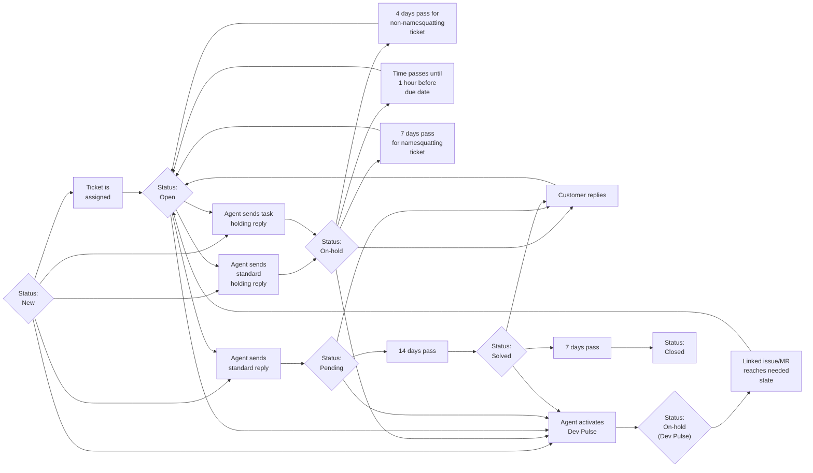

## How do we maintain them?

We currently maintain all groups via Zendesk itself.

## Zendesk Global ticket settings

- Comments
  - Formatting options for agents: Markdown
  - Enable emoji text replacement
  - Agent comments via web are public by default
  - Agent comments via email are public by default
- Attachments
  - Customers can attach files
  - Require authentication to download
- Tags
  - Enable tags on tickets
- CCs
  - Enable CCs on tickets
  - Enable CCs for end users on Help Center
  - CC blacklist: <noreply@google.com>
  - CC email subject: `[{{ticket.account}}] Update: {{ticket.title}}`
  - CC email text:
    > You are registered as a CC on this support request ({{ticket.link}}). Reply
    > to this email to add a comment to the request.
    >
    > {{ticket.comments_formatted}}
    >
    >

- Assignment
  - Auto-assign tickets upon solve
  - Allow re-assignment back to the general group
- Suspended Ticket Notifications
  - How often you want to receive email about new suspended tickets. `Never`
- Ticket IDs: 161869
- Side conversations
  - Enable Slack

## Zendesk Us Federal ticket settings

- Comments
  - Formatting options for agents: Markdown
  - Enable emoji text replacement
  - Agent comments via web are public by default
  - Agent comments via email are public by default
- Attachments
  - Customers can attach files
  - Require authentication to download
- Tags
  - Enable tags on tickets
- CCs
  - Enable followers
  - Follower email subject: {{ticket.title}}
  - Follower email template
    > You are a follower on this request ({{ticket.id}}).
    > {{ticket.follower_reply_type_message}}
    >
    > {{ticket.comments_formatted}}

- Requester
  - Agents can change requester
- Assignment
  - Auto-assign tickets upon solve
  - Allow re-assignment back to the general group
- Suspended Ticket Notifications
  - How often you want to receive email about new suspended tickets. `Never`

## Ticket statuses

As per
[Zendesk](https://support.zendesk.com/hc/en-us/articles/4408832151834-Updating-and-solving-tickets#topic_i3y_np1_vt)
the various status are defined as:

- New
  - This indicates that no action has been taken on the ticket. Once a New
    ticket's status has been changed, it can never be set back to New.
- Open
  - This indicates that the ticket is waiting for action by the agent.
- Pending
  - This indicates that the agent is waiting for more information from the
    requester. When the requester responds and a new comment is added, the
    ticket status is automatically reset to Open.
- On-hold
  - This indicates that the agent is waiting for information or action from
    someone other than the requester. It is similar to the Pending status in
    that you as an agent can't proceed with resolving the ticket until you
    receive more information from someone else. However, the On-hold is an
    internal status that the ticket requester never sees. While a ticket is set
    to On-hold, the requester sees the status as Open.
- Solved
  - This indicates that the agent has submitted a solution or the end-user has
    marked it as such. A solved ticket can still be edited or re-opened.
- Closed
  - This indicates that the ticket is in a state where it can no longer receive
    updates. Replying to a closed ticket opens a follow-up ticket, which
    contains all previous tags and links to the previous ticket.

At GitLab, we define them a bit differently:

- New
  - This is a new ticket. This means it has not yet been worked by GitLab.
- Open
  - This means the ticket is awaiting our reply.
- Pending
  - This means we are waiting on the end-user to reply. We should only use this
    specifically when the user will reply back to the ticket (or it will
    auto-solve). If you need to keep a ticket in a "pending" like state for
    lengthy periods of time, use `On-hold`.
- On-hold
  - This means the end-user is waiting on us, but we are waiting on something
    that is blocking us from replying. We should only be using this in
    situations where we are waiting on something such as a different department,
    time to pass (namesquatting requests as an example), or some other criteria
    that fits along the same concept.
- Solved
  - This means the ticket has been resolved, but the end-user might come back to
    us.
- Closed
  - We use them exactly as Zendesk defines them.

## Basic status state flowchart

## Manually creating tickets

The process to manually create a ticket depends largely on the type of ticket it
is.

### Creating tickets on behalf of customers

When creating a ticket on behalf of a customer, you have to use the Zendesk
Super App to do so (namely the `Create new ticket` plugin). You can find more
information on this via the following documentation pages:

- [Zendesk Global](/handbook/support/readiness/operations/docs/zendesk/apps/global-apps#zendesk-super-app)
- [Zendesk US Government](/handbook/support/readiness/operations/docs/zendesk/apps/us-government-apps#zendesk-super-app)

**Note** This should never be used for outbound requests.
[See below](#creating-tickets-for-outbound-requests) for more info for those.

### Creating tickets for outbound requests

**Warning** This often requires the ability to *create users* in Zendesk, which
is only available on specific roles i.e. CMOCs. That access is *very* risky and
should only be used as documented in this section.

**Note** This only applies to Zendesk Global at this time.

When you need to send an outbound request, it must be done in a very specific
manner to ensure it routes properly and the end-user we wish to contact receives
the correct notification.

To do this, start by hover over the `+ Add` at the top-left of Zendesk and then
click `Ticket`.

The first thing you need to do is select the requester. To do this, click in the
text box below `Requester` at the top-left of the page and put the email you are
looking to reach out to.

The action taken next depend on whether the user in question exists or not:

- If the user exists, it will show said user in a drop-down (clicking said entry
  in the drop-down will select the user).
  
- If the user does not exist, no results will be found and you will need to
  click the `+ Add user` link in the drop-down. Doing so will bring up a modal
  where you will enter the name and email of the user to create. If you are
  unsure of the name, it is always safest to use the email itself for both the
  name and email field. Click the blue `Add` button to create the user.
  
  - **Warning** Never create a user in any other fashion. This is the one and
    only way a user should ever be manually created within our support system by
    any team other than Support Readiness. Never utilize this method when CC'ing
    a user.

After doing this, you should add the subject of the ticket. This should always
be done via the top-center part of the page.

After filling out the subject, you now need to apply the macro
`General::Outbound Contact Request`. This step is **vital** and should never be
skipped. This macro will ensure the ticket is setup properly for an outbound
request. Skipping this step can result in the new ticket not routing properly
and encountering an untold number of problems.

After this has been done, you will then enter the description for the ticket.
This is the core of the message you are wanting to send to the end-user.

Once this has been completed, the last step is to then finish creating the
ticket by submitting it as *pending*. This is done by clicking the downward
arrow at the bottom-right of the page and clicking `Submit as Pending`.

## Change management

As the ticket settings changes are unique in deployment, please see
[Zendesk settings change management](/handbook/support/readiness/operations/docs/change_management#zendesk-settings-change-management)
for more information.

### Labels to use

For all issues and MRs involving Zendesk settings, the label
`Support-Ops-Category::Zendesk Settings` should be used.

### Change criticality

Due to wildly varying nature and impact adding/editing/deleting Zendesk
settings can impose, all issues/MRs related to Zendesk organizations need
to have the their criticality
[manually determined](/handbook/support/readiness/operations/docs/change_criticalities#determining-criticality)
