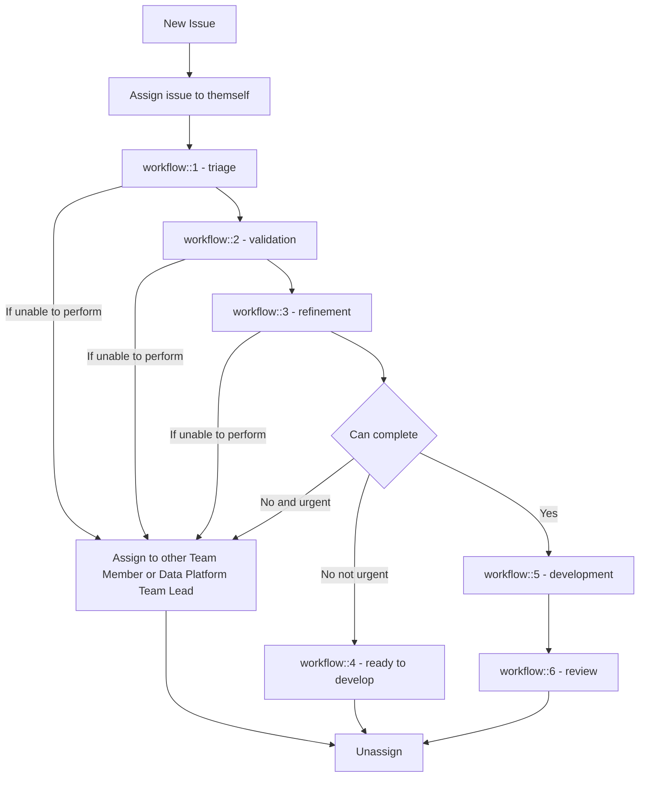
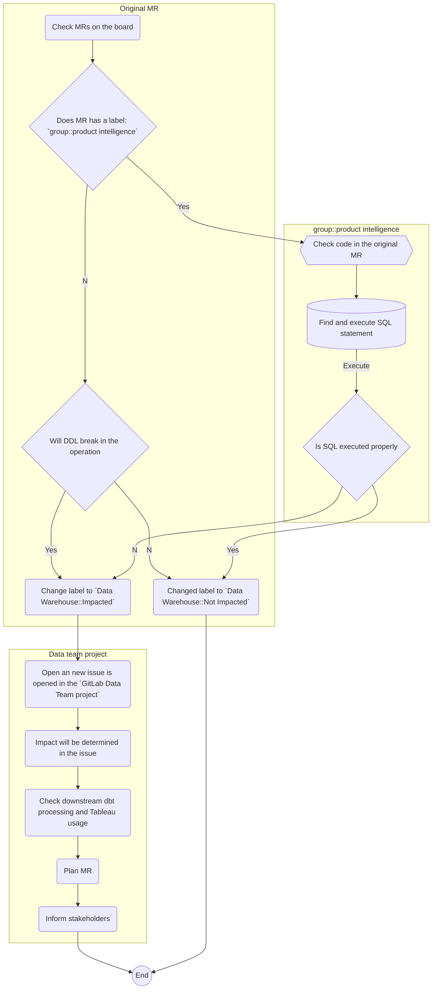

## <i class="fas fa-users fa-fw color-orange font-awesome" aria-hidden="true"></i>Data Triage

### Enterprise Data Program Triage

GitLab has a robust and vibrant Data Program which includes a Central Data Team and many Functional Analytics Teams. GitLab total team members are growing as well and we need to uplevel our triaging process to keep up with GitLab's growth.

Steps to uplevel triaging process:

1. Incorporate Functional Analytics Teams into the #data channel triaging process.
1. Create Slack Aliases so that GitLab Team members can ping a group of folks to get help with their questions in #data.
1. Create a Triage Schedule for the Data Program to follow on the Data Program Calendar. Ask for a commitment of one team member, per Business Team, per day to help triage.

### Enterprise Data Triage Groups

| Triage Group Name   | Triage Slack Alias  | Triage Group Members  |
| -------------- | ------------------- | -------------------- |
| Go To Market Analytics Triage | `@GTMAnalyticsTriage` |  Revenue Strategy & Analytics Team, Marketing Strategy and Performance Team, Business Insights and Analytics Team, GTM Data Fusion Team |
| R&D Analytics Triage | `@R&DAnalyticsTriage` | Product Data Insights Team, R&D Data Fusion Team |
| People Analytics Triage | `@PeopleAnalyticsTriage` | People Group Analytics Team, G&A Data Fusion Team |
| Engineering Analytics Triage | `@EngineeringAnalyticsTriage` | Engineering Analytics Team, G&A Data Fusion Team |
| Data Platform Triage | `@DataPlatformTriage`   | Data Platform Team |
| Tableau Triage | `@TableauTriage`   | Enterprise Analytics & Insights Team |

### Enterprise Data GitLab Projects

| Link to GitLab Data Projects |
| -------------- |
| [Data Team](https://gitlab.com/gitlab-data/analytics) |
| [Sales Strategy and Analytics](https://gitlab.com/gitlab-com/sales-team/field-operations/analytics) |
| [Marketing Strategy and Performance](https://gitlab.com/gitlab-com/marketing/marketing-strategy-performance) |
| [Product Data Insights](https://gitlab.com/gitlab-data/product-analytics) |
| [Business Analytics](https://gitlab.com/gitlab-com/business-analytics) |
| [People Analytics](https://gitlab.com/gitlab-com/people-group/people-analytics) |
| [Customer Success Operations - Use CSAnalytics label](https://gitlab.com/gitlab-com/sales-team/field-operations/customer-success-operations) |
| [Online Sales and Self-Service](https://gitlab.com/gitlab-com/sales-team/self-service) |

### Enterprise Data Triager

| Slack Channel Alias| Analytics Team | Sunday | Monday | Tuesday | Wednesday | Thursday | Friday |
| ---------     | -----------------    | -------| -------|---------| ----------|----------|--------|
| `@GTMAnalyticsTriage` | Revenue Strategy and Analytics | | `@melia` | |  | | |
|                   | Marketing Strategy and Performance | |  | `@David Egan` | | `@rkohnke` | |
|                   | Business Insights and Analytics | |  `@Vikas Agrawal` |  |  |      |   |
| `@R&DAnalyticsTriage` | Product Data Insights |  | `@Matthew Petersen` `@Carolyn Braza` | `@Dave Peterson` | `@Emma Neuberger` | `@Nicole Hervas` | `@Neil Raisinghani` |
| `@PeopleAnalyticsTriage` | People Analytics | |  | | | `@Adrian Pérez` | |
| `@DataPlatformTriage` | Data Platform | | Weekly rotation | Weekly rotation | Weekly rotation | Weekly rotation | Weekly rotation |
| `@TableauTriage` | Analytics & Insights |  | Weekly rotation  | Weekly rotation | Weekly rotation  | Weekly rotation | Weekly rotation |
|  `@GTMAnalyticsTriage` `@R&DAnalyticsTriage`  `@PeopleAnalyticsTriage` | Analytics Engineering |  | Weekly rotation  | Weekly rotation | Weekly rotation  | Weekly rotation | Weekly rotation |

#### Data Platform weekly rotation schedule

In FY23-Q4, the data platform team moved to a weekly triage schedule. The schedule is maintained on the Data Program Google Calendar.

#### Tableau weekly rotation schedule

For days that show `Weekly rotation` on the Tableau triage schedule, i.e. Monday - Friday, the triage responsibilities will be rotated between Enterprise Data Analysts.

#### Analytics Engineering weekly rotation schedule

Beginning on `2025-01-02` Analytics Engineering will move to a weekly triage schedule. The schedule is maintained on the Data Program Google Calendar.

### Enterprise Data Program Triage Instructions

All triage team members, regardless of their team, share the following responsibilities:

1. Triagers should review Slack messages in #data 
1. Triagers should respond in Slack threads by linking to relevant handbook pages, dashboards, or pointing team members to others who may have deeper expertise on the topic
1. If a request requires more than five minutes of investigation from a Data Program team member, triagers should direct the requestor to the channel description. The description includes links to the various Data Program projects where an issue can be created
1. Triagers should support team members who are new to the issue labeling process by reviewing issues with the `clean-up::review` label and offering guidance on proper labels to use
1. Triagers are responsible for monitoring and triaging all issues labeled with their team’s label to ensure timely responses and resolution of team-specific requests.

A team member who is off, on vacation, or working on a high priority project is responsible for finding coverage and communicating to the team who is taking over their coverage;
this should be updated on the [Data Program's Google Calendar](https://calendar.google.com/calendar?cid=Z2l0bGFiLmNvbV9kN2RsNDU3ZnJyOHA1OHBuM2s2M2VidW84b0Bncm91cC5jYWxlbmRhci5nb29nbGUuY29t). To avoid putting the *Monday workload* on the same shoulders every week again, the Data Platform Team will rotate/exchange every now and then triage days in good collaboration on an ad-hoc basis.

Having dedicated triagers on the team helps address the bystander affect. The schedule shares clear daily ownership information but is not an on-call position. Through clear ownership, we create room for everyone else on the team to spend most of the day around deep work. The triager is encouraged to plan their day for the kind of work that can be accomplished successfully with this additional demand on time.

#### Triage responsibilities by team

Data triagers are the first responders to requests and problems for the Data Program. 

**Functional Analysts Responsibilities**

- The Functional Analyst triage handle is primarily responsible for responding to GitLab team member requests that relate to their functions via Slack in **#data**.

**Data Platform Responsibilities**

The Data Platform triager is responsible for resolving problems with our data platform, which will either be in the **#data-pipelines** and **#data-prom-alerts** slack channels, on the [DE - Triage Errors board](https://gitlab.com/groups/gitlab-data/-/boards/1917859) and on the [MonteCarlo Incident page](https://getmontecarlo.com/incidents?include-normalized=false&types=freshness_anomaly%2Cvolume_anomaly%2Cdimension_anomaly%2Cfield_metrics_anomaly%2CDBT_ERRORS%2Cfreshness_sli_rule_breach%2Cvolume_sli_rule_breach%2Csql_rule_breach) (make sure to filter on the `Data Platform` domain in MonteCarlo). Issues created from these errors should use the [DE Triage Errors issue template](https://gitlab.com/gitlab-data/analytics/issues/new?issuable_template=Triage%20Errors%20DE).

- During the assigned triage week the Data Platform Team member will focused on (in priority order):
  - Incoming incidents
  - [Open incidents](https://gitlab.com/gitlab-data/analytics/-/incidents)
  - New issues: Every issue that comes in during a team member's triage week must be [resolved](/handbook/enterprise-data/how-we-work/triage.md#new-issue-triaging-for-the-data-platform-team).
    - A new issue is defined as an issue with no assignee and the workflow label `triage`. [This issue list](https://gitlab.com/groups/gitlab-data/-/issues/?sort=updated_desc&state=opened&assignee_id=None&label_name%5B%5D=Team%3A%3AData%20Platform&label_name%5B%5D=workflow%3A%3A1%20-%20triage&first_page_size=100) tracks these items.
  - Open issues on the [Data Platform - Triage Errors board](https://gitlab.com/groups/gitlab-data/-/boards/1917859).
    - If an open incident or issue is already assigned it is still the triager responsibility to either take that issue or ensure progress is made.
    - If there is no work to be performed on incidents or issues on the [board](https://gitlab.com/groups/gitlab-data/-/boards/1917859) the triager will work on their regular work assignments.
- Involvement from Data Platform Team members who do **not** carry triage responsibilities that week is likely still needed in some cases like:
  - A standing issue or incident could not be solved by the triager and triager need help from other Data Platform Team members.
  - Monitoring #data-prom-alerts:
    - The #data-prom-alerts slack channel is used for the most urgent breaking events, which requires **immediate** action. It is the responsibility of all Data Platform Team members to ensure action is taken in time after office hours of the triager.
  - Assistance from the Data Platform Team is needed by other GitLab Team members and this is outside of the office hours of the triager.
- Monte Carlo incidents are posted in the `#data-pipelines` Slack channel (except schema changes). Because Monte Carlo only initially notifies an incident, checking the Monte Carlo Incident page is needed to avoid missing any incidents. **Schema changes** are filtered out using [this link](https://getmontecarlo.com/incidents?include-normalized=false&types=freshness_anomaly%2Cvolume_anomaly%2Cdimension_anomaly%2Cfield_metrics_anomaly%2CDBT_ERRORS%2Cfreshness_sli_rule_breach%2Cvolume_sli_rule_breach%2Csql_rule_breach), because these don't require action (and are also not reported in the Slack channel). **All Monte Carlo incidents need to be given an appropriate resolution status or linked to an assigned GitLab issue end of day.**
  - Note: Currently there is a large backlog of unclassified incidents in MonteCarlo. We currently focus only on the last 7 days.

**Analytics Engineering Responsibilities**

The Analytics Engineer triager has two primary responsibilities: addressing dbt-related errors (both new and existing) and supporting issue organization. 

They monitor the `#analytics-pipelines` Slack channel for `dbt-test`, `dbt-run` errors and MonteCarlo anomalies, creating new issues using the [AE Triage Errors](https://gitlab.com/gitlab-data/analytics/-/issues/new?issuable_template=Triage:%20Errors%20AE%20) issue template when needed. 

**BI / Tableau Team Responsibilities**

The BI / Tableau triager is primarily responsible for acting as the primary owner of responses to ad hoc questions in the #data-tableau channel (others will continue to pitch in, but the person on triage will be the DRI) and facilitating Tableau Office Hours that week

**Data Science Responsibilities**

The Data Science triager is primarily responsible for reviewing model run issues / breakages and supporting operational requests such as executing field replacements due to dbt model updates.

We will iterate on triage responsibilities to include additional activities such as extract refresh failure review, job failure review, etc. as the team expands.

- For more information on responsibilities of a triager watch the [Data Engineer triage training session video](https://www.youtube.com/watch?v=0eGpgaQgEGg).

### How to Complete Data Triage

For issue triaging, the triager should add the appropriate labels to the issue to put the issue into the respective project's workflow. It is not the responsibility of the triager to validate the issue and determine any root causes or solutions. Rather, for the Data Team project for example, the triager should add the appropriate scoped TEAM label (Ex.`Team:GTM`) and the scoped `Workflow::triage` label. From there, those issues are then put into the respective team's workflow.

**Note:**
The Triager:

- is not expected to know the answer to all the questions
- should cc (mention) other team members who are subject matter experts (SME) or [functional DRIs](/handbook/enterprise-data/organization/#data-team-organization) for their feedback
- should document any issues stumbled upon and help to disseminate knowledge amongst all team members

The Central Data Team triager will create [an issue in the Data Team project](https://gitlab.com/gitlab-data/analytics/issues/new?issue%5Bassignee_id%5D=&issue%5Bmilestone_id%5D=&issuable_template=Data%20Triage). Task and duties are stated in the issue template.

[Read](/handbook/enterprise-data/how-we-work/triage/) the FAQ and common issues.

#### New issue triaging for the Data Platform Team

Every issue that comes in during a Data Platform Team member's triage week must be resolved as follows:

1. All issues are assigned to triager as starting point. 
1. All issues are `triaged`, `validated` and `refined` - following the defined [workflow (criteria)](/handbook/enterprise-data/how-we-work/#workflow-summary). If the triager cannot prepare it adequately:
   - Assign to a team member with domain expertise, OR
   - Assign to Director Data Platform if appropriate expertise is unknown
1. If an issue is **1-2** [issue points](/handbook/enterprise-data/how-we-work/#issue-pointing) they will fully implement the solution. This means moving with through all workflow stages up until `workflow::6 - review`) 
1. If an issue is **3 or more** issue points, the issue will be labelled as `workflow::4 - ready to develop`. 
   - If an issue is not urgent. Triager unassignes themselves and issue has been placed in the backlog.  
   - If an issue is urgent. Triage alligns with a team member on assignment or assigns to Director Data Platform. 



### Incident

The Data Team follows the [incident definition](/handbook/engineering/infrastructure/incident-management) from Engineering: Incidents are anomalous conditions that result in—or may lead to—service degradation or outages. These events require human intervention to avert disruptions or restore service to operational status.

Service degradation or outages in data can be seen as:

- Data is not available
- Data is not correct
- Data is outdated
- Data leakage

This means the following events (not extensive) are likely to be incidents:

- DBT model failed (and downstream models are skipped)
- DBT test failure
- DBT source freshness failure
- Infrastructural incident (Snowflake not accessible, Tableau not accessible)
- Data source not available
- Data pipeline not running

#### Severity

Depending on the nature and impact of the [incident](/handbook/enterprise-data/how-we-work/#incidents) a severity needs to be determined. Currently we don't have a decision matrix in place. To determine the severity, take the following aspects into consideration:

- In case of a data source or data pipeline incident, check the [Data Source Tier](/handbook/enterprise-data/platform/#data-sources).
- Number of users impacted
- Impacting Trusted Data models

#### Follow up

- Incidents are always given immediate attention.
- Every incident has a DRI assigned. This is not necessarily the triager/creator of the incident. Due to the nature of asynchronous working at GitLab, the triager/creator is the DRI until another GitLab Team Member is actively contacted/involved.
  - The [codeownerfile](https://gitlab.com/gitlab-data/analytics/-/blob/master/CODEOWNERS) is the right future*source to find the right DRI for assigning the incident.* Currently the code ownership is not well defined. As part of FY23-Q1 we are planning to have a more strict ownership.
- Every raised incident will be communicated in the `#data` Slack channel, followed by a short description, ETA and link to the incident. The right GitLab Team Members are tagged.
  - A regular (depending on the severity) update is posted in Slack. Sometimes there isn't a new status, don't hesitate to communicate this as well.
  - Timelines should be documented in the [timeline section](https://docs.gitlab.com/ee/operations/incident_management/incident_timeline_events.html) under the incident Subject/Header for use in retrospectives and other investigations.
  - When the incident is solved, an update is posted in Slack

### Triage Bot

The Data Team leverages the [GitLab Triage Bot](https://gitlab.com/gitlab-org/gitlab-triage) to automate issue management and maintain project organization. The triage policy for the analytics repo is defined in the [.triage-policies.yml](https://gitlab.com/gitlab-data/analytics/-/blob/master/.triage-policies.yml?ref_type=heads) file.

Triagers rely on labels to identify and prioritize work within their domain. Team members who are unsure about which labels to apply can add the `clean-up::review` label to their issue, and the AE team will assist with proper labeling.

This automation helps maintain project hygiene by ensuring every issue has the required scoped labels: `team`, `priority`, `champion`, and `workflow`. The labels `Documentation`, `Iteration Planning`, and `Discussion` are excluded from these requirements.

The automated process begins three days after an issue is created. When required labels are missing, the bot adds a comment listing the missing labels and applies both `Needs Triage` and `clean-up::warning` labels. The comment includes instructions for requesting help through the `clean-up::review` label.

After 14 days, if the issue still lacks required labels, the bot adds a reminder comment to prompt action. Issues that remain unlabeled for 30 days will be automatically closed with a `clean-up::close` label and a comment explaining the closure. Team members can reopen these closed issues at any time and ensure they won't be auto-closed again by adding the required labels.

When a previously closed issue is reopened, the bot automatically removes the `clean-up::close` label and checks for proper labeling. If required labels are still missing, it applies the `clean-up::warning` label and adds a comment explaining which labels are needed. This process ensures that reopened issues meet our labeling standards.

To help keep the project organized, the bot automatically removes warning labels once all required labels are properly applied to an issue. This creates a self-maintaining system where issues either progress through proper labeling or are eventually closed for review.

Changes to the triage bot policy file should be tested in the MR by running the "dry-run:triage" CI job and inspecting the log output.  This CI job is a dry-run, meaning it will not actually take any actions in the project but will print out what would happen if the policy was actually executed.

### End of day wrap-up

In order to get better and be more efficient in daily triage, we wrap-up the work by the end of the day. The following information is provided by the Data Analyst each day:

- Time Tracking: Listing down the time spent that day on triage and which activities are performed. The general idea is to gain an understanding on where the workload is, in order to optimize those activities. Please list down the work so it is useful for analysis purposes. I.e:
  - 2 hours solving data ingestion issue, for source x
  - 1 hours solving data transformation issue
  - 1 hour on solving a broken Tableau Dashboard
  - 1 hour triaging and re-routing (new) issues
  - 0.5 hour on answering Slack questions
- Groundhog Issues. Issues that occur on a regular basis are annoying and costing us unnecessary time. List down any issue that is popping up time after time. This is in order to find any spots in the current landscape to address.

A triage roundup will take place on a weekly or twice-weekly basis in order for the data leadership team to consolidate triage efforts. Please bear in mind the purpose of the information provided, to make it useful and improve Triage.

### End of week wrap-up

The Data Platform Team follows a weekly rotation schedule which means that by the end of the triage week the triager will hand over the triage responsibilities.

- Even though we still use the [triage issue](https://gitlab.com/gitlab-data/analytics/-/blob/master/.gitlab/issue_templates/Triage%3A%20Data%20Triage.md) on a daily basis, the triager will only write up the week a-sync in the central data team triage issue on Friday end of day.
- The triager will report/verbalize in the Weekly Data Platform Team meeting any notable things happened on triage on Tuesday in the next week.

Although running a weekly rotation, we expect the triager to post an EOD announcement in the applicable Slack channels.

### GitLab.com databases structure changes

GitLab.com databases do regularly change. In order not to break the daily operation, changes to the database needs to be tracked and checked. Any change to the GitLab.com database and CustomerDot database is tracked by the Danger Bot. The Data Team gets notified, by applying labels to the MR, if a change to the db/structure\.sql is made.

A label `Data Warehouse::Impact Check` is added by the Danger Bot as call to action for the data team.

- On triage, the Triager will [check](https://gitlab.com/groups/gitlab-org/-/merge_requests?scope=all&state=opened&label_name[]=Data%20Warehouse%3A%3AImpact%20Check&draft=no&approved_by_usernames[]=Any) for MRs with label `Data Warehouse::Impact Check`.

The following actions are performed by Data Team Triager:

- Every merge request (`MR`) will be judged
  - If `MR` contains the label `group::product intelligence` along with `Data Warehouse::Impact Check`, there are a couple of checks that need to do:
    - Because a new metric is added or the existing one is altered, the `Data team` should ensure the change will not break the `Service ping` extraction process
    - Check new metric `SQL` statement from the original `MR` *(a typical example is [gitlab-org/gitlab/merge_requests/75504](https://gitlab.com/gitlab-org/gitlab/-/merge_requests/75504/diffs#78300240169ab9f44b4dc25f6b6dcb56b3b629c7))* and execute it on `Snowflake` - usually, it is just a `SELECT` `SQL` statement
  - If the changes to the `SQL` file are not causing a break in the operation, the label will be changed to `Data Warehouse::Not Impacted`.
  - If the changes to the `SQL` file causing a break in the operation:
    - The Label will be changed to `Data Warehouse::Impacted`
    - A new issue is opened in the `GitLab Data Team project`, assigned to the correct DRI and linked to the original MR.
    - Impact will be determined in the issue.
    - Any MRs will be created to overcome loading issues, downstream dbt processing and Tableau usage.
      - If impact is beyond data loading, this means the data is used downstream, an Analytics Engineer **must** be included to also determine the business impact of the upstream change.
    - According to the Merge of the GitLab.com MR, merge will be planned.
  - If the `MR` does not contains the label `group::product intelligence` and it concerns changes to `SQL` structure:
    - Check if it will break the operation / data pipeline, following the Determination matrix below.

  - If any `MR` will cause a break in the operation, the label will be changed to `Data Warehouse::Not Impacted`.
  - If any `MR` will cause a break in the operation:
    - The Label will be changed to `Data Warehouse::Impacted`
    - A new issue is opened in the `GitLab Data Team project`, assigned to the correct DRI and linked to the original MR.
    - Impact will be determined in the issue.
    - Any MRs will be created to overcome loading issues, downstream dbt processing and Tableau usage.
      - If impact is beyond data loading, this means the data is used downstream, an Analytics Engineer **must** be included to also determine the business impact of the upstream change.
    - According to the Merge of the GitLab.com MR, merge will be planned.
    - All stakeholders will be informed.

#### Graphical representation of the process

<details><summary>Click to expand graphical representation of the process</summary>



</details>

Determination matrix: **

| Change | Call to action needed* |
| ------ | ------ |
| New table created | :x: |
| Table deleted | :white_check_mark: |
| Table renamed | :white_check_mark: |
| Field added | :x: |
| Field removed | :white_check_mark: |
| Field name altered | :white_check_mark: |
| Field datatype altered | :question:|
| Constraints changed | :question: |

*We are not loading all the tables and columns by default. Thus if new tables or columns are added, we only will load these tables if there is a specific business request. Any change to the current structure that causes a potential break of operation needs to be determined.

** Determination matrix is not extensive. Every MR should be checked carefully.

## Triage common issues

In this section we state down common issues and resolutions

### GitLab Postgres Database not accessible

In a situation when gitlab_dotcom postgres replica snapshot is not built correctly, the task `check_replica_snapshot` inside the extract DAG's fail for MAIN and/or CI db, which indicates either that the replica snapshot is not rebuilt/accessible or the `pg_last_xact_replay_timestamp` value was not present.The error message generated from task failure would indicate errors with the replica database connectivity or database system starting up and the error in the task would look something similar like this:

```console
[2023-07-15 13:04:48,022] INFO - b'psycopg2.OperationalError: could not connect to server: Connection refused\n'
[2023-07-15 13:04:48,022] INFO - b'\tIs the server running on host "{db_instance_ip}" and accepting\n'
[2023-07-15 13:04:48,022] INFO - b'\tTCP/IP connections on port {port}?
```

Follow the [runbook](https://gitlab.com/gitlab-data/runbooks/-/blob/main/Gitlab_dotcom/Gitlab_DB_recreation_failure.md) for the steps to perform, including communication.

### Automated service ping issue

In a situation when [Service ping](https://internal.gitlab.com/handbook/enterprise-data/data-governance/data-catalog/saas-service-ping-automation/#service-ping-overview) fail while it generates metrics, we should be informed either via `Trusted data dashboard` or `Airflow` log - generally, the error log is stored in `RAW.SAAS_USAGE_PING.INSTANCE_SQL_ERRORS` table. Follow the instructions from the link [error-handling-for-sql-based-service-ping](https://internal.gitlab.com/handbook/enterprise-data/data-governance/data-catalog/saas-service-ping-automation/#error-handling-for-sql-based-service-ping) in order to fix the issue.

### Zuora Stitch Integration single or set of table-level reset

It could happen, in any case, to [reset the table](https://www.stitchdata.com/docs/troubleshooting/destinations/destination-loading-error-reference#snowflake-error-reference) in Stitch for the Zuora data pipeline, in order to backfill a table completely (i.e. new columns added to in the source, technical error etc).
Currently, Zuora Stitch integration does not provide [table level reset](https://www.stitchdata.com/docs/integrations/saas/zuora#zuora-feature-snapshot), and thus we have to perform a reset of all the tables in the integration. This will result in extra costs and risks.

To this below steps can be followed using which we have successfully done the table level reset.
In this example, we have used Zuora `subscription` table, but this could be applied to any other table in the Stitch Zuora data pipeline.

#### Step 1:- Rename existing table with the date suffix to identity the backup, recommended format YYYYMMDD

```sql
    ALTER TABLE "RAW"."ZUORA_STITCH"."SUBSCRIPTION" RENAME TO "RAW"."ZUORA_STITCH"."SUBSCRIPTION_20210903";
```

#### Step 2:- Pause the regular integration


#### Step 3:- Create a new integration Zuora-Subscription in Stitch

While setting it up setup the extraction frequency to 30 minutes and date from extraction to 1st Jan 2012 to ensure all data gets pulled through.


#### Step 4:- Run the newly created integration

Try running the newly created integration manually and wait for it to complete. Once completed then and it shows on the home page successfully. Once done Pause the newly integration task because we don't want any misaligned data while we follow the next steps.

#### Step 5:- Check for the records

In the newly created table `"RAW"."ZUORASUBSCRIPTION"."SUBSCRIPTION"` cross-check the number of rows showing as loaded in the integration UI in stitch and loaded in the table is same.

#### Step 6:- Create the table in the main schema

Move the newly loaded data to `ZUORA_STITCH` schema because the new integration will create the table in the `ZUORASUBSCRIPTION` as stated above in the image.

```sql
    CREATE TABLE "RAW"."ZUORA_STITCH"."SUBSCRIPTION" CLONE  "RAW"."ZUORASUBSCRIPTION"."SUBSCRIPTION";
**Note:** Check for the primary key present in the table post clone or not if not check for the primary key in the [link](https://www.stitchdata.com/docs/integrations/saas/zuora#subscription) and add the constraints on those columns.
```

#### Step 7:- Make records count check to ensure we don't have fewer records in the new table

```sql
    select count(*) from "RAW"."ZUORA_STITCH"."SUBSCRIPTION_20210903" where deleted = 'FALSE';
    select count(*) from "RAW"."ZUORA_STITCH"."SUBSCRIPTION" ;
```

#### Step 8:- Drop the new schema

```sql
    DROP SCHEMA "RAW"."ZUORASUBSCRIPTION"  CASCADE ;
```

#### Step 9:- Delete temp Zuora-Subscription integration and enable regular integration

#### Step 10:- Run regular integration and validate

This is to ensure that error observed previously to the table is gone and data is getting populated in the table.
Check on duplicate ids due to 2 different extractors, to ensure the data is getting populated in the table correctly.

```sql
    select id, count(*) from "RAW"."ZUORA_STITCH"."SUBSCRIPTION"
    group by id
    having count(*) > 1
**Note** Refer to the [MR (internal link)](https://gitlab.com/gitlab-data/analytics/-/issues/10065#note_668365681) for more information.
```

### Source freshness errors

See the [source contact spreadsheet](https://docs.google.com/spreadsheets/d/1VKvqyn7wy6HqpWS9T3MdPnE6qbfH2kGPQDFg2qPcp6U/edit) for who to contact if there are external errors related to a source.

### Airflow Task failure

|   |
| ------------------------- |
| DAG `gitlab_com_db_extract` <br> Task `gitlab-com-dbt-incremental-source-freshness`  <br> |
| Background: This extract relies on a copy (replication) database of the GitLab.com environment. Its high likely that this is the root cause of a high replication [lag](https://prometheus-db.gprd.gitlab.net/graph?g0.expr=(pg_replication_lag)%20and%20on(instance)%20(pg_replication_is_replica%7Btype%3D~%22postgres-(archive)%22%7D%20%3D%3D%201)&g0.tab=0&g0.stacked=0&g0.range_input=1w&g1.expr=pg_long_running_transactions_age_in_seconds%7Btype%3D~%22postgres-(archive)%22%7D&g1.tab=0&g1.stacked=0&g1.range_input=6h). |
| More information of the setup [here (internal link)](https://gitlab.com/gitlab-data/analytics/-/issues/8283#note_537332709).  |
| Possible steps, resolution and actions: - Check for replication lag <br> - Pause the DAG if needed <br> - Check for data gaps <br> - Perform backfilling <br> - Reschedule the DAG  |
| Note: The GitLab.com data source is a very important data source and commonly used. Please inform an update business stakeholders accordingly. |

### Sheetload - Column '#REF!' is not recognised

|   |
| ------------------------- |
| DAG `sheetload` <br> Task `dbt-sheetload`  <br> |
| Background: This is an issue with Google sheets when data is being imported from a second sheet using Google sheets' import function. Occasionally the connections between the sheets stop working and the sheet needs to be refreshed. |
| More information of the setup [here](https://internal.gitlab.com/handbook/enterprise-data/platform/pipelines/#sheetload).  |
| Possible steps, resolution and actions: <br> - In general you should just need to open the Google sheet which is failing and confirm the data has been re-populated. <br> - If you do not have access to the sheet contact @gitlab-data/engineers and confirm if anyone else does. |

### Model version_usage_data_unpacked stale

When got an error for model `version_usage_data_unpacked` and error looks like:

```console
[2022-01-26 11:56:32,233] INFO - b'\x1b[33mDatabase Error in model version_usage_data_unpacked (models/legacy/version/xf/version_usage_data_unpacked.sql)\x1b[0m\n'
[2022-01-26 11:56:32,233] INFO - b' 000904 (42000): SQL compilation error: error line 241 at position 12\n'
[2022-01-26 11:56:32,233] INFO - b" invalid identifier '{metrics_name}'\n"
[2022-01-26 11:56:32,233] INFO - b' compiled SQL at target/compiled/gitlab_snowflake/models/legacy/version/xf/version_usage_data_unpacked.sql\n'
[2022-01-26 11:56:32,234] INFO - b'\n'
```

The root cause of this issue is when new metrics are introduced in an upstream model - and this model (along with model `version_usage_data_unpacked_intermediate`) try to pivot values to columns. Without full refresh, this will not happen under the pipeline.

Full refresh required as per instructions from [dbt models full refresh - internal handbook](https://internal.gitlab.com/handbook/enterprise-data/platform/infrastructure/#dbt-full-refresh).

An example for this failure is the issue: **[#11524 (internal link)](https://gitlab.com/gitlab-data/analytics/-/issues/11524)**

### Zuora Revenue Source and Target Column Mismatch

Sometimes Zuora Revenue source system as part of a certain release modify the source table definition by adding/removing column(In a year once or twice). Whenever this type of change happens it triggers failure in the loading task in DAG `zuora_revenue_load_snow`.

For example, there was 3 additional column added to table `BI3_RC_POB` which lead to the below error message.

```console
[2022-03-21, 13:26:48 UTC] INFO - sqlalchemy.exc.ProgrammingError: (snowflake.connector.errors.ProgrammingError) 100080 (22000): 01a31326-0403-d02c-0000-289d37f10d4e: Number of columns in file (102) does not match that of the corresponding table (99), use file format option error_on_column_count_mismatch=false to ignore this error
[2022-03-21, 13:26:48 UTC] INFO -   File 'RAW_DB/staging/BI3_RC_POB/BI3_RC_POB_12.csv', line 3, character 1
[2022-03-21, 13:26:48 UTC] INFO -   Row 1 starts at line 2, column "BI3_RC_POB"[102]
[2022-03-21, 13:26:48 UTC] INFO -   If you would like to continue loading when an error is encountered, use other values such as 'SKIP_FILE' or 'CONTINUE' for the ON_ERROR option. For more information on loading options, please run 'info loading_data' in a SQL client.
```

When this kind of failure happens we need to alter/create or replace the target table and add the additional column to the table definition in RAW.ZUORA_REVENUE schema. It is good to practise creating or replacing because it requires doing the full refresh of the data because of the addition of a new column.

Below are set of steps that will guide you to resolve this.

**Step 1:-**  Download the first file from the storage to local to view the additional column. For any file, only the file name and folder name should be modified.

```console
gsutil cp  gs://zuora_revpro_gitlab/RAW_DB/staging/BI3_RC_POB/BI3_RC_POB_1.csv .
```

For any other file, only the file name and folder name should be modified. For example table, `BI3_RC_BILL` above command will change to `gsutil cp gs://zuora_revpro_gitlab/RAW_DB/staging/BI3_RC_BILL/BI3_RC_BILL_1.csv .`

**Step 2:-** Once the file is downloaded look for the header of the file using the below command

```console
head -1 BI3_RC_POB_1.csv
```

**Step 3:-** Pull out the current table definition from snowflake using the below query

```sql
USE ROLE LOADER;
USE DATABASE RAW;
USE SCHEMA ZUORA_REVENUE;
select get_ddl('table','BI3_RC_POB');
```

Prepare the CREATE OR REPLACE TABLE query by comparing the missing column from the header and the table definition and adding them to the new table. The missing column should be at the end and the data type should be varchar.
Deploy the modified SQL.

**Note:-** If the table doesn't exist then create the table with all the column named present in header with datatype as Varchar.

**Step 4:-** Move the log file from the process folder to the staging folder of the table.

```console
gsutil cp gs://zuora_revpro_gitlab/RAW_DB/processed/22-03-2022/BI3_RC_POB/BI3_RC_POB_22-03-2022.log  gs://zuora_revpro_gitlab/RAW_DB/staging/BI3_RC_POB/
```

The point to consider in this command is the date in the path and the log file name. If the failure happened on `23-03-2022` then it will become `gs://zuora_revpro_gitlab/RAW_DB/processed/23-03-2022/BI3_RC_POB/BI3_RC_POB_23-03-2022.log`

Validate in [GCS storage](https://console.cloud.google.com/storage/browser/zuora_revpro_gitlab/RAW_DB/staging?project=gitlab-analysis&pageState=(%22StorageObjectListTable%22:(%22f%22:%22%255B%255D%22))&prefix=&forceOnObjectsSortingFiltering=false) that the log file is present for the respective table.

**Step 5:-** Re-run the task from the airflow by clearing the task.

## Triage FAQ

**Is Data Triage 24/7 support or shift where we need to support it for 24 hours?** <br>
We need to work in our normal working hour perform the list of task mentioned for the triage day in the [Triage Template (internal link)](https://gitlab.com/gitlab-data/analytics/-/issues/new?issuable_template=Triage:%20Data%20Triage)

**If any issue is found do we directly jump to fix it in production or take it as part of the incident and solve it within the defined time?** <br>
On the Triage day the data team member present will look for all the failures, questions or errors in:

- The Slack-channels; #data-prom-alerts #analytics-pipelines and #data
- Newly added [issues](https://gitlab.com/groups/gitlab-data/-/boards/1917859?&label_name[]=Priority%3A%3A1-Ops&label_name[]=Triage)

It includes all the failures since the last person did sign off and will create an issue for all the failures since then till the person signs off.
If any data pipeline has broken and there is expected to be a delay in getting data loaded or refreshed. The concerned team has to be notified using the [Triage Template (internal link)](https://gitlab.com/gitlab-data/analytics/-/issues/new)

**Is there ETA for a different kind of issue?** <br>
If the pipeline is broken it needs to be fixed, currently we are working on defining SLO's for our data assets. For our data extraction pipelines, there is a comprehensive overview [here](/handbook/enterprise-data/platform/).

**If I work my normal hours on triage day i.e. till 11 AM of US timeline. What happens when the pipeline breaks post my normal hours and there is a delay in data availability?** <br>
Yes, the benefit of our presence is that we have a wide overage of hours. If the person who is on Triage is ahead of US timelines, we have an advantage of solving issues timely. The downside is that we have not full coverage that day for US timelines. This is an attention point towards the future.

## Useful regex

### Match lines where these terms do not exist

`^(?!.*(<First term to find>|<Second term to find>)).*$`

e.g. For cleaning up Airflow logs:

`^(?!.*(Failure in test|Database error)).*$`
