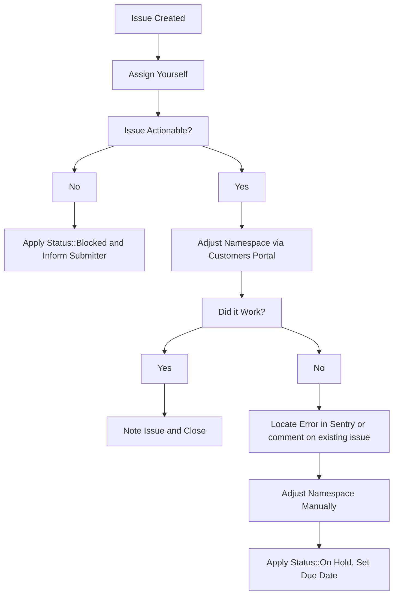

## Handling GitLab.com trial requests

### GitLab.com customers without a subscription

1. New customers without an existing GitLab.com subscription and namespace can apply for a 30-day GitLab Ultimate subscription by completing the following [form](https://gitlab.com/-/trial_registrations/new?glm_source=about.gitlab.com/&glm_content=default-saas-trial).
1. GitLab.com users who have an existing namespace but do not have an active GitLab.com subscription can go to the billing section for their group namespace and press the `Start Trial` button. If a trial previously existed on that namespace, the button will not be present. In such situations the user will need to contact GitLab Sales to request a new trial or a trial extension.

### GitLab.com customers with a Premium Subscription

GitLab.com Premium customers who want to trial SaaS Ultimate have two options to do so:

1. Customers can self-service an Ultimate trial, including Duo Enterprise, on top of their existing paid Premium plan for 60 days from a CTA button on the group's Billing page, see [here in the internal handbook](https://internal.gitlab.com/handbook/product/fulfillment/saas-ultimate-trials/#gitlabcom-ultimate-trial-on-existing-premium-group-details) or the [documentation page](https://docs.gitlab.com/subscriptions/subscription-add-ons/#start-gitlab-duo-enterprise-trial) for details
1. Request an Ultimate trial from [GitLab's public trial page](https://about.gitlab.com/free-trial/?hosted=sass). This will require the customer to set up a new namespace to which to apply the trial. No Sales or Support action will be required.

#### Subscription seats during trials-over-subscription

When applying an Ultimate trial over a subscription, the customer's licensed subscription seat count still applies. If the customer wishes to increase their seat count during the Ultimate trial, they will have to purchase the seats as usual. If the customer exceeds their seat allowance during the trial, they will be billed for them at their next reconciliation and the seats will still apply after the end of the trial.

#### Namespaces with a prior Ultimate trial

These namespaces are allowed to start an Ultimate trial over Premium subscription, circumventing the normal guardrails preventing a group from taking out more than one trial.

#### Workflow caveats

- For all trials, the renewal start date must align with the end date of the prior subscription term therefore requests for Ultimate trials with the purpose of extending ahead of the renewal date should be denied. It is GitLab policy to align renewal dates with the end of the prior subscription term.
- GitLab.com Ultimate trials cannot be extended past the 30-day duration.
- GitLab.com trials are only available for the GitLab Ultimate Subscription plan.

### Requests to workaround GitLab.com trial limitations

GitLab.com trials have [some limitations](https://about.gitlab.com/free-trial/#what-is-included-in-my-free-trial-what-is-excluded), including the use of group access tokens. Some customers may request circumvention of these limitations in cases such as facilitating post-migration checks.

Sales will need to work with Deal Desk using this [workflow](../../../../sales/field-operations/sales-operations/deal-desk#concurrent-subscriptions) to request a temporary Premium or Ultimate subscription which will result in a $0 paid subscription without the trial limitations.

## Extending trials

Sales will often request through a Zendesk Ticket that we extend the duration of GitLab.com trials on behalf of their prospects. These tickets will always be raised from the GitLab Support End User <gitlab_support@example.com>, with the submitter cc'd on the ticket. If a customer or sales representative raise an extend trial request on a *customer ticket*, we should respond that an internal request **must** be created by the sales representative to request the trial extension.

If any fields when opening the ticket were filled out incorrectly,  send a public reply in the ticket asking the submitter to supply the missing information.

1. Take ownership of the ZD ticket.
1. Check over the request and ensure that we've been provided enough information to action the request. To do this check that:
   1. The `Namespace:` field contains a valid GitLab namespace and it that holds the trial plan (active or expired). This should not be a Salesforce link or email address.
   1. The `Extend the date to:` field contains a future date. (Trial expires around 23:59 UTC on this date)
   1. The `Trial license plan:` field is filled out
1. Use the [`Trial changes (SaaS)` in the CustomersDot Support Admin Tools](/handbook/support/license-and-renewals/workflows/customersdot/support_tools/#update) to process the request.
   1. If there is an error while taking action, check the [GCP Logs Explorer dashboard](https://console.cloud.google.com/logs/query?project=gitlab-subscriptions-prod) to see what went wrong. Please also locate the [error in sentry](https://sentry.gitlab.net/gitlab/customersgitlabcom/) (see [Searching Sentry](/handbook/support/workflows/500_errors/#searching-sentry) if needed) and file an issue, or comment on an existing one.
1. If namespace needs to be adjusted manually, then raise a new internal issue with details and  `~Console Escalation::Customers` label.

If a customer is requesting a trial extension, please follow [Working with Sales workflow](/handbook/support/license-and-renewals/workflows/working_with_sales/) to let Sales team know in case they would like to have a discussion with the customer.

### Customer requests for a subscription extension

When a customer requests a subscription extension, follow the steps below based on the day of the week and whether the customer is classified as Enterprise or SMB.

1. Locate the Account Owner:
    - In the Zendesk (ZD) ticket, look for the internal note labeled `Organization Info` to dentify the Account Owner:
        - For Enterprise/Commercial customers, a specific individual will be listed.
        - For SMB customers, you will see `EMEA/AMER/APAC SMB Sales` instead of a named person.

2. Determine next steps Based on the Day and Customer Type:

    | Day | Enterprise/Commercial | SMB |
    |--|-----------------------|-----|
    | **Weekday** | Redirect to Sales | Redirect to Sales |
    | **Weekend/Holiday** | Redirect to Sales | Issue temp extension and redirect to Sales |

3. Steps for Redirecting to Sales:

    **Enterprise/Commercial Customers:**
        - Inform the customer that such requests have to be channeled through sales and provide them with their AE's email address before closing the ticket.
        - Notify the Account Executive (AE) through Chatter to ensure they are aware of the request.
    **SMB Customers:**
        - Follow the process outlined in the [Working with the Global Digital SMB Account Team](/handbook/sales/commercial/high_velocity_sales_first_orders/#working-with-the-global-digital-smb-account-team) handbook page.
        - Provide the Salesforce (SFDC) ticket ID to the customer.
        - Close the ticket.

4. For SMB Customers on Weekends or Holidays, please issue a temporary subscription extension before redirecting to Sales.

### SFDC generated temporary renewal extensions

Account Executives (AEs) can use SalesForce.com (SFDC) to issue a SaaS 21-day Subscription extension to a customer when the renewal opportunity is taking longer than expected to close. When an AE uses this functionality, the subscription is automatically extended without any L&R Support involvement. The [Temporary renewal extensions](/handbook/product/groups/fulfillment-guide/#temporary-renewal-extensions) handbook entry documents this approach.

Please note that the above approach has the following caveats:

1. There are guardrails in place to prevent abuse of this functionality. As a result, only one subscription extension can be generated per renewal event. Therefore, there may be occasions when L&R Support will still be required to generate further subscription extensions. If this occurs then please follow the manual process for [extending an active or expired subscription](#extend-an-existing-active-or-expired-subscription).
1. Additionally, the subscription has to be a non-trial subscription. If the subscription is set to expire within the next 15 days, please redirect the salesperson to utilize the SFDC feature by employing the `Deviation from SM License Extension Workflow macro` and subsequently close the ticket.
1. If the subscription expiration is more than 15 days away, advise the salesperson to wait until the expiry is within 15 days before utilizing the SFDC feature. Once within the 15-day window, redirect the salesperson to use the SFDC feature using the `Deviation from SM License Extension Workflow` macro and then close the ticket.

## Extend an existing active or expired subscription

1. Before taking any action to create the trial license, get confirmation from
   the customer that they understand and accept the
   [constraints](https://about.gitlab.com/free-trial/#what-is-included-in-my-free-trial-what-is-excluded)
   that accompany a trial. Use the `Support::L&R::Trial Subscription - Exclusions Sign Off`
   macro in Zendesk for this purpose. Be sure to assign the ticket to
   yourself so that you will receive the customer's response and be
   able to take action quickly.
1. This is done via the CustomersDot Support Admin Tools through
   [`Trial changes (SaaS)`](/handbook/support/license-and-renewals/workflows/customersdot/support_tools/#update).

**Note**: We cannot extend the trial if the customer hasn't started one on the namespace. The Subscription name field in the ZenDesk Mechanizer app is there for that reason. When there's a Subscription name, the mechanizer will create a new trial for the namespace.

## Workflow diagram

## Plan change requests

Plan changes should **never** be done manually except in the following cases:

1. Downgrading to Free.
1. Emergency: a next business day follow up is required for the customer to no longer be on a manual plan. The ticket should be passed to L&R or an internal ticket created.

Plan changes on a paid non-trial namespace should be done through a subscription purchase.

If a manual plan change is required for non-emergencies, a [legal issue](/handbook/legal/#how-to-reach-us) must be created and approved by legal as manually changing a plan causes data discrepancies, can cause legal issues, and can cause bug issues.

### Downgrading to a free plan

Before actioning a downgrade request:

1. Ensure that the requester provides authorization per the [Ownership verification workflow](/handbook/support/license-and-renewals/workflows/customersdot/associating_purchases#ownership-verification).
1. Determine whether they want to pursue a refund. If they do, then follow the [refunds workflow](/handbook/support/license-and-renewals/workflows/billing_contact_change_payments#refunds).

| Example Ticket | Date |
| --- | --- |
| [ZD Link](https://gitlab.zendesk.com/agent/tickets/322319) | 2022-09-02 |

### Using customerDot

**Important**

From CustomerDot you can only change the plan type not the subscription end date.

1. From the left side menu click on `customers` and search for the customer.
1. In the search results click on the GitLab groups icon for the customer you want to update.
1. You'll see a list of groups owned by the customer and you can perform your change here.

> If you receive an error, follow the usual troubleshooting procedures in
> looking up the error in sentry and/or for an existing CustomersDot issue,
> adding to an existing issue or creating a new one as required.

If you get an error, use admin following the instructions in the next section.

### Licensing pathways for handling customer renewals and new sales that have become delayed

In certain scenarios where customer renewals or new customer sales are experiencing delays, the L&R Support process workflows provide flexibility to address these challenges. The following table outlines the options available to issue temporary trial licenses based on specific use cases:

| Use Case | Pathway |
| ------ | ------ |
|  Customer renewal is taking longer than expected      | The sales AE (Account Executive) generates a one-off 21 day [temporary renewal extension](/handbook/product/groups/fulfillment-guide/#temporary-renewal-extensions) via SFDC        |
|  Customer renewal exceeds the additional 21 days     |  The sales AE can open a new Internal Request (IR) ticket with L&R support and request a trial subscription extension for up to 1 month      |
|  Customer renewal exceeds the additional 21 days + 1 month     | The sales AE can open a new Internal Request (IR) ticket with L&R support who request approval via the ticket from the senior director of revenue @andrew_murray       |
|  New customer potential sale     |  The sales AE can request up to 1 month trial extension via an IR with L&R support.|
|  New customer sale taking longer than 1 month | The sales AE generates a $0 dollar opportunity in SFDC, then opens a new IR ticket with L&R support who request approval via the ticket from the senior director of revenue @andrew_murray       |

### How to create an NFR (Not for resale) SaaS License

As of Feb. 19, 2025, [partner NFR subscriptions](/handbook/resellers/channel-working-with-gitlab/#not-for-resale-nfr-program-and-policy)) will be provisioned as standard GitLab.com subscriptions instead of as trial subscriptions. Ecosystem Operations manage this process and no longer requires assistance from the support team to provision. Reach out to #global-ecosystem-programs-ops via slack with any questions.
