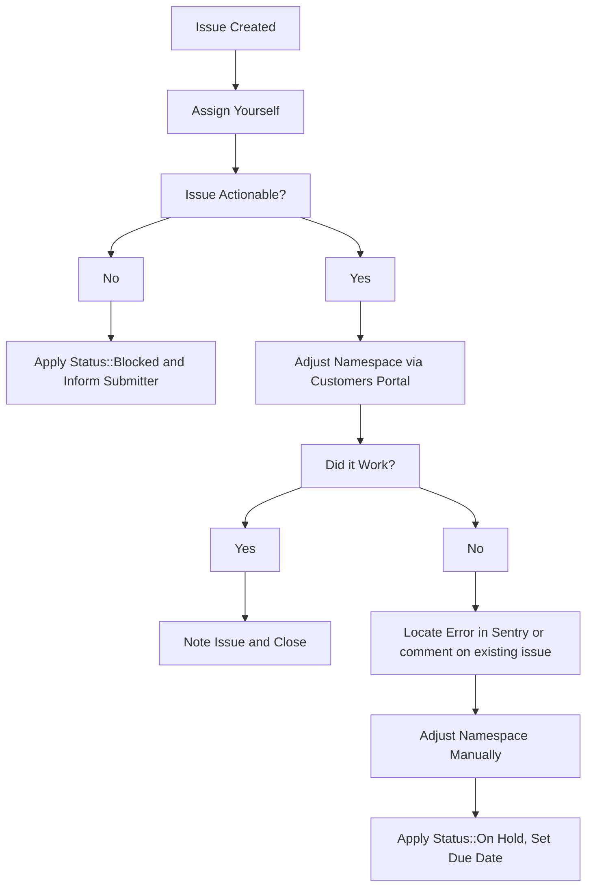

---

title: Handling trials, extensions and plan changes on GitLab.com
description: "How to handle GitLab.com subscription trials and plan changes"
category: GitLab.com subscriptions & purchases
---

## Handling GitLab.com trial requests

### GitLab.com customers without a subscription

1. New customers without an existing GitLab.com subscription and namespace can apply for a 30-day GitLab Ultimate subscription by completing the following [form](https://gitlab.com/-/trial_registrations/new?glm_source=about.gitlab.com/&glm_content=default-saas-trial).
1. GitLab.com users who have an existing namespace but do not have an active GitLab.com subscription can go to the billing section for their group namespace and press the `Start Trial` button. If a trial previously existed on that namespace, the button will not be present. In such situations the user will need to contact GitLab Sales to request a new trial or a trial extension.

### GitLab.com customers with a Premium Subscription

GitLab.com Premium customers who want to trial SaaS Ultimate have two options to do so:

1. Request an Ultimate trial from [GitLab's public trial page](https://about.gitlab.com/free-trial/?hosted=sass). This will require the customer to set up a new namespace to which to apply the trial. No Sales or Support action will be required.
1. Temporarily upgrade their existing GitLab Premium subscription to a GitLab Ultimate Trial.

- As part of the initiative to enable current SaaS Premium customers to trial SaaS Ultimate on their primary namespace, the first iteration implementation now grants L&R Support the capability to temporarily upgrade an existing Premium subscription to an Ultimate trial subscription. To facilitate this process, the customer's Account Executive must use the following instructions:

  - Go to the [Support Super Form](https://support-super-form-gitlab-com-support-support-op-651f22e90ce6d7.gitlab.io/); you must have a [Zendesk Light Agent account](/handbook/support/internal-support/#requesting-a-zendesk-light-agent-account) to use this form.
  - Under `What is this request concerning`, select `License and Renewal Related Requests` > `GitLab Support Internal Request for Global Customers`.
  - In the form that appears, under `What type of GitLab Support Internal Request is this for?`, select `SaaS Trial Related` > `Request an Ultimate trial for a customer using a Premium subscription`.
  - Fill out the required fields and click Submit request. If you need assistance filling out the form, please ask in the `#support_operations` Slack channel.

Once the form has been submitted, the L&R Support Engineer should follow the workflow outlined in the following [video](https://www.youtube.com/watch?v=wJCrh45Ug2Q), which entails:

- Locating the correct `Customer` record by searching `Customers`.
- Clicking the (i) info button on the customer record.
- Going to the `Zuora Subscriptions` tab.
- Selecting the appropriate namespace and pressing the `Apply Ultimate Trial` button.

#### Subscription seats during trials-over-subscription

When applying an Ultimate trial over a subscription, the customer's licensed subscription seat count still applies. If the customer wishes to increase their seat count during the Ultimate trial, they will have to purchase the seats as usual. If the customer exceeds their seat allowance during the trial, they will be billed for them at their next reconciliation and the seats will still apply after the end of the trial.

#### Namespaces with a prior Ultimate trial

These namespaces are allowed to start an Ultimate trial over Premium subscription, circumventing the normal guardrails preventing a group from taking out more than one trial.

#### Workflow caveats

- For all trials, the renewal start date must align with the end date of the prior subscription term therefore requests for Ultimate trials with the purpose of extending ahead of the renewal date should be denied. It is GitLab policy to align renewal dates with the end of the prior subscription term.
- GitLab.com Ultimate trials cannot be extended past the 30-day duration.
- GitLab.com trials are only available for the GitLab Ultimate Subscription plan.

## Extending trials

Sales will often request through a Zendesk Ticket that we extend the duration of GitLab.com trials on behalf of their prospects. These tickets will always be raised from the GitLab Support End User <gitlab_support@example.com>, with the submitter cc'd on the ticket. If a customer or sales representative raise an extend trial request on a *customer ticket*, we should respond that an internal request **must** be created by the sales representative to request the trial extension.

If any fields when opening the ticket were filled out incorrectly,  send a public reply in the ticket asking the submitter to supply the missing information.

> **NOTE**: Due to [customers #973](https://gitlab.com/gitlab-org/customers-gitlab-com/-/issues/973) and [customers #1643](https://gitlab.com/gitlab-org/customers-gitlab-com/-/issues/1643), these must be done via [mechanizer]() or [CustomersDot console](). Once those issues are resolved, these requests should be done via CustomersDot admin.

1. Take ownership of the ZD ticket.
1. Check over the request and ensure that we've been provided enough information to action the request. To do this check that:
   1. The `Namespace:` field contains a valid GitLab namespace and it that holds the active trial. This should not be a Salesforce link or email address.
   1. The `Extend the date to:` field contains a future date. (Trial expires around 23:59 UTC on this date)
   1. The `Trial license plan:` field is filled out
1. Use the [Manage GitLab Plan and Trials]() to process the request.
   1. This should create a new internal request issue documenting the change action. Reference this new issue to the ZD Ticket where the extension was requested.
   1. If there is an error while taking action, check the internal issue to see what went wrong. Please also locate the [error in sentry](https://sentry.gitlab.net/gitlab/customersgitlabcom/) (see [Searching Sentry](/handbook/support/workflows/500_errors/#searching-sentry) if needed) and file an issue, or comment on an existing one.
1. If namespace needs to be adjusted manually, then raise a new internal issue with details and  `~Console Escalation::Customers` label.

If a customer is requesting a trial extension, please follow [Working with Sales workflow]() to let Sales team know in case they would like to have a discussion with the customer.

### SFDC generated temporary renewal extensions

Account Executives (AEs) can use SalesForce.com (SFDC) to issue a SaaS 21-day Subscription extension to a customer when the renewal opportunity is taking longer than expected to close. When an AE uses this functionality, the subscription is automatically extended without any L&R Support involvement. The [Temporary renewal extensions](/handbook/product/fulfillment-guide/#temporary-renewal-extensions) handbook entry documents this approach.

Please note that the above approach has the following caveats:

1. There are guardrails in place to prevent abuse of this functionality. As a result, only one subscription extension can be generated per renewal event. Therefore, there may be occasions when L&R Support will still be required to generate further subscription extensions. If this occurs then please follow the manual process for [extending an active or expired subscription](#extend-an-existing-active-or-expired-subscription).
1. Additionally, the subscription has to be a non-trial subscription. If the subscription is set to expire within the next 15 days, please redirect the salesperson to utilize the SFDC feature by employing the `Deviation from SM License Extension Workflow macro` and subsequently close the ticket.
1. If the subscription expiration is more than 15 days away, advise the salesperson to wait until the expiry is within 15 days before utilizing the SFDC feature. Once within the 15-day window, redirect the salesperson to use the SFDC feature using the `Deviation from SM License Extension Workflow` macro and then close the ticket.

## Extend an existing active or expired subscription

1. Before taking any action to create the trial license, get confirmation from
   the customer that they understand and accept the
   [constraints](https://about.gitlab.com/free-trial/#what-is-included-in-my-free-trial-what-is-excluded)
   that accompany a trial. Use the `Support::L&R::Trial Subscription - Exclusions Sign Off`
   macro in Zendesk for this purpose. Be sure to assign the ticket to
   yourself so that you will receive the customer's response and be
   able to take action quickly.
1. This is done via the Mechanizer tool through
   [Manage GitLab Plan and Trials]().

**Note**: We cannot extend the trial if the customer hasn't started one on the namespace. The Subscription name field in the ZenDesk Mechanizer app is there for that reason. When there's a Subscription name, the mechanizer will create a new trial for the namespace.

## Workflow diagram



## Plan change requests

Plan changes should **never** be done manually except in the following cases:

1. Downgrading to Free.
1. Emergency: a next business day follow up is required for the customer to no longer be on a manual plan. The ticket should be passed to L&R or an internal ticket created.

Plan changes on a paid non-trial namespace should be done through a subscription purchase.

If a manual plan change is required for non-emergencies, a [legal issue](/handbook/legal/#3-other-legal-requests) must be created and approved by legal as manually changing a plan causes data discrepancies, can cause legal issues, and can cause bug issues.

### Downgrading to a free plan

Before actioning a downgrade request:

1. Ensure that the requester provides authorization per the [Ownership verification workflow](/handbook/support/license-and-renewals/workflows/customersdot/associating_purchases#ownership-verification).
1. Determine whether they want to pursue a refund. If they do, then follow the [refunds workflow](/handbook/support/license-and-renewals/workflows/billing_contact_change_payments#refunds).

| Example Ticket | Date |
| --- | --- |
| [ZD Link](https://gitlab.zendesk.com/agent/tickets/322319) | 2022-09-02 |

### Using customerDot

**Important**

From CustomerDot you can only change the plan type not the subscription end date.

1. From the left side menu click on `customers` and search for the customer.
1. In the search results click on the GitLab groups icon for the customer you want to update.
1. You'll see a list of groups owned by the customer and you can perform your change here.

> If you receive an error, follow the usual troubleshooting procedures in
> looking up the error in sentry and/or for an existing CustomersDot issue,
> adding to an existing issue or creating a new one as required.

If you get an error, use admin following the instructions in the next section.

### How to create an NFR (Not for resale) SaaS License

A NFR SaaS 'license' must begin with either an existing trial or a new trial on a GitLab namespace.
Console acccess is then required to convert from trial to an NFR subscription.

## How to extend an NFR (Not for resale) SaaS trial using the rails console

To extend a trial SaaS extension.

1. The NFR partner needs to either signup for a trial at: <https://about.gitlab.com/free-trial/> or start a trial from within their current GitLab namespace.
1. Once they have a valid namespace for their trial they need to provide this to support.
1. The support engineer requires [console access to CustomersDot](/handbook/support/license-and-renewals/workflows/customersdot/customer_console) to GitLab Rails to update the namespace.
1. Within the CustomersDot rails console you should execute the command: ``` view_namespace '<group name space>' ```
1. This will return the partners namespace information and order information. Get the order 'id' (i.e. 123456), you will need it for the next command.


1. Execute the command to interact with the order id: ```o = Order.find 123456```
1. Review, modify, and execute the following command to update the order:

```o.update!(product_rate_plan_id: Plan::ULTIMATE_SAAS_1_YEAR_PLAN, quantity: 25, end_date: Date.parse('2022-11-09'), trial: false)```

- View the important info below for what values to substitute as needed

1. Execute the command to synchronise the update: ```Gitlab::Namespaces::UpdatePlanInfoService.new(o, force_sync: true).execute```
1. In GitLab.com admin, edit the group and update the **Quota of compute minutes** to 400. See next step on how to find the admin screen.
1. [Add an admin note]() for the group to document the partner has an NFR subscription and link the issue.

Some important information to consider:

- Product_rate_plan_id == the requested NFR plan, it should be `Plan::ULTIMATE_SAAS_1_YEAR_PLAN` or `Plan::PREMIUM_SAAS_1_YEAR_PLAN` (no quotes)
- Quantity ==  the ticket submitter will specify this in the issue, it is typically 10 or 25 users
- Trial == must be false otherwise they will be unable to use GitLab shared runners.
- Start date == is the specified in the issue or the date today.
- End date == is one year from specified date or from today's date.
