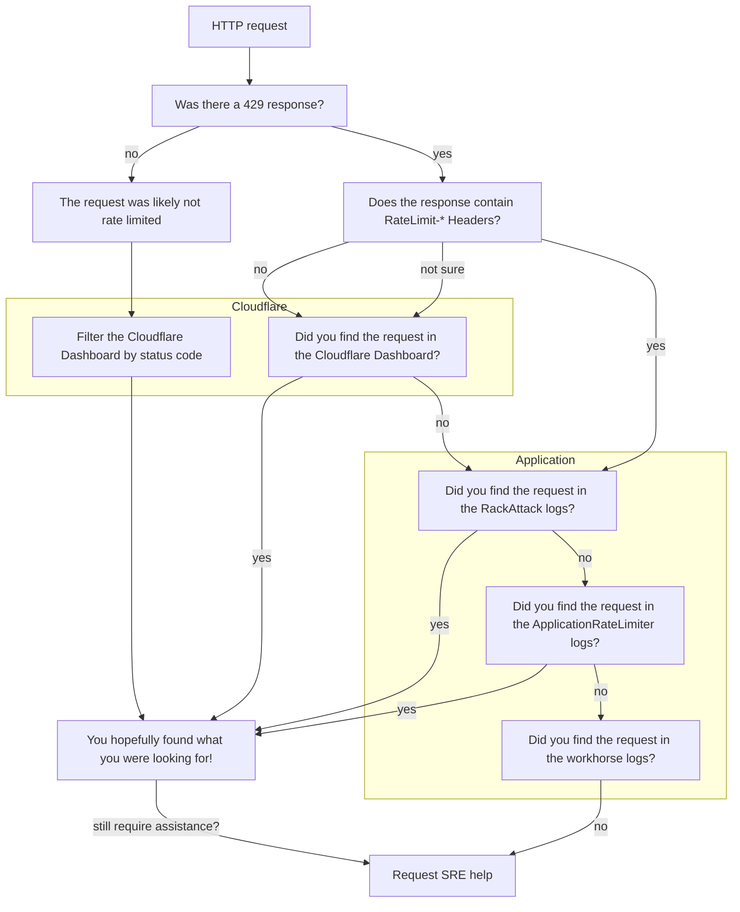

## Overview

Troubleshooting rate limiting issues can be complicated,
particularly as requests can be throttled at different layers of our stack.
This page provides GitLab team members (who have the correct permissions) steps to follow
in order to find where a customer's request has been rate limited, and why.

## Has a request been rate limited?

Rate limited requests will return a `429 - Too Many Requests` response.

Following these troubleshooting guides for other status codes may still be beneficial.

## What layer is rate limiting the request?

All traffic to GitLab.com is subject to rate limiting,
there are different [limits](/handbook/engineering/infrastructure/rate-limiting/#limits) applied at Cloudflare and within the Application.

**Note:** If you are troubleshooting rate limiting issues for GitLab Pages or Registry,
see [other rate limits](/handbook/engineering/infrastructure/rate-limiting/#other-rate-limits) for details on how these are configured.

The following diagram should aid you in determining where to look first,
and for further detail scroll down to the related section.

### Rate Limit Response Headers

Sometimes users will see `RateLimit-*` response headers when a request has been rate limited;
this depends on the layer that has throttled the request.
For example, Cloudflare does not return a `RateLimit-*` response header.
This behaviour is better documented in the [Rate Limiting Headers](/handbook/engineering/infrastructure/rate-limiting/#headers) section of the handbook.

The presence (or absence) of these headers can be used to signal where to start your investigation,
as the `RackAttack` rate limits configured in the Application return these response headers on throttled requests.

## Cloudflare

GitLab team members with access can [use SSO to login to our Cloudflare account](https://dash.cloudflare.com/login).
To do so, enter your GitLab email and the `Log in with SSO` option will appear.

To request access, open an [access request](https://gitlab.com/gitlab-com/team-member-epics/access-requests/-/issues/new?issuable_template=Access_Change_Request) for the Cloudflare Analytics role.

Watch a [recorded walkthrough of the Cloudflare Dashboard](https://www.youtube.com/watch?v=7oW5WrlJWp0) (private to GitLab Team Members).

### Quick Links

- [Cloudflare Overview: gitlab.com domain](https://dash.cloudflare.com/852e9d53d0f8adbd9205389356f2303d/gitlab.com)
- [Analytics & Logs: Network Analytics](https://dash.cloudflare.com/852e9d53d0f8adbd9205389356f2303d/network-analytics/all-traffic)
- [Analytics & Logs: HTTP Traffic for gitlab.com](https://dash.cloudflare.com/852e9d53d0f8adbd9205389356f2303d/gitlab.com/analytics/traffic)
- [Security Center: Events for gitlab.com](https://dash.cloudflare.com/852e9d53d0f8adbd9205389356f2303d/security-center/events?host=gitlab.com)
- [Security: Bot Analytics for gitlab.com](https://dash.cloudflare.com/852e9d53d0f8adbd9205389356f2303d/gitlab.com/security/bots)

#### Select custom date ranges for your searches

Doing so serves two purposes:

1. It narrows your search to a specific time period.
1. It allows you to share a snapshot view with colleagues,
whereas the `Previous 24 hours` will generate a link with a rolling window.

**Note:** that the dates seen in the UI are in your local time zone.

### HTTP Traffic Analytics

This dashboard will show the HTTP traffic for `gitlab.com`,
which can return sampled results.
Use this dashboard to look up paths, IPs, source user agents, data centers, and more.

Click to see Cloudflare HTTP Traffic Analytics

#### Add filters

There are a number of filters that can be applied when looking at HTTP traffic.
A few useful filters to be aware of:

- `Source IP` - filter by the customer's IP address.
- `Edge status code` - this is the response code from Cloudflare.
- `Origin status code` - this is the response code from GitLab.

For example, seeing that the Edge status is different
to the Origin status returned from GitLab
could be an indication that a request isn't making it past Cloudflare.

You can apply as many filters as required,
then scroll down to see the results.
The default view will return the top 5 items,
but this can be increased to 15 items if required.

### Security Events

The [Security Events](https://dash.cloudflare.com/852e9d53d0f8adbd9205389356f2303d/security-center/events?host=gitlab.com)
show the volume of requests that were blocked, challenged, or skipped.
Use this dashboard to investigate if (and what) Cloudflare rule might be blocking traffic.

Click to see Cloudflare Security Events

#### Add filters

The most useful filters you can apply when looking at Security Events are:

- `Source IP` - filter by the customer's IP address.
- `Action` - search for allowed, blocked, challenged, or other statuses.
- `Ray ID` - search for a specific identifier [[Cloudflare Ray ID docs](https://developers.cloudflare.com/fundamentals/reference/cloudflare-ray-id/)].

You can apply as many filters as required,
then scroll down to see the results.
The default view will return the top 5 items,
but this can be increased to 15 items if required.

**Note:** Search results may be limited to 30 days.

#### Interpreting Results

Once you have filtered your results then you can use the results to further investigate:

- **Source IP Addresses:** Are requests coming from one, or many IP addresses?
- **User Agents:** Are requests from a common library? What version?
- **Paths:** What resources or paths are they targetting, is there a pattern?
- **Firewall/ Rate limiting/ Managed rules**: What rules are being hit? Is this expected behaviour?
  - Note: these may show as `Rule unavailable` to those with Analytics access,
  but can still be beneficial to know which type of rule has blocked a request.

If any of the results are particularly interesting,
you can hover over the value to further `Filter` or `Exclude` to dig deeper into your investigation.

Click to see Cloudflare Security Event Results

The below results have been redacted
to remove any potentially sensitive information.

### SSH Traffic

The [Network Analytics](https://dash.cloudflare.com/852e9d53d0f8adbd9205389356f2303d/network-analytics/all-traffic?dest-port=22) dashboard allows you to filter by destination port.
Setting a filter of `Destination port equals 22`
will allow you to do basic analysis on SSH traffic.

For more detailed investigation, logs are pushed to a Google Cloud Storage (GCS) bucket
where those with access to GCP can investigate further.

See the [Cloudflare runbook](https://gitlab.com/gitlab-com/runbooks/-/blob/master/docs/cloudflare/logging.md) for details on querying the Cloudflare logs,
or follow guidance to request further SRE assistance.

### Bots

The [Bot Analytics](https://dash.cloudflare.com/852e9d53d0f8adbd9205389356f2303d/gitlab.com/security/bots) dashboard (Administrator access only)
allows you to filter in the same way as other Cloudflare dashboards,
which can be useful if all other options have been exhausted
to determine the likelihood of automation versus human requests.

Click to see Cloudflare Bot Analytics

## HAProxy

HAProxy is not used to throttle requests to `gitlab.com`,
however if you're investigating rate limits related to Registry or Pages,
then you can refer to the [HAProxy Logging runbook](https://gitlab.com/gitlab-com/runbooks/-/blob/master/docs/frontend/haproxy-logging.md).

## Application

There are two main throttling mechanisms in the GitLab Application:
[RackAttack](/handbook/engineering/infrastructure/rate-limiting/#rackattack) and the
[ApplicationRateLimiter](/handbook/engineering/infrastructure/rate-limiting/#applicationratelimiter).

You can observe trends for both using the [Rate Limiting Overview](https://dashboards.gitlab.net/d/rate-limiting-rate-limiting_overview/rate-limiting3a-rate-limiting3a-overview?orgId=1) Grafana dashboard.

### Quick Links

- [Metrics: Rate Limiting Overview dashboard](https://dashboards.gitlab.net/d/rate-limiting-rate-limiting_overview/rate-limiting3a-rate-limiting3a-overview?orgId=1)
- [Logs: RackAttack](https://log.gprd.gitlab.net/app/discover#/view/0026cc97-6b9a-445a-a364-7197e04053a2?_g=())
- [Logs: ApplicationRateLimiter](https://log.gprd.gitlab.net/app/discover#/view/2d2cf10e-b22a-4c07-bbda-45bb665c31ee?_g=())
- [Logs: Rate Limit Dashboard](https://log.gprd.gitlab.net/app/r/s/AJDZC)

### RackAttack

If a request is throttled by [RackAttack](/handbook/engineering/infrastructure/rate-limiting/#rackattack) it will contain `RateLimit-*` response headers.

You can filter the [RackAttack logs](https://log.gprd.gitlab.net/app/discover#/view/0026cc97-6b9a-445a-a364-7197e04053a2?_g=()) by:

- IP address using `json.remote_ip`
- Throttle using `json.matched`
- Path using `json.path`

### ApplicationRateLimiter

You can filter the [ApplicationRateLimiter logs](https://log.gprd.gitlab.net/app/discover#/view/2d2cf10e-b22a-4c07-bbda-45bb665c31ee?_g=()) by:

- IP using `json.meta.remote_ip`
- User using `json.meta.user` or `json.meta.client_id`
- Project using `json.meta.project`
- Throttle using `json.env`
- Path using `json.path`

### Workhorse

If you have not found the request in Cloudflare, RackAttack, or ApplicationRateLimiter,
then you can search for rate limited responses in the [Workhorse logs](https://log.gprd.gitlab.net/app/discover#/view/7b6dc396-5b27-4e86-b150-72b476255faf?_g=()) by:

- IP using `json.remote_ip`
- Path using `json.uri`
- Status using `json.status`

## Requesting further assistance

If you have followed this troubleshooting guidance
and have not found the results you were looking for,
you can request further assistance from a Site Reliability Engineer (SRE)
using one of two confidential issue templates:

- [Cloudflare Troubleshooting](https://gitlab.com/gitlab-com/gl-infra/production-engineering/-/issues/new?issuable_template=Cloudflare%20Troubleshooting)
- [User Rate Limiting Settings](https://gitlab.com/gitlab-com/gl-infra/production-engineering/-/issues/new?issuable_template=request-rate-limiting)

## Additional Resources

- [Support Workflows: IP Blocks](/handbook/support/workflows/ip-blocks/)
- [Runbooks: Rate Limiting](https://gitlab.com/gitlab-com/runbooks/-/tree/master/docs/rate-limiting)
- [Runbooks: Cloudflare](https://gitlab.com/gitlab-com/runbooks/-/tree/master/docs/cloudflare)
- [Docs: RackAttack Troubleshooting](https://docs.gitlab.com/ee/security/rate_limits.html#troubleshooting)
