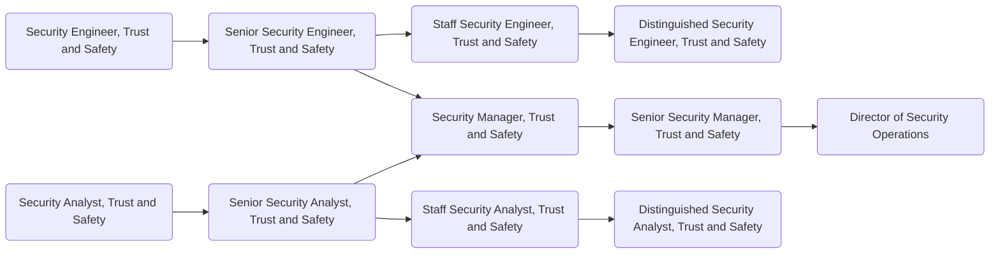

[Trust & Safety](/handbook/security/security-operations/trustandsafety/) team members are the builders and maintainers of the anti-abuse world at GitLab.com. They develop the tools and manage the workflows that are needed to monitor, mitigate and report on abusive activity, and are an essential part of our goal of being good internet citizens.
In the Trust and Safety Team there are two primary role types, Security Engineer and Security Analyst. Where the Security Engineer in Trust and Safety is primarily focused on the creation, maintenance and improvements of the systems and tools required to detect and mitigated abusive activity on GitLab.com, the Security Analysts' primary focus is on the creation, maintenance and processing operational workflows in the team.
Depending on the role type you are applying for your daily duties could include creating tooling and automation for curbing abusive activity on GitLab.com, assisting with incident response and operational workloads and mitigating abusive activity.
A successful candidate is someone who is curious and willing to learn, has at least a basic understanding of security concepts, is comfortable moving forward in the face of ambiguity and able to effectively manage competing priorities.

## Analyst, Trust and Safety

### Responsibilities

- Monitor and mitigate abusive activity on GitLab.com
- Triage and respond to Trust and Safety related incidents and reports
- Create, maintain and improve operational workflows in Trust and Safety
- Utilize log ingestion platforms for analyzing and identifying the tactics, techniques and patterns of abusive users
- Assist with training and onboarding of new team members

### Requirements

- Ability to use GitLab
- You are a team player, and enjoy collaborating with cross-functional teams
- You are a great communicator
- You employ a flexible and constructive approach when solving problems
- You are comfortable with moving forward when faced with ambiguity
- Share our [values](/handbook/values/), and work in accordance with those values

### Levels

### Security Analyst, Trust and Safety (Intermediate)

This position reports to the [Manager, Trust and Safety](#manager-trust-and-safety).

#### Security Analyst, Trust and Safety (Intermediate) Job Grade

The Security Analyst, Trust and Safety is a [grade 6](/handbook/total-rewards/compensation/compensation-calculator/#gitlab-job-grades).

#### Security Analyst, Trust and Safety (Intermediate) Responsibilities

- Respond to incidents of abusive activity originating from `GitLab.com`
- Participate in the Trust and Safety Team [on-call rotation]()
- Process abuse reports and DMCA notices relating to GitLab.com
- Mitigate detected abusive activity on GitLab.com and it's related products and services
- Manage internal requests from other teams inside and outside the Security Department
- Contribute to the creation of documentation, runbooks and workflows

#### Security Analyst, Trust and Safety (Intermediate) Requirements

- A minimum of 2 years experience working in either a Security, Data, or Trust and Safety (anti-abuse) Analyst type role
- Good written and verbal communication skills
- Basic experience using log analysis platforms such as ELK, bigquery, etc
- Familiarity with security and abuse concepts

### Senior Security Analyst, Trust and Safety

This position reports to the [Manager, Trust and Safety](#manager-trust-and-safety).

#### Senior Security Analyst, Trust and Safety Job Grade

The Security Analyst, Trust and Safety is a [grade 7](/handbook/total-rewards/compensation/compensation-calculator/#gitlab-job-grades).

#### Senior Security Analyst, Trust and Safety Responsibilities

- Extends Security Analyst, Trust and Safety responsibilities, plus;
- Handle escalated Trust and Safety issues independently
- The creation of runbooks, processes and workflows
- Periodically review and updating existing workflows, runbooks and processes
- Utilize log ingestion platforms for analyzing and identifying the tactics, techniques and patterns of abusive users
- Assist with recruiting activities and administrative work

#### Senior Security Analyst, Trust and Safety Requirements

- 3+ years of demonstrated experience in anti-abuse processes and workflows, including some experience with incident response
- Excellent written and verbal communication skills
- Capability to build working relationships with key stakeholders
- Some experience using log analysis platforms such as ELK, bigquery, etc

### Staff Security Analyst, Trust and Safety

This position reports to the [Manager, Trust and Safety](#manager-trust-and-safety).

#### Staff Security Analyst, Trust and Safety Job Grade

The Security Analyst, Trust and Safety is a [grade 8](/handbook/total-rewards/compensation/compensation-calculator/#gitlab-job-grades).

#### Staff Security Analyst, Trust and Safety Responsibilities

- Extends Senior Security Analyst, Trust and Safety responsibilities, plus;
- SME on anti-abuse methodologies, mentoring and training other members of the Trust and Safety Team
- Lead the design, evaluation and implementation new Trust and Safety workflows to improve the operational efficiency of the Trust and Safety Team
- Maintain knowledge of emerging threats, security technologies and academic research for application in the prevention of abusive activity on GitLab.com
- Contribute towards the creation of a cross-functional team with the goal of limiting the impact of abusive activity on GitLab.com

#### Staff Security Analyst, Trust and Safety Requirements

- 6 years of demonstrated experience in security or anti-abuse processes and workflows, including experience with incident response
- Profound knowledge of anti-abuse methodologies
- Demonstrable experience using log analysis platforms such as ELK, bigquery, etc
- Demonstrable experience with project management and process improvement
- Experience in cross-functional collaboration

## Engineering, Trust and Safety

### Responsibilities

- Triage and respond to Trust and Safety related incidents
- Assess and integrate new tools and technologies, particularly open-source, in order to improve our operational efficiencies
- Assist with training and onboarding of new team members
- Assist with operational tasks if needed. Examples Include: Processing abuse reports, mitigating active and/or ongoing abusive activity
- Develop systems to detect abusive activity on GitLab.com
- Code reviews related to Trust and Safety tooling
- Identify possible new abuse vectors and communicate them to the relevant stakeholders

### Requirements

- Ability to use GitLab
- Experience with designing and implementing processes and tools to improve incident handling and resolution
- Technical knowledge of application development and architecture
- Proficiency to communicate over a text-based medium (Slack, GitLab Issues, Email) and can succinctly document technical details
- Share our [values](/handbook/values/), and work in accordance with those values

### Levels

### Security Engineer, Trust and Safety (Intermediate)

This position reports to the [Manager, Trust and Safety](#manager-trust-and-safety).

#### Security Engineer, Trust and Safety (Intermediate) Job Grade

The Security Engineer, Trust and Safety is a [grade 6](/handbook/total-rewards/compensation/compensation-calculator/#gitlab-job-grades).

#### Security Engineer, Trust and Safety (Intermediate) Responsibilities

- Respond to incidents of abusive activity originating from GitLab.com
- Participate in the Trust and Safety Team [on-call rotation]()
- Utilize log ingestion platforms for analyzing and identifying the tactics, techniques and patterns of abusive users
- Contribute to the creation of documentation and runbooks
- Contribute to the production and tuning of anti-abuse detection and mitigation tooling
- Identify new potential abuse vectors

#### Requirements

- A minimum of 1 years experience working in either a Security Engineering or Trust and Safety (anti-abuse) type role
- Good written and verbal communication skills
- Experience using log analysis platforms such as ELK, bigquery, etc
- Familiarity with Google Cloud Platform (GCP), AWS, and/or Azure
- Substantial engineering mindset

### Senior Security Engineer, Trust and Safety

This position reports to the [Manager, Trust and Safety](#manager-trust-and-safety).

#### Senior Security Engineer, Trust and Safety Job Grade

The Senior Security Engineer, Trust and Safety is a [grade 7](/handbook/total-rewards/compensation/compensation-calculator/#gitlab-job-grades).

#### Senior Security Engineer, Trust and Safety Responsibilities

- Extends Security Engineer, Trust and Safety responsibilities, plus;
- Leverages Trust and Safety (anti-abuse) expertise in at least one specialty area
- Triage and handle escalated issues independently
- Conducts architecture reviews on Trust and Safety tooling/systems and makes recommendations
- Interview security candidates during the hiring process

#### Senior Security Engineer, Trust and Safety Requirements

- 5+ years of demonstrated experience in Software Engineering with some experience in web or cloud security or abuse detection
- A minimum of 2 years experience working with incident response
- Excellent written and verbal communication skills
- Capability to build working relationships with key stakeholders
- Experience with operating system internals, web applications and browser security

### Staff Security Engineer, Trust and Safety

This position reports to the [Manager, Trust and Safety](#manager-trust-and-safety).

#### Staff Security Engineer, Trust and Safety Job Grade

The Staff Security Engineer, Trust and Safety is a [grade 8](/handbook/total-rewards/compensation/compensation-calculator/#gitlab-job-grades).

#### Staff Security Engineer, Trust and Safety Responsibilities

- Extends Senior Security Engineer, Trust and Safety responsibilities, plus;
- SME on abuse detection and mitigation, mentoring and training other members of the Trust and Safety Team
- Lead the design, evaluation, implementation and deployment of new abuse detection and mitigation technologies
- Maintain knowledge of emerging threats, security technologies and academic research for application in the prevention of abusive activity on GitLab.com
- Lead efforts to design and collect metrics and behavioral data related to abusive activity on GitLab.com in order to improve the efficiency and effectiveness of the Trust and Safety Team

#### Staff Security Engineer, Trust and Safety Requirements

- 10 years of demonstrated experience in Software Engineering with some experience in web or cloud security or abuse detection
- Profound knowledge of attack and mitigation methods
- Experience with application development and architecture
- Experience with threat modeling
- Experience in the development of security tools and automation

## Manager, Trust and Safety

### Levels

### Manager, Trust and Safety

The Manager, Trust and Safety reports to the [Senior Manager, Trust and Safety](#senior-manager-trust-and-safety) role.

#### Manager, Trust and Safety Job Grade

The Trust and Safety Manager is a [grade 8](/handbook/total-rewards/compensation/compensation-calculator/#gitlab-job-grades).

#### Manager, Trust and Safety Responsibilities

- Hire a world class team of security engineers to work on their team
- Participate in the Trust and Safety Team [on-call rotation]() as the `Trust and Safety Manager On-call (TSMOC)`
- Help their team grow their skills and experience
- Provide input on security architecture, issues, and features
- Hold regular 1:1's with all members of their team
- Create a sense of psychological safety on their team
- Be your team's role model in terms of positive thinking, de-escalating conflict, and taking time off
- Identify the need to, and drive the implementation of security-related technical and process improvements
- Author project plans for security initiatives
- Draft and successfully deliver quarterly OKRs
- Train team members to screen candidates and conduct interviews
- Draft and deliver operation reports and hold retrospectives
- Build a substantial, collaborative partnership with Legal, Infrastructure, Support and Product teams

#### Manager, Trust and Safety Requirements

- Experience with leading abuse operations teams
- Experience with working at a SaaS, or product company
- Being comfortable with often not being in control of their time (because abusive activity doesn't respect any schedules)
- Willingness to be part of the Security Manager On-Call rotation
- Robust sense of ownership, urgency, and drive
- Excellent written and verbal communication skills, especially experience with executive-level communications
- Capability to make sound decisions in the face of ambiguity and imperfect knowledge
- Robust understanding of abuse-related issues, vectors, processes, and a solid grasp of the current global abuse landscape
- First hand experience with major cloud providers - GCP, AWS, Azure, Digital Ocean
- Alignment with Manager responsibilities as outlined in [Leadership at GitLab](/handbook/company/structure/#management-group)

### Senior Manager, Trust and Safety

The Senior Manager, Trust and Safety reports to the [Director of Security Operations](/job-families/security/security-leadership/#director-security-operations) role.

#### Senior Manager, Trust and Safety Job Grade

The Senior Manager, Trust and Safety is a [grade 9](/handbook/total-rewards/compensation/compensation-calculator/#gitlab-job-grades).

#### Senior Manager, Trust and Safety Responsibilities

- Extends Manager, Trust and Safety responsibilities, plus;
- Provide tactical oversight of the teams' daily efforts
- Maintain vision for the teams' immediate and near-term future
- Develop and maintain teams' KPIs
- Be your teams' role model in terms of positive thinking, de-escalating conflict, and taking time off
- Help teams prioritise efforts and ensure they align with the overall direction of the company
- Draft and successfully deliver on quarterly OKRs
- Train team members to screen candidates and conduct managerial interviews
- Build a substantial, collaborative partnership with peers from Legal, Infrastructure, Alliances, and Product departments
- Take the role of an Incident Manager during larger security events not necessarily related to Trust & Safety efforts
- Take part in the Security Escalation On-Call rotation

#### Senior Manager, Trust and Safety Requirements

- Experience with leading people managers
- Experience with leading security or abuse operations teams
- Experience with working at a SaaS, or product company
- Excellent written and verbal communication skills, especially experience with executive-level communications
- Capability to make concrete progress in the face of ambiguity and imperfect knowledge
- Being comfortable with rapid context switching
- Willingness to be part of the Security Escalation On-Call rotation
- Robust understanding of security issues, mitigations, and a solid grasp of the current global threat landscape
- Experience with the role of an incident manager during large scale security events
- Familiarity with major cloud providers - GCP, AWS, Azure, Digital Ocean

## Performance Indicators

- Improve the health of GitLab.com, and drive down cost by [mitigating abusive activity](/handbook/security/performance-indicators/#cost-of-abuse).

### Career Ladder

For details on the Security organization leadership roles, to include the Security Operations Director and VP of Security, see the Security Leadership page.

## Hiring Process

Candidates for this position can expect the hiring process to follow the order below. Please keep in mind that candidates can be declined from the position at any stage of the process. To learn more about someone who may be conducting the interview, find their job title on our [team page](/handbook/company/team/).

- Qualified candidates will be invited to schedule a 30 minute [screening call](/handbook/hiring/interviewing/#screening-call) with one of our Global Recruiters.
- Next, candidates will be invited to schedule an interview with Trust and Safety Manager
- Candidates will then be invited to schedule an interview with Senior Security Engineer, Trust and Safety, Security Incident Response Team Manager, Red Team Manager
- Candidates will then be invited to schedule an interview with Director of Security Operations
- Successful candidates will subsequently be made an offer via email

Additional details about our process can be found on our [hiring page](/handbook/hiring/).
