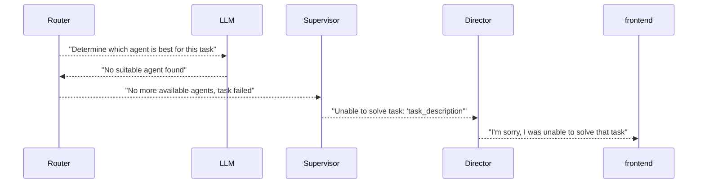
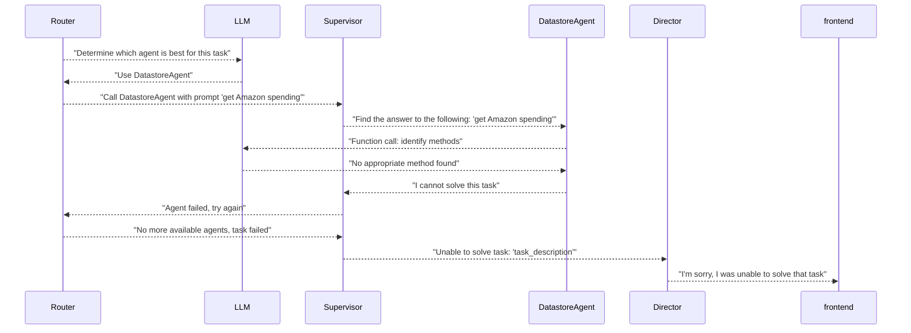

# Sequence diagrams of the unhappy flows

>## Notes - to be removed
>What looping do we want in the failure cases:
>- Should director go back to task agent and ask for a different task breakdown?
>- Should the router try and look for an agent again?
>- Should the router continue and try its best to solve the remaining tasks and >let the director know which tasks it couldn't solve?

The below assume no looping for error cases:

## "Router unable to find agent to solve task"

## "Router choses agent, unable to solve task, no more agents"

