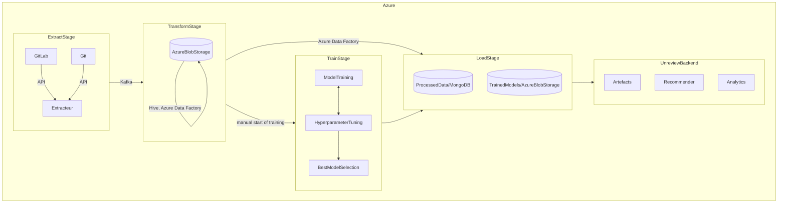
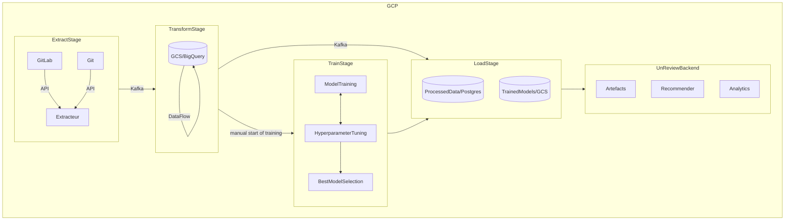
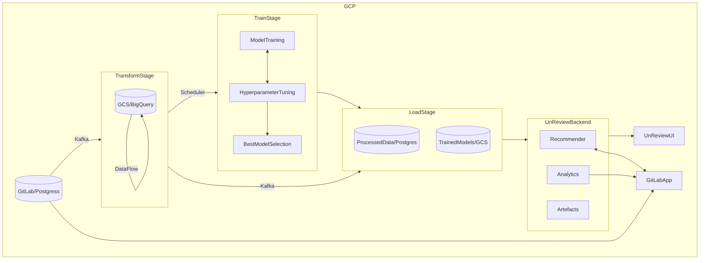
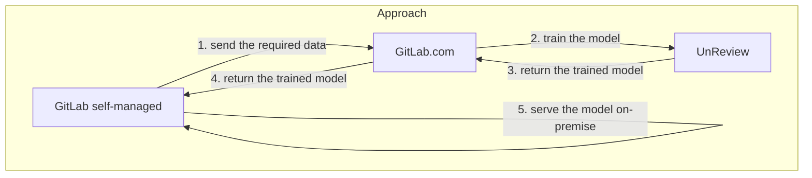

---

title: UnReview Overview
description: "UnReview is an approach for finding appropriate code reviewers in the most effective way"
---

## Introducing UnReview

### Overview

Code review is an important part of any development process. Over the years, code review has shown a large impact on improving the quality of source code. In addition, code review facilitates in transferring knowledge about the codebase, approaches, expectations regarding quality, etc.; both to the reviewers and to the author.

In a small project, finding an appropriate code reviewer is not a big issue. This might be done manually. However, as the project grows, finding an appropriate code reviewer becomes increasingly difficult. In this setting, manual assignments become time-consuming and require keeping in mind lots of aspects when looking for the right person. Random assignments will be potentially error-prone, as the pool of developers and possible reviewers usually grows with the size of the project, reducing the likelihood of appropriate recommendations. The other option of always assigning key reviewers would make the selected persons overburdened and a bottleneck due to inadvertently siloing knowledge. Overall, none of the provided strategies appear to be optimum. To find appropriate code reviewers in the most effective way, the UnReview project has been initiated.

UnReview focuses on achieving the following goals:

* Eliminating the time wasted manually searching for an appropriate code reviewer to review code changes.
* Making optimum recommendations that consider the reviewers’ experience and optimize the review load across the team, which additionally facilitates knowledge sharing.
* Providing analytics on the state of code review in the project, explaining why a particular code reviewer is recommended.

Today, UnReview is an early-stage technology.  However, significant testing and validation has been done on production data. After the [acquisition](https://about.gitlab.com/press/releases/2021-06-02-gitlab-acquires-unreview-machine-learning-capabilities.html) is complete, we continue to work on the approach, integrating UnReview into GitLab via iteration.

### How UnReview works

To make recommendations, UnReview considers the reviewer’s experience in the part of the source code proposed by a merge request. For a given project, UnReview automatically collects the commit history and merge requests in order to identify who is responsible for reviewing and for which part of the source code. Using that information, UnReview then trains the model that is able to make appropriate recommendations.

UnReview is able to resolve the cold start problem, i.e., when the proposed source code is unknown to the recommendation engine. When making recommendations, UnReview additionally tries to balance the review load across the team. Future versions will also consider the context of the merge request, i.e., which source code has been exactly changed and how it affects other parts of the project.

### Challenges

Working on UnReview, we have faced the following challenges:

* It can be difficult to identify who is an appropriate reviewer for the merge request, as many can contribute, but not everyone has permission to merge.
* Optimizing the review load while making it clear why the person is selected as an appropriate reviewer.
* Previous assignments are potentially error-prone. They can be performed at random or a key reviewer is always assigned. Thus, relying solely on previous assignments may lead to biased recommendations.

### Architecture

UnReview consists of multiple components used for a variety of purposes, from data extraction and processing to training machine learning models:

* [Apache Kafka](https://kafka.apache.org/): distributed event streaming and processing;
* [Apache Hive](https://hive.apache.org/): data preprocessing including building train/test datasets;
* [Azure Data Factory](https://azure.microsoft.com/en-us/services/data-factory/): orchestrating the preprocessing pipelines, managing the Hive cluster, and moving the processed data to MongoDB
* [MongoDB](https://www.mongodb.com/): document-based database for storing the processed data
* [Azure Blob Storage](https://azure.microsoft.com/en-us/services/storage/blobs/): temporary storage for the trained ML models and raw data

The following chart provides more details on how the UnReview components relate to each other:

When integrating UnReview into GitLab, some components can be replaced as we progress through the defined milestones.

### Integration into GitLab

The backend work for integration will be primarily handled by the [AI Assisted](/handbook/engineering/development/data-science/ai-assisted/) team with help from the infrastructure team.  The frontend work will be by both the AI Assisted team and the `Create::code review` team (PM [Kai Armstrong](/handbook/company/team/#phikai) and EM [André Luís](/handbook/company/team/#andr3)).

* Milestone 1 [Reviewer/maintainer assignment architectural plan and PoC](https://gitlab.com/groups/gitlab-org/-/epics/5794)
* Milestone 2 [Customer facing MVC of integration of unreview](https://gitlab.com/groups/gitlab-org/-/epics/6113)
* Milestone 3 [Extend MVC and create plan for unreview functionality for self-managed customers](https://gitlab.com/groups/gitlab-org/-/epics/6114)

## Milestone 1

### Overview

Milestone 1 focuses on creating an UnReview proof-of-concept that works like [Reviewer Roulette](https://docs.gitlab.com/ee/development/code_review.html#reviewer-roulette) based on the GitLab product code. This milestone retains the existing UnReview functionality but requires a number of changes to the architectural components of the approach.

The following tasks have to be completed:

* Move Azure and GitHub-hosted aspects of UnReview to GCP.
* Implement UnReview code and dependent components in the GitLab managed GCP instance.
* Replace the small number of libraries with undesirable open-source licenses.
* Demonstrate UnReview on the GitLab codebase and compare/contrast with existing Reviewer-Roulette.

More information on Milestone 1 can be found by following its [epic](https://gitlab.com/groups/gitlab-org/-/epics/5794).

### Architecture

At this milestone, a set of UnReview components has to be replaced according to the objectives specified above:

* Apache Hive and Azure Data Factory will be replaced with [Apache Beam](https://beam.apache.org/) backend by [Google Dataflow](https://cloud.google.com/dataflow) for data preprocessing.
* Azure Blob Storage will be replaced with [Google Cloud Storage](https://cloud.google.com/storage)/[BigQuery](https://cloud.google.com/bigquery) for storing the trained ML models and raw data.
* MongoDB will be replaced with [PostgreSQL](https://www.postgresql.org/) for storing the processed data.

The following chart provides more details on how the UnReview components, including the replaced ones, relate to each other:

## Milestone 2

### Overview

Milestone 2 focuses on providing the UnReview functionality to GitLab.com customers and for dogfooding at GitLab. At this milestone, UnReview should be able to connect to a provided project, automatically extract/process data, and periodically retrain the ML models to improve code reviewer recommendations. GitLab.com customers who license and enable this feature will start seeing and experiencing value from the functionality, including the ability to intelligently assign code reviewers to merge requests based on ML models.

To support GitLab.com customers:

* Code reviewer recommendations should be implemented behind a feature flag, which will be disabled by default.
* Integrate the UnReview UI into the GitLab product following the MVC pattern.
* Make it possible to compare UnReview with existing methods by providing recommendations in a comment.
* Add the option to automatically assign reviewers recommended by UnReview.

To support dogfooding at GitLab:

* Start the dogfooding process.
* Make UnReview available to replace or exist alongside Reviewer-Roulette used by GitLab team members for GitLab projects.
* Automatically assign reviewers recommended by UnReview.

More information on Milestone 2 can be found by following its [epic](https://gitlab.com/groups/gitlab-org/-/epics/6113).

### Architecture

At this milestone, UnReview integrates into GitLab without using the public API because it is believed the API will not be fast enough and would possibly put too high of a load on the GitLab infrastructure. The requested data is passed directly to the UnReview infrastructure via Apache Kafka. In this way, Kafka acts as a bridge between UnReview and GitLab, separating the two infrastructures, while allowing UnReview to access the data it needs that is not available through the public API. To solve another issue of periodically retraining ML models, UnReview could potentially use a scheduler, e.g., [Apache Airflow](https://airflow.apache.org/).

The following chart provides more details on how UnReview communicates with the GitLab infrastructure via Apache Kafka:

## Milestone 3

### Overview

Milestone 3 focuses on further improving the UnReview functionality for GitLab.com customers, as well as planning to provide the functionality to self-managed customers. At this milestone, GitLab.com customers will continue seeing and experiencing value from the functionality, including the ability to intelligently assign code reviewers to merge requests based on ML models. Primary feedback from GitLab.com customers and dogfooding at GitLab should be considered and integrated into the product.

To support GitLab.com customers:

* Make the feature flag enabled by default and available to customers GA via configuration options in the GitLab user interface.
* Automatically assign reviewers when the feature flag is enabled.

To support self-managed customers:

* Determine self-managed performance concerns as it relates to performance and storage requirements in the customer-hosted environment and at customers that intentionally have no internet connectivity.

More information on Milestone 3 can be found by following its [epic](https://gitlab.com/groups/gitlab-org/-/epics/6114).

### Architecture

Delivering the full UnReview functionality to self-managed customers may be challenging. Processing data and training ML models requires significant hardware power and administration efforts from the customer’s team itself. We continue to explore various approaches to addressing this issue. Additionally, we are looking towards privacy-preserving machine learning through data obfuscation.

Overall, one way to support self-managed customers might be to:

* securely access only the necessary data stored on the self-managed GitLab infrastructure;
* process the obtained data on the GitLab.com side and then train the ML model;
* send the trained ML model back to the self-managed GitLab infrastructure to serve it on-premise.

The following diagram provides more details on how UnReview may interact with the self-managed GitLab infrastructure:

