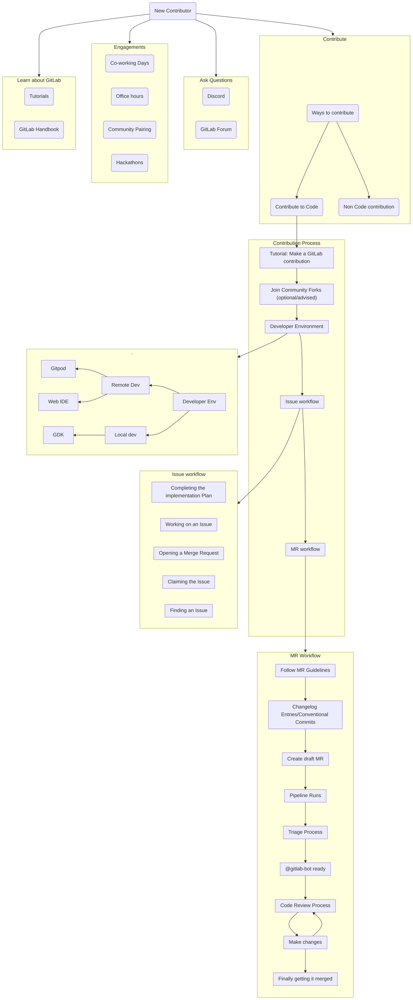

## Journey Map

```mermaid
%%{init: {"flowchart": { "useMaxWidth": false } }}%%
flowchart TB
    start("New Contributor")


    subgraph id4["Contribute"]
        id4_heading("Ways to contribute")
        id4_box1("Contribute to Code")
        id4_box2("Non Code contribution")
        id4_heading --> id4_box1
        id4_heading --> id4_box2

        click id4_box1 "https://docs.gitlab.com/ee/development/contributing/"

    end

    subgraph id5["Contribution Process"]

        subgraph id5_box1["Tutorial: Make a GitLab contribution"]
        end
        subgraph id5_sg0["Join Community Forks (optional/advised)"]
        end
        subgraph id5_sg1["Developer Environment"]
        end
        subgraph id5_sg2["Issue workflow"]
        end
        subgraph id5_sg3["MR workflow"]
        end

        direction TB
        id5_box1 --> id5_sg0
        id5_sg0 --> id5_sg1
        id5_sg1 --> id5_sg2
        id5_sg2 --> id5_sg3
        %% id5_sg3 --> id5_sg4
        %% id5_sg4 --> id5_sg5
        %% id5_sg5 --> id5_sg6
        %% id5_sg6 --> id5_sg7
        %% id5_sg7 --> id5_sg8

        click id5_box1 "https://docs.gitlab.com/ee/development/contributing/first_contribution.html"
        click id5_sg1 "https://docs.gitlab.com/ee/development/contributing/#set-up-the-gitlab-development-kit"
        click id5_sg2 "https://docs.gitlab.com/ee/development/contributing/issue_workflow.html"
        click id5_sg3 "https://docs.gitlab.com/ee/development/contributing/merge_request_workflow.html"
        click id5_sg0 "https://gitlab.com/gitlab-community/community-members"
    end


    subgraph id7["."]
    direction RL
         id7_box0["Developer Env"]
         id7_sg1["Local dev"]
         id7_sg2["Remote Dev"]
         id7_box1["Gitpod"]
         id7_box2["Web IDE"]
         id7_box3["GDK"]


        id7_box0 --> id7_sg1
        id7_box0 --> id7_sg2
        id7_sg2 --> id7_box1
        id7_sg2 --> id7_box2
        id7_sg1 --> id7_box3

        click id7_box1 "https://docs.gitlab.com/ee/integration/gitpod.html"
        click id7_box2 "https://docs.gitlab.com/ee/user/project/web_ide/"
        click id7_box3 "https://gitlab.com/gitlab-org/gitlab-development-kit/-/blob/main/README.md"
    end


    subgraph id8["Issue workflow"]
        direction RL
        subgraph id8_sg1["Finding an Issue"]
        end
        subgraph id8_sg2["Claiming the Issue"]
        end
        subgraph id8_sg3["Opening a Merge Request"]
        end
        subgraph id8_sg4["Working on an Issue"]
        end
        subgraph id8_sg5["Completing the implementation Plan"]
        end

        click id8_sg4 "https://docs.gitlab.com/ee/development/contributing/issue_workflow.html#working-on-the-issue"

    end

    subgraph id9["MR Workflow"]
        direction TB
        subgraph id9_sg1["Follow MR Guidelines"]
        end
        subgraph id9_sg2["Changelog Entries/Conventional Commits"]
        end
        subgraph id9_sg3["Create draft MR"]
        end
        subgraph id9_sg4["Pipeline Runs"]
        end
        subgraph id9_sg5["Triage Process"]
        end
        subgraph id9_sg6["@gitlab-bot ready"]
        end
        subgraph id9_sg7["Code Review Process"]
        end
        subgraph id9_sg8["Make changes"]
        end
        subgraph id9_sg9["Finally getting it merged"]
        end

        click id9_sg2 "https://docs.gitlab.com/ee/development/changelog.html"

        id9_sg1 --> id9_sg2
        id9_sg2 --> id9_sg3
        id9_sg3 --> id9_sg4
        id9_sg4 --> id9_sg5
        id9_sg5 --> id9_sg6
        id9_sg6 --> id9_sg7
        id9_sg7 --> id9_sg8
        id9_sg8 --> id9_sg7
        id9_sg8 --> id9_sg9

    end

    subgraph id1["Ask Questions"]
        id1_box1("Discord")
        %% id1_box2("FAQs")
        id1_box3("GitLab Forum")

        click id1_box1 "https://discord.gg/rxWqW5e8"
        %% click id1_box2 "https://docs.gitlab.com/ee/development/fe_guide/frontend_faq.html"
        click id1_box3 "https://forum.gitlab.com/"
    end

    subgraph id2["Engagements"]
        id2_box1("Co-working Days")
        id2_box2("Office hours")
        id2_box3("Community Pairing")
        id2_box4("Hackathons")

        click id2_box2 "https://handbook.gitlab.com/handbook/marketing/developer-relations/contributor-success/#community-office-hours"
        click id2_box3 "https://handbook.gitlab.com/handbook/marketing/developer-relations/contributor-success/community-pairing-sessions.html"
        click id2_box4 "https://handbook.gitlab.com/handbook/company/culture/all-remote/informal-communication/#coffee-chats"
        click id2_box5 "https://about.gitlab.com/community/hackathon/"

    end

    subgraph id3["Learn about GitLab"]
        id3_box1("Tutorials")
        id3_box2("GitLab Handbook")

        click id3_box1 "https://docs.gitlab.com/ee/tutorials/"
        click id3_box2 "https://handbook.gitlab.com/handbook/"
    end

%% Root level mappings
    start --> id1
    start --> id2
    start --> id3
    start --> id4

    %% Contribution Process
    %% Mappings

    %% Mapping Subgraph contribute to code with Contribution Process
    id4_box1 --> id5_box1
    %% 3. Setting up local dev
            id5_sg1 --> id7
    %% 4. Issue Workflow
            id5_sg2 --> id8
    %% 5. MR WorkFlow
            id5_sg3 --> id9
    %% 6. Triage Process
```

