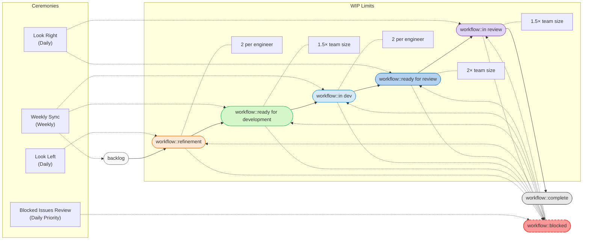
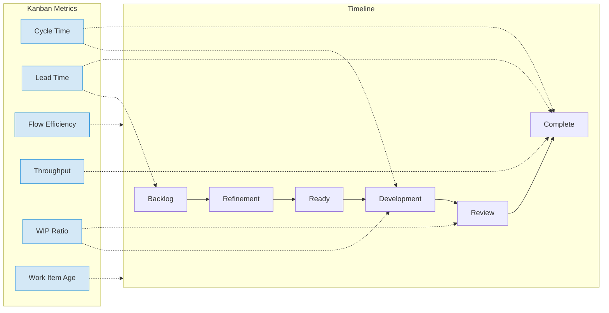
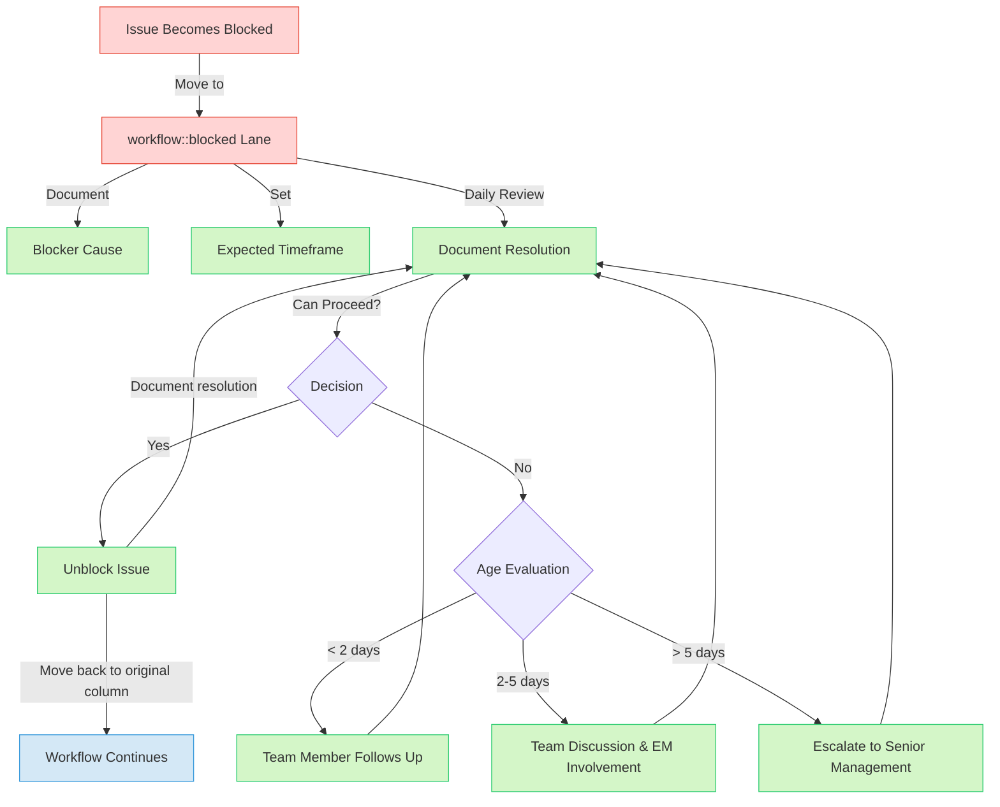

## Overview

The Self Managed team is responsible for installation, upgrades, scaling, migration, and configuration across various deployment methods. Our work often involves:

1. Responding to both internal and external customer requests
2. Supporting multiple deployment methods and platforms simultaneously
3. Managing technically complex integration work with varied timelines
4. Balancing planned feature development with maintenance work

Following [Kanban](https://en.wikipedia.org/wiki/Kanban_(development)) approach provides these benefits:

- **Improved flow efficiency** - Work items progress continuously rather than being tied to milestone boundaries
- **Greater adaptability** - Easier to respond to urgent deployment issues or customer requests without disrupting planned work
- **Better visualization of workload** - Clearer view of in-progress work across different deployment platforms
- **More predictable delivery** - Work completion is based on team capacity rather than milestone deadlines

## Kanban Implementation

We also use the [GitLab product development flow](/handbook/product-development/product-development-flow/#workflow-summary) and labels in principle. However, we usually skip below phases due to the nature of our work:

- [Validation phase 3: Design](/handbook/product-development/product-development-flow/#validation-phase-3-design)
- [Validation phase 4: Solution Validation](/handbook/product-development/product-development-flow/#validation-phase-4-solution-validation)

### Workflow Diagram

### Kanban Board Structure

The Self Managed Kanban board would use the following columns, aligned with GitLab's product development workflow:

| Column | Description | WIP Limit |
|--------|-------------|-----------|
| **backlog** | Prioritized but not ready for development | No limit |
| **workflow::refinement** | Issues being refined, broken down | 2 per engineer |
| **workflow::ready for development** | Fully specified, ready to be worked on | 1.5× team size |
| **workflow::in dev** | Currently being implemented | 2 per engineer |
| **workflow::ready for review** | Implementation complete, waiting for reviewer to pick up | 2× team size |
| **workflow::in review** | Under active code review | 1.5× team size |
| **workflow::complete** | Completed work | No limit |
| **workflow::blocked** | Work that cannot proceed due to some reason | Tracked but no limit |

## Key Ceremonies

### Daily Activities

- **Look Left & Right Before Dev** - Help move one item forward from refinement or review (ready for review/in review) before starting new development
- **Async Stand-up** - Brief asynchronous check-in focused on flow and impediments

### Weekly Meetings

1. **Team Sync** (Weekly)
   - Review Kanban board progress with EM and PM
   - Discuss impediments and prioritization
   - Ensure alignment with product goals

2. **Team Demo** (Weekly)
   - Sharing with Build group
   - Regular demonstrations of completed work
   - Sharing knowledge about new features or  improvements
   - Gathering feedback from team members and stakeholders
   - Increasing visibility of the team's accomplishments

3. **Maintainer Discussion** (Weekly)
   - Sharing with Build group
   - Regular review of merge requests and code quality
   - Discussion of technical decisions and architecture
   - Coordination between maintainers on critical components
   - Ensuring consistency in code standards and practices

4. **Engineers Huddle** (On demand)
   - Development-focused discussion
   - Implementation strategies and technical decisions

### Monthly Activities 

On the last week's weekly sync meeting every month.

- **Flow Retrospective** - Review flow metrics and process improvements
- **Release Planning** - Align with next milestone planning using flow-based priorities

### Quarterly Activities

- **Roadmap planning** - Participate in quarterly roadmap planning to align flow with strategic objectives
- **Retrospective** - Reflect on the past quarter's achievement, identify areas for enhancement, and create action plans for the future

## Priority definition

Self Managed team uses [infrastructure-wide priority labels](/handbook/engineering/infrastructure/engineering-productivity/issue-triage/#priority)
to determine the position in the Kandban columns.

| Priority | Label | Position in Kanban | Action Required |
|----------|-------|--------------------|-----------------|
| 1 | ~priority::1 | Top of active columns | Immediate attention required |
| 2 | ~priority::2 | High in active columns | Address after Priority 1 items |
| 3 | ~priority::3 | Middle of workflow | Address after higher priorities |
| 4 | ~priority::4 | Bottom of workflow | Address when resources available |

- "**Active columns**" refer to the workflow stages where work is currently being processed. These include:
  - **Ready for Development**: Issues prioritized and ready to be worked on
  - **In dev**: Issues currently being worked on by team members
  - **Ready for review:** Work completed but waiting to be reviewed
  - **In review**: Work completed but going through review and approval
- "**Middle/Bottom of workflow**" refers to issues with ~priority::3 and ~priority::4 that are positioned in the central part of our board. These items:
  - Have moderate urgency
  - Are positioned below Priority 1 and 2 items in active columns
  - Are typically scheduled after more urgent work
  - May be in any workflow stage (refinement, development, review)
  - Represent important work that should be completed, but can wait until higher priorities are addressed

- The position in Kanban board needs to be managed and maintained manually due to the issue boards' limitation.

### Work Prioritization Guidance

1. **Highest Priority First**: Always address higher priority items before any lower priority ones
2. **Milestone/Deadline-Driven Work**: Issues with fixed deadlines or milestone take precedence over non-deadline work of the same priority
3. **Dependency Resolution**: Address blocking issues before dependent issues regardless of initial priority
4. **WIP Limits**: Maintain work-in-progress limits to ensure focus on completing high-priority items

## Issue Weight Definition

<table>
<tr>
<th>Weight</th>
<th>Extra investigation</th>
<th>Surprises</th>
<th>Collaboration</th>
<th>Description</th>
<th>Examples</th>
</tr>
<tr>
<td>1: Trivial</td>
<td>not expected</td>
<td>not expected</td>
<td>not required</td>
<td>Cannot benefit from further breakdown</td>
<td>

- [Create or update simple documentation](https://gitlab.com/gitlab-org/cloud-native/operator/-/issues/161)
- [Fix a missing encoding problem in secret management](https://gitlab.com/gitlab-org/cloud-native/operator/-/issues/68)

</td>
</tr>
<tr>
<td>2: Small</td>
<td>possible</td>
<td>possible</td>
<td>possible</td>
<td>Simple tasks with clear requirements</td>
<td>

- [Update to a new version of key dependency](https://gitlab.com/gitlab-org/cloud-native/gitlab-operator/-/issues/1836)
- [Create or update complex documentation](https://gitlab.com/gitlab-org/cloud-native/operator/-/issues/184)

</td>
</tr>
<tr>
<td>3: Medium</td>
<td>likely</td>
<td>likely</td>
<td>likely</td>
<td>More complex tasks requiring coordination</td>
<td>

- [Add E2E test to a CI pipeline](https://gitlab.com/gitlab-org/cloud-native/operator/-/issues/156)
- [Addressing security vulnerabilities in dependencies with our customization](https://gitlab.com/gitlab-org/cloud-native/charts/gitlab-ingress-nginx/-/issues/23)

</td>
</tr>
<tr>
<td>5: Large</td>
<td>highly likely</td>
<td>highly likely</td>
<td>highly likely</td>
<td>Consider breaking down if technically feasible</td>
<td>

- [Migrate secret generator module to the new framework](https://gitlab.com/gitlab-org/cloud-native/operator/-/issues/130)
- [Introduce a new application API and custom resource definition to Operator V2](https://gitlab.com/gitlab-org/cloud-native/operator/-/issues/109)

</td>
</tr>
<tr>
<td>8+</td>
<td>guaranteed</td>
<td>guaranteed</td>
<td>guaranteed</td>
<td>Too large - must be broken down into multiple issues and grouped into an Epic</td>
<td>

- [Address DockerHub pull limits across projects](https://gitlab.com/groups/gitlab-org/distribution/-/epics/104)
- [Self managed: Support Rollout of Container Registry for Self-Managed Instances](https://gitlab.com/groups/gitlab-org/-/epics/17005)

</td>
</tr>
</table>

1. **Notes on weights:**
   - Weights are contextual and can be affected by domain knowledge, experience levels, and time at GitLab
   - Weights are not set in stone and can be adjusted by the author/assignee if an issue requires more effort than initially estimated
   - For Weight 5 issues, team members are encouraged to discuss whether breaking it down would be beneficial
   - Weight 8+ issues must be broken down and should not be marked as ready for development
2. **WIP Limits Implementation**
   - Set column WIP limits based on item count initially, review once there is more data

### Flow Metrics

Use these flow-based metrics instead of milestone-based completion metrics, we will establish the baseline metrics and aim for steady improvement by FY27Q1.

#### 1. Cycle Time

**Definition:** The total elapsed time from when work begins on an issue until it is delivered to production.

**Components:**

- **Code Time:** Time spent coding the solution
- **Review Time:** Time spent in code review (MR open → MR merged)

**Target:** Our target cycle time varies by work complexity (To be updated by FY27Q1):

- Trivial changes (Weight 1): \< x 
- Small changes (Weight 2): \< x 
- Medium changes (Weight 3): \< x 
- Large changes (Weight 5): \< x

**Measurement:** (To be updated by FY27Q1)

#### 2. Lead Time

**Definition:** The total elapsed time from when an issue is created until it is delivered to production.

**Components:**

- **Planning Time:** Time from issue creation to development start
- **Cycle Time:** (as defined above)

**Target:** Our target lead times are (To be updated by FY27Q1):

- Priority 1 issues: \< x 
- Priority 2 issues: \< x 
- Priority 3 issues: \< x 
- Priority 4 issues: \< x 

**Measurement:** (To be updated by FY27Q1)

#### 3. WIP Ratio

**Definition:** The ratio of work items in progress compared to team capacity. Calculated as the number of active work items divided by the number of team members. 

**Target :**

- Optimal WIP ratio: 1-3
- Warning threshold: \> 3.0 
- Critical threshold: \> 4.0

**Measurement:** Count of issues in the ~"workflow::in dev", and ~"workflow::in review" stages divided by the number of active team members.

#### 4. Throughput

**Definition:** The number of work items (issues) completed per time period.

**Target:** Teams should establish their baseline throughput and aim for steady improvement.

**Measurement:** Count of issues moved to the "closed" state per week.

#### 5. Work Item Age

**Definition:** The age of currently open work items.

**Target:**

- No Priority 1 issues older than x days
- No Priority 2 issues older than x days
- Average work item age decreasing over time

**Measurement:** Current date minus issue creation date for all open issues.

#### 6. Flow Efficiency

**Definition:** The percentage of time that work items are actively being worked on versus waiting.

**Target:** \> x% flow efficiency (industry standard is often 15-20%)

**Measurement:** Active work time (time spent in (~"workflow::refinement" + ~"workflow::in dev" + ~"workflow::in review")) divided by total lead time.

## Required labels

Besides the [GitLab product development flow](/handbook/product-development/product-development-flow/#workflow-summary) labels, there are a number of additional **required** labels applied at any time to Epics, issues and merge requests (items):

- `group::Self Managed` - Items specific to, or authored by us.

There are also a number of additional **required** labels under certain scenarios:

- `spike` - Issues which primarily involve research to understand options and the breakdown of future deliverables. [Spikes](/handbook/product/product-processes/#spikes) are often the first issue in a new Epic where the output defines additional issues and order of serial/parallel work.

In addition to the labels outlined above, see also [workflow labels used during merge request review](/handbook/engineering/infrastructure-platforms/gitlab-delivery/distribution/merge_requests/#workflow) and [labels used during issue triage](/handbook/engineering/infrastructure-platforms/gitlab-delivery/distribution/triage/#label-glossary).

## Milestone Integration

Maintain alignment with GitLab milestone practices through:

- Tag any strict timeline issue with appropriate milestone during creation and keep it till completion, e.g. breaking changes
- Keep the milestone as `Next 1-3 releases` for all other issues when actively working on them
- Keep all other issues with milestone `Backlog`
- Tag all completed work with the milestone for recording
- Maintain all standard required labels

## Blocked Issues Management Process

### Blocked Issue Tracking

- **~"Workflow::blocked" Lane** - Issues that cannot progress due to dependencies, waiting for input, or other impediments are moved to a dedicated "workflow::blocked" lane
- **Blocker Documentation** - Each blocked issue must include a comment describing:
  - What is blocking the issue
  - Who/what team is responsible for unblocking
  - Any actions taken to resolve the blockage
  - Expected timeframe for resolution (if known)

### Blocked Issue Review (Daily Priority)

1. **Daily Blocked Issues Triage**
   - At the start of each day, the team reviews all blocked issues
   - Blocked issues are sorted by priority and duration of blockage
2. **Escalation Path**
   - Issues blocked for less than 2 days: Issue assignee actively follows up
   - Issues blocked for 2-5 days: Team sync/async discussion and EM involvement
   - Issues blocked for 5+ days: Escalation to appropriate managers/departments
3. **Resolution Actions**
   - Issue assignee is responsible for following up on each blocked issue
   - Document all actions taken to resolve the blockage
   - Consider workarounds or scope adjustments if blockage cannot be resolved quickly
4. **Metrics and Reporting**
   - Track percentage of issues blocked vs. flowing
   - Report on average time to resolve blockages
   - Identify patterns in blockers to address systemic issues
5. **WIP Management for Blocked Issues**
   - Blocked issues still count against `workflow::in dev` WIP limits
   - Team may temporarily adjust capacity allocation when multiple issues are blocked
   - Consider swarming on blocked issues to remove impediments

### Unblocking Workflow

