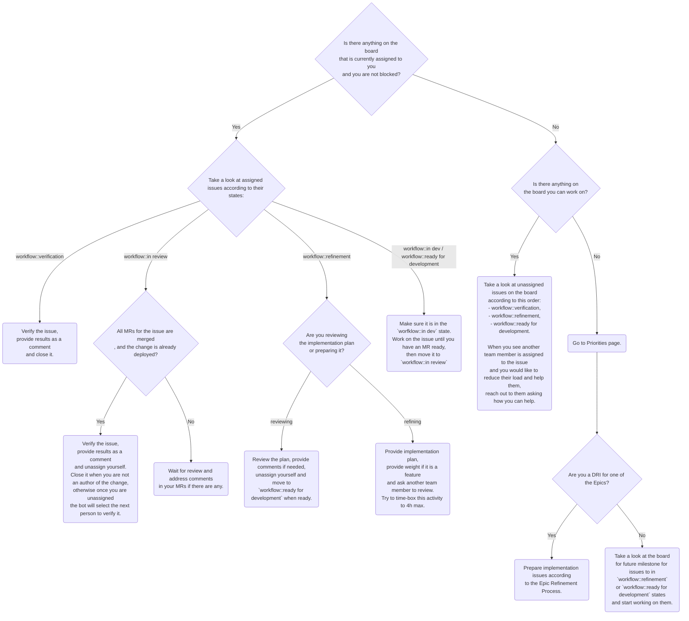

## How do we prioritize our current work?

Please refer to the flowchart provided below to understand the process we follow when determining the next task to work on after completing all assigned tasks.

