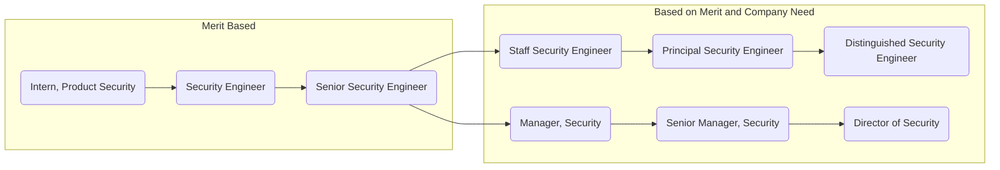

## Security Hiring

The company-wide mandate is justification for mapping Security headcount to around 5% of total company headcount. Tying Security Department growth headcount to 5% of total company headcount ensures adequate staffing support for the following (below are highlights and not the entire list of responsibilities of the Security Department):

- Security releases. At GitLab, the Security Department is DRI for critical and non-critical security releases.
- Detection/response for security incidents, which will increase as GitLab.com users increase.
- Preparation for becoming a public company.
- Running the GitLab public bug bounty program.
- Dogfooding and contributing to our product.
- Improving and maintaining the security of GitLab.com and related services.

## Career Development and Opportunities at GitLab

Career opportunities at GitLab, personal growth, and development are important and encouraged. Security team members and managers are encouraged to use [Individual Development Plans](/handbook/security/individual-development-plan/) to help foster, guide, and assist with career growth.

Information regarding growth and development benefits available to GitLab team members is available on the [General & Entity Specific Benefits](/handbook/total-rewards/benefits/general-and-entity-benefits/#growth-and-development-fund) page, with specific information regarding general budgeting strategy, reimbursement requirements, and budget exceptions for tuition available in the [Growth and Development Benefit section](/handbook/total-rewards/benefits/general-and-entity-benefits/#growth-and-development-fund) of that page.  [Eligibility information](/handbook/people-group/learning-and-development/growth-and-development/#growth-and-development-fund-eligibility) and directions on [how to apply](/handbook/people-group/learning-and-development/growth-and-development/#how-to-apply-for-growth-and-development-benefits) for growth and development benefits can be found on the [Growth and Development Benefit](/handbook/people-group/learning-and-development/growth-and-development/) page.  Be sure to review the [administration process for growth and development costs exceeding $1000](/handbook/people-group/learning-and-development/growth-and-development/#administration-of-growth-and-development-reimbursements-over-1000) before proceeding with payment as the [reimbursement process](/handbook/people-group/learning-and-development/growth-and-development/#types-of-growth-and-development-reimbursements) and timing differs depending on category.

### Individual Contribution vs. Management

## Security Internship

For information on the security internship, see the [Internship page](internship/).

## Security Shadow Program

The Security Organization is piloting a fully immersive on-the-job cross-training program among our various sub-organizations and teams. Participants will get a true behind the scenes look at how the Security Organization protects, defends, and assures our customers and team members day in and day out.

For more information, see the [Security Shadow Program](/handbook/security/security-shadow/) page.

## Security Gearing Ratios

Gearing ratios related to the Security Department have been moved to a [separate page](/handbook/security/gearing-ratios/).
