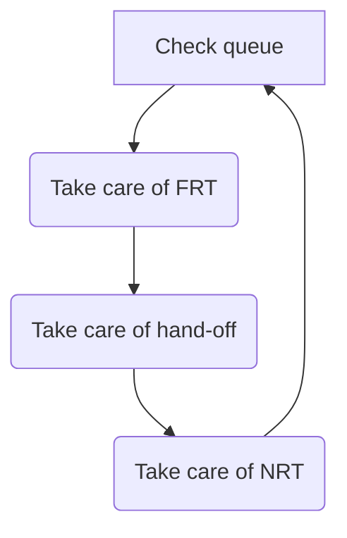

## Introduction

This page helps guide Support Engineers (SEs) to [find](#zendesk-views),
[select](#selecting-new-tickets), and [work](#first-response-and-ongoing-communication)
support tickets. For information about working on tickets successfully in the
Support Global Groups environment, please read the [SE Responsibilities and Priorities](/handbook/support/support-global-groups/#se-responsibilities-and-priorities)
topic on the main Support Global Groups page.

## Zendesk views

The default views in Zendesk for Support Engineers (SEs).

| Name | Purpose |
|------|---------|
| [My Assigned Tickets](https://gitlab.zendesk.com/agent/filters/360062369834) | Tickets assigned to you that are not `Solved` or `Closed`. |
| SGG: _group name_ | An alphabetical list of group views. Each view shows all tickets in an SGG that are not `Pending`, `Solved`, or `Closed`, sorted by ticket weight. |
| Assigned Support Engineer Tickets | Tickets from organizations that have an Assigned Support Engineer (ASE). |
| L&R | Licensing & Renewals tickets |
| All FRT and Emergencies | `New` tickets in the FRT stage. To be used in periods of reduced capacity, or as needed. |

### Regional views

Some Zendesk views are restricted by region.

| Name | Region | Purpose |
| ---- | ------ | ------- |
| Global FRT's | | Visible only to APAC, this functions similarly to the All FRT and Emergencies view and is frequently used by APAC to flex across SGGs to ensure adequate coverage |

## Selecting new tickets

Support Engineers working in SGGs should follow the guidelines for [prioritizing work](/handbook/support/support-global-groups/#prioritizing-work)
to make decisions about what to work on. Then, employ the following workflows
for:

 Choosing Tickets:

- Focus on handling tickets from the top down in your First Response Time (FRT) stage view, as they are sorted by `Ticket Weight` to highlight the highest-priority issues first. This approach ensures that you address the most critical tickets promptly. Additionally, keep an eye on tickets that are nearing their SLA deadlines to prevent any breaches. Please note, while the Ticket Weight field itself isn’t visible in the view, it is used to order the tickets, ensuring that those with the highest priority appear at the top.
- Next, work collaboratively to address unassigned NRT tickets, ensuring respect for the customer preferred regional preference.
- You should follow the tickets workflow, as shown in the flowchart below.

 Assigning Tickets:

- Assign tickets to yourself using the "Take It" button and update status to
     `Open` or `Pending`.
- Ensure every response is linked to an assigned ticket.
- Please Note that the SLA clock continues to run until you’ve sent a public
      response to the user.

## Managing ticket load

- Regularly review your `open`, `pending`, and `on-hold` tickets under
      [My Assigned Tickets](https://gitlab.zendesk.com/agent/filters/360062369834)
      to maintain a balanced workload, as well as align with
      [other responsibilities](/handbook/support/support-global-groups/#se-responsibilities-and-priorities).
- Aim for a manageable number of tickets, adjusting based on daily demands
     and personal capacity.
- Aim to adhere to the support ticket SLA/SLOs:
  - Urgent FRT 30m, NRT 4h
  - High FRT 4h, NRT 4h
  - Normal FRT 8h, NRT 24h
  - Low FRT 24h, NRT 72h
- During periods of reduced operational capacity, such as holidays or company
     events, the Support team will prioritize handling all incoming tickets
     through the special ‘All FRT and Emergencies’ and ‘All NRT’ views, with
     each engineer expected to take ownership of any unassigned tickets they
     address.

## First response and ongoing communication

When starting work on a ticket, prioritize these steps to effectively address
the customer's needs and streamline the resolution process:

1. **Confirm Understanding:** Begin by confirming in the first response your
   understanding of the customer's situation, needs, and the problem or question
   they need resolved. If unsure, request clarification or propose a brief
   meeting to discuss details.
2. **Review Past Interactions:** Check the customer’s recent tickets for related
   issues or useful background information. Confirm any relevant environmental
   details with the customer and review any organizational notes in Zendesk that
   might dictate specific actions or communication methods.
3. **Adjust Priorities:** If the ticket’s priority doesn’t align with our
   [Definitions of Support Impact](https://about.gitlab.com/support/definitions/#definitions-of-support-impact),
   discuss and adjust the priority with the customer using the
   `General::Changed priority` macro.
4. **Prepare for Emergencies:** If the ticket could escalate to an emergency,
   alert the on-call engineer(s).
5. **Manage Time Effectively:** If an extensive response is required or the SLA
   is near breaching, send an initial brief response. Outline the actions you
   will take and when the customer can expect an update. Adjust timelines as
   necessary based on customer feedback.
6. **Use Tools:** Set the ticket to Open and use ‘Due Date’ and ‘Reminder’ apps
   to keep track.

By following these steps, you ensure a structured approach to ticket handling
that can save time and enhance customer satisfaction.

## Handling tickets from different regions

Where possible, respect the customer's specified preferred region for ticket
handling. Exceptions should be made only under the following conditions:

- If a ticket is close to breaching FRT SLA.
- The ticket has been escalated/STAR'ed, requiring immediate attention regardless of region.
- The customer has specifically requested it to be handled outside of region.

### Preparing a ticket for handover

1. Set the proper expectations to the customer.
   1. It is important to be transparent and communicate that certain requirements, such as phone calls and immediate responses, will necessitate coordination with the receiving region.
   1. Please ensure that the receiving team is properly informed and aligned on any tasks and timelines before finalizing them with the customer.
1. Use the Zendesk [Zendesk `Handover Ticket Summary` macro](https://gitlab.com/gitlab-com/support/zendesk-global/macros/-/blob/master/active/Support/Out%20of%20Region/Handover%20Ticket%20Summary.md)
   to ensure all necessary information is included and the ticket is unassigned.
1. Set the Zendesk Form Field `Handover Status` to `Need Handover`.
1. CC yourself on the ticket and save the ticket to the `Open State`.
1. If you require assistance with the handover process, please contact the SGG managers for support.

### Using the cross region handover form

The Slack Handover Form is designated for tickets with high weight values, high priority, or those that are business critical. This streamlines the process for urgent transfers, allowing Support Engineers to manage lower-priority tickets autonomously via the Handover Ticket Summary macro. To ensure a smooth handover, follow these steps:

- **Select the Appropriate Form:** Choose a handover form from the Handovers
   folder pinned at the top of your SGG channel, based on the ticket's target region (e.g.,
   Handover to EMEA).
- **Complete the Form:** Fill in all required fields and submit the form.
- **Communication:** Upon submission, a notification will be sent to your
   group’s Slack channel, alerting the regional group handle.
- **Reminder:** You’ll receive a private Slack reminder to use the mandatory
   Handover Ticket Summary macro.
- **Tracking:** All handover requests are logged in the #spt_handover-log
   channel for tracking purposes.

### Working tickets handed over from another region

1. Update the `Handover Status` text field to reflect the receiving region. For
   example, if you are in the EMEA region, set it to `Handed over to EMEA` to
   ensure accurate metric tracking.
1. Review the `Handover Ticket Summary` and the Next Response Time (NRT) SLA.
1. If ready to proceed:
   - Introduce yourself to the customer, confirm the handover, and provide the
     next technical response.
1. If additional research is needed:
   - Introduce yourself, inform the customer that further research is required,
     and set expectations for the next steps.

## Contacting a Customer Success Manager (CSM) or Account Manager (AM)

Engage a CSM or AM for reasons such as discussing architecture, Professional
Services, or support collaboration. If escalation is required, follow the
designated workflow. If no CSM is available, contact the AM, identified in
Zendesk as `Account Owner`. To involve a CSM or AM, use the following methods:

1. Zendesk: Add the CSM/AM as a CC on the ticket, inform the customer, and add
   an internal note for context.
2. Slack: Notify the CSM/AM with one of the following:
   - Mention them in an existing ticket discussion.
   - Start a new thread in the customer’s channel
     (#a_customerName-internal).
   - Post a message in a relevant support channel (`#support_leadership`,
     `#support_gitlab-com`, or `#support-self_managed`).

### Helping with a ticket that has an Assigned Support Engineer

Some customers have an Assigned Support Engineer (ASE) that will own their
tickets. This will be apparent from the org note in the ticket. For such
customers, see [the ASE workflow](assigned-support-engineer/working-on-ase-tickets.html).

## FAQ

### How many new tickets should I pick up each week?

Each week, every Support Engineer should aim at least to meet, and preferably to
exceed, [the appropriate baseline](/handbook/support/support-engineer-responsibilities/#ticket-baseline)
from the following list for the number of first responses:

| Ticket type   | FRT goal   |
| ------------- | ---------- |
| Self-managed  | 6 tickets  |
| SaaS          | 7 tickets  |
| SaaS Accounts | 8 tickets  |
| L&R           | 24 tickets |

The aim is to ensure equitable ticket distribution among team members. These
numbers are based on ticket volume, number of SEs, and average PTO (15%). We
continuously monitor ticket volume and number of SEs to make sure the above
guidelines are accurate.

#### What if I can't meet baseline?

There will be times when you may be leading an escalation, working through
challenging tickets, or focusing on non-ticket work, and you cannot take on new
ticket assignment. This is okay! The key is to make sure you have coordinated
with your SGG and Manager so they are aware of the risks to our team.

### What can I do when I'm stuck and I really need help?

Follow the [how to get help](/handbook/support/workflows/how-to-get-help/)
workflow for guidance.

### I'm going to be absent, what do I do with my assigned tickets?

Please see the [Support Team Member Time Off](/handbook/support/support-time-off/)
page for guidance on taking time off.

### What if the customer is absent and wants to keep the ticket open until they return?

In this scenario:

1. Acknowledge the customer's request and inform them of your plan.
1. Set the ticket status to `on-hold`.
1. Change the ticket type to **Task**.
1. Set a reminder for yourself to check in with the customer 1-2 days after
   their planned return date.

Because of the [behavior of `On-Hold` tickets](/handbook/support/workflows/zendesk-ticket-basics/#behavior-of-on-hold-tickets)
the ticket will remain in the `on-hold` state until the customer returns. This
is useful if the customer will be unavailable for 1-2 weeks. If a customer will
be unavailable for a longer period of time, consider asking them to handover the
ticket to a colleague, or open a new ticket upon their return.

### May I reassign a ticket to someone else?

There are some situations in which it is appropriate to reassign a ticket. A few
common situations are listed below, but others may arise. If you encounter a
scenario where you need to reassign a ticket that isn't detailed in the
handbook, please discuss with your manager, and then add it below!

#### If you'll be out of office

If you're out of office, either planned or unplanned, follow the guidance in
[Support Team Member Time Off](/handbook/support/support-time-off/).

#### If you need an expert

If you've determined that specific expertise outside your own is required to
resolve the ticket, pair with an expert so that you can get the ticket resolved
and learn in the process. If that person determines that they need to take the
lead due to the advanced or complex nature of the problem, then:

1. Send a message to the customer informing them:
   - You’ve asked another support engineer with relevant expertise to take the
     ticket
   - You’ve reviewed the ticket with that engineer
   - You'll stay involved in order to help in any way you can
1. Assign the ticket to the expert

#### If you have too many tickets

If you've become overloaded with tickets, you may look to find one or more other
SEs to take some of your tickets. Start with your Support Global Group, and then
look to the larger team if necessary. Be sure you discuss each ticket before
reassigning it to gain agreement and so that the other support engineers don't
have to start from scratch.

Once you've found a new assignee:

1. Add an internal note summarizing the ticket and noting the reassignment
1. Send a public reply to the customer informing them of the reassignment
1. Reassign to the new engineer

### What if a customer has confirmed a ticket can be closed but the ticket has no assignee?

While we should ensure that all tickets always have an assignee from FRT to,
close, there are some scenarios where a ticket is ready to be closed but has no
assignee. For example, a customer may open a ticket and inform us that they have
resolved the issue before we send an FRT. In these scenarios:

1. Inform the customer that you are changing the ticket status to solved
1. Assign the ticket
   - If a solution was provided, assign to the engineer who provided the
     solution
   - If the issue was not solved as the result of a direct suggestion, assign it
     to an engineer who has significantly contributed to the ticket throughout
     its life cycle
   - If the customer solved the ticket before we could respond, take assignment
     of the ticket yourself. After all, you're doing the work of acknowledging
     the customer's update, and solving the ticket!
1. Mark the ticket as `solved`

### How many issues or incidents should I handle in a single support ticket?

As detailed in [Support General Policies](https://about.gitlab.com/support/general-policies/#we-handle-each-incident-within-a-single-support-ticket)
it is GitLab's policy to handle each unique issue or incident within a single
support ticket.

### How can I open a new ticket on behalf of a customer?

As detailed in the [Support General Policies](https://about.gitlab.com/support/general-policies/#we-handle-each-incident-within-a-single-support-ticket)
it is GitLab policy to handle each individual incident, problem or issue within
a single support ticket. If a situation arises where you need to open a new
ticket on behalf of a customer, you **must** use the Support Portal to ensure
proper routing and SLA assignment:

1. Use the Support Portal to [submit a new request](https://support.gitlab.com/hc/en-us/requests/new)
1. Select the appropriate form type. This will most likely match the request
   type of the originating ticket.
1. Enter the customer's details like email address, subject, problem description
   and other relevant information. Use the customer's existing Zendesk Ticket to
   obtain the necessary customer information to complete the form.
1. Submit the ticket using the form.

Once the form is submitted, the portal will not provide the corresponding ticket
ID. Instead, you can find the ticket in Zendesk under the user or organization
associated with it.

If you plan to immediately start working the ticket, please update the SGG
assignment to match your SGG.
