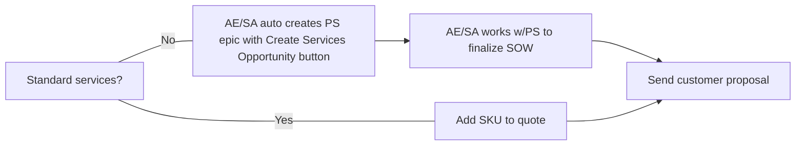

### How to Contact Professional Services

At GitLab, Professional Services (PS) is part of the [Customer Success department](/handbook/customer-success/). As such, you can engage with PS by following the guidelines for engaging with any [Solutions Architect (SA)](/handbook/customer-success/solutions-architects#when-and-how-to-engage-a-solutions-architect). This process ensures that the Customer Success department as a whole can understand the inbound needs of the account executive and our customers.

#### Slack

PS uses the [#professional-services](https://gitlab.slack.com/archives/CFRLYG77X) slack channel to answer generic questions about services and to signal delivery of PS scoping work items like PS Engagement Estimates and SOWs.  The private [#professional-services-us-pubsec](https://gitlab.slack.com/archives/C025UHLTR50/p1625778195002900) slack channel is used for US Public Sector services.  Please request access to [#professional-services-us-pubsec](https://gitlab.slack.com/archives/C025UHLTR50/p1625778195002900) in [#professional-services](https://gitlab.slack.com/archives/CFRLYG77X).

#### Requesting training for GitLab team members

**For team leads**

Internal GitLab team leads can request training sessions delivered by Professional Services for their teams. Here are the steps for making a request.

1. [Create a new issue](https://gitlab.com/gitlab-com/customer-success/professional-services-group/education-services/-/issues/new?issue%5Bassignee_id%5D=&issue%5Bmilestone_id%5D=#) in the Education Services namespace using the internal_trainer_request issue template. or internal-team-member-training-request
1. Complete the Requestor Tasks in the issue description.
1. The PS Project Coordinator will reach out to plan and schedule the training session(s).

**For individual team members**

Individual GitLab team members can request to audit a customer-facing training sessions delivered by Professional Services. Here are the steps for making a request to attend.

1. [Create a new issue](https://gitlab.com/gitlab-com/customer-success/professional-services-group/education-services/-/issues/new?issue%5Bassignee_id%5D=&issue%5Bmilestone_id%5D=#) in the Education Services namespace using the internal-team-member-training-request template.
1. Complete the Requestor Tasks in the issue description.
1. The PS Project Coordinator will confirm the date(s) with you and provide you with a registration link.

### For Sales Reps and SAs: How to order Professional Services

1. To order Professional Services, the SAE or ISR [creates a child PS Opportunity in SFDC off of a standard license or subscription parent opportunity](/handbook/sales/field-operations/gtm-resources/#creating-a-professional-services-opportunity) using the `Create Services Opportunity` button.

1. The next steps depend on whether the services needed are standard or custom.

- **Standard Services (non-customized)**: Sold using Professional Services SKUs with pre-defined statement of work (SOW) documents. These offerings do not require custom scoping and are ordered directly from Zuora in SFDC. Checkout our [full catalog](https://about.gitlab.com/professional-services/catalog/) for a list of standard services currently offered.

- **Custom Services**: Sold if standard services do not meet the needs of the customer, using a custom SOW. Please contact your [Professional Services Engagement Manager based on region](https://docs.google.com/document/d/1bdVOf3jL6aJF79qRMFLQsmMxIgQh5ZQ-WiLuNgsWB08/edit?tab=t.0#heading=h.qzgxpwqxme5). When creating the PS Opportunity in step 1 above, a [Professional Services Epic](https://gitlab.com/groups/gitlab-com/customer-success/professional-services-group/-/epics?state=opened&page=1&sort=start_date_desc) will automatically be created for you as well as a [scoping issue](https://gitlab.com/gitlab-com/customer-success/professional-services-group/ww-consulting/ps-plan/-/issues/?sort=created_date&state=opened&first_page_size=100). Please use the epic and issue to input information and collaborate with your Engagement Manager.

**Process for Sales Reps and SAs**

For more details on selling professional services, see [Selling Professional Services](/handbook/customer-success/professional-services-engineering/selling).

For information on how to position Professional Services to your customer, see [Positioning Professional Services](/handbook/customer-success/professional-services-engineering/positioning).

#### Lead time for starting a Professional Services Engagement

Often we are asked "what is your lead time for getting started with a project" or a customer may have a specific timeframe in which they want a project delivered.
As there may be many projects and proposals in flight at any time, there are a few rules we use when prioritizing and scheduling engagements:

- No engagement schedule can be committed to until the PS Opportunity is closed/ won and the PS Operations team has scheduled the project. While we can make a good faith effort to try and match a schedule ahead of that time, to be fair to customers who have committed to a services engagement we must prioritize those first.
- Please, check with the PS Operations Team by tagging the group `@ps-scheduling` for the latest lead time details in the [professional services slack channel](#slack) if you need a more accurate estimate.
- The PS Operations team does review projects that are SFDC Stage 5.  As we strive to start the projects within days of the SFDC Stage of closed/won.

#### Custom services SOW creation and approval

When scoping custom SOWs, the Professional Services Engagement Manager partners with the SA/CSM/SAE to create a custom engagement that will help meet the customer's needs, and push the SOW through the appropriate approval process. All Custom SOW's will require approval from PS Leadership.

##### Estimate creation

- The account team (SAE/ISR/SA/CSM) can initiate the process by creating a new Professional Services Epic and related child scoping issue by using the `Create Services Opportunity` button from a standard parent SFDC Opportunity, [as noted above](#for-sales-reps-and-sas-how-to-order-professional-services). On the scoping issue, a SSOT table will appear in the issue to drive the scoping process. The SA/CSM should work with the Customer initially to complete this as well as they can. The Professional Services Engagement Manager will then create an Estimate based upon the inputs provided, and provide a link for review.

##### SOW creation

- Once the Estimate has been reviewed by the account team and Customer, any feedback received, and refinement made, we can then move to generating the SOW. As part of the scoping issue, the Engagement Manager will need to understand whether there is a MSA in place, or standard terms are to be used.
- We prefer customers to mark up our agreement and SOW document if they request changes. If they require the use of their own services terms or SOW, please contact the PS team.

##### SOW Proposal Approval Board

The [SOW Proposal Approval Board](https://gitlab.com/groups/gitlab-com/customer-success/professional-services-group/-/boards/1353982?label_name[]=Services%20Calculator) is used to progress all SOWs through the scoping and approval process before sending them to a customer for review and signature.

**SOW approval workflow labels**

The labels are (from left to right):

- `Open`: This issue has been created by the Services Calculator and waiting for the Engagement Manager to confirm
- `proposal::Awaiting_Discovery`: Gathering information from the account team and customer required to scope the engagement
- `proposal::Strawman_WIP`: The Engagement Manager is drafting an initial estimate for review
- `proposal::Estimate_Feedback`: The Estimate is with the account team and/or Customer for review. The Engagement Manager is awaiting feedback and confirmation prior to moving to SOW.
- `proposal::SOW_WIP`: The Engagement Manager is drafting the SOW and preparing a [Cost Estimate](/handbook/customer-success/customer-success-vision/#professional-services-standard-cost) using the [SOW Cost Estimate Calculator](https://docs.google.com/spreadsheets/d/16KFNRFe4E_oaqU7_ZGivoO7eU3-65dkMgVvK5Jvb7ZQ/edit#gid=158441360) for margin calculation purposes. Please note that this Cost Estimate Calculator is built into a larger estimate tool that our Engagement Managers use to create estimates for a wide variety of PS engagements.
- `proposal::Ready For Approval`: The Engagement Manager has prepared the required SOW, and triggered the approval requests. Approvals are now required prior to releasing the SOW.
- `proposal::Approved`: The SOW is now approved, and ready for execution. The SAE/AE should gain a Legal stamp with a Legal Case in SFDC before releasing the SOW for signature.

### Scheduling Professional Services

Currently, customer projects are scheduled in order as the opportunity is Closed-Won.  Please discuss any concern about scheduling the project during the Discovery phase of the scoping process. As part of the Discovery phase, please update the Project Scheduling Intake issue. The Project Coordinator will use this information to review staffing. If there are lead time or availability questions, please ask the Engagement Manager or Project Coordinator by tagging the group @ps-scheduling in the professional services slack channel (#professional-services).
Please do not commit any project start dates prior to the SOW/contracts being signed without confirming with the PS Project Coordinator.

Once the opportunity is updated to Close/ Won, here are the next steps:

- The PS Project Coordinator will review the SOW and Order Form and work to set up the project in Kantata
- The PS Project Coordinator will reach out the account team for the customer contacts if the information has not been provided in the Project Scheduling Intake issue.
- The PS Project Coordinator will send a Welcome to PS email within 72 business hours of the opportunity booking to the customer and copy the account team and Professional Services leaders.
