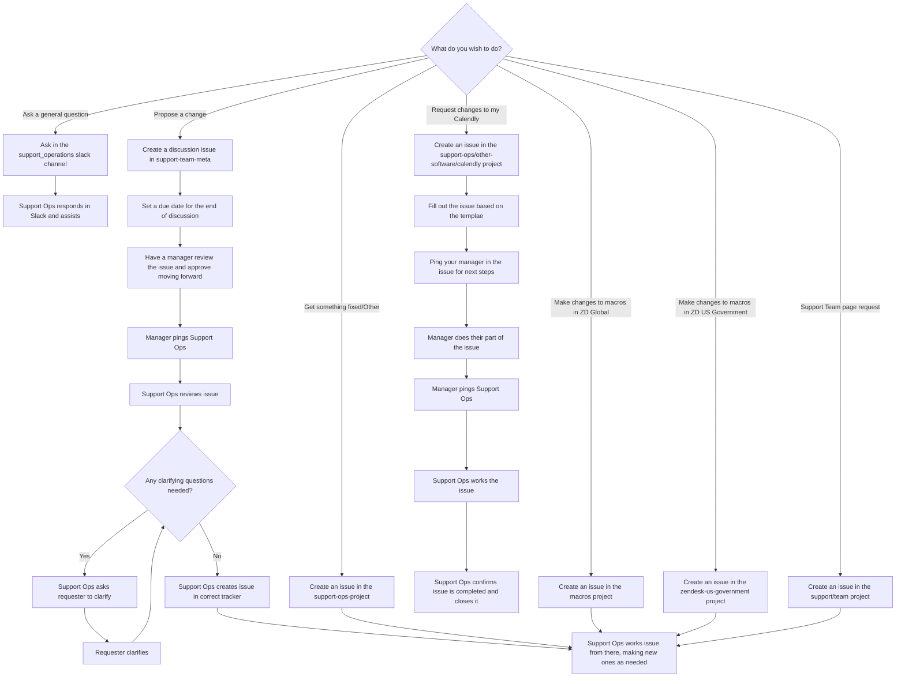

---

title: Working with Support Ops
category: References
description: "Workflow for working with Support Operations"
---

## Working with Support Ops

General speaking, working with Support Operations can be broken down into 8
categories:

- [Customer asking for support portal changes](#customer-asking-for-support-portal-changes)
- [Asking general questions](#asking-general-questions)
- [Request changes to your Calendly](#request-changes-to-your-calendly)
- [Propose a change](#propose-a-change)
- [Get something fixed](#get-something-fixed)
- [Make changes to Zendesk Global or Zendesk US Government macros](#make-changes-to-zendesk-global-or-zendesk-us-government-macros)
- [Support Team page requests](#support-team-page-requests)
- [Everything else](#everything-else)

For a general overview, please see the [flowchart](#flowchart).

### Customer asking for support portal changes

Occasionally, a customer might mis-file a ticket and send a request for support
portal changes using a Support form. In these cases, please change the form to
Support Ops in Zendesk and we will handle it from there. Please do not reply
(as that removes our SLA clock from the ticket).

Please never modify a user's acces permissions or make any edits to the
organization itself. We have specific processes and policies we must follow for
such changes to occur.

### Asking general questions

For general questions and assistance, reach out via the
[support_operations Slack channel](https://gitlab.slack.com/archives/C018ZGZAMPD).
From there, a member of the Support Operations team will respond and work with
you to help address the question. Should the discussion need more than a simple
answer, Support Operations will direct you to create an issue in the correct
issue tracker.

### Request changes to your Calendly

**Note**: Support Operations does not have the ability to change your personal Calendly
settings, only those used in team events.

When you need modifications made to your Calendly (such as being added to an
event, having the schedule used in an event changed, etc.), you will want to
create an issue in the
[calendly issue tracker](https://gitlab.com/gitlab-com/support/support-ops/other-software/calendly/-/issues/new).

From there, your manager will review the request and approve it. Once approved,
they will ping Support Operations.

Support Operations will then review the request and work the issue. Once
completed, Support Operations will then confirm the issue is completed and
close out the issue.

### Propose a change

To propose or request a change, create an issue in the
[support-team-meta issue tracker](https://gitlab.com/gitlab-com/support/support-team-meta/-/issues/new)
so it can be discussed amongst the team. If the proposal impacts teams other
than Support, include those teams in the discussion.

When creating the issue, be sure to set a reasonable due date. Choose a date
on which the discussions will end and a decision will be
reached between the approving manager(s) and the requester. If you need the
assistance of Support Operations in the discussion, you can ping the Support
Operations team using `@gitlab-com/support/support-ops`.

Once a decision has been made, the approving manager will then ping the Support
Operations team in a comment on the issue using
`@gitlab-com/support/support-ops`. A Support Operations team member will then
review the issue and ask for any clarification as needed.

After Support Operations has confirmed the request and received any requested
clarification, they will then create an issue in the appropriate tracker.

Support Operations will then work from the new issue to perform testing and
other related tasks. At this stage, ensure you are available to help with the
testing and review the results. Support Operations will ask the original
requester to review everything before moving on to the next step.

**Note**: Do not create the issues in the Support Operations issue tracker(s).
They require a support-team-meta issue for discussion and approval from a
manager to be actioned on. Without this having occurred, Support Operations is
likely to close out the issue and request the normal procedure be followed.

### Get something fixed

This is category is for anything in our current setups that needs to be fixed
(ie it is broken). These issues should not be for improvements or changes, but
simply to get something that is currently broken fixed as soon as possible. For
these, you would file an issue in the
[support-ops-project issue tracker](https://gitlab.com/gitlab-com/support/support-ops/support-ops-project/-/issues/new).
As these types of requests are highly important and solely to fix something
broken, they do not require a discussion issue or manager approval.

Once the issue is created, Support Operations will work the issue. They may
create new issues or move the original request as needed. As these tend to be
timely in nature, make sure you are available to work with Support Operations.

### Make changes to Zendesk Global or Zendesk US Government macros

Macros are [deployed immediately](/handbook/support/readiness/operations/docs/change_management/#zendesk-macros-change-management). For information on macros, please see [Zendesk Global Macros](/handbook/support/readiness/operations/docs/zendesk/macros/).

If you want to edit the wording of a macro, make an MR to the repo (Zendesk Global or Zendesk US Government).
If you want to make non-wording changes (renaming it, add/removing options, etc.), use the [Support Super Form](https://support-super-form-gitlab-com-support-support-op-651f22e90ce6d7.gitlab.io) ‘Edit a Zendesk macro’ option.
If you want to create a new macro, use the [Support Super Form](https://support-super-form-gitlab-com-support-support-op-651f22e90ce6d7.gitlab.io) ‘Create a Zendesk macro’ option.
To discuss a macro (but not actually action on anything), use a support-team-meta issue.

### Support Team page requests

For changes to the support team page, you would file an issue in the
[support/team issue tracker](https://gitlab.com/gitlab-com/support/team/-/issues/new).

Once the issue is created, Support Operations will work the issue. They may
create new issues or move the original request as needed.

### Everything else

This is a catchall category for anything that didn't fit the previous ones. For
these types of requests, you would file an issue under the
[support-ops-project issue tracker](https://gitlab.com/gitlab-com/support/support-ops/support-ops-project/-/issues/new).
From there, Support Operations will work the issue. They may create new issues
or move the original request as needed.

### Flowchart

### Helpful links

- [Support Ops team page](/handbook/support/readiness)
- [Support Ops documentation](/handbook/support/readiness/operations/docs)
- [support_operations Slack channel](https://gitlab.slack.com/archives/C018ZGZAMPD)
- [calendly issue tracker](https://gitlab.com/gitlab-com/support/support-ops/other-software/calendly/-/issues/new)
- [support-team-meta issue tracker](https://gitlab.com/gitlab-com/support/support-team-meta/-/issues/new)
- [macros issue tracker](https://gitlab.com/gitlab-com/support/support-ops/zendesk-global/macros/-/issues/new)
- [zendesk-us-government issue tracker](https://gitlab.com/gitlab-com/support/support-ops/zendesk-us-federal/-/issues/new)
- [zendesk-us-government macros issue template](https://gitlab.com/gitlab-com/support/support-ops/zendesk-us-federal/-/issues/new?issuable_template=Macros)
- [support/team issue tracker](https://gitlab.com/gitlab-com/support/team/-/issues/new)
- [support-ops-project issue tracker](https://gitlab.com/gitlab-com/support/support-ops/support-ops-project/-/issues/new)
