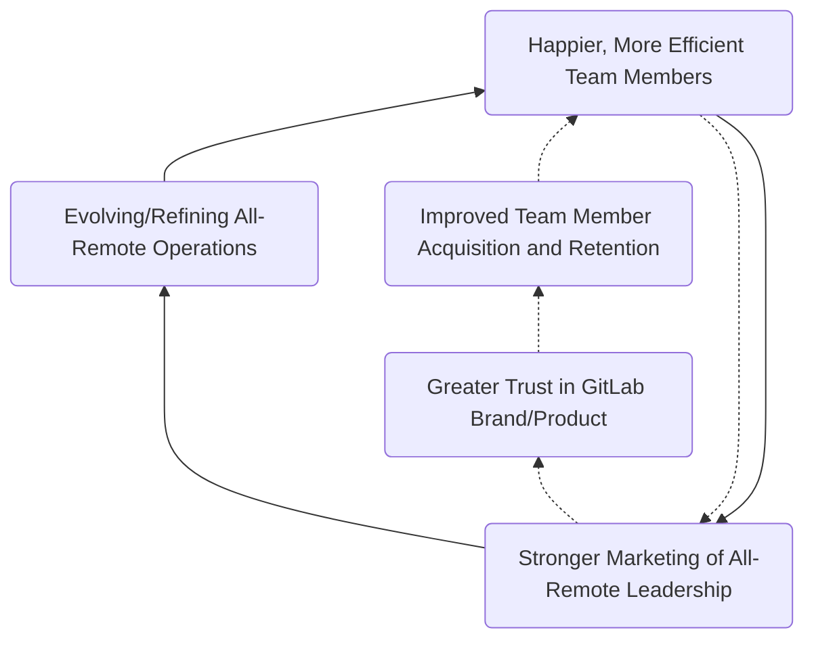

## About the GitLab Strategy and Operations (Workplace) Team

The GitLab Strategy and Operations (Workplace) Team evolved from the All-Remote Marketing team. It is responsible for:

1. The creation, curation, and continued iteration of [GitLab's guide to all-remote](/handbook/company/culture/all-remote/guide/), a deep library of guides that covers every facet of how GitLab functions as a remote team.
1. Stewarding, iterating, and evangelizing GitLab's management philosophy and people practice, [TeamOps](/teamops/).
1. Building an overarching methodology for the modern workplace.

**This page is the single source of truth for TeamOps and all-remote positioning, evangelism, approvals, vision, and strategy**.

### Mission Statement



The mission of GitLab's Strategy and Operations (Workplace) team is to define, evolve, and scale [TeamOps](/teamops/). We also evolve and champion the company's [all-remote culture](/handbook/company/culture/all-remote/).

This involves close collaboration with [GitLab's CEO](/handbook/ceo/) and [Chief of Staff](/handbook/ceo/office-of-the-ceo/); Corporate Marketing (PR, corporate events); People Group ([employment branding](/handbook/people-group/employment-branding/)) and [Diversity, Inclusion & Belonging](/handbook/company/culture/inclusion/).

### All-Remote Flywheel

The All-Remote Flywheel is focused on continually evolving and refining GitLab's all-remote environment (e.g. tooling, approach to meetings, collaboration, and communication, total rewards/compensation) in order to drive stronger brand awareness, marketing potential, and thought leadership. If our [organizational design principles](https://link.springer.com/article/10.1186/s41469-020-00087-8) continue to stay ahead of the curve, we're able to lead marketing conversations on all-remote and the future of work. This also drives happier, more efficient team members, and impacts elements such as time-to-hire and team member retention.

Strong all-remote marketing may bolster industry trust in the GitLab brand and product due to the [halo effect](https://www.investopedia.com/terms/h/halo-effect.asp). E.g., If [The Remote Playbook](https://allremote.info/) inspires a firm's remote transition blueprint, said firm is likely to show favoritism to GitLab's product offerings and services.

### Vision

GitLab is an influencer and educator in remote work and people operations. It serves the community by creating valuable content that furthers the proliferation and ubiquity of [remote-first](/handbook/company/culture/all-remote/how-to-work-remote-first/) and [all-remote](/handbook/company/culture/all-remote/terminology/) organizations, while enhancing the operations of colocated and [hybid-remote](/handbook/company/culture/all-remote/hybrid-remote/) companies by sharing implementable remote-first practices.

We believe that the [people practice](/teamops/) and [operating principles](/handbook/values/#operating-principles) relied on by GitLab are applicable even to colocated companies, and educating on pillars such as [asynchronous workflows](/handbook/company/culture/all-remote/asynchronous/) and [informal communication](/handbook/company/culture/all-remote/informal-communication/) can benefit all organizations.

## Goals (OKR)

Follow our work and collaborate in the [TeamOps Q4-FY23 Epic](https://gitlab.com/groups/gitlab-com/-/epics/1978).

The team's KR is defined within [GitLab CEO's OKR](/handbook/company/okrs/fy23-q4/#okrs).

In Q4-FY23, our KR is: **Certify at least 100 GitLab team members and 1 person in each department as TeamOps Trainer: Level 1**

## TeamOps Trainer

[TeamOps](/teamops/) is how GitLab works. It is an operations model that helps teams maximize productivity, flexibility, and autonomy by managing decisions, information, and tasks more efficiently.

TeamOps Trainers are team members who are internal champions of GitLab's values, operating principles, and ways of working, inclusive of all functions and departments. They aspire to mentor and share with others GitLab's ways of working, both inside and outside of the organization.

A TeamOps Trainer transitions through three stages of TeamOps understanding. 1) Recall => 2) Apply => 3) Teach

In Q4-FY23, we are hosting TeamOps Trainer Pilot Workshops.

The purpose of the first version of this program is to collect feedback and resources as part of a larger go to market strategy, including:

- Focus Group – Content testing, feedback, and iteration as beta test before TeamOps is released to the public market with a more formal sales strategy.
- Content/Model Prototyping – Test the viability of creating a network of TeamOps representatives for future phases of TeamOps growth. ("Train the Trainer")
- Content Creation – Scale content related to TeamOps by empowering all of GitLab to contribute blog posts and social threads.

Creation of and participation in this program also supports the [FY23-Q4 OKR to Grow Careers](/handbook/company/okrs/fy23-q4/) of GitLab team members.

Apply to become a TeamOps Trainer and learn more about the program in [this GitLab issue](https://gitlab.com/gitlab-com/office-of-the-ceo/cos-team/-/issues/305).

Requirements for [TeamOps Trainer: Level 1](https://gitlab.com/gitlab-com/office-of-the-ceo/cos-team/-/issues/305)

1. Complete the [TeamOps practitioner course](https://levelup.gitlab.com/learn/course/teamops)
1. Be able to answer questions (interview by existing trainer)
1. Enthusiastic presentation of about 3-5 minutes on advantages of TeamOps on YouTube (GitLab Unfiltered)
1. Contribute proposals to the materials (1+ MRs) on iterating TeamOps content to be market-ready (e.g. more applicable to your specific team or function)
1. One blog post (or similar) published on GitLab, LinkedIn, Medium, Twitter thread, etc.

## Evangelism Materials

Anyone can be a remote evangelist! Help yourself to these materials for your presentations, blogs, and consultations.

### Remote Work Essentials {#gitlabs-guide-to-remote-work}

We're often asked to share how GitLab thrives as an [all-remote](/handbook/company/culture/all-remote/terminology/) team. Here are the foundational resources you can share to start the conversation:

- **[GitLab's Guide to Remote Work](/handbook/company/culture/all-remote/guide/)** is a comprehensive overview of what "all-remote" really means, how it works at GitLab, some tips and tricks for remote teams, and resources to learn more.
- **[The Remote Playbook](https://learn.gitlab.com/allremote/remote-playbook)**, a curated eBook with GitLab's top advice for companies transitioning to remote, can be downloaded via a prompt on the all-remote homepage, accessible at [https://allremote.info/](https://allremote.info/)
- This blog post — **[Resources for companies embracing remote work](https://about.gitlab.com/blog/2020/03/06/resources-for-companies-embracing-remote-work/)** — gives background and context, and lays out a logical flow of links for leaders and workers to follow as they learn.

In scenarios where you need a quick link to vocalize, tweet, email, or otherwise share, we have established a memorable redirect: https://allremote.info/ ("*All Remote Dot Info*")

### Why remote?

GitLab's overview video on its [all-remote culture](/handbook/company/culture/all-remote/vision/) can be [viewed here](https://youtu.be/GKMUs7WXm-E).

### Presentations (slide deck)

GitLab's Workplace team collaborated with Brand and Corporate Communications to create a **TeamOps Presentation Template** on Google Slides, entitled [Making Teamwork an Objective Discipline](https://docs.google.com/presentation/d/1jYsr0rFOEUdZlbULmM25qvLOxP7QL5A2tnhio4x3ymw/edit?usp=sharing). Please *make a copy* of this presentation to edit photos and names, personalizing it to your specific need.

You may be asked to give a presentation on how GitLab works as an all-remote team, including requests that are specific to your role (sales, engineering, finance, people, etc.).

In these instances, you're welcome to use [this Google Slides presentation](https://docs.google.com/presentation/d/1EH5Wky2oXSbR8o7dHMchi-PddSq40ywywUV0aaF8dAM/edit?usp=sharingz), `Managing a Thriving Remote Team: A foundational toolkit`. (*This link is only viewable by GitLab team members.*) A [suggested script](https://docs.google.com/document/d/16viV_819RhRtCb_SOJami3ctw7gcZoBMzT8ICIU_wX0/edit?usp=sharing) following this presentation is available for your use.

For a video of GitLab's Head of Remote walking through this presentation to a group of founders, [click here](https://youtu.be/MVTvm4awuJ0). This presentation will serve as a guide to narrating the slides and connecting GitLab's approach to remote with the current reality of your audience.

Expand this section for more slide decks you can use.

<ul>
   <li><a href="https://docs.google.com/presentation/d/1n6y8sEUKGLdRuPAVN3cTBI3XnKPY_mFnEAi6E08f4qI/edit?usp=sharing">GitLab remote work starter guide — adjusting to work-from-home for workers</a> with <a href="https://docs.google.com/document/d/1vUJ_Lks1O2kZuekPQMhadd2LjynH1n7b87A2FJmfcrA/edit?usp=sharing">suggested script</a></li>
   <li><a href="https://docs.google.com/presentation/d/1XC0eysmuImfvdTy81IVaZ98mRq_rX2IGX3j_CISWc04/edit#slide=id.g8164dec4ba_0_215">GitLab remote work company emergency plan — what to do and where to start for team leaders</a> with <a href="https://docs.google.com/document/d/1RgHTZ_eDEQrcMA_w8mkuxhjjslFH5gnGwbzccXX2S2Q/edit?usp=sharing">suggested script</a></li>
   <li><a href="https://drive.google.com/file/d/1-hYeifS-Z10iUzp_17QP1UxOxGXVPARk/view">Implementing and reinforcing remote-first practices — shared at GitLab Culture Open House 2020</a></li>
   <li><a href="https://docs.google.com/presentation/d/1X2gjIPPyfZpIMTinLtqZYMh2SQBhvD-_IM29fc1rp8U/edit?usp=sharing">GitLab Team member slide deck from Festival of Work in EMEA, "sure you remote, but do you async?"</a></li>
</ul>

**Usage guidelines**:

1. Please make a copy of the presentation and script instead of overwriting the template.
1. Swap out existing names/headshots for your own.
1. Feel welcome to add a slide or two related to the specifics of the request.

### Teaching other companies how to go remote



For a glimpse at how GitLab's Strategy & Operations (Workplace) team speaks about remote through presentations, watch the embedded video above or visit the [GitLab Unfiltered](https://www.youtube.com/playlist?list=PL05JrBw4t0Kq7QUX-Ux5fOunQotqJbECc) (YouTube) links below. These presentations were shared at GitLab Connect EMEA in March 2021.

1. [Remote Teamwork: How to thrive in a post-office world](https://youtu.be/uqPigmWzZRI)
1. [Making Remote Work](https://youtu.be/0F4ltXcqE-w)

GitLab is unique in that every single team member is remote. All-remote is the common thread that we all share, regardless of what department we serve. This means that each GitLab team member is uniquely equipped to share best practices with other leaders and companies.

The requests may be varied, from small firms looking to [unwind](https://youtu.be/MSj6-wC4f9w) their office strategy and go [all-remote](/handbook/company/culture/all-remote/terminology/), to multi-nationals which are looking to implement [remote-first](/handbook/company/culture/all-remote/how-to-work-remote-first/) best practices to account for more of their team working outside of the office (or in different offices).

Top questions from suddenly or newly-remote companies

It is useful to empathize with those you speak with. GitLab is a very advanced remote work environment, making it all the more important for team members to understand alternative baselines and speak to other realities, all while forecasting what's possible if an organization invests in remote-first principles today.

Below are the most common questions asked by suddenly or newly-remote companies, linked to relevant handbook pages that you can study prior to presenting. These shed light on their challenges, and will help you proactively speak to common needs, misconceptions, and struggles.

<ol>
   <li>How do you <a href="/handbook/company/culture/all-remote/building-culture/">maintain and build company culture</a> in a remote work environment?</li>
   <li>How do we <a href="/handbook/company/culture/all-remote/informal-communication/">maintain and build new work relationships</a> without seeing each other in-person on a regular basis?</li>
   <li>How do we <a href="/handbook/company/culture/all-remote/mental-health/">prevent burnout, isolation, and mental health crises</a>?</li>
   <li>How do we <a href="/handbook/company/culture/all-remote/meetings/">combat Zoom fatigue</a> (e.g. exhaustion associated with nonstop video calls)?</li>
   <li>How we do handle <a href="/handbook/total-rewards/compensation/">compensation changes</a> if people permanently relocate to work remotely?</li>
   <li>How do we ensure that <a href="/handbook/leadership/">employees are productive</a> when we cannot physically see them?</li>
   <li>How does one <a href="/handbook/company/culture/all-remote/being-a-great-remote-manager/">become a great remote manager</a>?</li>
   <li>How do you <a href="https://www.coursera.org/learn/remote-team-management">effectively lead remote teams</a>?</li>
   <li>How do you <a href="/handbook/company/culture/all-remote/onboarding/">onboard</a> and <a href="/handbook/company/culture/all-remote/learning-and-development/">train/educate</a> remotely?</li>
   <li>How do you <a href="/handbook/company/culture/all-remote/collaboration-and-whiteboarding/">collaborate and whiteboard</a> remotely?</li>
   </ol>

### Key Points to Cover {#foundational-presentation-areas}

Regardless of the nuance in the request, here are the foundational areas that should be covered. Be sure to describe how GitLab implements these tactics using [low-context communication](/handbook/company/culture/all-remote/effective-communication/#understanding-low-context-communication), leaning on examples and detail such that a non-GitLab company can envision how such a tactic could be useful in their own organization.

1. **Forced work-from-home isn't remote work**. In speaking with suddenly or newly-remote companies, preface everything with the following sentiment: Forced work-from-home, triggered by external factors such as a global pandemic, is not the same as *intentionally designed remote work*. It is vital to disentangle the two concepts. The stress one feels from working at home with no preparation — possibly with a significant other also working from home while juggling childcare or virtual schooling — is more closely linked to life during a pandemic than it is remote work.
1. **Set the stage**. GitLab is the [one of world's largest all-remote companies](/handbook/company/history/#how-did-gitlab-become-an-all-remote-company), which is why our advice matters.
1. **Remote requires a different mindset**. All the tools and processes in the world will falter if leadership doesn't lead with **trust and transparency** rather than micromanagement and fear.
1. **Lead with data**. GitLab's [Remote Work Report](/handbook/company/culture/all-remote/remote-work-report/) surveys thousands of global remote workers. As leaders and team members grapple with going remote, this report provides insights on what matters to those who adopt this way of working, charting a path for building culture around autonomy and flexibility.
1. **Remote-first practices aren't just for remote companies.** Empathize with [challenges](/handbook/company/culture/all-remote/how-to-work-remote-first/). Offer up common issues that teams who are going remote will face. Although GitLab is [all-remote](/handbook/company/culture/all-remote/terminology/), we should make clear that our advice applies to colocated companies and [hybrid-remote](/handbook/company/culture/all-remote/hybrid-remote/) companies as well.
1. **How do I manage a remote team?**
   - What tools do we need?
   - How much communication is too much?
   - What is in charge of our remote transition?
1. **Guidance is about the here-and-now, but approach this for the long-term.**
   - Recognize that companies forced into work-from-home need communication gaps filled *now*.
   - The reason to do this with intention is that it will become a core part of a company's talent and operational strategy.
   - Remote de-risks a company, making it less susceptible to socioeconomic swings and crises.
1. **Three biggest challenges!**
   - Workspace challenges and work/life separation.
   - Communications in a remote world, and keeping everyone engaged/informed.
   - Mindset and culture, leaning into the reality that change takes time, and a focus on iteration.
1. **How does GitLab do it?!**
   - This is your moment to showcase specific examples of how GitLab does things differently. If you are addressing an department-specific audience (sales, engineering, HR, finance, etc.), surface examples germane to that audience.
   - Feel welcome to share that [GitLab uses GitLab](/handbook/company/culture/all-remote/gitlab-for-remote/). It's a tool built by an all-remote team to enable remote practices such as asynchronous workflows and prevent typical challenges such as communication silos.
   - Share our [GitLab for remote teams solutions page](/handbook/company/culture/all-remote/gitlab-for-remote/).
   - Prepare for minds to be blown. These things feel like second nature to GitLab team members, but are revolutionary to most.
1. **You must have a single source of truth**
   - It's not about blanket documentation. It's about working [handbook-first](/handbook/company/culture/all-remote/handbook-first/).
   - Start now! Designate a scribe if you have to. Start small, as an FAQ, and build it out.
   - Show an example of a handbook page — a great example is our [Communication page](/handbook/communication/).
1. **Asynchronous over synchronous**
   - Explain how GitLab requires each meeting to have an agenda and someone [documenting](/handbook/company/culture/all-remote/meetings/#document-everything-live-yes-everything).
   - Explain how meeting takeaways then need to be contextualized and [added to relevant handbook pages](/handbook/company/culture/all-remote/self-service/#paying-it-forward).
   - Explain how this added burden on meeting is a [forcing-function](/handbook/company/culture/all-remote/how-to-work-remote-first/) to work first in GitLab, and rely on a meeting as a last resort.
1. **"OK, but where do we start?"**
   - Start small, don't be overwhelmed. Get your executives out of the office and have EA's document the communication gaps that emerge. (Hint: *That's your priority list of what voids to fill*.)
   - Establish a team responsible for communication. Everything that comes next requires clear, frequent, transparent communication and an understanding of where to communicate and who are the DRIs for various functions.
   - Provide a feedback mechanism. [It's impossible to know everything](/handbook/values/#its-impossible-to-know-everything), so ask your team members what's missing in their remote approach. Prioritize those asks as you see themes forming.
   - Remind people that GitLab has two Getting Started guides: one for [leaders/companies](/handbook/company/culture/all-remote/remote-work-emergency-plan/), another for [workers](/handbook/company/culture/all-remote/remote-work-starter-guide/).
1. **Minimize your tool Stack**. The fewer moving pieces when transitioning to remote, the better. GitLab (the product) is at the heart of our workflows.
1. **"But wait, I still need help!"** Fret not! GitLab's entire library of remote guides are available at https://allremote.info/ ("*All Remote Dot Info*")

In case you as a subject matter expert are invited to write an Unfiltered blog post or create other written content, please feel free to make a copy of the ["Going remote in ____" blog post template](https://docs.google.com/document/d/199fWehOHX2tPUZgOLDIJUSjpTUOezqQXCtIFXo2uEng/edit?usp=sharing) and tailor based on your audience.

More examples of how to talk about remote work

If you're looking for examples of the GitLab team describing our experience with remote work, have a listen at the podcasts below.

<ul><li>The Future of Work Project — <a href="https://creators.spotify.com/pod/show/fowproject/episodes/23-Darren-Murph---Unlocking-the-Super-Powers-of-Remote--and-its-Positive-Effects-on-Families-e115ni7">Darren Murph // Unlocking the Super Powers of Remote, and its Positive Effects on Families</a></li>
<li>HR Leaders Podcast — <a href="https://hrleaders.co/podcast/darren-murph-how-gitlab-creates-and-sustains-scalable-remote-practices">How GitLab Creates and Sustains Scalable Remote Practices</a></li>
<li>SafetyWing Podcast — <a href="https://buildingremotely.com/episode/how-to-transition-to-remote/">How to transition to remote</a></li>
<li>The Recruitment Network Podcast — <a href="https://open.spotify.com/show/5Z3HMCHlBOLuYUWvczJjxj?si=giLfsfd-TZOB1hGkFiNeTw">The Future of Remote Working with Darren Murph</a></li>
<li>Wise Up with Cristina Podcast - <a href="https://podcasts.apple.com/us/podcast/remote-work-opportunities-beyond-work/id1510125819?i=1000486607447">Darren Murph, Remote Rebel, on Opportunities Beyond Work</a></li>
<li>Changelog Podcast — <a href="https://changelog.com/podcast/397">Creating GitLab's remote playbook</a></li>
<li>OpenFin MVP Podcast — <a href="https://openfin-mvp.simplecast.com/episodes/all-remote-before-it-was-mandatory-with-gitlabs-brendan-oleary">All-remote before it was mandatory with GitLab's Brendan O'Leary</a></li>
<li>Skills for Mars — <a href="https://youtu.be/g78mzVYjDY0">Darren Murph On Transparency, Values & Leadership when All-Remote</a></li>
<li>Bright & Early Podcast — <a href="https://www.youtube.com/watch?v=Vg0R9r4DcXw">Darren Murph: Remote Work at GitLab</a></li>
<li>Working Without Borders: The Get on Board Podcast — <a href="https://medium.com/getonbrd/working-without-borders-s01e02-darren-murph-head-of-remote-at-gitlab-5567d7c634fd">Darren Murph on leading a remote culture at GitLab</a></li>
<li>Outside The Valley: <a href="https://arc.dev/employer-blog/companies-should-go-remote-darren-murph/">Darren Murph of GitLab - Why Companies Should Go All-Remote</a></li>
<li>Accelerating Support Podcast: <a href="https://soundcloud.com/acceleratingsupport/accelerating-support-export-v1/s-JylGQhxc7il">Darren Murph, Head of Remote at GitLab</a></li>
</ul>

### 'How to Manage a Remote Team' course on Coursera

Mention in panels and consultations that GitLab's expertise in managing a remote team can be digested as a free course on Coursera.

The course, titled "[How to Manage a Remote Team](https://www.coursera.org/learn/remote-team-management)," provides a holistic, in-depth analysis of remote team structures, phases of adaptation, and best practices for managers, leaders, and human resources professionals. It is being offered free of charge, with an optional paid certificate available.

### GitLab Remote Work Foundation Certification

Anyone in the world (yes, this includes those who are not employed by GitLab) may take the [GitLab Remote Work Foundation Certification](/handbook/company/culture/all-remote/remote-certification/) and [TeamOps practitioner certification](https://levelup.gitlab.com/learn/course/teamops) to improve their remote fluency.

### Social media assets and guidelines

[This is the issue](https://gitlab.com/gitlab-com/marketing/corporate_marketing/corporate-marketing/-/issues/1973) to get everything you need in order to evangelize remote work on your social media accounts. It includes:

- Goals
- Perspective
- Hashtags to use
- Topics to follow
- Tips for writing your own posts
- FAQ

## How does a company create their own handbook?

Learn more in GitLab's [Handbook-First Documentation guide](/handbook/company/culture/all-remote/handbook-first/#tools-for-building-a-handbook) about how GitLab (the company) uses GitLab (the product) to build and maintain its handbook, as well as tools and tips for other companies who wish to start their own.

## All-remote guide creation

GitLab's growing [library of remote guides](/handbook/company/culture/all-remote/guide/) is designed to be bolstered by new pages. Below is an overview of the process for adding a new guide.

1. Check [this GitLab Issue](https://gitlab.com/gitlab-com/marketing/corporate_marketing/corporate-marketing/-/issues/2131) to ensure that your proposed guide isn't already being scheduled
1. If it's a net-new idea, please put each new guide idea/topic in a new issue within [Corporate Marketing](https://gitlab.com/gitlab-com/marketing/corporate_marketing/corporate-marketing/-/issues/)
1. Put `Proposal: [NEW ALL-REMOTE GUIDE]` as the subject
1. Add the label `mktg-status::triage`
1. Assign to `@streas` to evaluate and provide feedback

### What's the difference between an all-remote guide and a traditional GitLab handbook page?

See below for an A/B comparison of how an inward-facing GitLab *handbook* page is written vs. an external-facing *all-remote guide* is written.

- [Handbook Hiring Page](/handbook/hiring/) and [Handbook Learning & Development Page](/handbook/people-group/learning-and-development/) (The audience is clearly GitLab, serving as an internal process guide for team members to follow.)
- [All-Remote Hiring Guide](/handbook/company/culture/all-remote/hiring/) and [All-Remote Learning & Development Guide](/handbook/company/culture/all-remote/learning-and-development/) (The audience is external readers, written as an instructive guide for external companies.)

## Design and illustration assets

GitLab's [Brand and Digital Design](/handbook/marketing/digital-experience/) team are building out images and illustrations to visualize all-remote.

*This section will be refreshed upon completion of the FY23 remote work brand refresh.*

## Approvals

Any GitLab team member is welcome to offer 1:1 advice or consultations on remote work. **If you're asked to give a broader presentation or webinar to a group, private or public, please create a [new issue in Corporate Marketing](https://gitlab.com/gitlab-com/marketing/corporate_marketing/corporate-marketing/-/issues/new).**

An example of these details in an issue can be found [here](https://gitlab.com/gitlab-com/marketing/corporate_marketing/corporate-marketing/-/issues/2177).

Please be sure to wait for approval before you confirm, if possible. Review this [guidance on speaking about GitLab](https://docs.google.com/document/d/e/2PACX-1vRNsgwGb7uNxZs9EbA8eyIAdVifThEid-Wz8p62eJRi1JtIGlLrNREdOV2WQM0ASfK0TzGLY5qVnrGm/pub) before your engagement, and ask the Corporate Communications team if you have questions. (*This document is only viewable by GitLab team members.*)

Once you have done this, please share in the `#teamops` Slack channel.

The team will be available to help direct if you feel unprepared, or pair the creator of the issue with someone else on the GitLab team if there's opportunity to add another layer of expertise (e.g. a DevOps expert, an HR expert, a Finance expert) depending on the company that's requesting.

## Other assets

### The Remote Playbook by GitLab

[The Remote Playbook by GitLab](https://learn.gitlab.com/allremote/remote-playbook) is our premier guide to understanding and implementing remote work. It has been downloaded over 150,000 times by leaders and teams across the globe.

### GitLab Remote Work Report

GitLab's [Remote Work Report](/handbook/company/culture/all-remote/remote-work-report/) sheds light on the current reality of remote work during a critical time in its global adoption. As leaders and team members grapple with going remote, this report provides insights on what matters to those who adopt this way of working, charting a path for building culture around autonomy and flexibility.

For example, 86% of respondents believe remote work is the future and 62% of respondents said that they would consider leaving a co-located company for a remote role. Contrary to popular belief, we found that most remote workers aren't digital nomads, and 52% are actually likely to travel less than their office working counterparts.

### Work-from-Home Field Guide

The [Work-from-Home Field Guide](/handbook/company/culture/all-remote/work-from-home-field-guide/) was co-created by GitLab and Herman Miller. It combines GitLab's expertise on [remote work](https://learn.gitlab.com/allremote/remote-playbook) and [management philosophy](/teamops/) with Herman Miller's deep understanding of workspaces and design.

### Remote Work playlist on GitLab Unfiltered

GitLab is a very [transparent](/handbook/values/#transparency) company. As such, our AMAs, webinars, and other conversations with team members and other companies are uploaded to a dedicated [Remote Work playlist](https://www.youtube.com/playlist?list=PL05JrBw4t0Kq7QUX-Ux5fOunQotqJbECc) on the GitLab Unfiltered YouTube channel.

### Universal Remote webcast playlist on GitLab YouTube channel

[Universal Remote](https://www.youtube.com/playlist?list=PLFGfElNsQthay5Dd5OUC9DsNiIl7tzhMW) is GitLab's weekly web show focused on helping teams transition to a fully remote world. The running playlist of episodes can be found on [GitLab's YouTube channel](https://www.youtube.com/playlist?list=PLFGfElNsQthay5Dd5OUC9DsNiIl7tzhMW).

### All-Remote on the GitLab blog

- GitLab blog posts [in the `Culture` category](https://about.gitlab.com/blog/categories/culture/)
- GitLab blog posts [tagged `remote-work`](https://about.gitlab.com/blog/tags/remote-work/)

## Our audience

The audience we aim to reach with our all-remote and workplace initiatives is both internal and external to GitLab. It closely aligns with our employment branding audience, and expands to cover key segments in the investor and business communities.

- Venture capitalists
- Entrepreneurs
- Business founders
- Talent, talent acquisition, and HR leads
- Media (business, lifestyle, workplace, finance)
- Educators and researchers
- GitLab team members
- Job candidates and future team members
- The broader GitLab community
- People interested in remote work
- Executives, Managers and HR that are finding a need for resources to support a remote workforce
- Educators suddenly needing to support remote teaching
- Industry analysts
- People suddenly working remotely

## Key Messages for All-Remote and Workplace

### GitLab: The Remote Strategy

- GitLab is an [all-remote](/handbook/company/culture/all-remote/terminology/) company. Hiring managers are able to find candidates not limited to tech hubs like San Francisco, New York or Boston.
- When you can hire around the world, you can pay market wages and offer people an at-market or above-market wage while still reducing costs for the company.
- Without office rent, an organization [saves](/handbook/company/culture/all-remote/benefits/) a significant amount of money. GitLab, for example, has experienced rapid growth and would've had to move offices seven times in the last few years. We save a significant amount of money on rent, utilities, office equipment, and additional team members to manage the office.
- GitLab has [grown](/handbook/company/history/) from 350 employees at the beginning of 2019, to over 1,600 employees across 65+ countries and regions currently.
We chose the all-remote structure so we can hire people irrespective of location and we're able to find the most talented people in the world rather than within a commutable distance.

### Best practices for managing teams and communications remotely

**Managing your team**

- Prioritize impact over activity
- Don't require people to have consistent set working hours or say when they're working
- Don't encourage or celebrate working long hours or on weekends
- Encourage teamwork and saying thanks

**Communication**

- Encourage people to write down all information
- Allow everyone in the company to view and edit every document
- Consider every document a draft, don't wait to share until it's done
- Use screenshots in an issue tracker instead of a whiteboard, ensuring that everyone at any time can follow the thought process
- Encourage non-work related communication for relationship building
- Encourage group video calls for bonding
- Encourage one-on-one video calls between people (as part of onboarding)
- Host periodic summits with the whole company to get to know each other in an informal setting

### Connecting to GitLab's values of iteration and transparency

**Iteration**

- We do the smallest thing possible and get it out as quickly as possible. If you make suggestions that can be excluded from the first iteration, turn them into a separate issue that you link. Don't write a large plan, only write the first step. Trust that you'll know better how to proceed after something's released. You're doing it right if you're slightly embarrassed by the minimal feature set shipped in the first iteration.
- This value is the one most underestimate when they join GitLab. The impact both on your work process and on how much you achieve is greater than anticipated. In the beginning, it hurts to make decisions fast and to see that things are changed with less consultation. But frequently the simplest version turns out to be the best one.

**Transparency**

- Be open about as many things as possible. By making information public we can reduce the threshold to contribution and make collaboration easier. Use public issue trackers, projects, and repositories when possible.
- An example is the public repository of our website that also contains our company handbook. Everything we do is public by default, for example, the GitLab CE and GitLab EE issue trackers, but also marketing and infrastructure.
- Transparency creates awareness for GitLab, which allows us to recruit people that care about our values. It gets us more and faster feedback from people outside the company, and makes it easier to collaborate with them. It's also about sharing great software, documentation, examples, lessons, and processes with the whole community and world in the spirit of open source, which we believe creates more value than it captures.

### Connecting GitLab sellers to individuals

At times, our remote team members speak with GitLab prospects on joint media panels, interviews, webinars, etc. focused on the topic of remote work. If appropriate, the GitLab team member with the contact should consider introducing the prospect to the GitLab sales member. In order to make this connection to the GitLab seller (if it is not known to the All-Remote team member), the All-Remote team member should open an issue in the [Field Marketing project](https://gitlab.com/gitlab-com/marketing/field-marketing/-/issues/new?issuable_template=) and tag the correct [regional Field Marketing leader](https://gitlab.com/gitlab-com/marketing/field-marketing#fm-managers).

Field Marketing will look up account ownership in SFDC (Salesforce.com) and make the connection between the GitLab seller and the All-Remote team member so they can establish next steps in connecting to the prospect. The All-Remote team member should also feel comfortable asking about account ownership in the `#fieldmarketing` or `#sales` Slack channels before opening an issue.

## Channels

### Web

The team's primary home for publishing informational guides and content is the [all-remote section of GitLab's handbook](/handbook/company/culture/all-remote/). This will be the preeminent home to all-remote content, positioned for consumption by media, investors, prospective customers and candidates. This links readers to the guides that make up [The Remote Playbook](https://learn.gitlab.com/allremote/remote-playbook), as well as [TeamOps](/teamops/). Future web experiences are being evaluated.

### Video

GitLab is a very [transparent](/handbook/values/#transparency) company. As such, our remote-centric AMAs, webinars, and other conversations with team members and other companies are uploaded to a dedicated [Remote Work playlist](https://www.youtube.com/playlist?list=PL05JrBw4t0Kq7QUX-Ux5fOunQotqJbECc) on the GitLab Unfiltered YouTube channel.

### Events, panels, keynotes and webinars

All-remote and Workplace events should elevate GitLab as a thought leader in the remote work space, create new partnerships, generate leads and generate media interest/coverage. We will consider physical events, virtual events and events that combine an in-person presence with a livestream option.

We believe that [all-remote is for everyone](https://about.gitlab.com/blog/2019/08/15/all-remote-is-for-everyone/), and that almost every company is [already a remote company](/handbook/company/culture/all-remote/scaling/#does-all-remote-work-at-scale). This includes all company sizes, from solo enterprises to multi-nationals, and geographies. Our event strategy should reflect this, offering education, insights, and actionable advice that applies to a wide spectrum of remote companies.

Events should create an inclusive atmosphere, welcoming and beneficial to those who are not receptive to remote or are working in a company where remote is not feasible/acceptable.

#### REMOTE by GitLab

We gathered the workplace design community in June 2021 for **REMOTE by GitLab**, a half-day symposium exploring the future of workplace design, strategy, and culture. [Learn more](/handbook/company/culture/all-remote/events/#remote-by-gitlab) about the event, and [watch the recorded sessions](https://www.youtube.com/c/Gitlab/playlists?view=50&sort=dd&shelf_id=1).

[This epic](https://gitlab.com/groups/gitlab-com/-/epics/1219) outlines the workstreams associated with bringing REMOTE by GitLab to life.

### Social media

We incorporate all-remote content on GitLab's [social media](/handbook/marketing/integrated-marketing/digital-strategy/social-marketing/) accounts, and are investigating a visual approach to new mediums that are aligned with culture and lifestyle stories.

We are working with talent branding to surface relevant all-remote stories from GitLab team members to talent acquisition channels and review sites, such as Glassdoor, LinkedIn and Comparably.

There are also a number of videos on GitLab's [YouTube channel](https://www.youtube.com/gitlab) that relate to working here:

- [GitLab Unfiltered Remote Work playlist](https://www.youtube.com/playlist?list=PL05JrBw4t0Kq7QUX-Ux5fOunQotqJbECc)
- [Everyone can contribute](https://youtu.be/V2Z1h_2gLNU)
- [Working remotely at GitLab](https://youtu.be/NoFLJLJ7abE)
- [This is GitLab](https://youtu.be/Mkw1-Uc7V1k)
- [What is GitLab?](https://youtu.be/MqL6BMOySIQ)

## How to contribute (working with us)

To contribute an idea or [proposal](/handbook/values#make-a-proposal) to further GitLab's all-remote mission:

1. Please put each new idea/topic in a new issue within the [Office of the CEO](https://gitlab.com/gitlab-com/office-of-the-ceo/cos-team/-/issues) project
1. Put `Proposal: [IDEA]` as the subject
1. Assign to `@streas`
1. Please [set a due date](/handbook/values/#set-a-due-date) using GitLab's `Due Date` feature and provide context for the deadline(s).

### Requesting guidance

To request guidance on a panel or speaking engagement:

1. Provide an overview of the opportunity, and whether you or someone else is being requested, in the `#remote` Slack channel (for remote engagements) or `#ceo-chief-of-staff-team` Slack channel (for broader/more general engagements)
1. We will evaluate the opportunity and provide guidance; if we decide to proceed, the participating GitLab team member will be asked to create an issue using [this Corporate Marketing issue template](https://gitlab.com/gitlab-com/marketing/corporate_marketing/corporate-marketing/-/issues/new?issuable_template=remote_consultation_request) to track progress.

### Async weeks

In 2021, the All-Remote team began pilot testing [asynchronous work](/handbook/company/culture/all-remote/asynchronous/): every sixth week, the team blocks our calendars and declines all non-critical meetings. 1:1 meetings are carried out asynchronously via a process [detailed in the All-Remote Async Guide](/handbook/company/culture/all-remote/asynchronous/#how-to-have-an-async-11-meeting).

The goal of this initiative was to create dedicated space for deep work and creative brainstorming. We encouraged other teams to join us or to find other ways to [implement asynchronous workflows](/handbook/company/culture/all-remote/asynchronous/#how-to-implement-asynchronous-workflows).

The pilot test was a big success, inspiring not just GitLab team members (see [Sam Beckham's blog](https://sam.beckham.io/wrote/all-meetings-are-optional/)) but even other companies: for example, Twitter adopted Focus Weeks.

<blockquote class="twitter-tweet">
It's day 4 of Focus Week for my team where we cleared all meetings (except for a few critical) and do all work async. The feedback so far is…incredible  Productivity🔥 Zoomed-out thinking 🔥 Prioritization 🔥 Focus (duh) 🔥 Collaboration 🔥 Sanity 🔥🙏
&mdash; Leslie Berland (@leslieberland) <a href="https://twitter.com/leslieberland/status/1441068737658978314?ref_src=twsrc%5Etfw">September 23, 2021</a></blockquote> 

We will continue Async Weeks as a regular process for 2022. Our challenge is to **reduce synchronous meetings, not to reschedule them.** If your meeting with an All-Remote team member is declined during an async week, we encourage you to:

1. Consider whether the discussion can be conducted asynchronously instead
1. Look for opportunities to combine this discussion with others in a single meeting
1. Reschedule only if there are no workarounds

To read more about the results of the Async Weeks pilot, see [this slide](https://docs.google.com/presentation/d/1d6LTN1RlDYsjAEOqLWRP6hfTOBGzUbQGZ0L71IufjRo/edit#slide=id.g10660c3a1ce_1_0) from the All-Remote Group Conversation (GitLab team members only).

For a good template to roll this out for your team, see the [Growth team's planning and feedback issue](https://gitlab.com/gitlab-org/growth/team-tasks/-/issues/390). If you have additional feedback on this initiative, please let us know in the `#all-remote_action` Slack channel. We appreciate hearing your thoughts and ideas.

## Team

### Contact us

- Slack: Find us in `#remote`, `#teamops`, and `#ceo-chief-of-staff-team`

---

Return to the [Office of the CEO Handbook](/handbook/ceo/office-of-the-ceo/).
